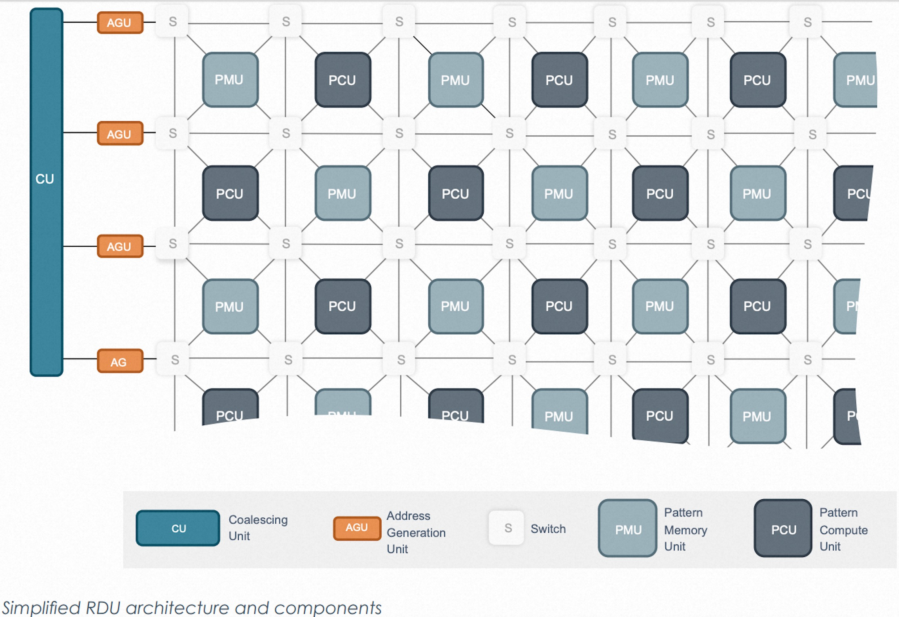
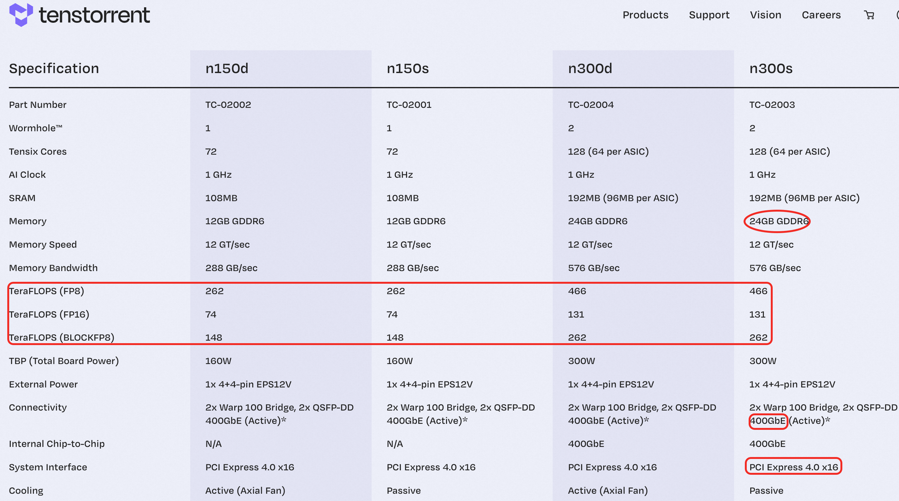
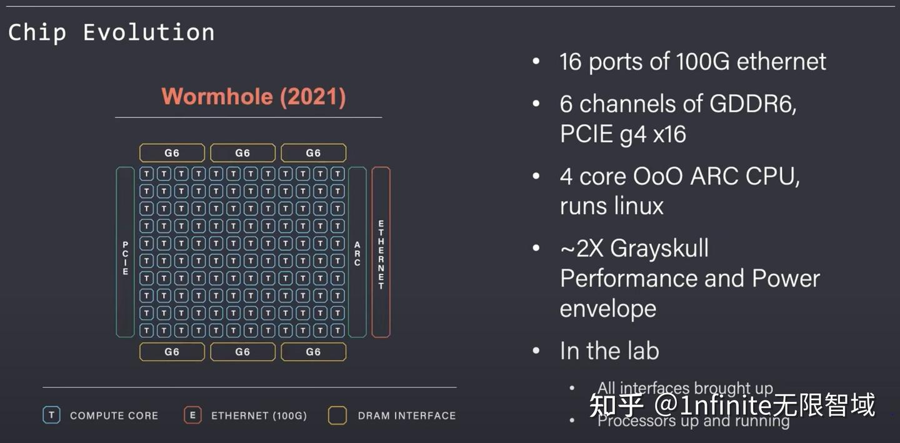
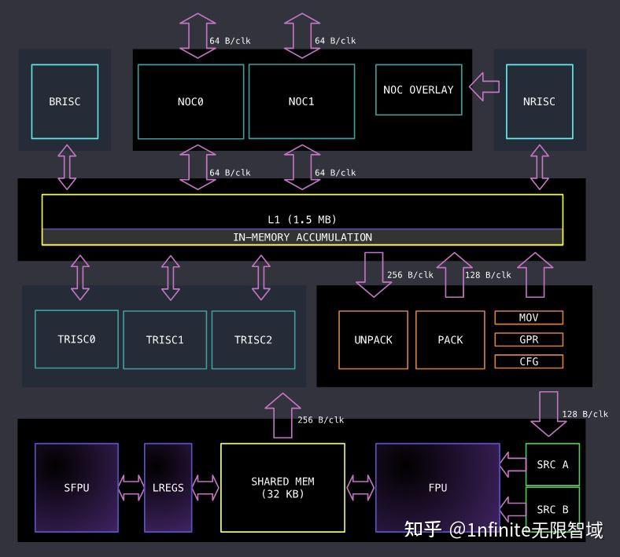
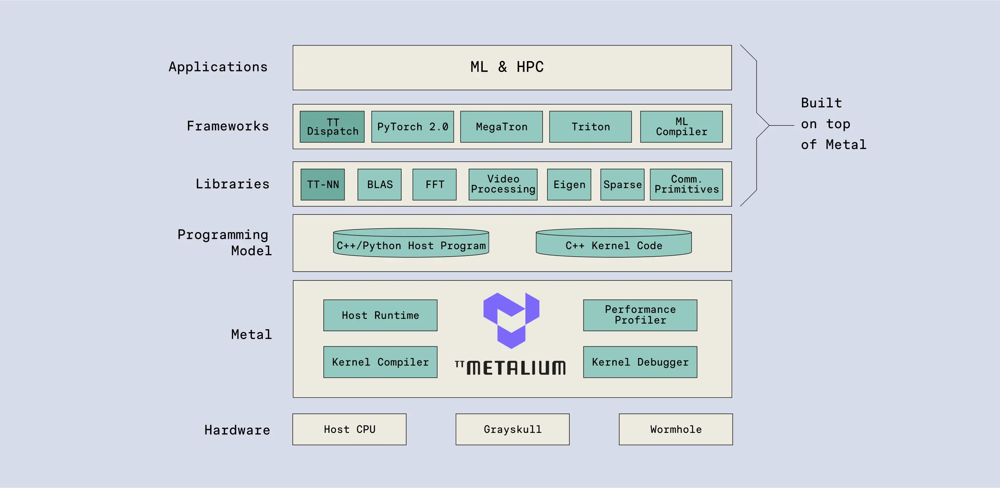
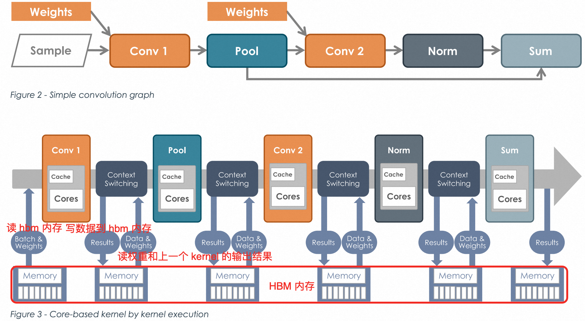
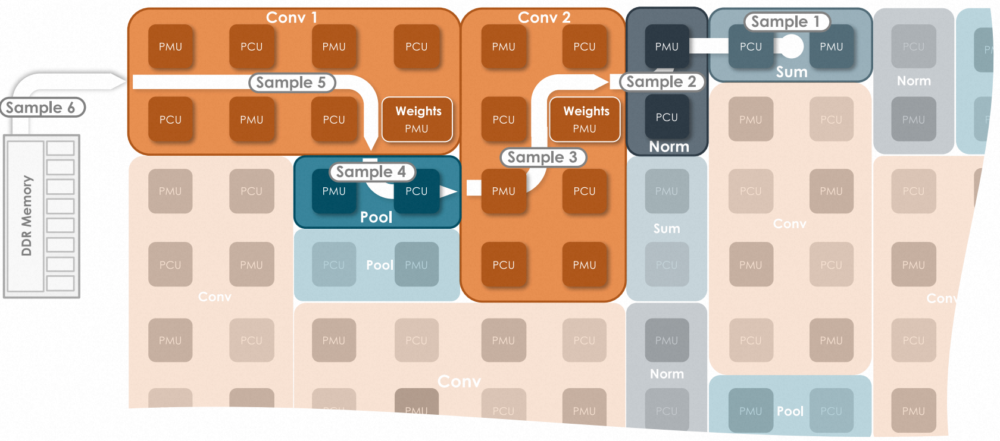

- [一 GPU 背景知识](#一-gpu-背景知识)
- [二 Dataflow 架构的 AI 芯片](#二-dataflow-架构的-ai-芯片)
	- [2.1 Dataflow 架构组成](#21-dataflow-架构组成)
	- [2.2 Dataflow 架构的芯片实现案例](#22-dataflow-架构的芯片实现案例)
	- [2.3 DataFlow 芯片和 GPU 芯片的比较](#23-dataflow-芯片和-gpu-芯片的比较)
- [三 Wormhole 芯片](#三-wormhole-芯片)
	- [3.1 芯片的特性总结](#31-芯片的特性总结)
	- [3.2 Tensix 核架构](#32-tensix-核架构)
	- [3.3 存储单元](#33-存储单元)
	- [3.4 Wormhole 芯片如何 Scale Up \& Scale Out](#34-wormhole-芯片如何-scale-up--scale-out)
- [四 Wormhole AI 开发软件栈-TT-Metalium™](#四-wormhole-ai-开发软件栈-tt-metalium)
	- [4.1 TT 编译器和工具链](#41-tt-编译器和工具链)
- [参考资料](#参考资料)

## 一 GPU 背景知识

1，GPU 芯片结构

`GPU` 虽然是冯诺依曼架构，但是去除了 `CPU` 中的分支预测、乱序执行等模块，遵循 `SIMT`（Single Instruction Multiple Thread）的编程模型，同一条指令可以同时在多个线程上执行，极大的增强了计算程序执行时的并行性。

2，GPU 的核心优化特性：
- 高速内存带宽：提供了高带宽的 HBM，以减少“内存墙”问题。
- 卡间互联带宽：开发了 `NVlink` 技术用于解决 `GPU` 之间的通讯问题。
- 专用硬件加速单元：开发了 `Tensor Core` 专门用于 `GEMM` 计算加速。

3，英伟达 GPU 芯片的共享内存：从安倍架构（`A100`）开始对应的硬件是 `L1 cache`，它是线程块级别的低延迟内存，作用是块内线程数据同步和共享，减少全局内存访问。

4， GPU 的访存带宽其实是指 HBM 带宽。访存带宽跟以下几个因素决定：
- 内存总线宽度： 数据总线的位宽越大，每个时钟周期传输的数据量就越多。
- 内存时钟频率： 内存的工作频率越高，每秒传输的数据量也越大。
- 内存体系结构： 包括并行传输通道数量、缓存设计等，也会影响实际可达到的带宽。

## 二 Dataflow 架构的 AI 芯片

`Dataflow` 和冯诺依曼基于传统逻辑控制流的架构不同，其架构的核心思想是“以数据流为中心”，即数据一旦到达处理单元就立即触发计算（数据传到算子激活），而不是依赖固定的指令执行顺序，计算过程也无需中间数据到 HBM 搬运过程。

`Dataflow` 架构的芯片需要对 kernel 进行编排拆分，因此其指令调度的代价相比控制流（PC）更大。

### 2.1 Dataflow 架构组成

其架构组成通常有三部分：

1. **处理单元（Processing Elements, PEs）**：
   - 每个 `PE` 负责执行特定的计算任务，通常包含算术逻辑单元（`ALU`）、寄存器文件和本地存储器。
   - 计算任务通常有密集张量和矢量运算。
   - **不同的 `PE` 可以在同一时刻独立执行**，其天然的支持大规模并行运算。
2. **数据传输网络（Interconnect 或 NoC）**：
   - **特指 `PEs` 相互连接的网络**，决定了数据传输的效率和延迟。
   - 通常采用**网络片上（Network-on-Chip, NoC）技术**，将各个 `PE` 串联或以矩阵、`mesh` 网格等拓扑结构连接起来。
3. **分层存储**：
	- **本地存储器**：每个 `PE` 单元都有自己的本地存储器（一般是 `SRAM`），用于存储中间结果和权重数据。（类比 A100 的 L1 Cache）
	- **片上共享存储器**： 多个 `PE` 共享一个片上共享存储器，用于存储全局数据，用在多个 PE 之间传递数据。（类比 A100 的 L2 Cache）
	- **片外存储器**： 如 `DRAM` 等外部存储器，加载模型参数和存储输入数据用。（类比 A100 的 HBM）。

### 2.2 Dataflow 架构的芯片实现案例

1，`Google` 公司的 TPU（Tensor Processing Unit）。TPU 系列芯片主要包括以下计算资源：
- 矩阵乘法单元（`MUX`）：65,536 个 8 位乘法和加法单元，运行矩阵计算
- 统一缓冲（`UB`）：作为寄存器工作的 24MB 容量 SRAM
- 激活单元（`AU`）：硬件实现的激活函数

2，`SambaNova` 公司的架构自称为可重构数据流架构（Reconfigurable Dataflow Architecture），特点是其 kernel 的执行过程是 pipeline 管道形式。**SambaNova AI 芯片的基础计算核心架构硬件称为 RDU**，RDU（Reconfigurable Dataflow Unit）的组成如下所示：
- `PCU`（Pattern Compute Unit 模式计算单元）-- 执行单个最内部并行操作。
- `PMU`（Pattern Memory Unit 模式内存单元）-- 提供片上存储器容量并执行许多专门的智能功能。
- `S`（Switch 交换结构）-- 连接 PCU 和 PMU 的高速交换结构由标量、矢量和控制三种交换网络组成。
- Address Generator Units (`AGU`) and Coalescing Units (`CU`) -- RDU 和系统其余部分之间的互连，包括片外 DRAM、其他 RDU 和主机处理器。

`RDU` 架构和组成的简略图如下所示:

3，`Tenstorrent` 公司使用 `RISC-V ISA` 作为基础计算核心架构(`Tensix` `core`)，计算单元之间通过片上网络（`NoC`）互联。开发了 Grayskull、Wormhole、BlackHole 三代产品，从第二代产品 `Wormhole` 开始，片上网络 (NoC) 可以通过以太网端口进行多卡互联（scale out）。

`Tenstorrent` 的 AI 架构主要可以分为两类：以 `Wormhole` 为代表的 AI 加速器和以 `Blackhole` 为代表的 CPU+ML 异构解决方案。

Wormhole（代号） AI 加速器芯片的特性：
- 极致扩展性：多个芯片可以组成一台服务器、多个服务器组成一个机柜、多个机柜组成一个POD集群。
- 高并行性
- 高效数据流控制

### 2.3 DataFlow 芯片和 GPU 芯片的比较

1, **Tenstorrent AI 芯片和 Nvidia GPU 芯片在卡间互联的对比**:

- Nvidia GPU 扩展超过 `8` 个 GPU 时需要专用的交换机，超过 `16` 个 GPU 则需要使用 InfiniBand 网络设备。
- Tenstorrent 的 Wormhole 的片上网络（NoC-Network on chip）可以透明地扩展到数据中心，对于软件而言，看起来像是一个由 Tensix 核心组成的 `2D` 同质网格，不需要关心芯片、服务器、机架这种层次结构。

2, Tenstorrent AI 芯片和 Nvidia GPU 芯片在计算上的对比。
- 冯·诺依曼架构下的 GPU 芯片在计算过程中需要将中间结果数据写回内存。
- 数据流架构下的 AI 芯片，**无需将中间结果数据写回内存**。

## 三 Wormhole 芯片

### 3.1 芯片的特性总结

Tenstorrent 以 Wormhole 设计为代表的 AI 芯片包括 n150d、n150s、n300d 和 n300s，它们的芯片规格和特性总结如下表所示：

`Wormhole` 主要由网格化的计算单元（`128` 个 Tensix(`n300d`)，蓝色）、内存单元（GDDR6，黄色）和互联单元（ETHERNET，红色）三个重要部分组成。

### 3.2 Tensix 核架构

`Wormhole` 中的计算单元内核 `Tensix` 展开后的结构图如下图所示：

从上述 Tensix 架构的详细组成图可以看出，Tensix 核组成部分有：

- 5 个 Baby RISC-V Core（蓝色部分，BRISC、NRISC、TRISC0、TRISC1、TRISC2），用于控制和标量计算。其中 BRISC 和 NRISC 主要负责数据移动，而剩余的三个 RISC-V Core（TRISCs）负责控制计算过程。
- 数据传输（浅蓝色部分，NOC0、NOC1、NOC OVERLAY），负责控制设备之间和设备与主机之间的数据传输。
- 打包解包（橙色部分，UNPACK、PACK）。
- 内存（黄色部分，L1、SHARED MEM）。
- **数学引擎**（紫色部分，`FPU`、`SFPU`），其中 FPU 是密集张量数学单元，用于执行大量张量数学运算，如矩阵乘法；SFPU 是矢量引擎，用于各种杂项激活运算，如指数、平方根、softmax、topK 等。
- 寄存器组（绿色部分，SRC A、SRC B）。SRC A，SRC B 是源寄存器，DST（未出现在图中）是目标寄存器，它们都是使用一组寄存器，可以存放张量，支持浮点数和低精度数据类型，这里的寄存器和 5 个 Baby RISC-V Core 是不同的寄存器。

软件调用 `FPU` 的典型计算过程分为三个部分：
- 解包 `UNPACK`（从 L1 拷贝数据到 SRC 寄存器），由 TRISC0 负责;
- 计算 `MATH`（FPU 从 SRC 寄存器读取数据进行计算，结果保存在 DST 寄存器），TRISC1 负责;
- 打包 `PACK`（将结果从 DST 寄存器拷贝回 L1），`TRISC2` 负责。

值得注意的是，`FPU` 的计算是 `tile-based`，L1 和寄存器之间的数据传输也是 tile-based。`UNPACK` 和 `PACK` 的数据搬运是通过底层的 `TDMA`（Time Division Multiple Access）指令实现的。

### 3.3 存储单元

Wormhole（n300 板卡）的存储架构的层次结构较为简单（相对于 GPU 而言），分为两个部分：
- `DRAM`: 大小为 24G 的 GDDR6，**所有 Tensix 核共享**。
- `SRAM`: 每个 `Tensix` 核有 `1.5MB` 的 `SRAM`（称为 `L1`），是 `Tensix` 核独有的，有单独的地址空间，可以寻址访问。

### 3.4 Wormhole 芯片如何 Scale Up & Scale Out

Wormhole 借助片上网络 `NoC` 硬件能够很清晰的拓展到：4U 服务器（32 个 Wormhole 芯片）-> Wormhole 数据中心机柜（8台nebula服务器）。`Noc` 避免了不同内存、卡间互联互联，机器互联的 InfiniBand 网络等不同通信速度带来的通信复杂性问题。

## 四 Wormhole AI 开发软件栈-TT-Metalium™

`TT-Metalium™` 是一个用于异构 CPU 和 Tenstorrent 设备集合的低级软件平台，让用户可以直接访问 RISC-V 处理器、NoC（片上网络）以及 Tensix Core 内的矩阵和矢量引擎。

GPU 芯片在模型推理的执行期间，必须将每个内核加载到 CPU 或 GPU 上，从内存中读取数据和权重，执行计算并将输出结果写入内存。然后，该过程在每个阶段重复，从而增加数据移动量并消耗大量内存带宽。具体过程如下图所示:

整个程序运行系统以 `pipeline` 管道的形式运行，`RDU` 的不同部分执行模型的不同层，同时处理每个阶段的不同数据。数据能够畅通无阻地流过每一层，避免上图图下半部分所示的上下文切换和内存访问延迟。

### 4.1 TT 编译器和工具链

AI 芯片编译器的作用很大，负责将 hight-level 的模型结构源代码转换为数据流图，并做图优化，具体流程包括：
1. 模型结构源代码到数据流图的转换：解析源代码，生成中间表示，并将中间表示转换为数据流图。
2. 图优化和目标代码生成：通过 AI 编译器优化技术提高数据流图的性能，包括：循环展开、流水线优化和数据流图优化等；得到优化后的图之后，编译器再生成最终的目标代码（硬件指令），给 PE 执行。

## 参考资料

- [探索 Dataflow 架构：从理论到芯片实现](https://zhuanlan.zhihu.com/p/716938041)
- [Accelerated Computing with a Reconfigurable Dataflow Architecture](https://sambanova.ai/hubfs/23945802/SambaNova_Accelerated-Computing-with-a-Reconfigurable-Dataflow-Architecture_Whitepaper_English-1.pdf)
