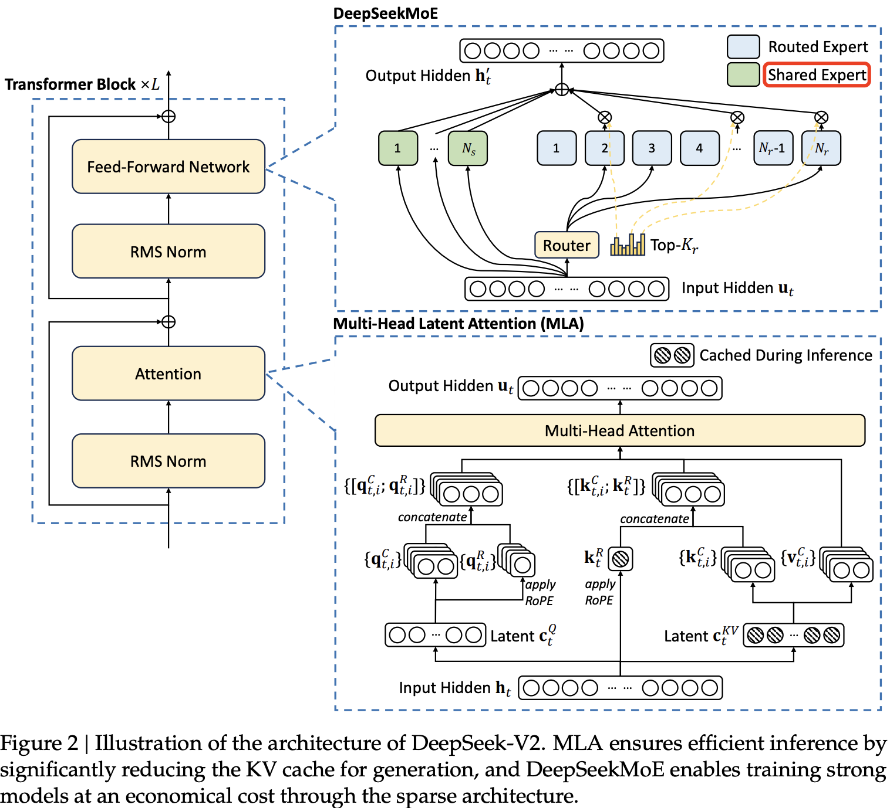
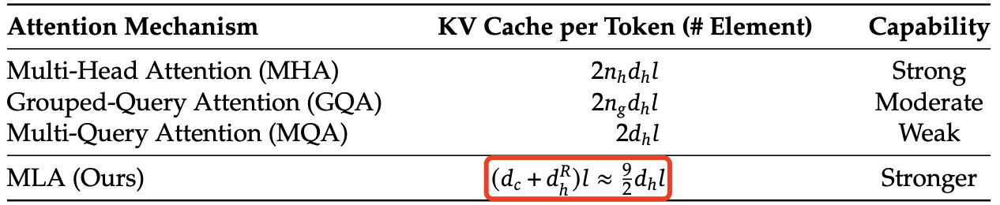

## 1. 介绍

DeepSeek-V2 是一种高效的开源混合专家（MoE）语言模型，基于创新的 Transformer 架构，实现了经济的训练和高效的推理。DeepSeek-V2 具有 2360 亿个参数(`236B`)，每个 token 激活 21 亿个参数，支持 `128K` tokens 的上下文长度。

和 DeepSeekV1 模型结构沿用 llama 结构不同，DeepSeekV2 提出了多头潜在注意力（`MLA`）和 `DeepSeekMoE`，旨在优化 Transformer 框架中的注意力模块和前馈网络（FFNs）。
1. `MLA`: Multi-head Latent Attention 结构，通过**低秩键值联合压缩**，**减少了推理时的 KV 缓存**，从而提高了推理效率。
2. `DeepSeekMoE`: `FFN`（标准 `MOE`） 的优化版。
- **细粒度专家划分(Routed Expert)**：相比标准 MOE，DeepSeekMoE 在保持参数量不变的前提下，通过减小每个 Expert 的 `FFN` 维度，来增加 Expert 数量，进行更细粒度专家划分。
- **共享专家隔离(Shared Expert)**: 用于表示 Routed Expert 中的共用知识信息，减少 Routed Expert 的知识冗余问题。

DeepSeek-V2 架构图如下所示：



## 2. 架构

本节介绍 MLA 和 DeepSeekMoE 的详细设计。

### 2.1 多头潜变量注意力（MLA）：提升推理效率

传统的 Transformer 模型通常采用多头注意力（MHA），但在生成（generation）过程中，其庞大的 Key-Value（KV）缓存会成为限制推理效率的瓶颈。为减少 KV 缓存占用，研究者提出了**多查询注意力**（MQA）（Shazeer, 2019）和**分组查询注意力**（GQA）（Ainslie et al., 2023）。这两种方法虽然减少了 KV 缓存需求，但在性能上仍无法与 MHA 相媲美（关于 MHA、GQA 和 MQA 的消融实验见附录 D.1）。

DeepSeek-V2 引入了一种全新的注意力机制**多头潜变量注意力**（`MLA`）。MLA 结合了**低秩键值联合压缩**（low-rank key-value joint compression,），在推理时大幅降低 KV 缓存需求，同时在性能上超越 MHA。
> MLA 本质上是通过低秩转换的思路减少 head 的维度，即换为一个压缩的 QKV，存储的KV 的维度显著减小，而不是 GQA 方法减少 kv heads 的数量。

#### 2.1.1 Standard Multi-Head Attention

先回顾下标准的**多头注意力（MHA）机制**。设 $d$ 为嵌入维度，$n_h$ 为注意力头数，$d_h$ 为单个注意力头的维度，$h_t \in R_d$ 表示第 $t$ 个 token 进入注意力层的输入向量。

在 MHA 机制中，我们通过三个投影矩阵 $W_Q、W_K、W_V \in R^{n_h d_h\times d}$ 分别计算得到查询向量、键向量和值向量（$q_t、k_t、v_t \in R^{n_h d_h}$），QKV 向量的线性变换公式如下所示：
> QKV 的线性变换的权重矩阵的第二个维度大小一定为嵌入维度 $d$。

$$
\mathbf{q}_t = W^Q \mathbf{h}_t, \tag{1}
$$

$$
\mathbf{k}_t = W^K \mathbf{h}_t, \tag{2}
$$

$$
\mathbf{v}_t = W^V \mathbf{h}_t, \tag{3}
$$

然后，$q_t$, $k_t$, $v_t$ 将被切分为 $n_h$ 个头（`heads`），用于多头注意力计算：

$$[\mathbf{q}_{t,1}; \mathbf{q}_{t,2}; \dots; \mathbf{q}_{t,n_h}] = \mathbf{q}_t
\tag{4}$$

$$[\mathbf{k}_{t,1}; \mathbf{k}_{t,2}; \dots; \mathbf{k}_{t,n_h}] = \mathbf{k}_t
\tag{5}$$

$$[\mathbf{v}_{t,1}; \mathbf{v}_{t,2}; \dots; \mathbf{v}_{t,n_h}] = \mathbf{v}_t
\tag{6}$$

$$\mathbf{o}_{t,i} = \sum_{j=1}^{t} \text{Softmax}_j \left( \frac{\mathbf{q}_{t,i}^T \mathbf{k}_{j,i}}{\sqrt{d_h}} \right) \mathbf{v}_{j,i}
\tag{7}$$

$$\mathbf{u}_t = W^O [\mathbf{o}_{t,1}; \mathbf{o}_{t,2}; \dots; \mathbf{o}_{t,n_h}]
\tag{8}$$

其中，$q_{t,i}$, $k_{t,i}$, $v_{t,i} \in \mathbb{R}^{d_h}$ 分别表示第 $i$ 个注意力头的查询（query）、键（key）和值（value）；$W_O \in \mathbb{R}^{d \times d_h n_h}$ 表示输出投影矩阵。在推理过程中，key 和 value 需要被缓存，以加速计算，避免重复计算。

标准 `MHA` 每个 `token` 的 kv 缓冲大小 = $2n_hd_h l$，单位为字节 `byte`；如果使用了 `GQA` 优化技术，每个 token 的 kv 缓冲大小变为 $2n_{kv}d_h l = 2n_hd_h l/\text{groups}$ 个元素。下标 $t$ 表示第几个 token，下标 $[1, n_h]$ 表示注意力头数，$l$ 表示 decoder layers 数目。

在模型部署时，这种庞大的 KV 缓存 成为了一个主要的瓶颈，限制了**最大批量大小**（batch size）和**序列长度**（sequence length）。

#### 2.1.2 Low-Rank Key-Value Joint Compression

MLA 的核心是对**键**（keys）和**值**（values）进行**低秩联合压缩**（low-rank joint compression），以减少 KV 缓存（KV cache）的占用：

$$
\mathbf{c}_t^{KV} = W^{DKV} \mathbf{h}_t,
\tag{9}
$$

$$
\mathbf{k}_t^{C} = W^{UK} \mathbf{c}_t^{KV},
\tag{10}
$$

$$
\mathbf{v}_t^{C} = W^{UV} \mathbf{c}_t^{KV},
\tag{11}
$$

`KV` 向量的生成是先投影到一个**低维**（`5120 -> 512`）的 `compressed_kv` 向量（$\mathbf{c}_t^{KV}$）再升维展开得到 $\mathbf{k}_t^{C}$ 和 $\mathbf{v}_t^{C}$。上述公式的各个变量定义：

- $\mathbf{c}_t^{KV}$ 是 `keys` 和 `values` 的**压缩后的潜在向量**（`latent vector`）；
- $d_c (\ll d_h n_h)$ 代表 `KV` 压缩维度（KV compression dimension）
- $W^{DKV} \in \mathbb{R}^{d_c \times d}$ 是**降维投影矩阵**（down-projection matrix）；
- $W^{UK}, W^{UV} \in \mathbb{R}^{d_h n_h \times d_c}$ 分别是 keys 和 values 的**升维投影矩阵**（up-projection matrices）。

另外，虽然不能减少 KV Cache 的占用，但是为了**减少训练时的激活内存**（activation memory），同样也对查询（queries）也进行了**低秩压缩**（low-rank compression）。同样也是先投影到一个**低维**（`5120 -> 1536`）的 `compressed_kv` 向量（$\mathbf{c}_t^{Q}$）再升维展开得到 $\mathbf{q}_t^{C}$:

$$
\mathbf{c}_t^{Q} = W^{DQ} \mathbf{h}_t,
\tag{12}
$$

$$
\mathbf{q}_t^{C} = W^{UQ} \mathbf{c}_t^{Q},
\tag{13}
$$

类比前面的公式可知:
- $\mathbf{c}_t^{Q} \in \mathbb{R}^{d'_c}$ 是查询的压缩潜在向量（compressed latent vector for queries）；
- $d'_c (\ll d_h n_h)$ 表示查询的压缩维度（query compression dimension）；
- $W^{DQ} \in \mathbb{R}^{d'_c \times d}$ 是查询的降维投影矩阵；
- $W^{UQ} \in \mathbb{R}^{d_h n_h \times d'_c}$ 是查询的升维投影矩阵（up-projection matrix）。

#### 2.1.3 Decoupled Rotary Position Embedding

和 DeepSeek 67B（DeepSeek-AI, 2024）类似，作者也计划在 DeepSeek-V2 中使用 旋转位置编码（RoPE, Rotary Position Embedding）（Su et al., 2024）。但是，RoPE 与**低秩 KV 压缩（low-rank KV compression）并不兼容**。

具体来说，RoPE 使键（Key）和查询（Query）都具备**位置敏感性**（position sensitivity）。如果我们在**压缩后的键** $\mathbf{k}_t^{C}$ 上应用 ROPE，那么实际上我们得到的键表示会是这样的形式：

$$k_t^R = \text{ROPE}(W^{UK} \mathbf{c}_t^{KV})$$


很明显式（10）中的 $W^{UK}$ 和 RoPE 旋转矩阵在计算过程中“耦合”在一起—这意味着 $W^{UK}$ 输出的结果会始终被那个依赖于具体位置的旋转矩阵所“修正”或“调制”。

这样会导致在执行 atten weight（$QK^T$）的计算优化中，无法像原本设想的那样，把 $W^{UK}$ 吸收到 $W^Q$  中，因为 当前生成 token 相关的 RoPE 矩阵位于 $W^Q$  和 $W^{UK}$ 之间，而矩阵乘法不满足交换律（commutative law）。这直接导致在推理过程中，我们必须**重新计算**所有 prefix token 的键（keys），这将显著降低推理效率。

为了解决这个问题，作者提出了一种**解耦 RoPE**（decoupled RoPE）的策略，通过**额外引入多头查询**（multi-head queries）$q_{t,i}^R \in \mathbb{R}^{d^R_h}$和**采用一个共享键**（shared key) $k_t^R \in \mathbb{R}^{d^R_h}$ 来**承载 RoPE 信息**。其中 $d^R_h$  代表**解耦查询和键的每头维度**（per-head dimension of the decoupled queries and key）。

在使用**解耦 RoPE 策略**后，`MLA` 的计算过程变成如下所示：

$$
\left[ \mathbf{q}_{t,1}^{R}; \mathbf{q}_{t,2}^{R}; \dots; \mathbf{q}_{t,n_h}^{R} \right] = \mathbf{q}_t^{R} = \text{RoPE}(W^{QR} \mathbf{c}_t^{Q}),
\tag{14}
$$

$$
\mathbf{k}_t^{R} = \text{RoPE}(W^{KR} \mathbf{h}_t),
\tag{15}
$$

$$
\mathbf{q}_{t,i} = \left[ \mathbf{q}_{t,i}^{C}; \mathbf{q}_{t,i}^{R} \right],
\tag{16}
$$

$$
\mathbf{k}_{t,i} = \left[ \mathbf{k}_{t,i}^{C}; \mathbf{k}_{t,i}^{R} \right],
\tag{17}
$$

$$
\mathbf{o}_{t,i} = \sum_{j=1}^{t} \text{Softmax}_j \left( \frac{\mathbf{q}_{t,i}^{T} \mathbf{k}_{j,i}}{\sqrt{d_h + d_h^{R}}} \right) \mathbf{v}_{j,i}^{C},
\tag{18}
$$

$$
\mathbf{u}_t = W^{O} \left[ \mathbf{o}_{t,1}; \mathbf{o}_{t,2}; \dots; \mathbf{o}_{t,n_h} \right],
\tag{19}
$$

其中，$W^{QR} \in \mathbb{R}^{d^R_h n_h \times d'_c}$ 和 $W^{KR} \in \mathbb{R}^{d^R_h \times d}$ 分别是用于生成**解耦查询（decoupled queries）和解耦键（decoupled key）的矩阵**。$\text{RoPE}(\cdot)$ 表示应用 RoPE 矩阵的操作，$\cdot ; \cdot$ 表示拼接（concatenation）操作。

在推理过程中，解耦后的键（decoupled key）也需要缓存。因此，DeepSeek-V2 的 KV 缓存总大小为 $(d_c + d^R_h)l$ 个元素。

很明显和前面公式相比，多了 $\mathbf{q}_t^{R}$ 和 $\mathbf{k}_t^{R}$ 两个变量的计算过程，它们用于单独承载 ROPE 信息，并和前面计算得到的 $\mathbf{q}_t^{C}$ 和 $\mathbf{k}_t^{C}$ 做拼接后得到新的 $q、k$，再执行 atten weight 计算（$qk^t$）。

最后，总结下完成的 MLA 计算过程如下所示：


#### 2.1.4 kv cache 大小的比较

下表 1 中对比了不同注意力机制下，每个 token 需要的 KV 缓存大小。MLA 仅需要**少量的 KV 缓存**，其大小相当于仅有 $2.25$ 组（groups）的 GQA，但其性能却强于 MHA。



表 1｜不同注意力机制下，每个 token 需要的 KV 缓存对比。其中，
- $n_h$ 表示**注意力头的数量**，
- $d_h$ 表示每个注意力头的维度，
- $l$ 表示模型层数，
- $n_g$ 表示 GQA 的组数，
- **$d_c$ 和 $d^R_h$ 分别表示 MLA 中的 KV 压缩维度和解耦查询与键的 per-head 维度**。

KV 缓存的数量以**元素(elements)个数**计算，不考虑存储精度（storage precision）。对于 DeepSeek-V2，
- $d_c$ 设定为  $4d_h$，
- $d^R_h$ 设定为 $\frac{d_h}{2}$。

因此，**DeepSeek-V2 只需要 相当于 GQA $2.25$ 组的 KV 缓存，但相比 MHA 仍能提供更强的性能**。

### 2.2 DeepSeekMoE：以经济成本训练强大的模型

对于 FFN（前馈网络），我们采用 DeepSeekMoE 架构（Dai et al., 2024）。DeepSeekMoE 主要包含两个关键思想：
1. **更精细地划分专家网络**，提升每个专家的专业性，提高知识表达的准确度。
2. **引入部分共享专家**，减少不同专家间的知识冗余，从而提升计算效率。

相比传统的 MoE 架构（如 GShard，Lepikhin et al., 2021），**DeepSeekMoE 在相同的专家参数量和激活参数量下，能显著提升模型性能**。

设 $u_t$ 为第 $t$ 个 token 的 FFN 输入，其 FFN 输出 $h'_t$ 计算如下：

$$
\mathbf{h}_t' = \mathbf{u}_t + \sum_{i=1}^{N_s} \text{FFN}_i^{(s)} (\mathbf{u}_t) + \sum_{i=1}^{N_r} g_{ij,t} \text{FFN}_i^{(r)} (\mathbf{u}_t), \tag{20}
$$

$$
g_{ij,t} =
\begin{cases}
s_{ij,t}, & s_{ij,t} \in \text{Topk}(\{s_{ij,t}| 1 \leq j \leq N_r\}, K_r), \\
0, & \text{otherwise},
\end{cases} \tag{21}
$$

$$
s_{ij,t} = \text{Softmax}_i (\mathbf{u}_t^T e_i), \tag{22}
$$

上述公式中：
- $N_s$ 和 $N_r$ 分别表示**共享专家**和**路由专家**的数量；
- $FFN(s) i(·)$ 和 $FFN(r) 𝑖(·)$ 分别表示第 $i$ 个共享专家和第 $i$ 个路由专家的计算过程；
- $K_r$ 表示激活的路由专家数量；
- $g_{i, t}$ 是第 $i$ 个专家的门控值，用来决定该专家是否激活；
- $s_{i, t}$ 是 token 到专家的亲和度值，表示 token 和专家之间的相关性；
- $e_i$ 是该层第 $i$ 个路由专家的质心，用于表示专家的聚合特征；
- $\text{Topk}(·, K)$ 表示从第 $t$ 个 token 计算的所有路由专家的亲和度分数中，选择出 $K$ 个最高的值，并将这些分数组成一个集合。

#### 2.2.2. 设备受限路由（Device-Limited Routing）

作者设计了一种设备受限的路由机制，用于限制 MoE 相关的通信成本。

当采用**专家并行**（expert parallelism）时，路由专家（routed experts）会分布在多个设备上。对于每个 token，它的 MoE **相关通信频率**与其目标专家所涉及的设备数量成正比。由于 DeepSeekMoE 采用了精细的专家划分策略，激活的专家数量可能较多，如果直接应用专家并行，会导致更高的 MoE 相关通信成本。

在 DeepSeek-V2 中，除了直接选择**得分最高**的 $K$ 个路由专家（top-K selection） 之外，我们还确保每个 token 的目标专家最多分布在 $M$ 台设备上。具体而言，对于每个 token，我们首先选择**拥有最高亲和度分数的** $M$ 台设备，然后在这 $M$ 台设备上的专家中执行 `top-K` 选择。实践中，我们发现当 $M \geq 3$ 时，设备受限路由的效果可以大致匹配不受限的 top-K 路由。

#### 2.2.3. 负载均衡的辅助损失（Auxiliary Loss for Load Balance）

作者在自动学习的路由策略中引入了负载均衡机制。
1. 负载不均衡会导致路由塌陷（routing collapse）（Shazeer et al., 2017），即部分专家可能无法得到充分训练和利用。
2. 在专家并行（expert parallelism）机制下，负载不均衡会降低计算效率。

在 DeepSeek-V2 训练过程中，我们设计了三种**辅助损失**（auxiliary losses），分别用于控制：
- 专家级负载均衡（ $L_{\text{ExpBal}}$ ），
- 设备级负载均衡（ $L_{\text{DevBal}}$ ），
- 通信均衡（ $L_{\text{CommBal}}$ ）。

这三种损失函数协同作用，确保 DeepSeek-V2 在计算资源受限的条件下，仍能高效训练高性能 MoE 模型。

#### 2.2.4. Token-Dropping 策略

虽然**平衡损**失有助于实现负载平衡，但它无法完全保证负载的严格平衡。为了解决负载不平衡带来的计算浪费，作者在训练中引入了**设备级的 Token-Dropping 策略**。该策略首先计算每个设备的平均计算预算，将每个设备的容量因子设为 1.0。然后，借鉴 Riquelme 等人（2021）的思路，我们会丢弃每个设备上亲和度最低的 token，直到达成计算预算。此外，我们还确保约 10% 的训练序列中的 token 不会被丢弃。这样，在推理过程中，我们可以灵活地根据效率需求选择是否丢弃 token，同时保持训练和推理的一致性。

## 3. 代码实现

### 3.1 MLA 代码实现解读

DeepDeekv2 的模型配置如下所示:

<div align="center">

</div>

#### 3.1.1 Q 向量计算

1，在 DeepSeek-V2 中，Q 向量也采用了低秩压缩的方式。首先，将输入向量投影到一个 1536 维的低维空间。

然后，再将其投影到 $\mathbb{R}^{H \times 128}$ 的多头向量空间上（其中 $H=128$ 是 `heads` 数），得到了 Q 向量的第一部分。

再将其投影到 $\mathbb{R}^{H \times 64}$ 上并使用 RoPE 嵌入位置信息，得到 Q 向量的第二部分；

最后，将这两部分进行 `concat` 拼接得到最终的 $Q$ 向量：

$$ q_t = [q_t^C, q_t^R] \in \mathbb{R}^{B \times L \times H \times 192}$$

#### 3.1.2 KV 向量计算

计算 KV 向量时，首先，将输入向量投影到一个 512 维的低维空间。

然后，和 Q 向量的计算过程类似，再将其投影到 $\mathbb{R}^{H \times 128}$ 的多头向量空间上（其中 $H=128$ 是 `heads` 数），得到了 $K$ 向量的第一部分。

$K$ 的第二部分同样也是将输入向量投影到 64 维向量空间并施加 RoPE 嵌入位置信息。

最后，和 Q 不同的是，完整的 K 是将 K 的第二部分广播到每个 head 后与第一部分拼接得到：

$$k_t = \begin{bmatrix}
    k_{t,1}^C & k_t^R \\ 
    k_{t,2}^C & k_t^R \\
    \vdots & \vdots \\
    \end{bmatrix} \in \mathbb{R}^{B \times L \times H \times 192}$$

上述广播后拼接的方式意味着，**每个 head 的 RoPE 部分是完全相同的**。

$V$ 向量因为不需要执行 ROPE 操作，所以它的的计算较为简单，直接将 $c_t^{KV}$ 解压缩（升维）到 $\mathbb{R}^{H \times 128}$ 即可：

$$ v_t = W^{UV} c_t^{KV} \in \mathbb{R}^{B \times L \times H \times 128} $$


#### 3.1.3 Self-Attention 计算

Self-Attention 的计算过程和传统的 `MHA` 一模一样。同样也是首先计算 `attention score`：

$$a = \mathrm{softmax}\left(\frac{q_t^\top k_t + \mathrm{Mask}}{\sqrt{192}}\right) = 
\mathrm{softmax}\left(\frac{{q_t^C}^\top k_t^C + {q_t^R}^\top k_t^R + \mathrm{Mask}}{\sqrt{128 + 64}} \right)
\in \mathbb{R}^{B \times L \times H \times L} $$

计算对 $V$的加权和，并将所有 heads 压平（即 heads * head_dim），得到 Attention 输出：

$$ o = a \cdot v_t \in \mathbb{R}^{B \times L \times H \times 128} \cong \mathbb{R}^{B \times L \times 16384} $$

其中，$16384 = 128 \times 128 = \text{num\;attention\;heads * v\;head\;dim}$。最后，经过另一个注意力输出矩阵的投影（5120 是 `hidden_size`），就能得到 MLA 的最终输出：

$$u = W^O o \in \mathbb{R}^{B \times L \times 5120}$$

### transformers 代码实现解读

transformers 库中的 modeling_deepseek.py 是没有经过推理加速优化的原始实现，代码如下所示：

```python
# 从 LlamaAttention 修改而来，适配 DeepseekV2 模型的注意力模块
class DeepseekV2Attention(nn.Module):
    """Multi-headed attention from 'Attention Is All You Need' paper"""

    def __init__(self, config: DeepseekV2Config, layer_idx: Optional[int] = None):
        super().__init__()
        self.config = config
        self.layer_idx = layer_idx  # 当前层索引，用于缓存区分
        if layer_idx is None:
            logger.warning_once("未提供 layer_idx，可能导致缓存错误")

        # 基础参数
        self.attention_dropout = config.attention_dropout  # 注意力权重 Dropout 概率
        self.hidden_size = config.hidden_size              # 隐藏层维度
        self.num_heads = config.num_attention_heads        # 注意力头数
        
        # RoPE 相关参数：qk_nope_head_dim": 128, "qk_rope_head_dim": 64, v_head_dim = 128,
        # "num_attention_heads": 128, "num_key_value_heads": 128,
        self.max_position_embeddings = config.max_position_embeddings  # 最大位置编码长度
        self.rope_theta = config.rope_theta                            # RoPE 基频参数
        self.qk_rope_head_dim = config.qk_rope_head_dim                # RoPE 应用的头维度
        
        # LoRA 参数
        self.q_lora_rank = config.q_lora_rank          # Query 低秩矩阵的秩
        self.kv_lora_rank = config.kv_lora_rank        # Key-Value 低秩矩阵的秩
        self.qk_nope_head_dim = config.qk_nope_head_dim  # 非位置编码的头维度
        self.v_head_dim = config.v_head_dim            # Value 头维度
        self.q_head_dim = self.qk_nope_head_dim + self.qk_rope_head_dim  # Query 总头维度

        self.is_causal = True  # 是否因果注意力（屏蔽未来信息）

        # Query 投影层（LoRA 分解为 q_a_proj 和 q_b_proj）
        self.q_a_proj = nn.Linear(self.hidden_size, self.q_lora_rank, bias=config.attention_bias)
        self.q_a_layernorm = DeepseekV2RMSNorm(self.q_lora_rank)  # LoRA 后的归一化
        self.q_b_proj = nn.Linear(self.q_lora_rank, self.num_heads * self.q_head_dim, bias=False)

        # Key-Value 投影层（LoRA 分解为 kv_a_proj_with_mqa 和 kv_b_proj）
        self.kv_a_proj_with_mqa = nn.Linear(
            self.hidden_size,
            self.kv_lora_rank + self.qk_rope_head_dim,  # 包含 RoPE 的 Key 部分
            bias=config.attention_bias,
        )
        self.kv_a_layernorm = DeepseekV2RMSNorm(self.kv_lora_rank)
        self.kv_b_proj = nn.Linear(
            self.kv_lora_rank,
            self.num_heads * (self.qk_nope_head_dim + self.v_head_dim),  # 合并 Key 和 Value
            bias=False,
        )

        # 输出投影层
        self.o_proj = nn.Linear(
            self.num_heads * self.v_head_dim, self.hidden_size, bias=config.attention_bias
        )
        # 注意力缩放因子（考虑 RoPE 缩放配置）
        self.softmax_scale = self.q_head_dim ** (-0.5)

        # 初始化 RoPE
        self._init_rope()        
        if self.config.rope_scaling is not None:
            scaling_factor = self.config.rope_scaling["factor"]
            if self.config.rope_scaling.get("mscale_all_dim", 0):
                mscale = yarn_get_mscale(scaling_factor, self.config.rope_scaling["mscale_all_dim"])
                self.softmax_scale *= mscale ** 2

    ########省略了 _init_rope、_shape 成员函数代码############
    def forward(
        self,
        hidden_states: torch.Tensor,
        attention_mask: Optional[torch.Tensor] = None,
        position_ids: Optional[torch.LongTensor] = None,
        past_key_value: Optional[Cache] = None,
        output_attentions: bool = False,
        use_cache: bool = False,
        **kwargs,
    ) -> Tuple[torch.Tensor, Optional[torch.Tensor], Optional[Tuple[torch.Tensor]]]:
        # 输入形状检查
        bsz, q_len, _ = hidden_states.size()

        # 1. 计算 Query
        q = self.q_a_proj(hidden_states)  # LoRA 投影 [bsz, q_len, q_lora_rank]
        q = self.q_a_layernorm(q)         # 归一化
        q = self.q_b_proj(q)              # 升维 [bsz, q_len, num_heads * q_head_dim]
        q = q.view(bsz, q_len, self.num_heads, self.q_head_dim).transpose(1, 2)
        q_nope, q_pe = torch.split(q, [self.qk_nope_head_dim, self.qk_rope_head_dim], dim=-1)

        # 2. 计算 Key-Value
        compressed_kv = self.kv_a_proj_with_mqa(hidden_states)  # [bsz, q_len, kv_lora_rank + qk_rope_head_dim]
        compressed_kv, k_pe = torch.split(compressed_kv, [self.kv_lora_rank, self.qk_rope_head_dim], dim=-1)
        k_pe = k_pe.view(bsz, q_len, 1, self.qk_rope_head_dim).transpose(1, 2)  # 扩展为多头
        
        # 低秩投影 Key-Value
        kv = self.kv_b_proj(self.kv_a_layernorm(compressed_kv))
        kv = kv.view(bsz, q_len, self.num_heads, self.qk_nope_head_dim + self.v_head_dim).transpose(1, 2)
        k_nope, value_states = torch.split(kv, [self.qk_nope_head_dim, self.v_head_dim], dim=-1)

        # 3. 应用 RoPE 位置编码
        kv_seq_len = value_states.shape[-2]
        if past_key_value is not None:
            # 合并历史缓存长度
            kv_seq_len += past_key_value.get_usable_length(kv_seq_len, self.layer_idx)
        cos, sin = self.rotary_emb(value_states, seq_len=kv_seq_len)
        q_pe, k_pe = apply_rotary_pos_emb(q_pe, k_pe, cos, sin, position_ids)

        # 4. 合并位置编码与非位置编码部分
        query_states = torch.cat([q_nope, q_pe], dim=-1)
        key_states = torch.cat([k_nope, k_pe], dim=-1)

        # 5. 更新缓存（若启用）
        if past_key_value is not None:
            key_states, value_states = past_key_value.update(
                key_states, value_states, self.layer_idx, {"sin": sin, "cos": cos}
            )

        ###############这步开始和标准 attention 的实现代码一样###################
        # 6. 计算注意力权重
        attn_weights = torch.matmul(query_states, key_states.transpose(2, 3)) * self.softmax_scale
        if attention_mask is not None:
            attn_weights = attn_weights + attention_mask  # 应用掩码
        attn_weights = nn.functional.softmax(attn_weights, dim=-1, dtype=torch.float32).to(query_states.dtype)
        attn_weights = nn.functional.dropout(attn_weights, p=self.attention_dropout, training=self.training)

        # 7. 注意力加权求和
        attn_output = torch.matmul(attn_weights, value_states)
        attn_output = attn_output.transpose(1, 2).contiguous().reshape(bsz, q_len, self.num_heads * self.v_head_dim)
        attn_output = self.o_proj(attn_output)  # 输出投影

        return attn_output, attn_weights if output_attentions else None, past_key_value
```


## 参考资料

- [DeepSeek-V2 论文](https://arxiv.org/pdf/2405.04434)
- [DeepSeek-V2高性能推理优化笔记：MLA优化](https://github.com/madsys-dev/deepseekv2-profile/blob/main/workspace/blog/optimizing-mla.md)