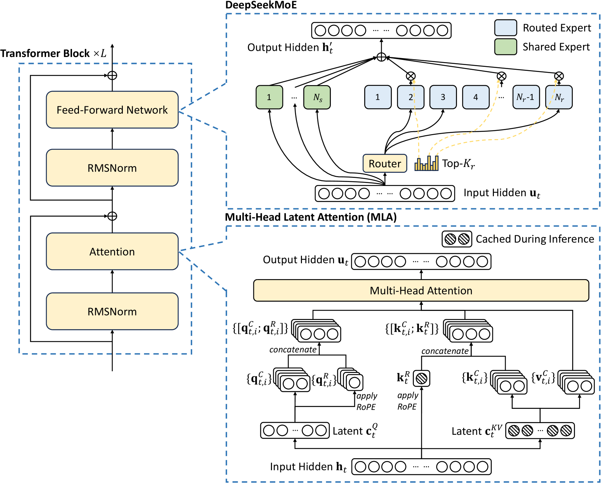
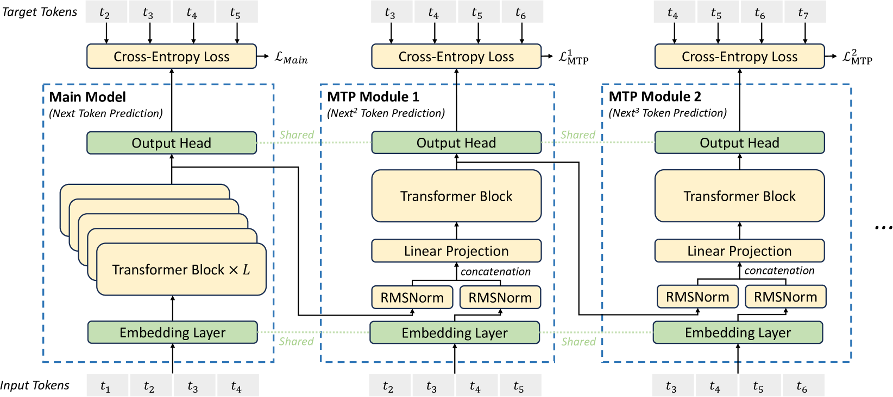
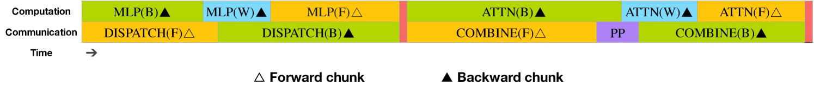
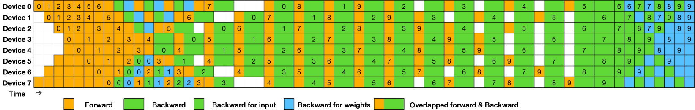
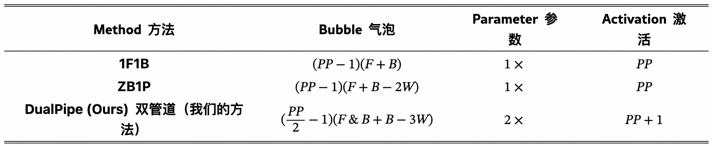
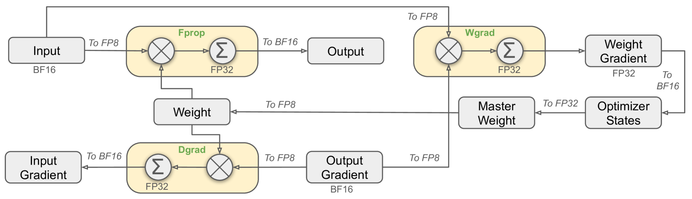

- [摘要](#摘要)
- [引言](#引言)
- [2. 架构](#2-架构)
  - [2.1 基础架构](#21-基础架构)
    - [2.1.1 多头潜在注意力机制 MLA](#211-多头潜在注意力机制-mla)
    - [2.1.2 无辅助损失负载均衡的 DeepSeekMoE](#212-无辅助损失负载均衡的-deepseekmoe)
  - [2.2 多 token 预测（MTP）](#22-多-token-预测mtp)
- [3. 基础设施](#3-基础设施)
  - [3.1 计算集群](#31-计算集群)
  - [3.2 训练框架](#32-训练框架)
    - [3.2.1 双流水与计算-通信重叠](#321-双流水与计算-通信重叠)
    - [3.2.2 跨节点全通通信的高效实现](#322-跨节点全通通信的高效实现)
    - [3.2.3 极低内存开销的优化方案](#323-极低内存开销的优化方案)
  - [3.3 FP8 训练](#33-fp8-训练)
  - [3.4 推理与部署](#34-推理与部署)
    - [3.4.1 预填充阶段](#341-预填充阶段)
    - [3.4.2 解码阶段](#342-解码阶段)
  - [3.5 硬件设计建议](#35-硬件设计建议)
    - [3.5.1 通信硬件](#351-通信硬件)
    - [3.5.2 计算硬件](#352-计算硬件)
- [参考资料](#参考资料)

## 摘要

DeepSeek-V3，是一个强大的混合专家（MoE）语言模型，总参数量达 6710 亿（`671B`），每个 token 激活 370 亿（`37B`）参数。为实现高效推理和经济高效的训练，DeepSeek-V3 采用了多头潜在注意力（`MLA`）和 `DeepSeekMoE` 架构，这些架构已在 DeepSeek-V2 中得到充分验证。

此外，**DeepSeek-V3 首创了无辅助损失的负载均衡策略，并设置了多 token 预测训练目标（`MTP`）以获得更强性能**。论文在 14.8 万亿个多样且高质量的 token 上对 DeepSeek-V3 进行了预训练，随后通过监督微调和强化学习阶段充分释放其潜力。全面评估表明，DeepSeek-V3 优于其他开源模型，性能可比肩领先的闭源模型。尽管表现出色，DeepSeek-V3 的完整训练仅需 278.8 万 H800 GPU 小时。其训练过程也异常稳定，在整个训练周期中未出现任何不可恢复的损失突增或执行回滚操作。

## 引言

DeepSeek-V3 在 DeepSeek-V2 提出的多头潜在注意力机制（MLA）和 DeepSeekMoE 架构基础上，引入了两项创新策略以进一步提升模型能力：
- 首创**无辅助损失的负载均衡策略**（Wang 等，2024a），旨在最小化传统负载均衡方法对模型性能的负面影响；
- 采用多令牌预测（multi-token prediction `MTP`）训练目标，经实证可显著提升模型在评估基准上的综合表现。

为了实现更高效训练，论文支持了 **FP8 混合精度训练**并对训练框架进行了全面优化。通过支持 FP8 计算与存储，我们同时实现了**训练加速和 GPU 显存占用降低**。针对训练框架，论文设计了** `DualPipe` 算法以实现高效流水线并行**，该算法具有更少的气泡间隙，并通过**计算-通信重叠**隐藏了训练过程中的大部分通信开销。这种重叠设计确保了随着模型规模的进一步扩大，只要保持恒定的计算通信比，我们仍可在跨节点部署**细粒度专家模块**的同时，实现近乎零成本的全员通信开销。此外，我们还开发了高效的**跨节点全员通信内核**，以充分利用 `InfiniBand`（IB）和 `NVLink` 的带宽优势。

DeepSeek-V3 的核心贡献包括：

**1. 架构：创新的负载均衡策略与训练目标**
- 在 DeepSeek-V2 高效架构的基础上，我们首创了无辅助损失的负载均衡策略（an auxiliary-loss-free strategy for load balancing），该策略能最大限度减少因促进负载均衡而导致的性能下降。
- 研究了多令牌预测（`MTP`）目标并证实其对模型性能的增益作用。该技术还可用于推测解码以实现推理加速。

**2. 预训练：追求极致的训练效率**
- 设计了 **FP8 混合精度训练框架**，并首次在超大规模模型上验证了 FP8 训练的可行性与有效性。
- 通过算法、框架与硬件的协同设计，突破了跨节点 `MoE` 训练中的通信瓶颈，实现了近乎完全的**计算-通信重叠**。这一突破显著提升了训练效率并降低了训练成本，使我们能够在无需额外开销的情况下进一步扩大模型规模。
- 仅以经济高效的 266.4 万 H800 GPU 小时成本，完成了 DeepSeek-V3 在 14.8 万亿 token 上的预训练，打造出当前最强的开源基础模型。后续训练阶段仅需 10 万 GPU 小时即可完成。

**3. 后训练阶段：基于 DeepSeek-R1 的知识蒸馏**

- 创新性地提出从长思维链（`CoT`）模型（具体采用 DeepSeek R1 系列中的某个模型）向标准 LLMs（特别是 DeepSeek-V3）蒸馏推理能力的方法。该流程巧妙地将 R1 的验证与反思机制融入 DeepSeek-V3，显著提升了其推理性能。同时，我们还保持了对 DeepSeek-V3 输出风格与长度的控制能力。

## 2. 架构

DeepSeek-V3 基础架构示意图如下图所示。延续 DeepSeek-V2 的设计，依然采用 MLA 和 DeepSeekMoE 架构，DeepSeek-V3 模型配置方案 DeepSeek-V2 一致。



### 2.1 基础架构

#### 2.1.1 多头潜在注意力机制 MLA

#### 2.1.2 无辅助损失负载均衡的 DeepSeekMoE

**1, Basic Architecture of DeepSeekMoE DeepSeekMoE 的基础架构**

**2, Auxiliary-Loss-Free Load Balancing 无辅助损失负载均衡**

**3, Complementary Sequence-Wise Auxiliary Loss 互补序列级辅助损失**

**4, Node-Limited Routing 节点受限路由**

与 DeepSeek-V2 采用的**设备受限路由**类似，DeepSeek-V3 同样采用受限路由机制来**限制 MoE 相关的通信成本**（节点间的通信成本很大）。

`Node-Limited Routing` 策略简单来说，**每个 `token` 最多只能被发送到 $M=4$ 个节点上**。具体来说，对于每个 token：首先，根据每个节点上分布的专家的最高 $K_r/M$ 亲和度分数之和来选择节点。然后，在 $M$ 个设备上的专家中执行 `top-K` 选择，每个设备选择 $\frac{K_r}{M}$ 个专家。在此约束下，混合专家训练框架几乎可以实现计算与通信的完全重叠。

**参数说明**:
- $K_r$: 每个 token 路由到的专家总数: $8$，对应 config.json 文件中的 `num_experts_per_tok` 字段。
- $M$: 每个 token 最多路由到的节点数: $4$。
- $K_r/M$: 每个节点平均分配的专家数。
- 节点选择分数 = Σ(节点 $i$ 上专家的最高 $K_r/M$ 亲和度分数)

选择 `top-k` 专家的路由策略代码如下所示:

```python
class MoEGate(nn.Module):
    def __init__(self, config):
        super().__init__()
        self.config = config
        self.n_group = config.n_group
        self.topk_group = config.topk_group
        #############省略#########
     def forward(self, hidden_states):
        bsz, seq_len, h = hidden_states.shape
        ### compute gating score
        hidden_states = hidden_states.view(-1, h)
        logits = F.linear(
            hidden_states.type(torch.float32), self.weight.type(torch.float32), None
        )
        if self.scoring_func == "sigmoid":
            scores = logits.sigmoid()
        else:
            raise NotImplementedError(
                f"insupportable scoring function for MoE gating: {self.scoring_func}"
            )

        ### select top-k experts
        if self.topk_method == "noaux_tc":
            assert not self.training
            scores_for_choice = scores.view(bsz * seq_len, -1) + self.e_score_correction_bias.unsqueeze(0)
            group_scores = (
                scores_for_choice.view(bsz * seq_len, self.n_group, -1).topk(2, dim=-1)[0].sum(dim = -1)
            )  # [n, n_group]
            group_idx = torch.topk(
                group_scores, k=self.topk_group, dim=-1, sorted=False
            )[
                1
            ]  # [n, top_k_group]
            group_mask = torch.zeros_like(group_scores)  # [n, n_group]
            group_mask.scatter_(1, group_idx, 1)  # [n, n_group]
            score_mask = (
                group_mask.unsqueeze(-1)
                .expand(
                    bsz * seq_len, self.n_group, self.n_routed_experts // self.n_group
                )
                .reshape(bsz * seq_len, -1)
            )  # [n, e]
            tmp_scores = scores_for_choice.masked_fill(~score_mask.bool(), float("-inf"))  # [n, e]
            _, topk_idx = torch.topk(
                tmp_scores, k=self.top_k, dim=-1, sorted=False
            )
            topk_weight = scores.gather(1, topk_idx)
        else:
            raise NotImplementedError(
                f"insupportable TopK function for MoE gating: {self.topk_method}"
            )

        ### norm gate to sum 1
        if self.top_k > 1 and self.norm_topk_prob:
            denominator = topk_weight.sum(dim=-1, keepdim=True) + 1e-20
            topk_weight = topk_weight / denominator
        topk_weight = topk_weight * self.routed_scaling_factor # must multiply the scaling factor

        return topk_idx, topk_weight
```

**5, No Token-Dropping 路由阶段无令牌丢弃机制**

得益于高效的负载均衡策略，DeepSeek-V3 在整个训练过程中保持了良好的负载平衡，因此在训练阶段不会丢弃任何 token。此外，还实施了**特定的部署策略以确保推理阶段的负载均衡**，使得 DeepSeek-V3 在推理过程中同样不会丢失 `token`。

### 2.2 多 token 预测（MTP）

受 Gloeckle 等人（2024）启发，我们为 DeepSeek-V3 研究并设定了多令牌预测（`MTP`）目标，该目标**将预测范围扩展到每个位置的多个未来 token**，它有以下作用：
- MTP 目标使训练信号更加密集，可能提高数据效率；
- MTP 可能使模型能够预先规划其表示，以更好地预测未来令牌。

图 3 展示了论文的 MTP 实现方式。与 Gloeckle 等人（2024）使用独立输出头并行预测 $D$ 个额外令牌不同，论文采用顺序预测额外令牌的方式，并在每个预测深度保持完整的因果链。本节将详细介绍我们的 MTP 实现方案。



> 图 3：多 token 预测（MTP）实现示意图。

省略


## 3. 基础设施

### 3.1 计算集群

DeepSeek-V3 在配备 2048 块 NVIDIA `H800 GPU` 的集群上进行训练。H800 集群中的每个节点包含 $8$ 块通过 `NVLink` 和 `NVSwitch` 互联的 GPU，不同节点间则采用 `InfiniBand(IB)` 网络互连以实现高效通信。

### 3.2 训练框架

DeepSeek-V3 的训练由 `HAI-LLM` 框架支持，这是 DeepSeek 公司自主研发的高效轻量级训练框架。整体上，DeepSeek-V3 采用了 $16$ 路流水线并行(`PP`)(Qi 等, 2023a)、跨 $8$ 个节点的 $64$ 路专家并行(`EP`)(Lepikhin 等, 2021)以及 `ZeRO-1` 数据并行(`DP`)(Rajbhandari 等, 2020)的混合并行策略。

为高效训练 DeepSeek-V3 模型，我们实施了精细的工程优化方案。

1. 首先，创新设计了 `DualPipe` 算法实现高效的流水线并行——相较于现有 PP 方法，该算法能显著减少流水线气泡。更重要的是，它**通过重叠前向传播与反向传播过程中的计算与通信阶段**，有效解决了跨节点专家并行带来的沉重通信开销难题。
2. 其次，开发了高效的跨节点全连接通信内核，可充分榨取 `InfiniBand` 与 `NVLink` 带宽潜力，同时节省专用于通信的流式多处理器（SM）资源。
3. 最后，我们对训练过程中的内存占用进行了极致优化，从而实现了无需依赖昂贵张量并行（`TP`）技术即可完成 DeepSeek-V3 的训练。

#### 3.2.1 双流水与计算-通信重叠


> 图 4：单个前向与反向分块的重叠策略（Transformer 块边界未对齐）。橙色表示前向计算，绿色表示"输入反向计算"，蓝色表示"权重反向计算"，紫色表示流水线并行通信，红色表示同步屏障。全连接通信与流水线通信均可被完全隐藏。

在 DeepSeek-V3 中，跨节点专家并行引入的通信开销导致计算与通信比低至约 1:1（跨节点的 EP 带来的通信开销居然占比 50%！）。为解决这一挑战，论文设计了名为 `DualPipe` 的创新流水线并行算法，该算法不仅通过有效重叠前向/反向计算与通信阶段来加速模型训练，同时显著减少了流水线气泡。

DualPipe 的核心思想是通过**成对的前向与反向计算块**实现计算与通信的重叠。具体而言，我们将每个计算块划分为四个组件：**注意力机制、全分发通信（all-to-all dispatch）、多层感知机（MLP）以及全聚合通信（all-to-all combine）**。特别地，对于反向计算块，注意力机制和 MLP 会进一步拆分为两部分——输入反向传播与权重反向传播，如 ZeroBubble（Qi 等人，2023b）所述。

此外，还设置了流水线并行（PP）通信组件。如图 4 所示，针对成对的前向-反向计算块，我们重新编排这些组件并手动调节 GPU 流式多处理器（SM）在通信与计算之间的分配比例。通过这种重叠策略，可以确保全分发通信和流水线并行通信在执行过程中完全被隐藏。

基于高效的重叠策略，图 5 展示了完整的 DualPipe 调度方案：采用双向流水线调度机制，从流水线两端同时输入微批次数据，使得绝大部分通信操作能够实现完全重叠。 这种重叠设计还确保，随着模型规模进一步扩大，只要我们**保持恒定的计算与通信比率**，仍可在各节点间部署细粒度专家模块，同时实现近乎零的全员通信开销。



此外，即便在通信负担较轻的通用场景下，DualPipe 仍展现出效率优势。表 2 汇总了不同流水线并行方法的流水线气泡与内存使用情况。数据显示，相较于 ZB1P（Qi 等，2023b）和 1F1B（Harlap 等，2018），DualPipe 在仅增加 $\frac{1}{PP}$ 倍峰值激活内存的同时，显著降低了流水线气泡。虽然 DualPipe 需要维护两份模型参数副本，但由于训练时采用较大的 EP 尺寸，这并未显著增加内存消耗。与 Chimera（Li 和 Hoefler，2021）相比，DualPipe 仅要求流水线阶段数和微批次量能被 2 整除，而无需微批次量被流水线阶段数整除。更重要的是，DualPipe 的气泡与激活内存均不会随微批次数量增加而增长。



表 2：不同管道并行方法间管道气泡与内存使用量的对比。 $F$ 表示前向块执行时间，$B$ 表示完整反向块执行时间， $W$ 表示"权重反向"块执行时间， $F\&B$ 表示两个相互重叠的前向与反向块执行时间。

#### 3.2.2 跨节点全通通信的高效实现

为确保 DualPipe 具备足够的计算性能，论文定制了**高效的跨节点全通信内核**（包括分发与聚合），以节省专用于通信的流处理器数量。该内核实现与 MoE 门控算法及集群网络拓扑协同设计。

具体而言，在我们的集群中，跨节点 GPU 通过 InfiniBand 全互联，节点内通信则经由 NVLink 处理。NVLink 提供 160GB/s 的单向带宽，约为 InfiniBand（50GB/s）的 $3.2$ 倍。为有效利用两种互连的带宽差异，我们将每个 `token` 的分发目标节点限制在最多 $4$ 个，从而降低 InfiniBand 流量。

每个 `token` 完成路由决策后，会先通过 `InfiniBand` 传输至目标节点中具有相同节点内索引的 GPU。抵达目标节点后，系统将确保其立即通过 NVLink 转发至托管目标专家的特定 GPU，且不会被后续到达的 token 阻塞。 通过这种方式，InfiniBand 与 NVLink 的通信实现了完全重叠，每个令牌可高效平均选择每节点 $3.2$ 个专家，且不会产生额外的 NVLink 通信开销。这意味着，尽管 DeepSeek-V3 实际仅选择 8 个路由专家，但在保持相同通信成本的前提下，该数量可扩展至最多 13 个专家（4 节点×3.2 专家/节点）。总体而言，在此通信策略下，仅需 20 个流式多处理器即可充分释放 InfiniBand 与 NVLink 的带宽潜力。

具体而言，论文采用**线程束专业化**（`warp specialization`）技术（Bauer 等人，2014 年），将 $20$ 个流式多处理器（SMs）划分为 $10$ 个通信通道（communication channels）。`dispatching` 过程分为 3 步：
1. InfiniBand 发送
2. IB 至 NVLink 转发
3. NVLink 接收分别由专用线程束处理。

各通信任务分配的 `warps` 数量会根据所有 `SMs` 的实际工作负载动态调整。

同样地，在 `combining` 也分为 3 步：
1. NVLink 发送
2. NVLink 至 IB 转发与累加
3. IB 接收与累加也由动态调整的线程束处理。

另外，dispatching 和 combining 内核均与计算流重叠执行，因此我们还需考量其对其他 SM 计算内核的影响。特别地，我们采用定制化 `PTX`（并行线程执行）指令并自动调优通信分块大小，这样可以**显著降低了二级缓存的使用量及对其他 `SM` 的干扰**。

#### 3.2.3 极低内存开销的优化方案

为降低**训练过程**中的内存占用，我们采用了以下技术手段。

1. RMSNorm 与 MLA 上投影层的重计算。
2. CPU 中的指数移动平均。
3. 多令牌预测的共享嵌入层与输出头。

### 3.3 FP8 训练


> 图 6：采用 FP8 数据格式的整体混合精度框架。为清晰起见，图中仅展示了线性算子部分。

虽然低精度训练前景广阔，但其应用常受限于激活值、权重和梯度中的异常值问题（Sun 等，2024；He 等；Fishman 等，2024）。为应对这一挑战并有效扩展 FP8 格式的动态范围，论文引入了一种细粒度的量化策略：采用 $1\times N_c$ 元素的 `tile-wise` 分组或 $N_c \times N_c$ 元素的 `block-wise` 分组。通过论文设计的**高精度累加过程**，相关反量化开销得以大幅降低，这是实现精确 FP8 通用矩阵乘法（GEMM）的关键所在。此外，为进一步降低混合专家训练中的内存与通信开销，论文采用 `FP8` 格式缓存并分发激活值，同时以 `BF16` 精度存储优化器状态。

我们在与 DeepSeek-V2-Lite 和 DeepSeek-V2 规模相近的两个模型上验证了所提出的 FP8 混合精度框架，训练约 1 万亿 token（详见附录 B.1）。值得注意的是，相较于 BF16 基线方案，采用 FP8 训练的模型相对损失误差始终保持在 0.25%以下，这一数值完全处于训练随机性可接受范围内。

### 3.4 推理与部署

#### 3.4.1 预填充阶段

推理部署采用 PD 分离架构，其中 Prefill 阶段的最小部署单元由 4 个节点共 32 块 GPU 组成：
- 注意力部分（`MLA`）采用 4路张量并行（`TP=4`）结合序列并行（SP），并配合 8 路数据并行（`DP=8`）。其较小的 TP 尺寸（4 路）有效限制了张量并行通信开销。
- 对于混合专家部分（`MoE`），我们采用 $32$ 路专家并行（`EP32`），确保每个专家能处理足够大的批量数据，从而提升计算效率。对于 MoE 模块的 all2all 通信策略，继续沿用训练阶段的方案：先通过 InfiniBand 实现跨节点令牌传输，再通过 NVLink 完成节点内 GPU 间转发。特别地，**针对浅层稠密 MLP 采用 1 路张量并行以节省 TP 通信开销**。

> device_number = tp x dp.

为实现混合专家（MoE）模块中各专家间的负载均衡，需确保每块 GPU 处理的 tokens 数量大致相同。由此引入了**冗余专家**部署策略：通过复制高负载专家实现冗余部署。高负载专家的判定基于线上部署时采集的统计指标，并定期（如每 10 分钟）动态调整。**确定 32 个冗余专家集合**后，根据观测负载情况在节点内 GPU 间精心重组专家分布，在避免增加跨节点全通信开销的前提下，尽可能实现 GPU 间的负载均衡。针对 DeepSeek-V3 的实际部署，在 Prefill 阶段，每块 GPU 除原有 8（$8 = 256/32$）个常驻专家外，还设置了 32 个冗余专家，冗余专家数量等于 GPU 数量，目的是确保每个 GPU 还额外托管 1 个冗余专家。

另外，在 Prefill 阶段，为提升吞吐量和掩盖 all-to-all 和 all-reduce 的通信开销，**推理部署系统采用双微批次（two micro-batches）同时处理，使其中一个微批次的注意力机制与混合专家模块计算与另一个微批次的张量 dispatch、combine 通信操作形成时序重叠，实现不同微批次的通信计算重叠，从而掩盖系统的通信开销**。

最后，DeepSeek 还在探索一种专家**动态冗余策略**，即每个 GPU 托管更多专家（例如 16 个），但在每次推理步骤中仅激活其中 9 个。在每层开始全对全通信操作前，我们会实时计算全局最优路由方案。鉴于预填充阶段涉及大量计算，这种路由方案的计算开销几乎可以忽略不计。

#### 3.4.2 解码阶段

在解码过程中，我们将共享专家视为路由专家之一。从这一视角来看，每个令牌在路由时会选择 9 位专家，其中共享专家被视为高负载专家并始终被选中。解码阶段的最小部署单元由 40 个节点组成，共配备 320 块 GPU，各个模块的不同并行策略如下:
- 注意力部分（`MLA`）：采用 `TP4` 结合 `SP` 的并行策略，并与 `DP80` 配合使用。
- 对于混合专家部分（`MoE`）：采用 EP320 架构。在混合专家模块中，每块 GPU 仅承载一个专家模型，其中 64 块 GPU 专门负责冗余专家和共享专家的部署。dispatch and combine 的 `all-to-all` 通信则通过 IB 网络的直接点对点传输实现低延迟。此外，我们运用 `IBGDA` 技术（NVIDIA，2022）进一步降低延迟并提升通信效率。

> 最新的 MoE 专家并行策略 EP144 和论文报告的 EP320 略有不同。

与预填充阶段类似，解码阶段也会基于在线服务的专家负载统计数据，定期确定特定区间内的冗余专家集合。但由于每个 GPU 仅承载单个专家，所以无需重新分配专家布局。同样，我们也在探索解码阶段的动态冗余策略，但这需要更精细地优化全局最优路由计算算法，并与调度内核深度融合以降低开销。

此外，为提升吞吐量并掩盖全通信开销，我们还在探索在解码阶段同时处理两个计算量相近的微批次。与预填充阶段不同，注意力机制在解码阶段耗时占比更大。因此，我们将一个微批次的**Attention 计算**与另一个微批次的**Dispatch + MoE + Combine**操作进行重叠处理。在解码阶段，每个专家处理的批次规模相对较小（通常不超过 256 个 token），此时瓶颈在于内存访问而非计算。由于专家混合部分只需加载单个专家的参数，内存访问开销极小，因此减少流式多处理器（SMs）数量不会显著影响整体性能。基于此，为避免干扰注意力模块的计算速度，我们仅需分配少量流式多处理器用于 Dispatch + MoE + Combine 操作。

### 3.5 硬件设计建议

#### 3.5.1 通信硬件

基于我们对 all-to-all 全连接通信和 FP8 训练方案的实现，现向 AI 硬件厂商提出以下芯片设计建议。

在 DeepSeek-V3 中，我们实现了计算与通信的重叠执行以隐藏计算过程中的通信延迟。与串行计算和通信相比，这显著降低了对通信带宽的依赖。然而当前的通信实现依赖于昂贵的流式多处理器（例如我们在 H800 GPU 的 132 个可用 SM 中为此分配了 20 个），这将限制计算吞吐量。此外，使用 SM 进行通信会导致显著的效率低下，因为张量核心完全未被充分利用。

目前， SMs 主要承担 all-to-all 全连接通信的以下任务：

-  在 InfiniBand（IB）与 NVLink 域间转发数据，同时聚合来自单个 GPU、发往同一节点内多个 GPU 的 IB 流量。
-  在 RDMA 缓冲区（已注册的 GPU 内存区域）与输入/输出缓冲区之间传输数据。
-  执行针对全对全合并的归约操作。
-  在跨 IB 和 NVLink 域向多个专家传输分块数据时，管理细粒度的内存布局。

我们期待未来厂商能开发出将这类通信任务从宝贵的计算单元 SM 卸载的硬件，使其作为 GPU 协处理器或类似 NVIDIA SHARP（Graham 等人，2016）的网络协处理器。更进一步，为降低应用程序编程复杂度，我们希望这类硬件能从计算单元视角统一 IB（横向扩展）和 NVLink（纵向扩展）网络。通过这种统一接口，计算单元只需基于简单原语提交通信请求，即可轻松完成跨整个 IB-NVLink 统一域的读取、写入、组播和归约等操作。

#### 3.5.2 计算硬件

**张量核心中更高精度的 FP8 GEMM 累加运算**

在当前 NVIDIA Hopper 架构的张量核心实现中，FP8 GEMM 运算存在累加精度受限的问题。在根据最大指数右移对齐 32 个尾数乘积后，张量核心仅使用每个尾数乘积的最高 14 位进行加法运算，并截断超出此范围的位数。加法结果累加至寄存器时同样采用 14 位精度。我们的实现方案通过在 CUDA 核心中以 FP32 精度累加 128 次 FP8 × FP8 乘法的加法结果，部分缓解了这一限制。虽然这有助于实现成功的 FP8 训练，但由于 Hopper 架构在 FP8 GEMM 累加精度方面的硬件缺陷，这仅是权宜之计。未来芯片需要采用更高精度方案。

**支持分片与分块量化**

当前 GPU 仅支持逐张量量化，缺乏对我们提出的分片级和块级细粒度量化的原生支持。在现有实现中，当达到 $N_C$ 区间时，部分计算结果将从张量核心复制至 CUDA 核心，乘以缩放因子后累加到 CUDA 核心的 FP32 寄存器中。尽管结合我们精确的 FP32 累加策略显著降低了反量化开销，但张量核心与 CUDA 核心之间频繁的数据迁移仍制约着计算效率。因此，我们建议未来芯片通过支持张量核心接收缩放因子并实现分组缩放的矩阵乘累加运算，从而原生支持细粒度量化。这种方式可使部分和累加与反量化全过程直接在张量核心内部完成直至生成最终结果，避免频繁的数据迁移。

**支持在线量化**

现有实现难以有效支持在线量化，尽管我们的研究已证明其有效性。在当前流程中，我们需要从高带宽内存(HBM)读取 128 个 BF16 激活值（前次计算的输出）进行量化，量化后的 FP8 值需写回 HBM，随后又需再次读取以执行矩阵乘法累加运算(MMA)。为解决这一效率问题，我们建议未来芯片将 FP8 类型转换与张量内存加速器(TMA)访问融合为单一操作，从而在将激活值从全局内存传输至共享内存时完成量化，避免频繁的内存读写。我们还建议支持 warp 级类型转换指令以加速处理，这能进一步促进层归一化与 FP8 类型转换的更好融合。或者可采用近内存计算方案，将计算逻辑部署在 HBM 附近。这种情况下，当 BF16 元素从 HBM 读入 GPU 时可直接转换为 FP8，使片外内存访问量减少约 50%。

**支持转置通用矩阵乘法运算**

当前架构使得矩阵转置与 GEMM 运算的融合变得繁琐。在我们的工作流程中，前向传播期间的激活值被量化为 1x128 的 FP8 数据块存储。反向传播时，需要将矩阵读出、反量化、转置、重新量化为 128x1 数据块，再存入 HBM。为减少内存操作，我们建议未来芯片能够支持直接从共享内存进行矩阵转置读取后再执行 MMA 运算，这一特性应覆盖训练和推理所需的全部精度。结合 FP8 格式转换与 TMA 访问的融合优化，该增强将显著简化量化工作流程。

## 参考资料

- [DeepSeek-V3 Technical Report](https://arxiv.org/pdf/2412.19437)