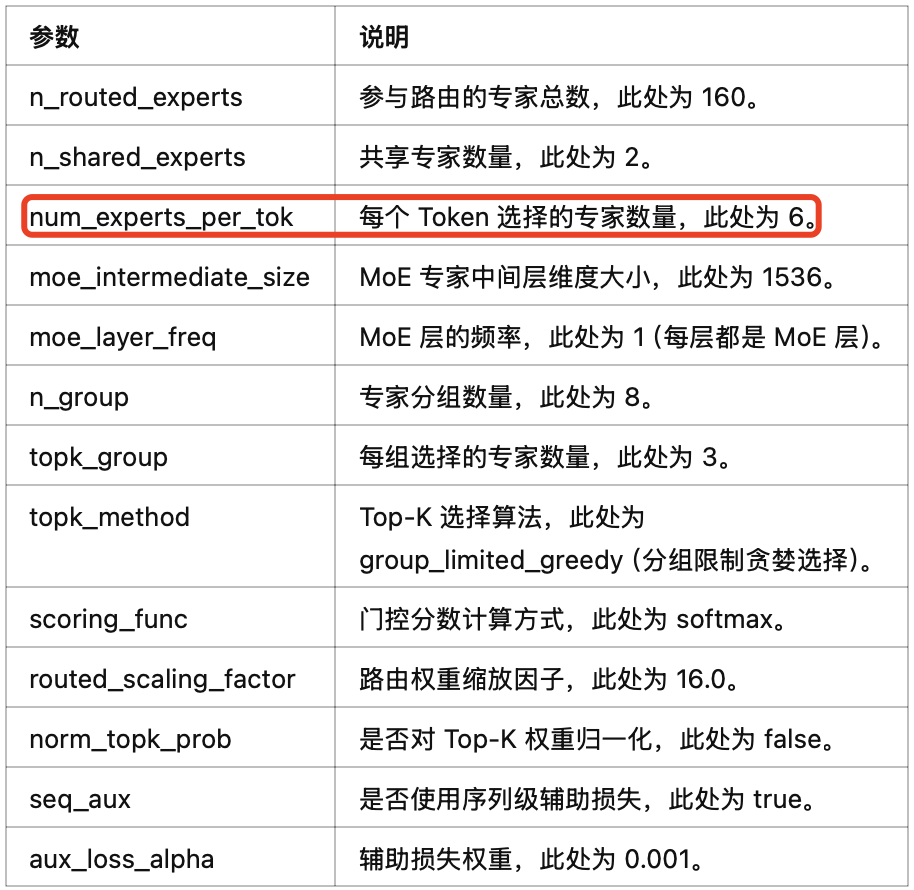

- [1. 基础 MOE 结构介绍](#1-基础-moe-结构介绍)
- [2. DeepseekMOE 结构介绍](#2-deepseekmoe-结构介绍)
  - [2.1 Gate 网络与 DeepseekMOE 计算流程](#21-gate-网络与-deepseekmoe-计算流程)
- [3. DeepseekMOE 结构代码实现](#3-deepseekmoe-结构代码实现)
  - [3.1 DeepseekV2MLP 实现](#31-deepseekv2mlp-实现)
  - [3.2 门控/路由网络实现](#32-门控路由网络实现)
  - [3.3 DeepseekMOE 实现](#33-deepseekmoe-实现)
- [参考资料](#参考资料)

## 1. 基础 MOE 结构介绍

`Mixtral` 8x7B (announcement, model card) 是高质量的混合专家模型 (Mixed Expert Models，简称 MoEs) 的 Transformer 模型，或者说是一种稀疏的 mixture-of-experts 模型，采用纯解码器结构，并使用 `MOE` 结构，替换原始的 `FFN` 结构。在每一层，对每个 `token`，存在一个 `router network` 会挑选两组 “experts”(即参数量更小的 FFN）来分别处理该 token，并通过**加法方式**融合两组 “experts” 的输出。

基础版的（稀疏）MOE 结构图如下图所示:


MOE 通常由两部分组成：
- **门控或 Router 网络**：模块负责根据输入 token 的特征动态选择激活哪些专家，路由器是由带学习的参数组成的网络。
- **“experts” 网络（小型 FFN）**：每层 MOE 都包含若干个（稀疏）专家网络，其通常是小型的 FFN，**在实际推理中只有部分专家(通常 8 个)会被激活参与计算**。

## 2. DeepseekMOE 结构介绍

和基础 MOE 结构的区别是：
1. **更精细地划分专家网络**，提升每个专家的专业性，提高知识表达的准确度。
2. **引入部分共享专家**，减少不同专家间的知识冗余，提升计算效率；所有 tokens 都会经过的共享专家，每个 token 会用计算的 Router 权重，来选择 topK 个专家，然后和共享的专家的输出一起加权求和。

DeepseekMOE 其实是有两类专家的：
- 共享专家（Shared Expert）：1 个共享专家，用于捕捉**通用**、全局的特征信息。
- 路由专家（Routed Experts）：每个 MoE 层都包含 256 个路由专家，负责精细化处理输入 tokens 的专业特征。

### 2.1 Gate 网络与 DeepseekMOE 计算流程

当一个 token 的向量传入 MoE 层时，首先会经过一个专门的 Gate 网络，该网络负责计算 token 与各个路由专家之间的匹配得分。具体流程如下：

1. **计算 tokens 和专家的匹配得分**
   - Gate 网络通过**线性变换**计算每个 token 与所有路由专家的兼容性得分。得分可以反映 token 和各专家“契合”的程度。

2. **选择 Top-K 专家**
    - 基于得分，Gate 网络为每个 token 选择 `Top-K` 个最合适的路由专家。在 DeepSeek‐V3 中，每个 token 通常选择 8 个路由专家（在一些实现中还可能对跨节点路由做限制，如最多路由到 4 个不同节点），从而只激活极少数专家进行计算。

3. **专家处理与加权聚合**
   - 被选中的专家各自对 `token` 进行独立处理（专家实际上是小型 FFN 模块，类似于 Transformer 中的 FFN 模块），并产生各自的输出。然后，**这些专家的输出会根据 Gate 网络给出的得分权重进行加权聚合**，最后再和共享专家的输出进行融合，形成当前 MoE 层的最终输出表示。

`DeepseekV2` 模型的 `MOE` 参数如下：

```json
{
  // 部分参数省略
  "hidden_act": "silu",
  "hidden_size": 5120,
  "initializer_range": 0.02,
  "intermediate_size": 12288,
  "model_type": "deepseek_v2",
  "moe_intermediate_size": 1536,
  "moe_layer_freq": 1,
  "n_group": 8,
  "n_routed_experts": 160,
  "n_shared_experts": 2,
  "norm_topk_prob": false,
  "num_experts_per_tok": 6,
  "num_hidden_layers": 60,
  "num_key_value_heads": 128,
  "topk_group": 3,
  "topk_method": "group_limited_greedy",
}
```

混合专家（MoE）参数说明：

<div align="center">

</div>

## 3. DeepseekMOE 结构代码实现

这里只考虑推理模式下的 DeepseekMOE 结构实现，且分步实现。

### 3.1 DeepseekV2MLP 实现

专家其实就是参数量更少的 FFN/MLP 结构，和 llama 中结构一样，只是参数量和计算量更少了，DeepseekV2MLP 代码如下所示。

```python
class DeepseekV2MLP(nn.Module):
    def __init__(self, config, hidden_size=None, intermediate_size=None):
        super().__init__()
        self.config = config
        self.hidden_size = config.hidden_size if hidden_size is None else hidden_size
        self.intermediate_size = (
            config.intermediate_size if intermediate_size is None else intermediate_size
        )

        self.gate_proj = nn.Linear(self.hidden_size, self.intermediate_size, bias=False)
        self.up_proj = nn.Linear(self.hidden_size, self.intermediate_size, bias=False)
        self.down_proj = nn.Linear(self.intermediate_size, self.hidden_size, bias=False)
        self.act_fn = ACT2FN[config.hidden_act] # silu 激活函数

    def forward(self, x):
        mlp_out = self.down_proj(self.act_fn(self.gate_proj(x)) * self.up_proj(x))
        return mlp_out
```

### 3.2 门控/路由网络实现

门控网络的作用是，根据输入 tokens 动态的选择 Top-K 个专家，并为每个 Token 分配权重。关键流程如下：
1. **门控分数计算**：通过线性层 + Softmax 生成专家选择概率分布。
2. **Top-K 专家选择**：支持两种模式（贪婪选择 vs 分组限制贪婪选择），贪婪模式直接使用 torch.topk 函数**选取分数张量中的前 k 个分数**。
3. **权重归一化**：对 Top-K 权重进行归一化或缩放。

代码实现如下所示:

```python
import torch
import torch.nn as nn
import torch.nn.functional as F
import math 
from dataclasses import dataclass

class MoEGate(nn.Module):
    def __init__(self, config):
        super().__init__()
        self.config = config
        self.top_k = config.num_experts_per_tok
        self.n_routed_experts = config.n_routed_experts
        self.routed_scaling_factor = config.routed_scaling_factor
        self.scoring_func = config.scoring_func
        self.topk_method = config.topk_method
        self.n_group = config.n_group
        self.topk_group = config.topk_group
        self.norm_topk_prob = config.norm_topk_prob
        
        # 静态化推理配置（假设配置固定）
        self.inference_norm = self.norm_topk_prob and (self.top_k > 1)
        self.use_group_limited = (self.topk_method == "group_limited_greedy")

        # 门控权重
        self.gating_dim = config.hidden_size
        self.weight = nn.Parameter(torch.empty((self.n_routed_experts, self.gating_dim)))
        self.reset_parameters()

    def reset_parameters(self):
        nn.init.kaiming_uniform_(self.weight, a=math.sqrt(5))

    @torch.inference_mode()  # 禁用梯度与训练逻辑
    def forward(self, hidden_states):
        bsz, seq_len, h = hidden_states.shape
        hidden_states = hidden_states.reshape(-1, h)
        
        # 门控分数计算（保持原始数据类型）
        logits = F.linear(hidden_states, self.weight)  # [n_tokens, n_experts]
        scores = logits.softmax(dim=-1)  # 自动推断 dtype

        # Top-K 选择（静态分支）
        if self.use_group_limited:
            # 分组限制逻辑优化
            group_scores = scores.view(bsz * seq_len, self.n_group, -1).max(dim=-1).values
            group_idx = torch.topk(group_scores, k=self.topk_group, dim=-1, sorted=False)[1]
            group_mask = torch.zeros_like(group_scores).scatter_(1, group_idx, 1)
            score_mask = group_mask.unsqueeze(-1).expand(-1, -1, self.n_routed_experts // self.n_group).reshape(bsz * seq_len, -1)
            scores = scores.masked_fill(~score_mask.bool(), 0.0)
        
        topk_weight, topk_idx = torch.topk(scores, k=self.top_k, dim=-1, sorted=False)

        # 权重归一化（静态分支）
        if self.inference_norm:
            topk_weight = topk_weight / (topk_weight.sum(dim=-1, keepdim=True) + 1e-20)
        else:
            topk_weight = topk_weight * self.routed_scaling_factor

        return topk_idx, topk_weight, None  # aux_loss 始终为 None

@dataclass
class DeepseekV2Config:
    # 1, Position Config
    max_position_embeddings: int = 163840
    vocab_size: int = 102400

    # 2, MLA Config
    # down_linear config
    q_lora_rank: int = 1536
    kv_lora_rank: int = 512

    # head_dim、heads and hidden_size config
    v_head_dim: int = 128
    qk_nope_head_dim: int = 128
    qk_rope_head_dim: int = 64
    hidden_size: int = 5120
    num_attention_heads: int = 128
    num_key_value_heads: int = 128
    
    attention_bias: bool = False

    attention_dropout: float = 0.1
    # rope config
    rope_theta: float = 10000

    # 3, MOE Config
    n_group: int = 8
    n_routed_experts: int = 160
    num_experts_per_tok: int = 6
    topk_group: int = 3
    routed_scaling_factor: float = 1.0
    scoring_func: str="softmax"
    topk_method: str="greedy"
    norm_topk_prob: bool = True

# 初始化配置
config = DeepseekV2Config()

# 模拟输入，CPU 电脑可直接跑，去除了 cuda 设备限制代码
device = torch.device("cuda" if torch.cuda.is_available() else "cpu")
hidden_states = torch.randn(32, 64, 5120, device=device)

# 创建模块
moe_gate = MoEGate(config)  # 半精度推理

# gate 网络推理
topk_idx, topk_weight, _ = moe_gate(hidden_states)

print("topk_idx shape ", topk_idx.shape) # 32 * 64 = 2048 个 tokens
print("topk_weight shape", topk_weight.shape)

"""
# 输出如下，表示每个 token 会激活 6 个专家参与计算
topk_idx shape  torch.Size([2048, 6]) 
topk_weight shape torch.Size([2048, 6])
"""
```

### 3.3 DeepseekMOE 实现

1. **门控计算**
   - 调用门控网络（self.gate），对输入 hidden_states 计算得到 top‑k 专家索引（topk_idx）、对应权重（topk_weight）以及辅助损失（aux_loss，推理时不参与梯度计算）。
2. **数据重排**
    - 将输入 hidden_states 展平为二维张量（形状 $[B \times T, d]$），并将 topk_idx 也展平。
	- 在推理模式下，通常不需要像训练时那样对每个 token 进行 repeat_interleave，因为每个 token 只会由对应专家处理一次。
3. **专家计算**
	- 根据展平后的 `topk_idx`，依次对每个专家负责的 token 子集进行计算。
	- 由于这里可能存在多个 token 被分配给不同专家，实际实现中需要将每个专家的输出按顺序记录下来。
4. **输出重构与加权融合**
	- 将所有专家计算的输出进行合并。通过将输出重新整理（排序）回原始 token 顺序，并按照 topk_weight 对各个专家输出进行加权求和，从而获得最终输出。
	- 整个过程保证最终输出形状与原始输入保持一致，即 $[B, T, d]$。

代码实现如下所示：

```python
# 为了单元测试，模拟不使用分布式（ep_size默认为1）
class DeepseekV2MoE(nn.Module):
    """
    A mixed expert module containing shared experts.
    """
    def __init__(self, config):
        super().__init__()
        self.config = config
        self.num_experts_per_tok = config.num_experts_per_tok

        self.experts = nn.ModuleList(
            [
                DeepseekV2MLP(
                    config, intermediate_size=config.moe_intermediate_size
                )
                for i in range(config.n_routed_experts)
            ]
        )
        self.gate = MoEGate(config)
        if config.n_shared_experts is not None:
            intermediate_size = config.moe_intermediate_size * config.n_shared_experts
            self.shared_experts = DummyMLP(config=config, intermediate_size=intermediate_size)

    # 此处为简化实现，仅做推理示例，不涉及分布式通信
    @torch.no_grad()
    def moe_infer(self, x, topk_ids, topk_weight):
        # x: [batch * seq_len, hidden_size] # 对每个 token 依然采用与训练类似的方式进行专家计算
        outputs = []
        flat_topk_ids = topk_ids.view(-1)
        for i, expert in enumerate(self.experts):
            mask = (flat_topk_ids == i)
            if mask.sum() == 0:
                continue
            outputs.append(expert(x[mask]))
        # 简单拼接，不做复杂排序和 all-to-all 操作
        outs = torch.cat(outputs, dim=0)
        new_x = torch.empty_like(outs)
        # 这里直接返回加权求和的结果（实际实现更复杂）
        final_out = (outs.view(*topk_weight.shape, -1) * topk_weight.unsqueeze(-1)).sum(dim=1)
        return final_out
```

## 参考资料

- [Mixtral of Experts](https://arxiv.org/pdf/2401.04088)
- [Switch Transformers: Scaling to Trillion Parameter Models with Simple and Efficient Sparsity](https://arxiv.org/pdf/2101.03961)
- [混合专家模型 (MoE) 详解](https://huggingface.co/blog/zh/moe)
- [MOE 大模型架构与机制详解 —— 以 DeepSeek‑v3 为例](https://zhuanlan.zhihu.com/p/22570639120)