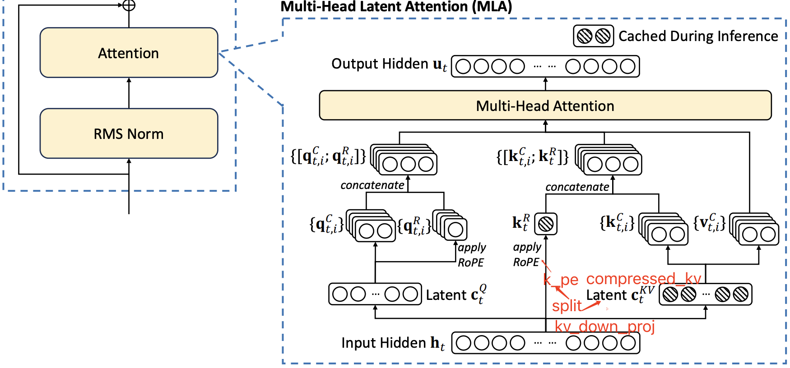
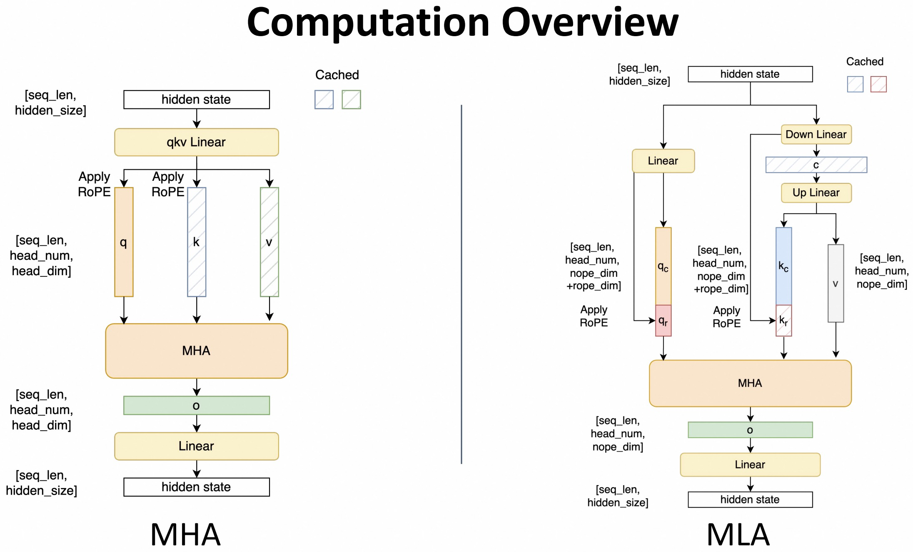
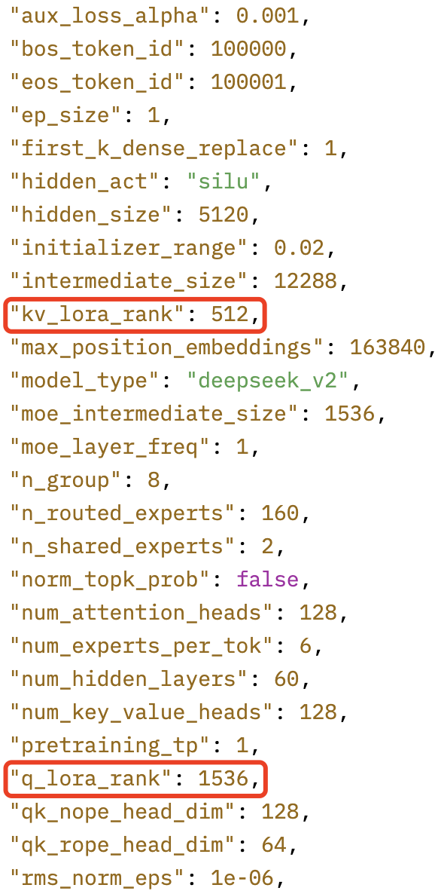

- [1. MLA 计算拆解](#1-mla-计算拆解)
  - [1.1 Q 向量计算](#11-q-向量计算)
  - [1.2 KV 向量计算](#12-kv-向量计算)
  - [1.3 Self-Attention 计算](#13-self-attention-计算)
- [2. 标准 MLA 模块的代码实现](#2-标准-mla-模块的代码实现)
- [3 MLA 模块的代码优化-Projection Absorption](#3-mla-模块的代码优化-projection-absorption)
  - [3.1 CC (CacheCompressed）](#31-cc-cachecompressed)
  - [3.2 A\_CC（AbsorbCacheCompressed）](#32-a_ccabsorbcachecompressed)
- [参考资料](#参考资料)

## 1. MLA 计算拆解

`MLA` 结构的可视化图如下所示：

<div align="center">

</div>

`MHA` 和 `MLA` 的结构对比如下所示：

<div align="center">

</div>

DeepDeekV2 的模型配置如下所示:

<div align="center">

</div>

### 1.1 Q 向量计算
> 大部分参考 [DeepSeek-V2高性能推理优化笔记：MLA优化](https://github.com/madsys-dev/deepseekv2-profile/blob/main/workspace/blog/optimizing-mla.md)，部分细节做了修改和优化， MLA 结构图以及这章节的公式更多的是给出 MLA 过程和细节，实际的代码实现没有一一对应。

1，在 DeepSeek-V2 中，Q 向量也采用了低秩压缩的方式。首先，将输入向量投影到一个 `1536`（**对应模型配置文件中的 `q_lora_rank` 参数**）维的低维空间，得到 Latent $c_t^Q$。

$$c_t^Q = W^{DQ} h_t \in \mathbb{R}^{B \times L \times 1536}$$

2，然后，再将其投影到 $\mathbb{R}^{H \times 128}$ 的多头向量空间上（其中 $H=128$ 是 `heads` 数，对应配置文件中的 `qk_nope_head_dim` 参数），得到了 Q 向量的第一部分: $q_t^C$。

$$q_t^C = W^{UQ} c_t^Q \in \mathbb{R}^{B \times L \times H \times 128}$$

3，再将其投影到 $\mathbb{R}^{H \times 64}$（对应模型配置文件中的 `qk_rope_head_dim` 参数）上，并使用 RoPE 嵌入位置信息，得到 Q 向量的第二部分: $q_t^R$。

$$q_t^R = \mathrm{RoPE}(W^{QR} c_t^Q) \in \mathbb{R}^{B \times L \times H \times 64}$$

4，最后，将这两部分进行 `concat` 拼接得到最终的 $Q$ 向量：$q_t$。

$$ q_t = [q_t^C, q_t^R] \in \mathbb{R}^{B \times L \times H \times 192}$$


其中：
- $B$: `batch_size` 批量大小；
- $L$: `seq_len` 序列长度；
- $H$: `heads` 注意力头数；
- $\mathbb{R}$ 的最后一维是 `head_dim`。

### 1.2 KV 向量计算

1，计算 $KV$ 向量时，首先，将输入向量投影到一个 $512$（**对应模型配置文件中的 `kv_lora_rank` 参数**）维的低维空间，得到 Latent $c_t^{KV}$：

$$c_t^{KV} = W^{DKV} h_t \in \mathbb{R}^{B \times L \times 512}$$

2，然后，和 $Q$ 向量的计算过程类似，$K$ 向量的第一部分 $k_t^C$ 是将 $c_t^{KV}$ 通过投影解压缩到 $\mathbb{R}^{H \times 128}$ 的多头向量空间上（其中 $H$ 是 `heads` 数量，值是 `128`，$128$ 对应模型配置文件中的 `qk_rope_head_dim` 参数），计算公式如下：

$$k_t^C = W^{UK}c_t^{K} \in \mathbb{R}^{B\times L\times H\times 128}$$

3，和 Q 向量不同，$K$ 向量的第二部分的 $k_t^R$ 是将输入向量投影到 $\mathbb{R}^{B \times L \times 1 \times 64}$ 单头向量空间（$64$ 对应模型配置文件中的 `qk_rope_head_dim` 参数）维向量空间，并应用 RoPE 嵌入位置信息, 计算公式如下：

$$k_t^R = \mathrm{RoPE}(W^{KR} h_t) \in \mathbb{R}^{B \times L \times 1 \times 64}$$

4，最后，和 $Q$ 不同，完整的 $K$ 是将 $k_t^R$ **广播到每个 `head` 后再与 $k_t^C$ `concate` 拼接得到**：

$$k_t = \begin{bmatrix}
    k_{t,1}^C & k_t^R \\ 
    k_{t,2}^C & k_t^R \\
    \vdots & \vdots \\
    \end{bmatrix} \in \mathbb{R}^{B \times L \times H \times 192}$$

上述广播后拼接的方式意味着，**每个 head 的 RoPE 部分是完全相同的**。

$V$ 向量因为不需要执行 `ROPE` 操作，所以它的的计算较为简单，直接将 $c_t^{KV}$ 解压缩（升维）到 $\mathbb{R}^{H \times 128}$ 即可：

$$ \mathbf{v}_t = W^{UV} c_t^{KV} \in \mathbb{R}^{B \times L \times H \times 128} $$

注意: $k_t^R$ 和 $c_t^{KV}$ 是需要缓冲的向量。前面计算得到 $q_t$、$k_t$ 和 $\mathbf{v}_t$ 用来执行 self-attention 计算。

### 1.3 Self-Attention 计算

Self-Attention 的计算过程和传统的 `MHA` 一模一样。同样也是首先计算 `attention score`：

<!--  -->
$$p = \mathrm{softmax}\left(\frac{q_t^\top k_t + \mathrm{Mask}}{\sqrt{192}}\right)
= \mathrm{softmax}\left(\frac{{q_t^C}^\top k_t^C + {q_t^R}^\top k_t^R + \mathrm{Mask}} {\sqrt{128 + 64}} \right)
\in \mathbb{R}^{B \times L \times H \times L}$$
<!--  -->

计算对 $V$的加权和，并将所有 heads 压平（即 heads * head_dim），得到 Attention 输出：

$$ o = p \cdot \mathbf{v}_t \in \mathbb{R}^{B \times L \times H \times 128} \cong \mathbb{R}^{B \times L \times 16384} $$

其中，$16384 = 128 \times 128 = \text{num\;attention\;heads * v\;head\;dim}$。最后，经过另一个注意力输出矩阵的投影（5120 是 `hidden_size`），就能得到 MLA 的最终输出：

$$u = W^O o \in \mathbb{R}^{B \times L \times 5120}$$

## 2. 标准 MLA 模块的代码实现

transformers 库中的 [modeling_deepseek.py](https://huggingface.co/deepseek-ai/DeepSeek-V2-Lite/blob/main/modeling_deepseek.py) 是没有经过推理加速优化的原始实现，我参考其实现给出了一个更为精简和更易看懂的版本，完整代码在[这里](https://github.com/harleyszhang/llm_note/blob/main/1-transformer_model/src/deepseekv_mla.py)。

```python
# 从 LlamaAttention 修改而来，适配 DeepseekV2 模型的注意力模块，简单版本不带 kv cache
class DeepseekV2MLA(nn.Module):
    def __init__(self, config: DeepseekV2Config):
        super().__init__()
        # MHA 初始化相关
        self.hidden_size = config.hidden_size
        self.num_heads = config.num_attention_heads
        self.v_head_dim = config.v_head_dim

        self.o_proj = nn.Linear(
            self.v_head_dim * self.num_heads, 
            self.hidden_size,
            bias=config.attention_bias,
        )

        self.attention_dropout = config.attention_dropout
        self.training = False
        self.qk_nope_head_dim = config.qk_nope_head_dim
        self.qk_rope_head_dim = config.qk_rope_head_dim

        # MLA 相关 part1: 压缩
        self.q_lora_rank = config.q_lora_rank
        self.kv_lora_rank = config.kv_lora_rank

        self.q_down_proj = nn.Linear(self.hidden_size, self.q_lora_rank)
        self.q_down_rmsnorm = DeepseekV2RMSNorm(self.q_lora_rank)
        
        self.kv_down_proj = nn.Linear(
            self.hidden_size, 
            self.kv_lora_rank + config.qk_rope_head_dim
        )
        self.kv_down_rmsnorm = DeepseekV2RMSNorm(self.kv_lora_rank)
        
        # MLA 相关 part2: 解压缩. # W^{WQ} 和 W^{QR} 权重是合并再一起的。
        self.qk_head_dim = self.qk_nope_head_dim  + self.qk_rope_head_dim
        self.q_up_proj = nn.Linear(
            self.q_lora_rank, 
            self.num_heads * self.qk_head_dim,
            bias=False,
        )
        
        self.kv_up_proj = nn.Linear(
            self.kv_lora_rank, 
            self.num_heads * (self.qk_nope_head_dim + self.v_head_dim),
            bias=False,
        )
        
        # MLA 相关 part3: 切片 q k 张量，以及 rope 旋转位置编码
        self.rotary_emb = DeepseekV2RotaryEmbedding(
            config.qk_rope_head_dim,
            config.max_position_embeddings,
            config.rope_theta,
        ) 

    def forward(self, hidden_states, position_ids, casual_mask=None):
        batch_size, q_len, hidden_size = hidden_states.shape

        # 1，q 压缩和解压缩，以及 split to q_nope, q_rope
        q = self.q_up_proj(
            self.q_down_rmsnorm(self.q_down_proj(hidden_states))
        )

        q = q.view(batch_size, q_len, self.num_heads, self.qk_head_dim).transpose(1,2)
        q_nope, q_rope = torch.split(
            q,
            [self.qk_nope_head_dim, self.qk_rope_head_dim],
            dim = -1,
        )

        # 2, kv 压缩和解压缩
        kv_down = self.kv_down_proj(hidden_states)
        
        # compressed_kv 压缩后的 kv 张量
        compressed_kv, k_rope = torch.split(
            kv_down,
            [self.kv_lora_rank, self.qk_rope_head_dim],
            dim = -1,
        )
        # num_heads = 1 后续广播其它 heads 上
        k_rope = k_rope.view(batch_size, q_len, 1, self.qk_rope_head_dim).transpose(1, 2)

        # 对 compressed_kv 解压缩
        kv = (
            self.kv_up_proj(self.kv_down_rmsnorm(compressed_kv))
            .view(batch_size, q_len, self.num_heads, self.qk_nope_head_dim + self.v_head_dim)
            .transpose(1, 2)
        )

        k_nope, value_states = torch.split(
            kv,
            [self.qk_nope_head_dim, self.v_head_dim],
            dim = -1,
        )

        # 3, 计算 cos 和 sin，并应用 rope 旋转位置编码
        kv_seq_len = value_states.shape[-2] # shape (b, nums_head, seq_len, v_head_dim)
        cos, sin = self.rotary_emb(value_states, seq_len=kv_seq_len)
        
        q_rope, k_rope = apply_rotary_pos_emb(q_rope, k_rope, cos, sin, position_ids)

        # 4, 执行 self-attention 计算
        query_states = torch.concat([q_nope, q_rope], dim=-1)
        key_states = torch.concat(
            [k_nope, k_rope.expand(-1, self.num_heads, -1, -1)], 
            dim=-1
        )
        # qk^t
        scores = (
            torch.matmul(query_states, key_states.transpose(2, 3)) / math.sqrt(self.qk_head_dim)
        )

        if casual_mask is not None:
            scores = scores.masked_fill(casual_mask == 0, float('-inf'))
        
        attn_weights = F.softmax(scores, dim=-1).to(query_states.dtype)
        attn_weights = F.dropout(
            attn_weights, p=self.attention_dropout, training=self.training
        ) # attn_weights shape: [bs, num_heads, seq_len, seq_len]
        
        attn_output = torch.matmul(attn_weights, value_states) # shape: [bs, num_heads, seq_len, head_dim]
        attn_output = attn_output.transpose(1, 2).contiguous().reshape(batch_size, q_len, self.num_heads * self.v_head_dim)

        # 5, MLA 输出映射
        output = self.o_proj(attn_output)

        return output, attn_weights
```

## 3 MLA 模块的代码优化-Projection Absorption

### 3.1 CC (CacheCompressed）

在 transformers 库中， MLA 算子不再缓冲完整的 KV Cache，而是改为缓存**压缩后的 KV Cache**，并将 RoPE 后的 `k_pe` 一并缓存入 KV Cache 中，与缓存完整的 KV Cache 相比，这将大大减少每个 token 的每层 Cache 大小。

### 3.2 A_CC（AbsorbCacheCompressed）

`CacheCompressed` 的代码并没有减少 KV Cache 过大的问题，因为在计算 MLA 的时候，仍然需要存储解压后的完整的 `KV Cache`（中间激活），这很可能引起 OOM 崩溃。

DeepSeek-V2 论文中提出，可以将 KV 的解压缩矩阵吸收到 Q-projection 和 Out-projection 中，从而可以在不解压缩 KV Cache的 情况下直接计算最终的 Attention 结果。 

1，**对于 K 的吸收**（吸收进 self-attention 算子中，相当于算子合并），在 Attention Score 的计算公式中，K 向量的非 RoPE 部分的可以做如下展开：

$${q_t^C}^\top k_t^C = (W^{UQ} c_t^Q)^{\top} W^{UK} c_t^{KV} = {c_t^Q}^{\top}{W^{UQ}}^{\top} W^{UK} c_t^{KV} = ({c_t^Q}^{\top}{W^{UQ}}^{\top} W^{UK}) c_t^{KV}$$

即通过矩阵乘法结合律，可以改为计算 $({c_t^Q}^{\top}{W^{UQ}}^{\top} W^{UK})$，K 的“吸收”核心的优化是 $\text{W}^\text{CombinedK} = ({W^{UQ}}^{\top} W^{UK})$，而这个组合矩阵是可以预先计算出来的。对应的 Attention Score 的计算就简化为：

$${c_t^Q}^{\top}\ \text{W}^\text{CombinedK}\ c_t^{KV}$$

那么做 $K$ 的吸收有什么好处呢？**避免重复解压缩出完整的 K 矩阵**：在原始版本的解压缩的过程中，由于每个 token 的 key 都需要与 $W^{UK}$ 相乘才能得到 $k_t$ 向量，然后再用 $q_t$ 去点乘这些 $k_t$，这意味着 $W^{UK}$ 要被用到很多次。

总结：`A_CC` 相比于 `CC`，把原来属于单 kv 的计算量转移到 q 上了，而 q 的 seq_len=1，可减少计算量。其中，$c_t^{KV}$ 是我们实际保存的 KV cache。

2，**$V$ 的吸收**，其实现更为复杂。为了更方便表述，采用 `Einstein` 求和约定描述该过程。先定义一些变量：
- b：批大小(batch)
- l：KV 序列长度
- q：Query 序列长度
- h：注意力头数
- c：输入特征维度
- d：每头 Value 维度
- D：最终输出维度

直接生成 Value 向量（基线实现）代码：

```python
# (1) 生成多头 Value：v_t ∈ ℝ^{b×l×h×d}
v_t = einsum('hdc, blc -> blhd', W_UV, c_t_KV)

# (2) 按注意力权重加权求和：o ∈ ℝ^{b×q×h×d}
o   = einsum('bqhl, blhd -> bqhd', a, v_t)

# (3) 输出投影：u ∈ ℝ^{b×h×D}
u   = einsum('hdD, bhqd -> bhD', W_o, o)

# 将上述三式合并，得到总的计算过程
u   = einsum('hdc,blc,bqhl,hdD->bhD', W_UV, c_t_KV, attn_weights, W_o)
```

结合律优化（延迟投影、避免 v_t）代码：

```python
# (4) 先把注意力权重直接乘到原始上下文，得到 o_ ∈ ℝ^{b×h×q×c}
o_  = einsum('bqhl, blc -> bhqc', attn_weights, c_t_KV)

# (5) 再做 Value 投影：o ∈ ℝ^{b×h×q×d}
o   = einsum('bhqc, hdc->bhqd', o_, W_UV)  # (5)

# (6) 最终输出：u ∈ ℝ^{b×h×D}
u   = einsum('hdD, bhqd -> bhD', W_o, o)
```

> 本质上是改变计算顺序的优化: **通过结合律调整计算顺序，减少中间张量的内存占用**。

显存对比：
- 基线需要暂存 v_t，大小为 b·l·h·d
- 优化版只产生 o_，大小为 b·h·q·c
- 在长序列（l ≫ q）或 d ≫ c 时能显著降低显存。

计算量对比：
- 基线的矩阵乘法规模：W_UV×c_t_KV ≈ h·d·c × b·l·c → b·l·h·d·c 乘加
- 优化版把乘加推迟到更小的张量 `o_` 上，整体 `MACs` 更少。

上述优化方法的实现和对比测试代码如下所示:

```python
import torch
import time

# 配置参数
b, q, l, h, d, c, D = 32, 64, 128, 64, 64, 128, 256  # 将 h 调整为 64
n_warmup = 10   # 预热次数
n_trials = 100  # 正式测试次数

# 初始化张量（GPU）
device = torch.device("cuda" if torch.cuda.is_available() else "cpu")

W_UV = torch.randn(h, d, c, device=device)
c_t_KV = torch.randn(b, l, c, device=device)
attn_weights = torch.randn(b, q, h, l, device=device)
W_o = torch.randn(h, d, D, device=device)  # h 维度为 64

# 预热 GPU
for _ in range(n_warmup):
    _ = torch.einsum('hdc,blc->blhd', W_UV, c_t_KV)
    _ = torch.einsum('bqhl,blhd->bqhd', attn_weights, _)
    _ = torch.einsum('hdD,bhqd->bhD', W_o, _)

# 原始分步实现
def original_method():
    v_t = torch.einsum('hdc,blc->blhd', W_UV, c_t_KV)
    o = torch.einsum('bqhl,blhd->bqhd', attn_weights, v_t)
    u = torch.einsum('hdD,bhqd->bhD', W_o, o.permute(0, 2, 1, 3))

# 优化后实现
def optimized_method():
    o_ = torch.einsum('bhql,blc->bhqc', attn_weights.permute(0, 2, 1, 3), c_t_KV)
    o = torch.einsum('bhqc,hdc->bhqd', o_, W_UV)
    u = torch.einsum('hdD,bhqd->bhD', W_o, o)

# 测量时间
def benchmark(func):
    times = []
    for _ in range(n_trials):
        start = time.time()
        func()
        end = time.time()
        times.append(end - start)
    return sum(times) / n_trials

# 执行测试
time_original = benchmark(original_method) * 1000  # 转换为毫秒
time_optimized = benchmark(optimized_method) * 1000

# 打印结果
print(f"原始方法平均时间: {time_original:.3f} ms")
print(f"优化方法平均时间: {time_optimized:.3f} ms")
print(f"速度提升: {time_original / time_optimized - 1:.1%}")

# 验证等价性
def validate_equivalence():
    v_t_orig = torch.einsum('hdc,blc->blhd', W_UV, c_t_KV)
    o_orig = torch.einsum('bqhl,blhd->bqhd', attn_weights, v_t_orig)
    u_orig = torch.einsum('hdD,bhqd->bhD', W_o, o_orig.permute(0, 2, 1, 3))
    
    v_t_opt = torch.einsum('hdc,blc->blhd', W_UV, c_t_KV)
    o_opt = torch.einsum('bqhl,blhd->bqhd', attn_weights, v_t_opt)
    u_opt = torch.einsum('hdD,bhqd->bhD', W_o, o_opt.permute(0, 2, 1, 3))
    
    # 检查是否等价
    assert torch.allclose(u_orig, u_opt, atol=1e-4), "两种方法结果不一致！"
    print("两种方法结果一致，验证通过。")

# 调用验证函数
validate_equivalence()

"""
原始方法平均时间: 28.649 ms
优化方法平均时间: 20.378 ms
速度提升: 40.6%
两种方法结果一致，验证通过。
"""
```

## 参考资料

- [vLLM在Prefill阶段和Decode阶段对MLA的不同实现的对比分析](https://zhuanlan.zhihu.com/p/1897225385751585767)
- [DeepSeek-V2 MLA KV Cache 真的省了吗？](https://zhuanlan.zhihu.com/p/714761319)
- [DeepSeek-V2 论文](https://arxiv.org/pdf/2405.04434)
- [DeepSeek-V2高性能推理优化笔记：MLA优化](https://github.com/madsys-dev/deepseekv2-profile/blob/main/workspace/blog/optimizing-mla.md)
- [再读MLA，还有多少细节是你不知道的](https://mp.weixin.qq.com/s/E7NwwMYw14FRT6OKzuVXFA)
- [LLMs-Zero-to-Hero](https://bruceyuan.com/llms-zero-to-hero/the-way-of-moe-model-evolution.html#_2-%E7%89%88%E6%9C%AC2-sparsemoe-%E5%A4%A7%E6%A8%A1%E5%9E%8B%E8%AE%AD%E7%BB%83%E4%BD%BF%E7%94%A8)
- [sglang_deepseek_model_optimizations](file:///Users/honggao/Downloads/sglang_deepseek_model_optimizations.pdf)