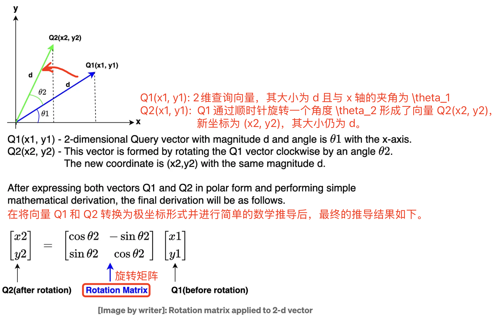
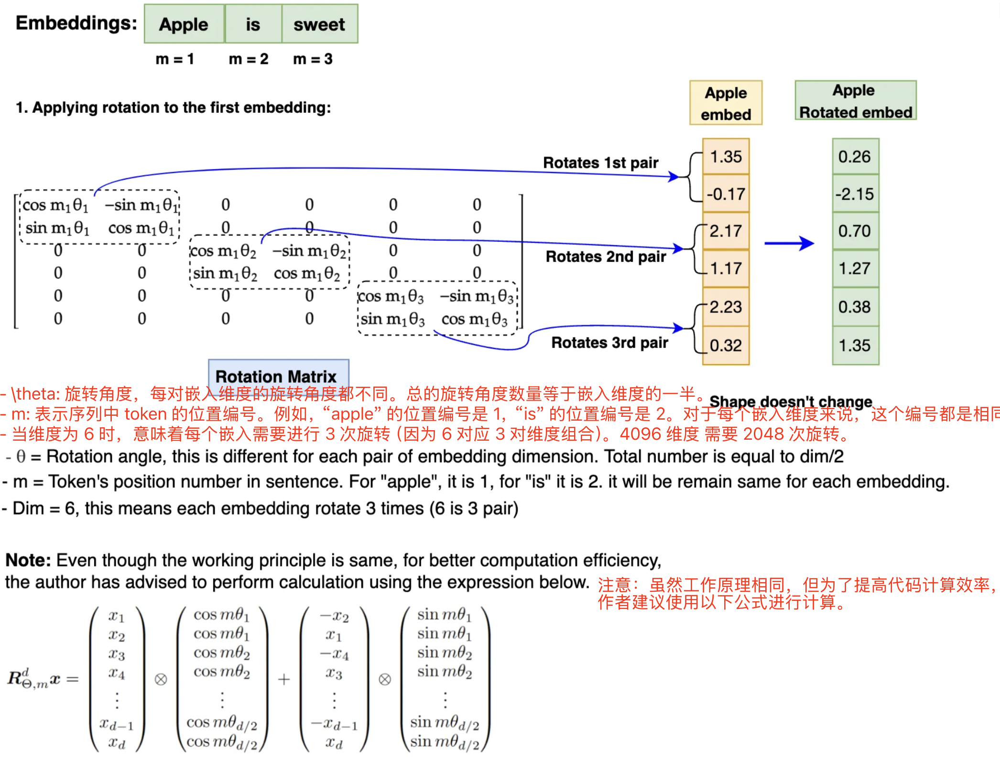

- [一 背景知识](#一-背景知识)
  - [1.1 torch 相关函数](#11-torch-相关函数)
  - [1.2 正弦位置编码 和 Self-Attention](#12-正弦位置编码-和-self-attention)
- [二 旋转位置编码 RoPE](#二-旋转位置编码-rope)
  - [2.1 RoPE 算法原理](#21-rope-算法原理)
  - [2.2 二维位置编码](#22-二维位置编码)
  - [2.3 多维的 RoPE 算法](#23-多维的-rope-算法)
- [三 RoPE 的 pytorch 实现](#三-rope-的-pytorch-实现)
  - [3.1 RoPE 实现流程](#31-rope-实现流程)
  - [3.2 RoPE 实现代码](#32-rope-实现代码)
- [参考资料](#参考资料)

旋转位置编码（Rotary Position Embedding，`RoPE`）是论文 Roformer: Enhanced Transformer With Rotray Position Embedding 提出的一种能够**将相对位置信息集成到 self-attention 中**，用以提升 transformer 架构性能的位置编码方式。

和 Sinusoidal 位置编码相比，RoPE 具有更好的外推性，目前是大模型相对位置编码中应用最广的方式之一。这里的外推性实质是一个**训练和预测的文本长度不一致的问题**。具体来说，不一致的地方有两点：
1. 预测的时候用到了没训练过的位置编码（不管绝对还是相对）；
2. 预测的时候注意力机制所处理的 token 数量远超训练时的数量。

RoPE 的核心思想是将**位置编码**与**词向量**通过**旋转矩阵**相乘，使得词向量不仅包含词汇的语义信息，还融入了位置信息，其具有以下优点：

1. 相对位置感知：RoPE 能够自然地捕捉词汇之间的相对位置关系。
2. 无需额外的计算：位置编码与词向量的结合在计算上是高效的。
3. 适应不同长度的序列：RoPE 可以灵活处理不同长度的输入序列。

> 三角函数、旋转矩阵、欧拉公式、复数等数学背景知识可以参考这篇[文章](./位置编码算法背景知识.md)学习。

## 一 背景知识

### 1.1 torch 相关函数

1，`torch.outer` 

函数作用：torch.outer(a, b) 计算两个 1D 向量 a 和 b 的外积，生成一个二维矩阵，其中每个元素的计算方式为：

$$\text{result}[i, j] = a[i] \times b[j]$$

即，矩阵的第 $i$ 行、第 $j$ 列的元素等于向量 a 的第 $i$ 个元素与向量 b 的第 $j$ 个元素的乘积。

外积（outer product）是指两个向量  a  和  b  通过外积操作生成的矩阵：

$$\mathbf{A} = a \otimes b$$

其中 $a \otimes b$ 生成一个矩阵，行数等于向量 $a$ 的元素数，列数等于向量 $b$ 的元素数。

```bash
>>> a = torch.tensor([2,3,1,1,2], dtype=torch.int8)
>>> b = torch.tensor([4,2,3], dtype=torch.int8)
>>> c = torch.outer(a, b)
>>> c.shape
torch.Size([5, 3])
>>> c
tensor([[ 8,  4,  6],
        [12,  6,  9],
        [ 4,  2,  3],
        [ 4,  2,  3],
        [ 8,  4,  6]], dtype=torch.int8)
```
2，`torch.matmul`

可以处理更高维的张量。当输入张量的维度大于 2 时，它将执行批量矩阵乘法。
```bash
>>> A = torch.randn(10, 3, 4)
>>> B = torch.randn(10, 4, 7)
>>> C = torch.matmul(A, B)
>>> D = torch.bmm(A, B)
>>> assert C.shape == D.shape # shape is torch.Size([10, 3, 7])
>>> True
```

3，`torch.polar`

```python
# 第一个参数是绝对值（模），第二个参数是角度
torch.polar(abs, angle, *, out=None) → Tensor
```
构造一个复数张量，其元素是极坐标对应的笛卡尔坐标，绝对值为 abs，角度为 angle。
$$\text{out=abs⋅cos(angle)+abs⋅sin(angle)⋅j}$$
```python
# 假设 freqs = [x, y], 则 torch.polar(torch.ones_like(freqs), freqs) 
# = [cos(x) + sin(x)j, cos(y) + sin(y)j]
>>> angle = torch.tensor([np.pi / 2, 5 * np.pi / 4], dtype=torch.float64)
>>> z = torch.polar(torch.ones_like(angle), angle)
>>> z
tensor([ 6.1232e-17+1.0000j, -7.0711e-01-0.7071j], dtype=torch.complex128)
>>> a = torch.tensor([np.pi / 2], dtype=torch.float64) # 数据类型必须和前面一样
>>> torch.cos(a)
tensor([6.1232e-17], dtype=torch.float64)
```

4，`torch.repeat_interleave`

```python
# 第一个参数是输入张量
# 第二个参数是重复次数
# dim: 沿着该维度重复元素。如果未指定维度，默认会将输入数组展平成一维，并返回一个平坦的输出数组。
torch.repeat_interleave(input, repeats, dim=None, *, output_size=None) → Tensor
```
返回一个具有与输入相同维度的重复张量

```bash
>>> keys = torch.randn([2, 12, 8, 512])
>>> keys2 = torch.repeat_interleave(keys, 8, dim = 2)
>>> keys2.shape
torch.Size([2, 12, 64, 512])
>>> x
tensor([[1, 2],
        [3, 4]])
>>> torch.repeat_interleave(x, 3, dim=1)
tensor([[1, 1, 1, 2, 2, 2],
        [3, 3, 3, 4, 4, 4]])
>>> torch.repeat_interleave(x, 3)
tensor([1, 1, 1, 3, 3, 3, 4, 4, 4, 5, 5, 5])
```

**注意重复后元素的顺序**，以简单的一维为例 `x = [a,b,c,d]`，`torch.repeat_interleave(x, 3)` 后，结果是 `[a,a,a,b,b,b,c,c,c,d,d,d]`。

### 1.2 正弦位置编码 和 Self-Attention

设 $q$ 表示第 $m$ 个 `token` 对应的词向量, 定义位置编码函数 $f$，输入参数为词向量 $q$ 和绝对位置信息 $m$，则得到 $q_m$:

$$q_m = f(q, m) \tag{1}$$   

同理得到 $k$、$v_n$ 公式:

$$k_n = f(k, n) \\
v_n = f(v, n) 
$$

> 注意，这里的 $f$ 其实是把 $\text{embedding}\_\text{vector} \times W_q$ 的矩阵乘法过程包含进去了。

其中函数 $f$ 正是我们需要构造的位置编码函数。有了 `query`、`key` 和 `value` 向量表达式，接着就可以利用查询和键的值来计算注意力权重（$softmax(qk^T)$），输出则是对 $v_n$ 的加权求和, 完整的 `self-attention` 公式如下所示:

$$
a_{m,n} = \frac{\exp\left(\frac{q_m^T k}{\sqrt{d}}\right)}{\sum_{j=1}^{N} \exp\left(\frac{q_m^T k_j}{\sqrt{d}}\right)} \\
o_m = \sum_{n=1}^{N} a_{m,n} v_n \tag{2}$$

方程 (1) 的一种常见（transformer 论文用的余弦位置编码）公式是：

$$f_t:t∈\{q,k,v\}(x_i, i) := W_{t}(x_i + p_i)，\tag{3}$$

其中，$p_i \in \mathbb{R}^d$  是与 `token` $x_i$ 的位置相关的 $d$ 维向量，Vaswani 等人 [2017] 则提出了通过正弦函数来生成 $p_i$ 的方法，即 Sinusoidal 位置编码：

$$p_{i,2t} = \sin\left(\frac{k}{10000^{2t/d}}\right) \\
p_{i,2t+1} = \cos\left(\frac{k}{10000^{2t/d}}\right) \tag{4}$$

其中， $p_{i,2t}$ 是 $p_i$ 的第 $2t$ 个维度。

## 二 旋转位置编码 RoPE

### 2.1 RoPE 算法原理

虽然 Sinusoidal 位置编码缓解了无法准确感知两个词向量相对位置的问题，但是还不够吗，于是 [RoPE 论文](https://arxiv.org/pdf/2104.09864)提出为了能**利用 token 之间的相对位置信息（$m-n$）**，希望 $q_m$ 和 $k$ 之间的内积，即 $f(q, m) \cdot f(k, n)$ 中能够带有相对位置信息 $m-n$。那么问题来了， $f(q, m) \cdot f(k, n)$ 的计算如何才算带有相对位置信息，论文提出只需将其能够表示成一个关于 $q$、$k$ 以及它们之间的相对位置 $m - n$ 的函数 g(q, k, m - n) 即可，公式表达如下所示：
 
$$\langle f_q(q, m), f_k(k, n) \rangle = g(q, k, m - n) \quad (5)$$

> 注意，这里只有 $f_q(q, m)$, $f_k(k, n)$ 是需要求解的函数，$\langle  \rangle$ 表示内积操作，而对于 $g$，我们要求是表达式中有 $q, k, (m-n)$，也可以说是 **$q_m, k$ 的内积会受相对位置 $m-n$ 影响**。

接下来的目标就是**找到一个等价的位置编码方式 $f$，从而使得上述关系成立**，函数 $f_q$ 包含了位置编码和 $W_q \times q$（嵌入向量转换为 $q$ 向量）过程。

### 2.2 二维位置编码

假设现在词嵌入向量的维度是两维 $d=2$，这样就可以利用上 $2$ 维度平面上的向量的几何性质，然后论文中提出了一个满足上述关系的 $f$ 和 $g$ 的形式如下:

$$
f_q(x_m, m) = (W_q x_m) e^{im\theta} \\
f_k(x_n, n) = (W_k x_n) e^{in\theta} \\
g(x_m, x_n, m - n) = Re \left[ (W_q x_m)(W_k x_n)^* e^{i(m-n)\theta} \right] \quad (6)$$
> 其中 \( Re \) 表示复数的实部，\( (W_k k)^* \) 表示 \( (W_k k) \) 的共轭复数, $x_m$ 表示第 $m$ 个 token 向量。

$f_q、f_k$ 的推导需要基于三角函数定理、欧拉公式等，推导过程参考[这里](https://zhuanlan.zhihu.com/p/642884818)，本文直接给出结论：

1，**$f_q(q, m)$ 其实等于 `query` 向量乘以了一个旋转矩阵**，即:

$$f_q(q, m) = \begin{pmatrix} 
\cos(m\theta) & -\sin(m\theta) \\
\sin(m\theta) & \cos(m\theta)
\end{pmatrix}
\begin{pmatrix} 
q_m^{(1)} \\
q_m^{(2)} 
\end{pmatrix} \quad (7)$$

2，**$f_k(k, n)$ 其实等于 `key` 向量乘以了一个旋转矩阵**，即:

$$f_k(k, n) = \begin{pmatrix} 
\cos(n\theta) & -\sin(n\theta) \\
\sin(n\theta) & \cos(n\theta)
\end{pmatrix}
\begin{pmatrix} 
k^{(1)} \\
k^{(2)} 
\end{pmatrix} \quad (8)$$

3，同样可得 $g(q, k, m - n)$ 等于 $q_m^T$ 乘以旋转矩阵再乘以 $k$，即:

$$\langle f_q(q, m), f_k(k, n) \rangle  = \mathbf{q}_m^T R(m - n) \mathbf{k}_n \quad (9)$$

$$\begin{aligned}
g(q, k, m - n) &= (q_m^{(1)} k^{(1)} + q_m^{(2)} k^{(2)}) \cos((m - n)\theta) - (q_m^{(2)} k^{(1)} - q_m^{(1)} k^{(2)}) \sin((m - n)\theta) \\
&= \begin{pmatrix}
q_m^{(1)} & q_m^{(2)}
\end{pmatrix}
\begin{pmatrix}
\cos((m - n)\theta) & -\sin((m - n)\theta) \\
\sin((m - n)\theta) & \cos((m - n)\theta)
\end{pmatrix}
\begin{pmatrix}
k^{(1)} \\
k^{(2)}
\end{pmatrix} \\
 &= \mathbf{q}_m^T R(m - n) \mathbf{k}_n
\end{aligned} \quad(10)$$

公式（9）的证明也可通过旋转矩阵性质得到，先将公式 (9) 抽象成 $\langle R_a X, R_b Y \rangle = \langle X, R_{b-a} Y \rangle$（$R$ 表示旋转矩阵，$X、Y$ 表示向量）, 该等式的证明过程如下：


$$\begin{aligned}
\langle R_a X, R_b Y \rangle &= (R_aX)^T R_bY \\
&= X^T R_a^T R_bY \\
&=  X^T R(-a)R_bY \\
&=  X^T R_{(b-a)}Y = \langle X, R_{(b-a)}Y \rangle\\
\end{aligned} \quad(11)$$

上述推导过程分别应用了：展开内积、矩阵乘法的结合律、旋转矩阵性质1、旋转矩阵性质2。

总结：和正弦位置编码不同，**RoPE 并不是直接将位置信息 $p_i$ 和嵌入向量元素 $x_i$ 相加，而是通过与正弦函数相乘的方式引入相对位置信息**。

### 2.3 多维的 RoPE 算法

前面的公式推导，是假设的词嵌入维度是 2 维向量，将二维推广到任意维度，$f_{\{q,k\}}$ 可以表示如下：

$$f_{\{q,k\}}(q, m) = R_{\Theta, m}^d W_{\{q,k\}} q \tag{12}$$

其中，$R_{\Theta, m}^d$ 为 $d$ 维度的旋转矩阵，表示为：

$$R_{\Theta, m}^d =
\begin{pmatrix}
\cos m\theta_0 & -\sin m\theta_0 & 0 & 0 & \cdots & 0 & 0 \\
\sin m\theta_0 & \cos m\theta_0 & 0 & 0 & \cdots & 0 & 0 \\
0 & 0 & \cos m\theta_1 & -\sin m\theta_1 & \cdots & 0 & 0 \\
0 & 0 & \sin m\theta_1 & \cos m\theta_1 & \cdots & 0 & 0 \\
\vdots & \vdots & \vdots & \vdots & \ddots & \vdots & \vdots \\
0 & 0 & 0 & 0 & \cdots & \cos m\theta_{d/2-1} & -\sin m\theta_{d/2-1} \\
0 & 0 & 0 & 0 & \cdots & \sin m\theta_{d/2-1} & \cos m\theta_{d/2-1}
\end{pmatrix} \tag{13}$$

$R_{\Theta, m}^d$ 的形状是 `[sqe_len, dim//2]`。可以看出，对于 $d >= 2$ 的通用情况，则是将词嵌入向量元素按照两两一组分组，每组应用同样的旋转操作且每组的旋转角度计算方式如下：

$$
\Theta = \left\{ \theta_i = 10000^{-2(i-1)/d}, i \in [1, 2, \dots, d/2] \right\}
$$

将 RoPE 应用到前面公式（2）的 Self-Attention 计算，可以得到包含相对位置信息的Self-Attetion：

$$q_m^T k = \left( R_{\Theta, m}^d W_q q \right)^T \left( R_{\Theta, n}^d W_k k \right) = q^T W_q R_{\Theta, n-m}^d W_k k \tag{14}$$

其中，
$$R_{\Theta, n-m}^d = \left( R_{\Theta, m}^d \right)^T R_{\Theta, n}^d$$

Rotary Position Embedding(RoPE) 实现的可视化如下图所示:


最后总结**结合 RoPE 的 self-attention 操作的流程**如下：
1. 首先，对于 `token` 序列中的每个词嵌入向量，都计算其对应的 query 和 key 向量;
2. 然后在得到 query 和 key 向量的基础上，应用前面 $f_q(q, m)$ 和 $f_k(k, n)$ 的计算公式（7）和（8）对每个 `token` 位置都计算对应的旋转位置编码；
3. 接着对每个 `token` 位置的 query 和 key 向量的元素按照**两两一组**应用旋转变换；
4. 最后再计算 `query` 和 `key` 之间的内积得到 self-attention 的计算结果。

## 三 RoPE 的 pytorch 实现

### 3.1 RoPE 实现流程

先看旋转矩阵用于旋转一个二维向量过程示例：

<div align="center">

</div>

但是 Llama 模型的嵌入维度高达 4096，比二维复杂得多，如何在更高维度的嵌入上应用旋转操作呢？通过 RoPE 算法原理我们知道，**嵌入向量的旋转实际是将每个嵌入向量元素位置 $m$ 的值与每一对嵌入维度对应的 $\theta$ 相乘**，过程如下图所示：
> RoPE 通过实现旋转矩阵，**是既捕获绝对位置信息，又结合相对位置信息的方式**（论文公式有更详细体现）。

<div align="center">

</div>

图中每组的旋转角度计算方式如下：

$$
\Theta = \left\{ \theta_i = 10000^{-2(i-1)/d}, i \in [1, 2, \dots, d/2] \right\}
$$

在实现 RoPE 算法之前，需要注意：为了方便代码实现，在进行旋转之前，需要将旋转矩阵转换为极坐标形式，嵌入向量（$q$、$k$）需要转换为复数形式。完成旋转后，旋转后的嵌入需要转换回实数形式，以便进行注意力计算。此外，RoPE 仅应用于查询（Query）和键（Key）的嵌入，不适用于值（Value）的嵌入。

### 3.2 RoPE 实现代码

通过仔细阅读和一步步分析了 `llama` 官方代码后，会发现作者直接转化为**复数相乘**形式来计算 $f_q(q, m) = (W_q q) e^{im\theta}$，旋转矩阵定义和各种变换完全没用上（有种前面推导了个寂寞的感觉），但是没办法，虽然直接使用旋转矩阵，更符合线性代数的常规思路，但是这需要手动处理每个维度的旋转矩阵，代码稍微繁琐而且计算效率不如复数乘法高效。

所以，作者在 `RoPE` 算法实现中，没有使用矩阵相乘的形式，而是把旋转角度张量和 $W_qqk$ 转为复数形式再相乘，即直接实现公式（6）中的 $f_q(W_q q) e^{im\theta}$，因此 **`RoPE` 算法实现的流程和代码理解的难点**如下：

1. 如何生成旋转角度 $\theta$ 向量, $\Theta = \{ \theta_i = 10000^{-2(i-1)/d}, i \in \left [1, 2, \dots, d/2 \right ] \}$;
2. 如何将旋转角度和 `token` 位置索引相乘，并构造一个矩阵，该矩阵包含了每个位置和每个维度对应的旋转角度。
3. 得到所有 `token` 位置和其对应旋转角度后，如何转换为复数形式 $e^{im\theta}$的旋转矩阵；
4. 如何对 `RoPE` 函数的输入参数 `x_q` 做**形状变换**，并将实数张量转换为复数张量形式；
5. 两个复数张量相乘（应用旋转操作）后，转换回实数域，并恢复原始形状。

最后，如果你直接看 `pytorch` 代码，其实很难理解 `rope` 是如何应用相对位置信息的，这个只能通过前面的公式推导才能理解。

结合 llama 官方实现代码，下述是我修改优化和添加注释后的代码，更容易看懂:

```python
def compute_theta(dim: int, base: float = 10000.0, device: torch.device = torch.device('cpu')) -> torch.Tensor:
    """
    计算旋转位置编码中的 Theta 角度值。

    参数：
    - d (int): 嵌入向量的维度（必须为偶数）。
    - base (float): 基础频率参数, 默认为10000.0。
    - device (torch.device): 计算设备, 默认为CPU。

    返回：
    - torch.Tensor: 包含Theta值的1D张量, 形状为 [d/2]。
    """
    if dim % 2 != 0:
        print("嵌入维度 dim 必须为偶数")
    i = torch.arange(1, (dim//2) + 1, dtype=torch.float32, device=device)
    theta_i = base ** (-2*(i - 1) / dim)

    return theta_i

def precompute_freqs_cis(dim: int, seq_len: int, base: float = 10000.0, device: torch.device = torch.device('cpu')):
    theta = compute_theta(dim, base, device) # theta 角度值序列，向量, 大小为 dim // 2
    m = torch.arange(seq_len, device=device) # # token 位置值序列，向量，大小为 seq_len
    m_theta = torch.outer(m, theta) # 所有 token 位置的所有 Theta 值范围, 矩阵，尺寸为 [seq_len, dim // 2]
    freqs_cis = torch.polar(torch.ones_like(m_theta), m_theta) # e^{i*m*\theta}，本质上是旋转矩阵
    return freqs_cis

def reshape_for_broadcast(freqs_cis, x):
    ndim = x.ndim
    assert ndim >= 2
    assert freqs_cis.shape == (x.shape[1],x.shape[-1]), "the last two dimension of freqs_cis, x must match"
    shape = [d if i==1 or i==ndim-1 else 1 for i,d in enumerate(x.shape)]
    return freqs_cis.view(*shape)

def apply_rotary_emb(xq: torch.Tensor, xk: torch.Tensor, freqs_cis: torch.Tensor, device: torch.device = torch.device('cpu')):
    """
    参数:
        - x_q(torch.Tensor): 实际上是权重 W_q * 词嵌入向量值, 来自上一个线性层的输出, 形状为 [batch_size, seq_len, n_heads, head_dim]
        - x_k(torch.Tensor): 实际上是权重 W_k * 词嵌入向量值, 来自上一个线性层的输出, 形状为 [batch_size, seq_len, n_heads, head_dim]
        - freqs_cis (torch.Tensor): 频率复数张量, 形状为 [max_seq_len, head_dim]
    返回:
        - Tuple[torch.Tensor, torch.Tensor]: 旋转编码后的查询和键张量
    """
    # 实数域张量转为复数域张量
    xq_reshape = xq.reshape(*xq.shape[:-1], -1, 2) # [batch_size, seq_len, dim] -> [batch_size, seq_len, dim//2, 2] 
    xk_reshape = xk.reshape(*xk.shape[:-1], -1, 2) # [batch_size, seq_len, dim] -> [batch_size, seq_len, dim//2, 2] 
    xq_complex = torch.view_as_complex(xq_reshape) # 复数形式张量
    xk_complex = torch.view_as_complex(xk_reshape) # 复数形式张量

    # 旋转矩阵（freqs_cis）的维度在序列长度（seq_len，维度 1）和头部维度（head_dim，维度 3）上需要与嵌入的维度一致。
    # 此外，freqs_cis 的形状必须与 xq 和 xk 相匹配，因此我们需要将 freqs_cis 的形状从 [max_seq_len, head_dim] 调整为 [1, max_seq_len, 1, head_dim]。
    freqs_cis = reshape_for_broadcast(freqs_cis, xq_complex) # [max_seq_len, 1, 1, dim // 2]

    # 应用旋转操作，并将结果转回实数域。# flatten(2) 将后面两个维度压成一个维度
    xq_out = torch.view_as_real(xq_complex * freqs_cis).flatten(3) 
    xk_out = torch.view_as_real(xk_complex * freqs_cis).flatten(3)

    return xq_out.type_as(xq), xk_out.type_as(xk)
```

结合 rope 位置编码的 attention 结构的完整代码在[这里](https://github.com/harleyszhang/llm_note/blob/main/1-transformer_model/src/rope.py)，运行后，单元测试结果如下所示：

```bash
test_compute_theta passed.
test_precompute_freqs_cis passed.
test_apply_rotary_emb passed, xq_out and xq [0][0][0][0]: -1.3532123565673828 -1.3532123565673828.
test_attention passed.
```
> transformers 库提供的 llama rope 实现在[这里](https://github.com/huggingface/transformers/blob/main/src/transformers/models/llama/modeling_llama.py#L204)

## 参考资料

- [RoFormer: Enhanced Transformer with Rotary Position Embedding](https://arxiv.org/abs/2104.09864)
- [十分钟读懂旋转编码（RoPE）](https://zhuanlan.zhihu.com/p/647109286)
- [一文看懂 LLaMA 中的旋转式位置编码（Rotary Position Embedding）](https://zhuanlan.zhihu.com/p/642884818)
- [图解RoPE旋转位置编码及其特性](https://mp.weixin.qq.com/s/-1xVXjoM0imXMC7DKqo-Gw)