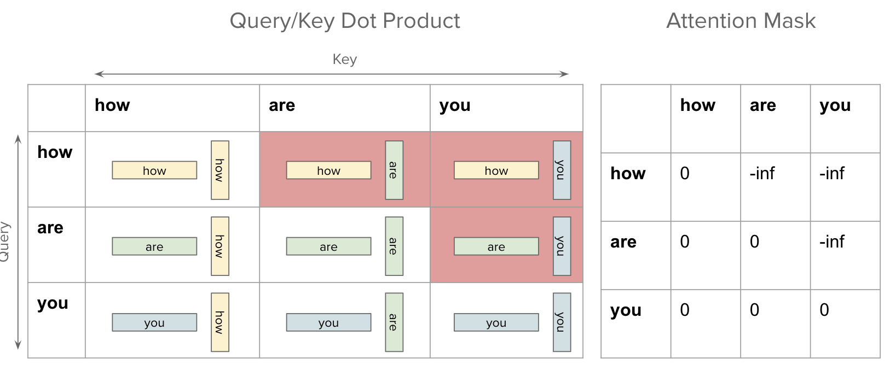

- [self-attention 结构](#self-attention-结构)
  - [Q/K/T 如何理解](#qkt-如何理解)
- [mask 原理](#mask-原理)
- [如何应用 mask](#如何应用-mask)
- [实现 Masked Attention](#实现-masked-attention)
  - [总结](#总结)
- [参考资料](#参考资料)

### self-attention 结构

`Self-Attention` 中文翻译为**自注意力机制**，论文中叫作 `Scale Dot Product Attention`，它是 Transformer 架构的核心，其结构如下图所示：

<div align="center">

</div>

通过上述结构图，我们可以知道自注意力的计算步骤如下所示：

对输入 tokens 进行线性变换，即输入序列通过三个线性层分别生成查询（Query）、键（Key）和值（Value）矩阵。

1. 计算注意力得分：查询矩阵与键矩阵的转置相乘，得到注意力得分矩阵。
2. 缩放：除以 $\sqrt{d_k}$
3. 应用掩码：根据任务需求应用掩码，将未来位置或填充位置对应值置为 `-inf`。注意，对于训练无需 mask 操作，对于 推理只有 `prefill` 阶段需要 `mask`，用了 kv cache 优化的 `decode` 阶段不需要 `mask` 操作。
4. 归一化：通过 `softmax` 函数将注意力得分归一化为概率分布。
5. 加权求和：将归一化后的注意力得分与值矩阵相乘，得到最终的注意力输出。

self-attention 的矩阵计算形式如下图所示:


假设 batch_size = 1, seq_len = 4, embedding_dim = 3, self-attention 的计算过程拆解及可视化如下所示。
> 缩放即除以 $\sqrt{d_k}$ 的操作没有展示。

**计算注意力得分**。在三个线性层对输入矩阵 $X$ 做线性变换得到 Q、K、V 矩阵后，执行 $QK^T$ 计算。


**应用掩码**。在 Softmax 操作之前需要先使用 `Mask` 矩阵遮挡住每一个单词之后的信息，masked 矩阵和应用遮挡操作的可视化如下所示：


**softmax 归一化**。得到 $\text{Mask}$ $QK^T$ 之后在 $\text{Mask}$ $QK^T$ 上进行 Softmax，每一行的和都为 1。但是单词 0 在单词 1, 2, 3, 4 上的 `attention score` 都为 0。这符合我们因果模型的性质，毕竟我们只关心当前 token 与之前 token 的注意力（相似度）关系！

**加权求和**。将 $\text{softmax}(\text{Mask}$ $QK^T)$ 与矩阵 $V$ 相乘，得到输出 $Z$，则单词 1 的输出向量 $Z_1$ 是只包含单词 1 信息的!


经过上述 `self-attention` 步骤就可以得到一个 Mask Self-Attention 的输出矩阵 $Z_i$，然后再通过 Multi-Head Attention 拼接多个输出然后计算得到第一个 Multi-Head Attention 的输出 $Z$，`MHA` 输出 $Z$ 与输入 $X$ 形状一样，即 `MHA` 不会改变输入张量的形状！

#### Q/K/T 如何理解

那么重点来了，第一个问题：Self-Attention 结构的最初输入 **Q(查询), K(键值), V(值)** 这三个矩阵怎么理解呢？其代表什么，通过什么计算而来？

在 Self-Attention 中，Q、K、V 是在**同一个输入（比如序列中的一个单词）上计算得到的三个向量**。具体来说，我们可以通过对原始输入**词的 embedding** 进行线性变换（比如使用一个全连接层），来得到 Q、K、V。这三个向量的维度通常都是一样的，取决于模型设计时的决策。

第二个问题：Self-Attention 结构怎么理解，Q、K、V的作用是什么？这三个矩阵又怎么计算得到最后的输出？

在计算 Self-Attention 时，Q、K、V 被用来**计算注意力分数**，即用于表示**当前位置和其他位置之间的关系**。注意力分数可以通过 Q 和 K 的点积来计算，然后将分数除以 `8`，再经过一个 softmax 归一化处理，得到每个位置的权重。然后用这些权重来加权计算 V 的加权和，即得到当前位置的输出。

> 将分数除以 8 的操作，对应图中的 `Scale` 层，这个参数 8 是 K 向量维度 64 的平方根结果。

### mask 原理

之所以需要 mask 是因为，**对于因果模型来说，只需要关注当前 token 与之前 token 的注意力关系，而无需理会它与后续 token 的关系**，基于此这种模型的 mask 被称为 `Causal Mask`。

在 self-attention 中实现 `Causal Mask`，其实就是要确保每个 `token` 只和它前面的词（包括它自己）进行交互，而不与它后面的词进行交互。

具体实现上，可以通过创建 mask 矩阵，然后在应用 softmax 函数之前，将 mask 矩阵加到$QK^T$ 点积相似度矩阵上，从而实现注意力分数矩阵的有效条目(`entires`)的注意力分数不变，无效条目的注意力分数变为无穷大（`-inf`）。两个 token 向量的注意力分数（点积值）较高，则认为它们之间相似度较高；但是如果它们的点积值为负无穷大，则表示它们是“无限不相似”的。

到这里，我们就还剩最后一个问题，`scores` 矩阵的哪些位置值应该置为 `-inf`，这里如果看过可视化 `self-attention` 计算过程图解，就能明白这本质上是**构建一个下三角 scores 矩阵**的问题！
> 在 `llama` 系列模型中，是构建**上三角 `scores` 矩阵**。

$QK^T$ 计算注意力分数，及应用 `Causal Mask` 过程的示意图如下所示：


上图可以看到，如果想要实现，让当前 `token` 只关注它及之前位置 `tokens` 的注意力关系，我们需要构建的 `Attention Mask` 是下三角矩阵。

1，为什么 gpt 这种 decoder-only 架构的模型还需要 mask？

GPT 在训练阶段为了提高训练效率，所以采用了 “masked self-attention” 机制，这使得在训练阶段每个 token 只能“看”它之前的所有 tokens。而在推理阶段，是自回归一个 token 一个 token 的生成，理论上无需 mask，但是为了和训练阶段保持一致，推理时通常仍然使用 mask。

3，标准 Transformer 模型中的 decoder 模块的 mask 作用？

而在标准的 Transformer 模型中，decoder 部分用于序列到序列的任务，如机器翻译。在这种情况下，decoder 在推理时是一次性获得整个输入序列（例如一个完整的句子），然后生成输出序列。这里的关键是 decoder 在生成每个词时都可以看到完整的输入序列，但是只能看到之前生成的输出词。为了实现这一点，使用了所谓的 “causal mask” 或 “look-ahead mask”，这确保了在生成第 n 个词时，模型只能看到输出序列中的前 n-1 个词。

> 参考[知乎回答](https://www.zhihu.com/question/647132629/answer/3419355716)。

### 如何应用 mask

代码实现分为两步：**创建 masked 矩阵和应用 masked 矩阵到 $QK^T$ 结果上**。

```python
>>> import torch
>>> seq_len = 4
>>> qkt = torch.randn([seq_len, seq_len])
>>> qkt
tensor([[ 0.0697,  0.7932, -0.1177,  0.0812],
        [ 0.3271, -1.1111, -0.8723,  1.2537],
        [ 1.7847, -0.2803,  1.3621, -1.1000],
        [ 0.5083,  0.5289,  1.9308, -0.0894]])
>>> masked = torch.tril(torch.ones([seq_len, seq_len])) # 返回矩阵的下三角部分
>>> masked
tensor([[1., 0., 0., 0.],
        [1., 1., 0., 0.],
        [1., 1., 1., 0.],
        [1., 1., 1., 1.]])
>>> qkt1 = qkt.masked_fill(masked == 0, float('-inf'))
>>> qkt1
tensor([[ 0.0697,    -inf,    -inf,    -inf],
        [ 0.3271, -1.1111,    -inf,    -inf],
        [ 1.7847, -0.2803,  1.3621,    -inf],
        [ 0.5083,  0.5289,  1.9308, -0.0894]])
```

值得注意的是，在 `llama` 系列模型中，是通过**上三角矩阵**实现了在自回归的过程中使其只能看到左侧部分，看不到右侧部分的信息。

```python
# 创建上三角矩阵
>>> mask = torch.triu(torch.ones([seq_len, seq_len]), diagonal=1)
>>> mask
tensor([[0., 1., 1., 1.],
        [0., 0., 1., 1.],
        [0., 0., 0., 1.],
        [0., 0., 0., 0.]])
>>> qkt2 = qkt.masked_fill(mask == 0, float('-inf'))
tensor([[   -inf,  0.7932,  -0.1177,  0.0812],
        [   -inf,    -inf,  -0.8723,  1.2537],
        [   -inf,    -inf,    -inf, -1.1000],
        [   -inf,    -inf,    -inf,    -inf]])
```

获取 `attnetion` 中上三角 `mask` 矩阵的函数代码如下所示：

```python
def generate_prefill_mask(self, tokens : torch.Tensor, prev_pos : int, cur_pos : int, device : torch.device):
    valid_seq_pos = torch.arange(prev_pos, cur_pos, device=device)
    seqlen = cur_pos - prev_pos
    mask = torch.full((1, 1, seqlen, seqlen), float("-inf"), device=device)
    mask = torch.triu(mask, diagonal=valid_seq_pos[0] + 1)

    return mask
```

### 实现 Masked Attention

1，先实现一个 `MHA`

```python
class MultiHeadAttention(nn.Module):
    def __init__(self, embed_dim, num_heads):
        super(MultiHeadAttention, self).__init__()
        assert embed_dim % num_heads == 0, "embed_dim must be divisible by num_heads"
        
        self.embed_dim = embed_dim
        self.num_heads = num_heads
        self.head_dim = embed_dim // num_heads
        
        # 定义线性变换
        self.query = nn.Linear(embed_dim, embed_dim)
        self.key   = nn.Linear(embed_dim, embed_dim)
        self.value = nn.Linear(embed_dim, embed_dim)
        
        self.out = nn.Linear(embed_dim, embed_dim)
        
    def forward(self, x, mask=None):
        batch_size, seq_length, embed_dim = x.size()
        
        # 线性变换并分成多头
        Q = self.query(x).view(batch_size, seq_length, self.num_heads, self.head_dim).transpose(1,2)  # (batch, heads, seq, head_dim)
        K = self.key(x).view(batch_size, seq_length, self.num_heads, self.head_dim).transpose(1,2)
        V = self.value(x).view(batch_size, seq_length, self.num_heads, self.head_dim).transpose(1,2)
        
        # 计算原始注意力分数, # (batch, heads, seq, seq)
        scores = torch.matmul(Q, K.transpose(-2, -1)) / (self.head_dim ** 0.5)  
        print("before masked scores", scores)

        # 对 scores 应用 masked 
        if mask is not None:
            masked_scores = scores.masked_fill(mask == 0, float('-inf'))
        
        # 归一化，将注意力权重分数转为概率分布 dim 维度值相加等于，对于2D张量即每行元素值相加等于 1
        attn_scores = F.softmax(masked_scores, dim=-1)  # (batch, heads, seq, seq)
        # 加权求和 (batch, heads, seq, head_dim)
        context = torch.matmul(attn_scores, V)
        
        context = context.transpose(1,2).contiguous().view(batch_size, seq_length, embed_dim) 
        out = self.out(context)  # 最后的线性变换(batch, seq_length, embed_dim)
        
        # 为方便可视化, 使用 torch.squeeze() 函数来移除张量中所有大小为 1 的维度
        print(f"mask 矩阵:\n {mask.squeeze()} \n") 
        print(f"原始的注意力分数矩阵:\n {scores.squeeze()} \n")
        print(f"应用 mask 后的注意力分数矩阵:\n {masked_scores.squeeze()} \n")
        print(f"使用 softmax 归一化后的掩码注意力分数矩阵:\n {attn_scores.squeeze()} \n")
        return out
```

2，实现构建 mask 下三角矩阵(张量)的函数

```python
def generate_causal_mask(seq_length):
    """生成一个因果遮罩，上三角为0，下三角为1"""
    mask = torch.tril(torch.ones((seq_length, seq_length))).unsqueeze(0).unsqueeze(0)  # (1, 1, seq, seq)
    return mask  # 1表示可见，0表示遮蔽
```

3，单元测试，判断结果是否符合预期。

```python
# 单元测试代码
def test_multihead_attention(vocab_size = 1000, batch_size = 1, seq_length = 4,embed_dim = 6, num_heads = 2):
    embedding_layer = nn.Embedding(vocab_size, embed_dim) # 将 input_ids 转为 embedding 向量
    mha_layer = MultiHeadAttention(embed_dim, num_heads) # 构建 MHA 模块

    torch.manual_seed(0)    
    input_ids = torch.randint(vocab_size, [batch_size, seq_length]) # 构建输入数据
    mask = generate_causal_mask(seq_length) # 创建注意力 mask, 默认下三角矩阵(张量)
    
    h = embedding_layer(input_ids)
    output = mha_layer(h, mask) # MHA 前向传播
    assert output.shape == (batch_size, seq_length, embed_dim), "输出形状不正确"
    
    print("多头注意力输出示例：")
    print(output)

if __name__ == "__main__":
    test_multihead_attention()
```

程序运行后输出结果如下所示:

```bash

mask 矩阵:

 tensor([[1., 0., 0., 0.],
        [1., 1., 0., 0.],
        [1., 1., 1., 0.],
        [1., 1., 1., 1.]])

原始的注意力分数矩阵:

 tensor([[[ 0.5530,  0.6123,  0.3896, -0.0834],
         [ 0.0271,  0.2272,  0.1394, -0.1029],
         [ 0.4198,  0.2406,  0.1581,  0.0425],
         [ 0.4801,  0.2925,  0.1978,  0.0919]],

        [[-0.4385, -0.1696, -0.2063, -0.5110],
         [-0.3161, -0.0823, -0.0555, -0.2165],
         [-0.1579,  0.0111,  0.0187, -0.1701],
         [ 0.0276,  0.0543,  0.0457, -0.0404]]], grad_fn=<SqueezeBackward0>)

应用 mask 后的注意力分数矩阵:

 tensor([[[ 0.5530,    -inf,    -inf,    -inf],
         [ 0.0271,  0.2272,    -inf,    -inf],
         [ 0.4198,  0.2406,  0.1581,    -inf],
         [ 0.4801,  0.2925,  0.1978,  0.0919]],

        [[-0.4385,    -inf,    -inf,    -inf],
         [-0.3161, -0.0823,    -inf,    -inf],
         [-0.1579,  0.0111,  0.0187,    -inf],
         [ 0.0276,  0.0543,  0.0457, -0.0404]]], grad_fn=<SqueezeBackward0>)

使用 softmax 归一化后的掩码注意力分数矩阵:

 tensor([[[1.0000, 0.0000, 0.0000, 0.0000],
         [0.4501, 0.5499, 0.0000, 0.0000],
         [0.3838, 0.3208, 0.2954, 0.0000],
         [0.3066, 0.2542, 0.2312, 0.2080]],

        [[1.0000, 0.0000, 0.0000, 0.0000],
         [0.4418, 0.5582, 0.0000, 0.0000],
         [0.2961, 0.3506, 0.3533, 0.0000],
         [0.2513, 0.2581, 0.2559, 0.2348]]], grad_fn=<SqueezeBackward0>)

多头注意力输出示例：

tensor([[[-0.3421,  0.2365,  0.6103, -0.4090, -0.8068,  0.0704],
         [-0.3464,  0.1968,  0.4517,  0.0176, -0.3458,  0.0084],
         [-0.2838,  0.2440,  0.4933,  0.0511, -0.3236,  0.0637],
         [-0.2093,  0.4587,  0.6149,  0.0597, -0.4142,  0.1879]]],
       grad_fn=<ViewBackward0>)
```

#### 总结

总结，`Casual Mask` 机制的本质是为了构建下三角（上三角）的注意力分数矩阵，从而实现因果模型只关注当前 token 与之前 token 的注意力关系，而不理会它与后续 token 的关系，即只"看"当前及前面的 `tokens`。

### 参考资料

- [Masking in Transformer Encoder/Decoder Models](https://sanjayasubedi.com.np/deeplearning/masking-in-attention/)
