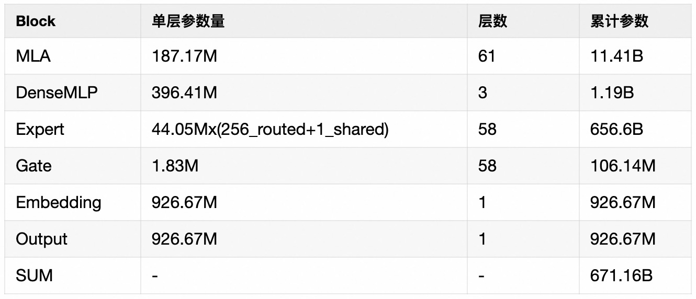
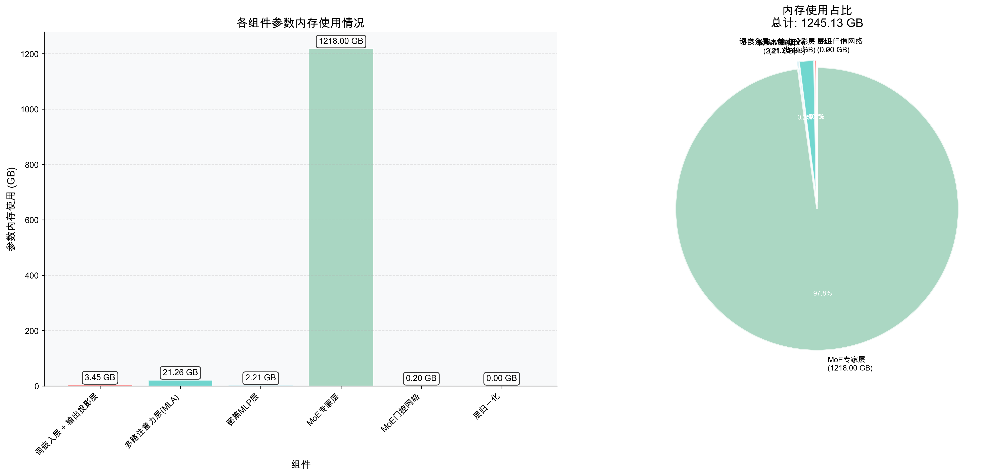

- [一 参数量分析](#一-参数量分析)
	- [1.1 MLA 参数量](#11-mla-参数量)
	- [1.2 DenseMLP 参数量](#12-densemlp-参数量)
	- [1.3MoE Expert 参数量](#13moe-expert-参数量)
	- [1.4 其他层参数量](#14-其他层参数量)
	- [1.5 参数量数据汇总 + 占比分析](#15-参数量数据汇总--占比分析)
- [二 计算量分析](#二-计算量分析)
	- [MLA 计算复杂度](#mla-计算复杂度)
		- [标准模式](#标准模式)
		- [矩阵吸收模式](#矩阵吸收模式)
	- [DenseMLP 计算复杂度](#densemlp-计算复杂度)
	- [MoE Expert 计算复杂度](#moe-expert-计算复杂度)
	- [数据汇总 + 占比分析](#数据汇总--占比分析)
- [三 Prefill 阶段耗时分析](#三-prefill-阶段耗时分析)
	- [MLA 耗时](#mla-耗时)
		- [MLA 计算耗时](#mla-计算耗时)
		- [All Reduce 通信耗时](#all-reduce-通信耗时)
	- [DenseMLP 计算耗时](#densemlp-计算耗时)
	- [MoE Expert 计算耗时](#moe-expert-计算耗时)
	- [AlltoAll 通信耗时](#alltoall-通信耗时)
		- [AlltoAll 通信量](#alltoall-通信量)
- [四 Decode 阶段耗时分析](#四-decode-阶段耗时分析)
	- [最大 BatchSize 计算](#最大-batchsize-计算)
	- [MLA 耗时](#mla-耗时-1)
	- [DenseMLP 计算耗时](#densemlp-计算耗时-1)
	- [MoE Expert 计算耗时](#moe-expert-计算耗时-1)
	- [AlltoAll 通信耗时](#alltoall-通信耗时-1)

## 一 参数量分析

`DeepseekV3` 和 `DeepseekR1` 模型结构是一样的，模型结构信息如下所示：

```bash
DeepseekV3Model(
  (embed_tokens): Embedding(129280, 7168)
  (layers): ModuleList(
    (0-2): 3 x DeepseekV3DecoderLayer(
      (self_attn): DeepseekV3Attention(
        (q_a_proj): Linear(in_features=7168, out_features=1536, bias=False)
        (q_a_layernorm): DeepseekV3RMSNorm((1536,), eps=1e-06)
        (q_b_proj): Linear(in_features=1536, out_features=24576, bias=False)
        (kv_a_proj_with_mqa): Linear(in_features=7168, out_features=576, bias=False)
        (kv_a_layernorm): DeepseekV3RMSNorm((512,), eps=1e-06)
        (kv_b_proj): Linear(in_features=512, out_features=32768, bias=False)
        (o_proj): Linear(in_features=16384, out_features=7168, bias=False)
      )
      (mlp): DeepseekV3MLP(
        (gate_proj): Linear(in_features=7168, out_features=18432, bias=False)
        (up_proj): Linear(in_features=7168, out_features=18432, bias=False)
        (down_proj): Linear(in_features=18432, out_features=7168, bias=False)
        (act_fn): SiLU()
      )
      (input_layernorm): DeepseekV3RMSNorm((7168,), eps=1e-06)
      (post_attention_layernorm): DeepseekV3RMSNorm((7168,), eps=1e-06)
    )
    (3-60): 58 x DeepseekV3DecoderLayer(
      (self_attn): DeepseekV3Attention(
        (q_a_proj): Linear(in_features=7168, out_features=1536, bias=False)
        (q_a_layernorm): DeepseekV3RMSNorm((1536,), eps=1e-06)
        (q_b_proj): Linear(in_features=1536, out_features=24576, bias=False)
        (kv_a_proj_with_mqa): Linear(in_features=7168, out_features=576, bias=False)
        (kv_a_layernorm): DeepseekV3RMSNorm((512,), eps=1e-06)
        (kv_b_proj): Linear(in_features=512, out_features=32768, bias=False)
        (o_proj): Linear(in_features=16384, out_features=7168, bias=False)
      )
      (mlp): DeepseekV3MoE(
        (experts): ModuleList(
          (0-255): 256 x DeepseekV3MLP(
            (gate_proj): Linear(in_features=7168, out_features=2048, bias=False)
            (up_proj): Linear(in_features=7168, out_features=2048, bias=False)
            (down_proj): Linear(in_features=2048, out_features=7168, bias=False)
            (act_fn): SiLU()
          )
        )
        (gate): DeepseekV3TopkRouter()
        (shared_experts): DeepseekV3MLP(
          (gate_proj): Linear(in_features=7168, out_features=2048, bias=False)
          (up_proj): Linear(in_features=7168, out_features=2048, bias=False)
          (down_proj): Linear(in_features=2048, out_features=7168, bias=False)
          (act_fn): SiLU()
        )
      )
      (input_layernorm): DeepseekV3RMSNorm((7168,), eps=1e-06)
      (post_attention_layernorm): DeepseekV3RMSNorm((7168,), eps=1e-06)
    )
  )
  (norm): DeepseekV3RMSNorm((7168,), eps=1e-06)
  (rotary_emb): DeepseekV3RotaryEmbedding()
)
```

### 1.1 MLA 参数量

参数量计算代码如下所示:

```bash
q_down_proj = hiddensize * q_lora_rank # q_a_proj
q_up_proj = q_lora_rank * num_heads * q_head_dim # q_b_proj

kv_down_proj_with_mqa  = hidden_size * (kv_lora_rank + qk_rope_head_dim) # kv_a_proj
kv_up_proj = kv_lora_rank * (qk_nope_head_dim + v_head_dim) * num_heads # kv_b_proj

out_proj = num_heads * v_head_dim * hidden_size # output_proj

mla_params = (
    q_down_proj + q_up_proj +
    kv_down_proj_with_mqa + kv_up_proj + out_proj
)
```

### 1.2 DenseMLP 参数量

DenseMLP 由 $3$ 个线性层组成: gate_proj、up_proj、down_proj。DenseMLP 参数量计算代码如下所示:

```python
3 * hidden_size * intermediate_size
```

### 1.3MoE Expert 参数量

每层 moe layer 包含 256 个路由专家、1 个共享专家和 1 个 Gate 层。

其中 Expert 由 $3$ 个线性层组成: gate_proj、up_proj、down_proj。Expert 参数量计算代码如下所示:

```python
expert_params = 3 * moe_intermediate_size * hidden_size
```

### 1.4 其他层参数量

`embedding` 层参数量

```python
emdedding_param = hidden_size * vocab_size * 2
```

`rmsnorm` 层参数量

```python
q_a_layernorm = self.q_lora_rank
kv_a_layernorm = self.kv_lora_rank
input_layernorm = self.hidden_size
post_attention_layernorm = self.hidden_size

all_layernorm = q_a_layernorm + kv_a_layernorm + input_layernorm + post_attention_layernorm
return all_layernorm
```

### 1.5 参数量数据汇总 + 占比分析

模型整体的参数分布如下表所示, 其中 MoE Gate 层, 参数量为 hidden_size * n_routed_expert + n_routed_expert(bias)=1.83M, 以及 Embedding 和 Output 层的参数 =  vocab_size x hidden_size = 926.67M（Embedding 和 Output 层共享参数）



DeepseekV3 前面 3 层为 dense layer，后面 58 层为稀疏 moe layer。

```bash
================================================================================
DeepSeekV3 模型参数分析报告
================================================================================

[模型配置]
  • 隐藏层维度: 7168
  • 词表大小: 129280
  • 注意力头数: 128
  • 总层数: 61 (密集层: 3, MoE层: 58)
  • 专家系统: 256 路由专家/层, 8 激活专家/token

[参数汇总]
+-----------------------+------------+---------+------------------------+
| 组件                  | 参数数量   | 占比    | 内存占用(FP16)         |
+=======================+============+=========+========================+
| 词嵌入层 + 输出投影层 | 1.85 G     | 0.28%   | 3.4521484375 GB        |
+-----------------------+------------+---------+------------------------+
| 多路注意力层(MLA)     | 11.41 G    | 1.70%   | 21.2591552734375 GB    |
+-----------------------+------------+---------+------------------------+
| 密集MLP层             | 1.19 G     | 0.18%   | 2.21484375 GB          |
+-----------------------+------------+---------+------------------------+
| MoE专家层             | 656.46 G   | 97.83%  | 1.22 K GB              |
+-----------------------+------------+---------+------------------------+
| MoE门控网络           | 106.43 M   | 0.02%   | 0.19824305176734924 GB |
+-----------------------+------------+---------+------------------------+
| 层归一化              | 999.42 K   | 0.00%   | 0.001861572265625 GB   |
+-----------------------+------------+---------+------------------------+
| 总计                  | 671.03 G   | 100.00% | 1.25 K GB              |
+-----------------------+------------+---------+------------------------+

[专家系统详情]
+-------------------+----------+
| 指标              | 值       |
+===================+==========+
| 专家总数          | 14848    |
+-------------------+----------+
| 每层专家数        | 256      |
+-------------------+----------+
| 每token激活专家数 | 8        |
+-------------------+----------+
| 单个专家参数      | 44.04 M  |
+-------------------+----------+
| 专家总参数        | 656.46 G |
+-------------------+----------+
| 专家占比          | 97.83%   |
+-------------------+----------+

[关键发现]
1. MoE专家层占总参数的 97.8%，是模型中最大的参数组成部分
2. 注意力机制(MLA)占总参数的 1.7%，通过LoRA结构优化
3. 密集MLP层仅占总参数的 0.2%，用于处理通用任务
4. 模型总参数量: 668.47 G
5. FP16内存占用: 1.25 TB
```



## 二 计算量分析

### MLA 计算复杂度

不考虑 MLA-AttnBlock 内的 Normal\rope\concat 类计算，直接从 MLA 的 Gemm 计算公式的角度切入分析“吸收”模式和“不吸收” 模式的访存。

1，“吸收“ 逻辑：

- Q_a_proj: [q_len, H] * [H, q_lora_rank]
- Q_b_proj : [q_len, q_lora] * [q_lora_rank, n *(qk_nope_dim + qk_rope_dim)]
- W_uk_from_kv_b_proj ：[n, q_len, qk_nope_h] *[n, qk_nope_h, kv_lora_rank]
- KV_a_proj_with_mqa : [q_len, H] * [H, kv_lora_rank + qk_rope_dim]
- AttnCore :
  - Q * K_t: [n, q_len, kv_lora_rank + qk_rope_dim] * [kv_lora_rank + qk_rope_dim, kv_len]
  - AttnScore * V: [n, q_len, kv_len] * [kv_len, kv_lora_rank]
  - W_uv_from_kv_b_proj: [q_len, n, kv_lora]*[n, kv_lora, v_head_dim]
-OutProj: [q_len, n * v_head_dim] * [n * v_head_dim, H]

2，“不吸收“ 逻辑：

- Q_a_proj: [q_len, H] * [H, q_lora_rank]
- Q_b_proj : [q_len, q_lora_rank] * [q_lora_rank, n *(qk_nope_dim + qk_rope_dim)]
- KV_a_proj_with_mqa : [q_len, H] * [H, kv_lora_rank + qk_rope_dim]
- K_b_proj: [q_len, kv_lora_rank] [kv_lora_rank, n * (qk_nope_dim + v_head_dim)]
- AttnCore :
  - Q * K_t: [n, q_len, (qk_rope_dim + qk_nope_dim)] * [n, (qk_rope_dim+qk_nope_dim), kv_len]
  - AttnScore * V: [n, q_len, kv_len] * [n, kv_len, v_head_dim]
- OutProj: [b,s,n/tp v_h] [n/tp * v_h, H]

**吸收模式能够大幅降低 decode attention kernel 的访存规模**。在最核心的 Attention kernel 计算，“吸收“模式下 K/V tensor Shape 中不携带 num_attn_heads 信息，计算逻辑转换成了 `MQA` 类 Attention 计算，“不吸收”模式下 K/V tensor 带 num_attn_heads。

#### 标准模式

```PYTHON
def mla_flops(self, cfg: DeepseekConfig,) -> tuple:
    """Count flops of MLA layer.(Flops approx. 2xMAC.)
    """
    cfg = self.cfg
    # MLA projection layers count MACs
    q_down_proj_MACs = self.seq_len * cfg.hidden_size * cfg.q_lora_rank
    q_up_proj_MACs = self.seq_len * cfg.q_lora_rank * cfg.num_heads * cfg.q_head_dim
    
    # kv_down_linear params shape: [kv_lora_rank + qk_rope_head_dim, hidden_size]
    kv_down_proj_MACs = self.kv_len * cfg.hidden_size * (cfg.kv_lora_rank + cfg.qk_rope_head_dim)
    
    # k_up_linear params shape: [kv_lora_rank, qk_nope_head_dim + v_head_dim]
    k_up_proj_MACs = self.kv_len * cfg.kv_lora_rank * cfg.num_heads * cfg.qk_nope_head_dim
    v_up_proj_MACs = self.kv_len * cfg.kv_lora_rank * cfg.num_heads * cfg.v_head_dim

    k_down_proj = kv_down_proj_MACs * (1 - self.kv_cache_rate)

    proj_gemm_sum = (
        q_down_proj_MACs + q_up_proj_MACs + 
        k_down_proj + k_up_proj_MACs + v_up_proj_MACs
    )

    # 标准 self-attention 的 MACs
    self_attn = cfg.num_heads * (
        self.seq_len * cfg.qk_rope_head_dim * self.kv_len +  # qk_matmul
        self.seq_len * cfg.qk_nope_head_dim * self.kv_len +  # qk_matmul_nope
        self.seq_len * self.kv_len * cfg.v_head_dim          # score * V
    )
    # 输出线性层 MACs
    out_proj = self.seq_len * cfg.num_heads * cfg.v_head_dim * cfg.hidden_size
    attn_sum = self_attn + out_proj

    # return flops by 2* Sum(MACs)
    GEMM_FP8_FLOPs = proj_gemm_sum * 2
    ATTN_FP16_FLOPs = self_attn * 2

    return GEMM_FP8_FLOPs + ATTN_FP16_FLOPs, GEMM_FP8_FLOPs, ATTN_FP16_FLOPs
```

#### 矩阵吸收模式

```python
def mla_matabsob_flops(self, cfg: DeepseekConfig) -> tuple:
    """Count flops of AbsorbCacheCompressed MLA layer.
    reference: matabsob_materialized_cache_compressed_move_elision.py
    """
    q_down_proj = self.seq_len * cfg.hidden_size * cfg.q_lora_rank # q_a_proj
    q_rope_up_proj = self.seq_len * cfg.q_lora_rank * cfg.num_heads * cfg.qk_rope_head_dim  # q_b_proj_rope

    q_absorb = self.seq_len * cfg.num_heads * (cfg.q_lora_rank * cfg.qk_nope_head_dim  # wq_b
                                    + cfg.qk_nope_head_dim * cfg.kv_lora_rank)  # w_uk
    
    k_down_proj = self.kv_len * cfg.hidden_size * (cfg.kv_lora_rank + cfg.qk_rope_head_dim)
    k_down_proj *= (1 - self.kv_cache_rate)
    proj_gemm_sum = (
        q_down_proj + q_rope_up_proj + k_down_proj + q_absorb
    )

    mqa =  cfg.num_heads * (
        self.seq_len * cfg.qk_rope_head_dim * self.kv_len +  # qk_matmul
        self.seq_len * cfg.kv_lora_rank * self.kv_len +      # qk_matmul_nope
        self.seq_len * self.kv_len * cfg.v_head_dim          # score * V
    )

    attn_up_proj = self.seq_len * cfg.num_heads * cfg.v_head_dim * cfg.kv_lora_rank
    o_proj = self.seq_len * cfg.num_heads * cfg.v_head_dim * cfg.hidden_size
    attn_sum = mqa + attn_up_proj + o_proj
    
    # flops by 2* Sum(MACs)
    gemm_sum = proj_gemm_sum * 2
    attn_sum = attn_sum * 2

    # all flops, gemm flops, attn flops
    return gemm_sum + attn_sum, gemm_sum, attn_sum 
```

### DenseMLP 计算复杂度

### MoE Expert 计算复杂度

### 数据汇总 + 占比分析

## 三 Prefill 阶段耗时分析

### MLA 耗时

#### MLA 计算耗时

#### All Reduce 通信耗时

### DenseMLP 计算耗时

### MoE Expert 计算耗时

### AlltoAll 通信耗时

#### AlltoAll 通信量

## 四 Decode 阶段耗时分析

### 最大 BatchSize 计算

### MLA 耗时

### DenseMLP 计算耗时

### MoE Expert 计算耗时

### AlltoAll 通信耗时
