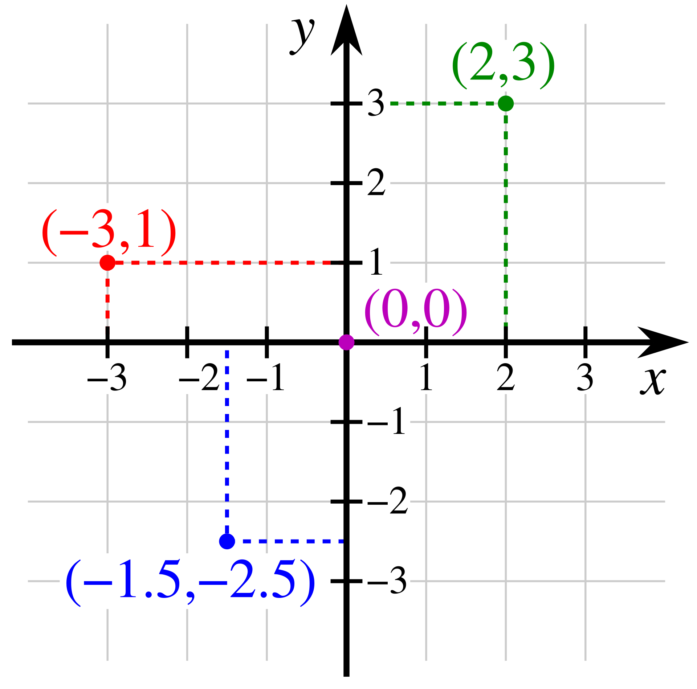
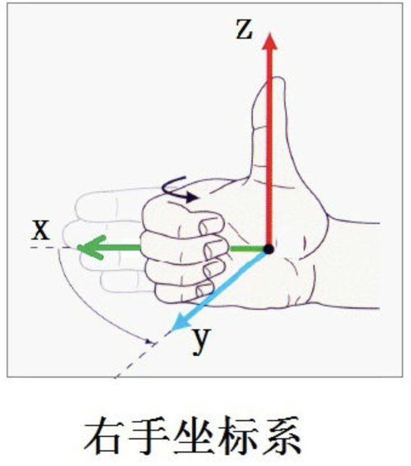
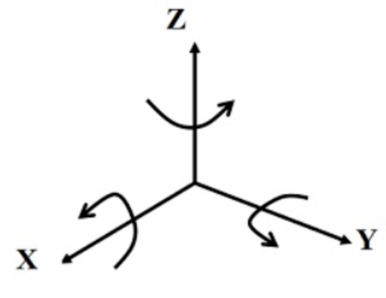
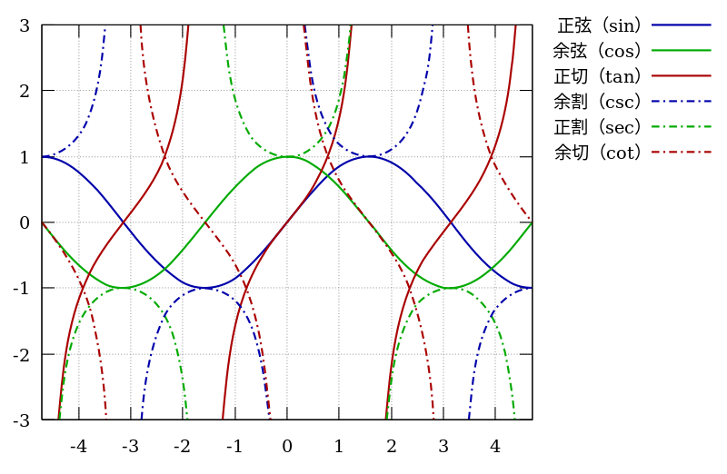
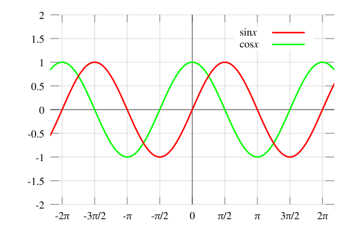
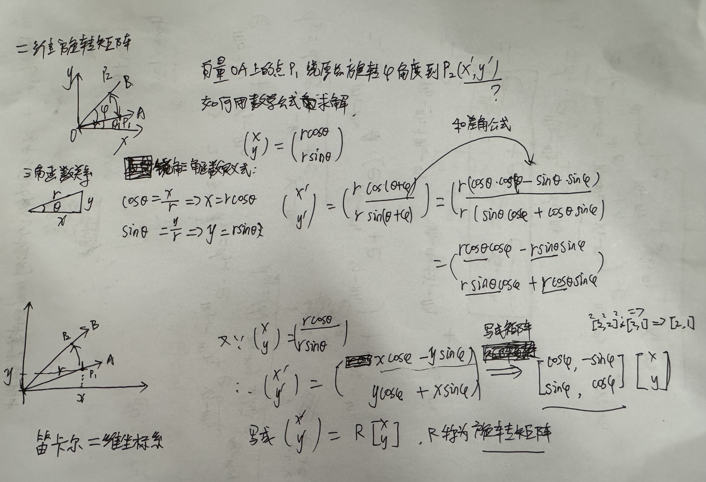
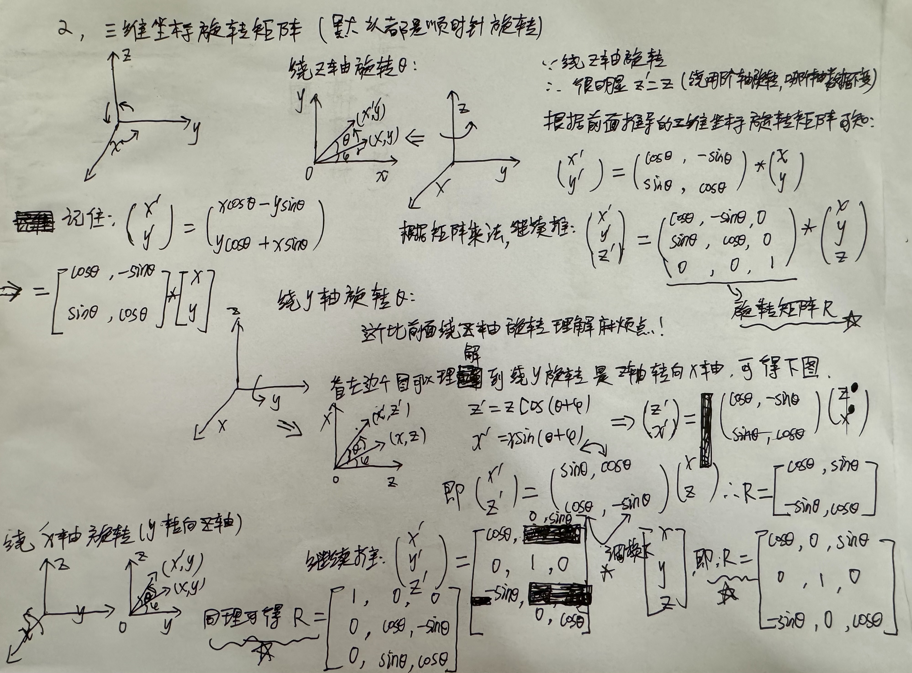

- [直角坐标坐标系](#直角坐标坐标系)
  - [向量](#向量)
  - [欧几里得空间](#欧几里得空间)
  - [欧拉公式](#欧拉公式)
- [三角函数](#三角函数)
  - [三角函数定义](#三角函数定义)
  - [三角恒等式](#三角恒等式)
  - [与指数函数和复数的关系](#与指数函数和复数的关系)
  - [周期函数](#周期函数)
- [旋转矩阵](#旋转矩阵)
  - [二维平面直角坐标系旋转矩阵](#二维平面直角坐标系旋转矩阵)
  - [三维旋转矩阵](#三维旋转矩阵)
  - [旋转矩阵的性质](#旋转矩阵的性质)
- [参考资料](#参考资料)

理解 RoPE 位置编码算法的原理和推导公式之前得先具备一些背景知识，主要是关于三角函数、旋转矩阵、直角坐标系、欧几里得内积的相关概念和公式，可以先快速阅览本章内容，后续关于 RoPE 算法的推导不理解的时候，再来细看相关公式和概念即可。

## 直角坐标坐标系

笛卡尔坐标系（也称直角坐标系）在数学中是一种正交坐标系。二维的直角坐标系是由两条相互垂直、相交于原点的数线构成的。

**采用直角坐标，几何形状可以用代数公式明确地表达出来**，且几何形状的每一个点的直角坐标必须遵守这个代数公式。例如：直线可以用标准式（一般式）$ax+by+c = 0$、斜截式 $y = mx+k$ 等式子来表示；

对于三维坐标系统，我们常用右手坐标系表示，如下图所示：
> 值得注意的是，网上三维坐标系统 x,y,z 轴的方向，以及右手坐标系表示内容太多了太繁杂了，且很多表达都不一样，这里我参考这篇[文章](https://www.singleye.net/2021/01/%E6%97%8B%E8%BD%AC%E7%9F%A9%E9%98%B5/)的画法，有找到更标准更统一规范的读者可以给出个参考链接。

    

在二维平面上，直角坐标系两点（(x1,y1) 和 (x2,y2) 两点）之间的欧几里得距离是: $d = \sqrt{(x_2 - x_1)^2 + (y_2 - y_1)^2}$。

欧几里得变换或欧几里得移动是欧几里得平面的点集到同一平面上点集的（双射）映射，它保持诸点之间的距离。这种映射（也叫等距映射）有四种类型：平移、旋转、反射和滑移反。
> 欧几里得空间是在约公元前300年，由古希腊数学家欧几里得建立的角和空间中距离之间联系的法则。

### 向量

采用直角坐标系，**在三维空间里，任何一点 $P$ 都可以用向量来表示**。我们可以想像向量为一支羽箭，其箭尾在原点，箭锋在点 P。假若点 P 的向量是 $\mathbf {r}$，直角坐标是$ (x,y,z)$。那么，

$$\mathbf {r} =x{\hat {\mathbf {i} }}+y{\hat {\mathbf {j} }}+z{\hat {\mathbf {k} }}$$

其中，单位向量 ${\hat {\mathbf {i}}}$，${\hat {\mathbf {j}}}$, ${\hat {\mathbf {k}}}$ 分别指向 x-轴，y-轴，与 z-轴指向的正无穷值方向。

### 欧几里得空间

以 $\mathbb {R}$ 表示**实数域**。对任意一个正整数 $n$，实数的 n 元组的全体构成了 $\mathbb {R}$ 上的一个 n 维度向量空间，用 $\mathbb {R}$ 来表示，有时称之为实数坐标空间。

在欧几里得空间中，对任意两个向量 $\mathbf {x}$、$\mathbf {y}$，引入它们的“标准内积”$<\mathbf {x} ,\mathbf {y} >$（一些文献上也称为点积，记为$\mathbf {x} \cdot \mathbf {y}$）：

$$<\mathbf {x} ,\mathbf {y} >=\sum _{i=1}^{n}x_{i}y_{i}=x_{1}y_{1}+x_{2}y_{2}+\cdots +x_{n}y_{n}$$

基于这个**内积**，可以建立距离、长度、角度等概念，前面两点之间的距离也是基于**内积**延伸出来的。

### 欧拉公式

欧拉公式（英语：Euler's formula）是复数分析领域的公式，它**将三角函数与复指数函数关联起来**，因其提出者莱昂哈德·欧拉而得名。欧拉公式提出，对任意实数 $x$，都存在公式：

$$e^{ix}=\cos x+i\sin x$$

其中 $e$ 是自然对数的底数，$i$ 是虚数单位，而 $\cos$ 和 $\sin$ 则是余弦、正弦对应的三角函数，参数 $x$ 则以弧度为单位。

复数记作 $z=x+yi$，基于欧拉公式可以提供复点至极坐标的变换：
皆可记为

$$z=x+iy=|z|(\cos \phi +i\sin \phi )=|z|e^{i\phi } \\
{z}=x-iy=|z|(\cos \phi -i\sin \phi )=|z|e^{-i\phi }$$

在这里:

- $x=\mathrm {Re} \{z\}$ 为实部
- $y=\mathrm {Im} \{z\}$ 为虚部
- $\left [ z\right ] =\sqrt {x^{2}+y^{2}}$ 为 $z$ 的模

## 三角函数

[三角函数](https://zh.wikipedia.org/wiki/%E4%B8%89%E8%A7%92%E5%87%BD%E6%95%B0)（英语：trigonometric functions）是数学很常见的一类**关于角度的函数**，它可以将直角三角形的内角和它的两边的比值相关联，也可以用单位圆的各种有关线段的长的等价来定义。三角函数在研究三角形和圆形等几何形状的性质时有着重要的作用，也是研究振动、波、天体运动和各种周期性现象的基础数学工具。在数学分析上，三角函数亦定义为无穷级数或特定微分方程的解，允许它们的取值扩展到任意实数值，甚至是复数值。

常见的三角函数有正弦函数 sin、余弦函数 cos 和正切函数tan 等。三角函数图像（动画演示）如下所示:

### 三角函数定义

三角函数的几何定义可以分为：以直角三角形来定义、以直角坐标系来定义、单位圆定义、指数定义等等。

**1，以直角三角形来定义**：

直角三角形只有锐角（大小在 0 至 90 度之间的角）三角函数的定义。指定锐角 $\theta$ 可做出直角三角形，使一个内角为 $\theta$，对应股（对边 a）、勾（邻边b）和弦（斜边 h）则：

1. $\theta$ 的正弦是对边与斜边的比值：$\sin {\theta }={\frac {a}{h}}$
2. $\theta$ 的余弦是对边与斜边的比值：$\cos {\theta }={\frac {b}{h}}$
3. $\theta$ 的正切是对边与斜边的比值：$\tan {\theta }={\frac {a}{b}}$

> a，b，h分别为角A的对边、邻边和斜边。

**2，以直角坐标系来定义**：

假设 $\textstyle P(x,y)$ 是平面直角坐标系 $\textstyle xOy$ 中的一点，$\theta$ 是横轴正向 ${\vec {Ox}}$ 逆时针旋转到 ${\vec {OP}}$ 方向所形成的一个角，$r={\sqrt {x^{2}+y^{2}}}>0$ 是 $P$ 到原点 $O$ 的距离，则 $\theta$ 的常见三种三角函数定义为:

|正弦|余弦|正切|
|----|---|---|
|$\sin {\theta }={\frac {y}{r}}$|$\sin {\theta }={\frac {x}{r}}$|$\sin {\theta }={\frac {y}{x}}$|

**3，指数定义**：

正弦函数的指数定义可由欧拉公式导出：

$$\sin \theta ={\frac {e^{i\theta }-e^{-i\theta }}{2i}}$$

### 三角恒等式

不同的三角函数之间有很多对任意的角度取值都成立的等式，称为三角恒等式。三角恒等式中一个关键的是**和差公式**：它能根据两个角度自身的正弦和余弦而给出它们的和与差的正弦和余弦。

$$\sin \left(x+y\right)=\sin x\cos y+\cos x\sin y\quad\quad\sin \left(x-y\right)=\sin x\cos y-\cos x\sin y \\
\cos \left(x+y\right)=\cos x\cos y-\sin x\sin y \quad\quad \cos \left(x-y\right)=\cos x\cos y+\sin x\sin y$$

### 与指数函数和复数的关系

级数定义证明了正弦和余弦函数分别是复指数函数在它的自变量为纯虚数时候的虚数和实数部分：

$$e^{\mathrm {i} \theta }=\cos \theta +{\mathrm {i} }\sin \theta \,（i是虚数单位, i^2 = -1$$

欧拉首先注意到这关系式，因此叫做欧拉公式[13]。从中可推出，对实数 $x$，

$$\cos x\,=\,\operatorname {Re}\left(e^{\mathrm {i}x}\right)\;,\qquad\quad \sin x\,=\,\operatorname {Im}\left(e^{\mathrm {i}x}\right)$$

> 前面欧拉公式给出了推导。

### 周期函数

在数学中，周期函数是无论任何独立变量上经过一个确定的周期之后数值皆能重复的函数。对于实数或者整数函数来说，周期性意味着按照一定的间隔重复一个特定部分就可以绘制出完整的函数图。如果在函数 $f$ 中所有的位置 $x$ 都满足:

$$f(x+T)=f(x)$$

那么，$f$ 就是周期为 $T$ 的周期函数。非周期函数就是没有类似周期 $T$ 的函数。

三角函数正弦函数与余弦函数都是常见的周期函数，其周期为 $2\pi$。**傅立叶级数研究的就将任意的周期函数用合适的三角函数的和来表示**。

> $f(x)=\sin x$ 与 $f(x)=\cos x$ 的图，二者的周期都是 $2\pi$，即 $sinx = sin (x+2\pi)$。

## 旋转矩阵

所谓旋转矩阵（英语：Rotation matrix）是在乘以一个向量的时候有改变向量的方向但不改变大小的效果并保持了手性的矩阵。数学中的旋转矩阵应用非常广泛，不仅是计算机图形学中的仿射变换包括平移、缩放、旋转等，机器人位置描述的时候也需要使用到平移、旋转，而且计算机领域的 `RoPE` 位置编码算法也用到了旋转矩阵概念和特性。

### 二维平面直角坐标系旋转矩阵

如下图所示二维直角坐标平面的任意点 $(x, y)$ 对应向量 $\overrightarrow{OA}$，旋转后的位置计作 $(x’, y’)$ 对应新的向量 $\overrightarrow{OB}$。经过推导可得下述矩阵变换:

$$\begin{bmatrix}
x' \\
y'
\end{bmatrix} = \begin{bmatrix}
cos\varphi & -sin\varphi \\
sin\varphi & cos \varphi
\end{bmatrix} * \begin{bmatrix}
x \\
y
\end{bmatrix}$$

即可定义二维平面直角坐标系的**旋转矩阵**如下所示: 

$$ \begin{bmatrix}
cos\varphi & -sin\varphi \\
sin\varphi & cos \varphi
\end{bmatrix}$$

在草稿纸上的推导过程如下所示:

> 利用三角函数定理推导。

### 三维旋转矩阵

对于三维坐标系统，用右手坐标系表示如下所示：

    

这里先给出 绕 z-轴旋转的旋转矩阵，因为其很容易从 2 维旋转矩阵直观推导出来。

1，绕 $z$ 轴旋转的矩阵变换:

$$\begin{bmatrix}
x' \\
y' \\
z'
\end{bmatrix} =\begin{bmatrix}
cos(\theta) & -sin(\theta) & 0 \\
sin(\theta) & cos(\theta) & 0 \\
0 & 0 & 1
\end{bmatrix} * 
\begin{bmatrix}
x \\
y \\
z
\end{bmatrix} = R * \begin{bmatrix}
x \\
y \\
z
\end{bmatrix}$$

即绕 $z$ 轴旋转 $\theta$ 角度的旋转矩阵 R 定义为：

$$ R_z = \begin{bmatrix}
cos(\theta) & -sin(\theta) & 0 \\
sin(\theta) & cos(\theta) & 0 \\
0 & 0 & 1
\end{bmatrix} * 
\begin{bmatrix}
x \\
y \\
z
\end{bmatrix}$$

2，绕 $y$ 轴旋转 $\theta$ 角度的旋转矩阵定义为:

$$R_y=\begin{bmatrix}
cos(\theta) & 0 & sin(\theta) \\
0 & 1 & 0 \\
-sin(\theta) & 0 & cos(\theta) 
\end{bmatrix}$$

3，绕 $x$ 轴旋转 $\theta$ 角度的旋转矩阵定义为:

$${\mathcal {R}}_{x}(\theta)={\begin{bmatrix}1&0&0\\0&\cos {\theta}&-\sin {\theta}\\0&\sin {\theta}&\cos {\theta}\end{bmatrix}}$$ 

在草稿纸上的推导过程如下所示:

> 利用三角函数定理推导。

### 旋转矩阵的性质

旋转矩阵有些重要性质，通俗描述如下所示:

1. **正交性（Orthogonality）**

旋转矩阵是正交矩阵，即其转置等于其逆矩阵：$R^{-1} = R^T$。

通俗讲就是旋转角度为 $\theta$ 的旋转矩阵 $R_{\theta}$ 存在 $R_{\theta}^T = R_{-\theta}$，即旋转矩阵的转置等于绕相反方向旋转相同角度的旋转矩阵。

2. **可加性**

$$R_a R_b = R_{a+b}$$

即，先绕角度 $a$ 旋转，再绕角度 $b$ 旋转，相当于绕角度 $a + b$ 旋转。另外，矩阵乘法的顺序很重要，因为旋转矩阵不满足交换律：

$$R_a R_b \neq R_b R_a$$

这意味着绕不同轴的旋转的顺序会影响最终的结果。延伸到三维空间，旋转可以通过三个欧拉角 $(\alpha ,\beta ,\gamma)$ 来定义。有一些可能的欧拉角定义，每个都可以依据 roll, pitch 和 yaw 的复合来表达。依据 "x-y-z" 欧拉角，[在右手笛卡尔坐标中的旋转矩阵可表达为](https://zh.wikipedia.org/wiki/%E6%97%8B%E8%BD%AC%E7%9F%A9%E9%98%B5):

$${\mathcal {M}}(\alpha ,\beta ,\gamma )={\mathcal {R}}_{z}(\gamma ){\mathcal {R}}_{y}(\beta ){\mathcal {R}}_{x}(\alpha )$$

## 参考资料

- [2D Rotations](https://articulatedrobotics.xyz/tutorials/coordinate-transforms/rotation-matrices-2d/)
- [草稿纸上推图形学坐标变换](https://yufeiran.com/cao-gao-zhi-shang-tui/)
- [维基百科-三角函数](https://zh.wikipedia.org/wiki/%E4%B8%89%E8%A7%92%E5%87%BD%E6%95%B0)
- [维基百科-笛卡尔坐标系](https://zh.wikipedia.org/wiki/%E7%AC%9B%E5%8D%A1%E5%B0%94%E5%9D%90%E6%A0%87%E7%B3%BB)