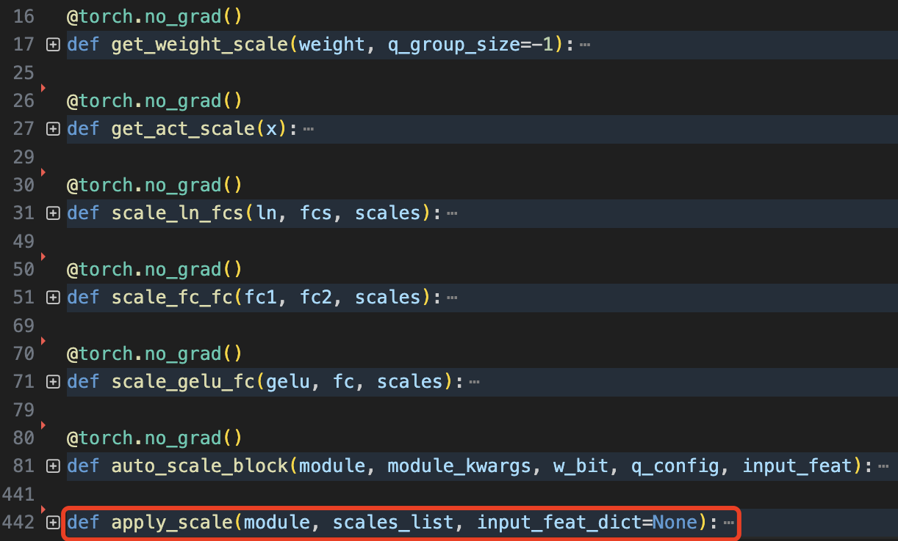
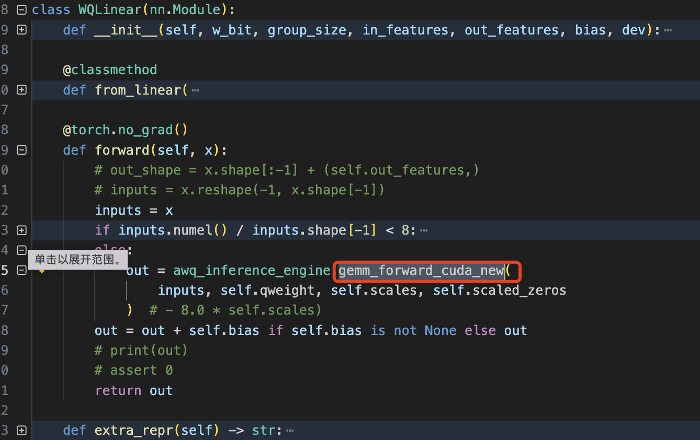
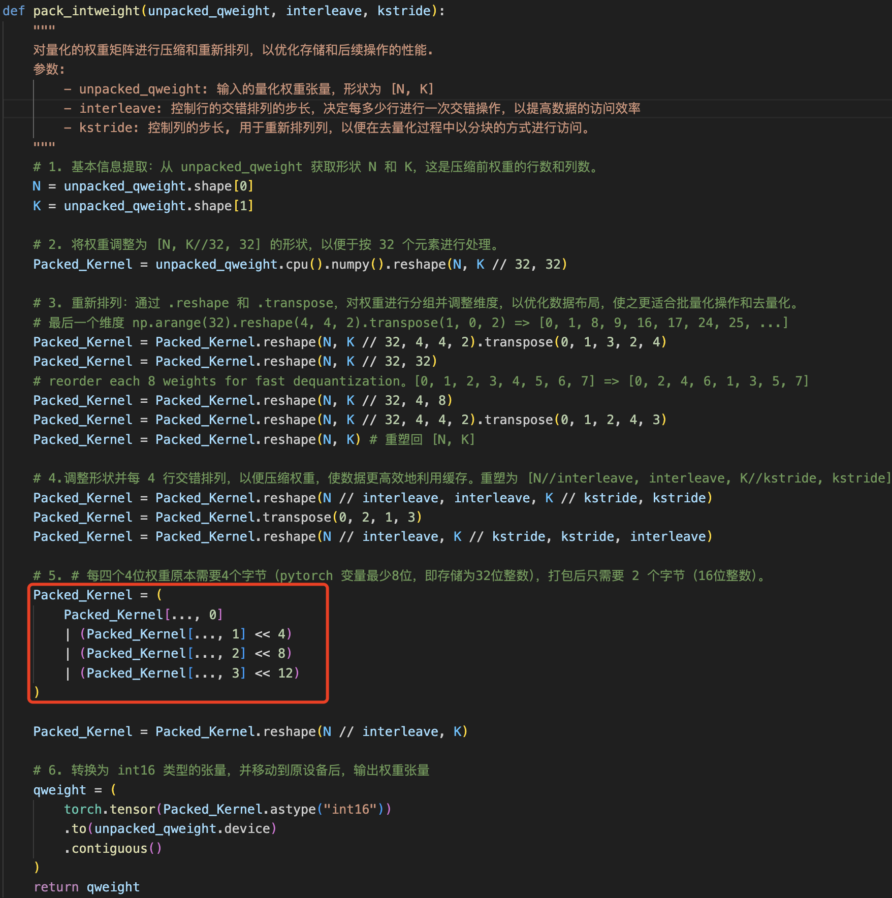

- [一 llm-awq 代码架构](#一-llm-awq-代码架构)
  - [1.1 如何使用](#11-如何使用)
  - [1.2 算法代码架构](#12-算法代码架构)
- [二 基于激活感知的权重放大和裁剪](#二-基于激活感知的权重放大和裁剪)
  - [2.1 auto\_scale.py](#21-auto_scalepy)
  - [2.2 auto\_clip.py](#22-auto_clippy)
- [三 权重量化](#三-权重量化)
  - [3.1 pre\_quant.py](#31-pre_quantpy)
  - [3.2 quantizer.py](#32-quantizerpy)
- [四 量化模型推理](#四-量化模型推理)
- [参考资料](#参考资料)

## 一 llm-awq 代码架构

### 1.1 如何使用

作者提供了 [llm-awq](https://github.com/mit-han-lab/llm-awq) 仓库，开源包括了量化算法、量化模型转换和量化模型推理的代码，另外提供了 `entry.py` 代码来调用模型权重量化和量化推理接口。

1，获取模型权重缩放（放大）的 scale 因子，定义 args.run_awq 参数后 entry 会调用 **run_awq 函数**获取缩放因子 $s$，通过 `--dump_awq` 参数指定缩放后的 llm 权重文件路径。

```bash
python -m awq.entry --model_path /PATH/TO/LLAMA3/llama3-8b \
    --w_bit 4 --q_group_size 128 \
    --run_awq --dump_awq awq_cache/llama3-8b-w4-g128.pt
```

2，使用伪量化推理在 `WikiText-2` 数据集上评估量化模型的精度，这点对于没有实现自定义量化 kernel 的新模型想实验下 awq 量化算法在其上的效果如何还是很有用的！定义参数 `args.q_backend == "fake"` 后，entry 会调用 `quantizer.py` 的 调用 `pseudo_quantize_model_weight` 来执行权重伪量化操作，当然前面得先通过 `apply_awq` 函数应用模型权重量化因子结果 awq_results 到模型中。

```bash
python -m awq.entry --model_path /PATH/TO/LLAMA3/llama3-8b \
    --tasks wikitext \
    --w_bit 4 --q_group_size 128 \
    --load_awq awq_cache/llama3-8b-w4-g128.pt \
    --q_backend fake
```

3，直接将浮点模型转换为 int4 位宽的量化模型权重，转换后模型权重体积直接减小了 4 倍，定义参数 `args.q_backend == "real"` 后，entry 会调用 `quantizer.py` 的 `real_quantize_model_weight()` 函数将模型的浮点权重参数原地转换为量化参数，同样 `entry.py`代码中前面会先通过 `apply_awq` 函数应用模型权重量化因子结果 awq_results 到模型中。

```bash
mkdir quant_cache
python -m awq.entry --model_path /PATH/TO/LLAMA3/llama3-8b \
    --w_bit 4 --q_group_size 128 \
    --load_awq awq_cache/llama3-8b-w4-g128.pt \
    --q_backend real --dump_quant quant_cache/llama3-8b-w4-g128-awq.pt
```

4，真正的量化模型推理并评估精度，其中量化 kernel 的实现是作者基于 `FT` 框架做了些调整迁移到 [awq/kernels/csrc/quantization](https://github.com/mit-han-lab/llm-awq/blob/main/awq/kernels/csrc/quantization/gemm_cuda_gen.cu) 中，包括 gemm 和 gemv 两种 `int4` 矩阵乘法。

```bash
python -m awq.entry --model_path /PATH/TO/LLAMA3/llama3-8b \
    --tasks wikitext \
    --w_bit 4 --q_group_size 128 \
    --load_quant quant_cache/llama3-8b-w4-g128-awq.pt
```

### 1.2 算法代码架构

通过 `entry` 的四种用法可以发现，`awq` [仓库的算法架构](https://github.com/mit-han-lab/llm-awq/blob/main/awq/)和 `smoothquant` 很像，伪量化推理过程比较简单这里忽略，量化模型推理的实现是通过下述步骤（模块）：
1. 基于校准集得到激活再根据量化算法计算量化缩放因子 $s$；
2. 裁剪线性层权重的最小、最大值，推测是为了抑制权重的异常值（smoothquant 没有这步）；
3. 在前面得到权重缩放因子 $s$ 基础上，将浮点模型权重转换为 `int4` 量化模型权重；
4. 自定义 int4 矩阵乘法 kernel，并替换掉原来的浮点线性层，得到量化模型，再执行真正的量化模型推理（forward）。

在代码实现上:
1. 步骤 1 的实现对应代码文件 [auto_scale.py](https://github.com/mit-han-lab/llm-awq/blob/main/awq/quantize/auto_scale.py)；
2. 步骤 2 的实现对应 [auto_clip.py](https://github.com/mit-han-lab/llm-awq/blob/main/awq/quantize/auto_clip.py)；
3. 步骤 3 的实现对应 `pre_quant.py` 和 [quantizer.py](https://github.com/mit-han-lab/llm-awq/blob/main/awq/quantize/quantizer.py)，前者分别调用 auto_scale.py 的 `apply_scale` 函数和 auto_clip.py 的 `apply_clip` 函数得到 awq 量化算法的最终结果 `awq_results` 给后续 quantizer.py 的模型量化函数 `real_quantize_model_weight` 用。

```python
# awq_results 是一个字典
awq_results = {
        "scale": [],
        "clip": [],
    }
```

> awq 的浮点模型权重量化转换是单独在 `quantizer.py` 中实现，这点跟 smoothquant 仓库不一样，smoothquant 是将模型权重转换为量化模型推理在一个文件中通过量化类的 `from_float` 和 `forward`（调用量化 kernel 接口） 函数来实现。

`awq` 代码文件组织情况如下所示，可以看出代码架构真的简单清晰，让人阅读起来很舒服！

```bash
├── entry.py           # 用户使用入口文件
├── kernels            # cuda 实现的 kernel 代码目录，包括 fp16 和 int4 的 gemm 和 gemv
│   ├── csrc
│   └── setup.py
├── quantize           # awq 算法实现目录
│   ├── __init__.py
│   ├── auto_clip.py
│   ├── auto_scale.py
│   ├── pre_quant.py
│   ├── qmodule.py
│   └── quantizer.py 
└── utils              # 公共接口函数目录
    ├── __init__.py
    ├── calib_data.py
    ├── lm_eval_adaptor.py
    ├── module.py
    ├── parallel.py
    └── utils.py
```
> 不愧是同一个作者，awq 跟 smoothquant 代码仓库风格还是很统一的。

## 二 基于激活感知的权重放大和裁剪

### 2.1 auto_scale.py

[auto_scale.py](https://github.com/mit-han-lab/llm-awq/blob/main/awq/quantize/auto_scale.py) 是 awq 代码和 smoothquant 等量化算法代码的最大不同之一，它对应的原理和公式是论文的 3.2 节内容。

先看下 auto_scale.py 拥有的函数，其中 `apply_scale()` 是提供给外部模块调用的接口。



其中 scale_ln_fcs、scale_gelu_fc、scale_fc_fc 函数都是在给定缩放因子 $s$ 的前提下去缩放网络层权重参数：
- `scale_ln_fcs`: 函数针对 ln->fcs 连接的线性层列表权重和 ln 的权重及偏置。
- `scale_gelu_fc`: 函数用于对 `GELU` 激活函数后接全连接层的权重进行缩放操作。 
- `scale_fc_fc`: 函数用于缩放两个连续全连接层 fc1->fc2 权重的函数。

其中带注释的 `scale_gelu_fc` 函数实现如下所示:

```python
@torch.no_grad()
def scale_gelu_fc(gelu, fc, scales):
    # 进行网络层类型检查
    assert isinstance(gelu, (nn.GELU, BloomGelu, GELUActivation))
    assert isinstance(fc, nn.Linear)

    # scales.view(1, -1) 将缩放因子重塑为 2D 张量, 以匹配权重矩阵的维度
    # mul_ 是就地乘法操作（节省内存），直接修改 fc.weight 的值
    fc.weight.mul_(scales.view(1, -1).to(fc.weight.device))

    # 遍历全连接层的所有参数，确保没有任何参数变成 NaN 值，这是一个重要的数值稳定性检查。
    for p in fc.parameters():
        assert torch.isnan(p).sum() == 0
```

前面论文的解读文章中，我们已经知道了权重缩放系数 $s$ 的计算公式是如下所示：

$$
s = \text{mean(abs}({\mathbf{x}}))^{\alpha}, \quad \alpha^* = \arg\min_{\alpha} \mathcal{L}(\text{mean(abs}({\mathbf{x}}))^{\alpha}) \tag{5}
$$

其中 $\text{mean(abs}({\mathbf{x}}))$ 是逐通道计算的激活值绝对值的平均值，对应的代码实现是 `auto_scale.py/get_act_scale` 函数。

```python
@torch.no_grad()
def get_act_scale(x):
    # x.abs().view(-1, x.shape[-1]): 重塑张量维度 -> [b*s, h]
    # x.abs().view(-1, x.shape[-1]).mean(0): 沿着第0维计算平均值 -> [h,]
    return x.abs().view(-1, x.shape[-1]).mean(0)
```

公式（5）也就是 $s$ 的**自动搜索算法**实现是在 `_search_module_scale` 函数中，代码如下所示：

```python
# _search_module_scale 是 auto_scale_block 内的函数
def _search_module_scale(block, linears2scale: list, x, kwargs={}):
    """
    在给定的模块和输入特征下，搜索最佳的缩放因子。

    参数:
        block (nn.Module): 当前要搜索缩放因子的模块。
        linears2scale (list of nn.Linear): 需要缩放的全连接层列表。
        x (torch.Tensor): 输入特征张量。
        kwargs (dict): 其他关键字参数。

    返回:
        torch.Tensor: 最佳缩放因子，形状为 [out_features]。
    """
    x = x.to(next(block.parameters()).device)  # 将输入特征移动到模块所在设备
    with torch.no_grad():
        org_out = block(x, **kwargs)  # 原始输出
        if isinstance(org_out, tuple):
            org_out = org_out[0]

    x_max = get_act_scale(x)  # 获取激活的缩放因子

    best_error = float("inf")
    best_ratio = -1
    best_scales = None

    n_grid = 20  # 缩放比例的网格大小
    history = []  # 保存每个比例的误差

    # 保存原始状态字典
    org_sd = {k: v.cpu() for k, v in block.state_dict().items()}

    for ratio in range(n_grid):
        ratio = ratio * 1 / n_grid  # 当前比例
        scales = x_max.pow(ratio).clamp(min=1e-4).view(-1)  # s^alpha 计算缩放因子
        scales = scales / (scales.max() * scales.min()).sqrt()  # 归一化缩放因子(论文没有描述这步操作)

        for fc in linears2scale:
            # 权重乘以缩放因子，对显著权重进行放大以降低量化误差, 对应公式(2)中的 w*s
            fc.weight.mul_(scales.view(1, -1).to(fc.weight.device))
            # 使用权重量化函数 w_quantize_func 执行权重量化操作，对应公式(4) W⋅diag(s))(diag(s)^−1
            fc.weight.data = w_quantize_func(fc.weight.data) / (scales.view(1, -1))

        out = block(x, **kwargs)  # 量化后的输出
        if isinstance(out, tuple):
            out = out[0]

        # 计算均方误差
        loss = ( (org_out - out).float().pow(2).mean().item() )
        history.append(loss)

        # 如果当前误差小于最佳误差，更新最佳误差和最佳比例
        is_best = loss < best_error
        if is_best:
            best_error = loss
            best_ratio = ratio
            best_scales = scales

        # 恢复原始状态字典
        block.load_state_dict(org_sd)

    if best_ratio == -1:
        print(history)
        raise Exception("Failed to find a suitable scaling ratio.")

    best_scales = best_scales.view(-1)  # 调整形状

    assert torch.isnan(best_scales).sum() == 0, "缩放因子包含NaN值"
        return best_scales.detach()
```

这里我重点提下缩放因子 $s$、权重的缩放（乘以缩放因子）和权重的量化操作的实现，具体来说流程是这样的:

1. 通过公式 $s = \text{mean(abs}({\mathbf{x}}))^{\alpha}$ 来得到权重的缩放因子 $s$，其中 $\alpha$ 取值范围为 0, 0.05, 0.10, 0.15 ……；
2. 将权重和缩放因子相乘，实现对显著权重进行放大的目的；
3. 通过指定量化函数 w_quantize_func 量化权重，注意要将激活的缩放操作融合进来，即 $Q(\mathbf{W} \cdot \text{diag}(\mathbf{s})) (\text{diag} \mathbf{s})^{-1}$。

对应代码如下所示：

```python
scales = x_max.pow(ratio).clamp(min=1e-4).view(-1)  # 计算缩放因子
scales = scales / (scales.max() * scales.min()).sqrt()  # 为防止 scales 过大或过小，需要多一步归一化操作

# n_grid 取值 20
for ratio in range(n_grid):
    ratio = ratio * 1 / n_grid  # 当前比例
    for fc in linears2scale:
        # 权重乘以缩放因子，对显著权重进行放大以降低量化误差, 对应公式(2)中的 w*s
        fc.weight.mul_(scales.view(1, -1).to(fc.weight.device))
        # 使用权重量化函数 w_quantize_func 执行权重量化操作，对应公式(4) W⋅diag(s))(diag(s)^−1
        fc.weight.data = w_quantize_func(fc.weight.data) / (scales.view(1, -1))
```

另外，跟 smoothquant 不同，awq 中需要根据模块类型，分别处理不同的线性层组，即分开计算不同模块的权重缩放因子！具体来说，作者将 `llm` 模型分成以下几个模块分别计算 `scales`。

对于 `OPTDecoderLayer`

1. self-attention 的查询、键、值投影层
2. self-attention 的输出投影层
3. mlp 的 第一个全连接层
4. mlp 的 第二个全连接层

对于 `LlamaDecoderLayer`
1. self-attention 的查询、键、值投影层
2. self-attention 的输出投影层
3. mlp 的 gate_proj 和 up_proj 线性层
4. mlp 的 down_proj 线性层

其中获取 `LlamaDecoderLayer` 缩放因子的代码如下所示:

```python
# 处理 LlamaDecoderLayer 的层
if isinstance(module, LlamaDecoderLayer):
    
    # 处理 self-attention 的查询、键、值投影层
    scales_list.append(
        # `_auto_get_scale` 是对 `_search_module_scale` 的一层包装，作用是获取某个层组的缩放因子。
        _auto_get_scale(
            prev_op=module.input_layernorm,
            layers=[
                module.self_attn.q_proj,
                module.self_attn.k_proj,
                module.self_attn.v_proj,
            ],
            inp=input_feat["self_attn.q_proj"],
            module2inspect=module.self_attn,
            kwargs=module_kwargs,
        )
    )
    # 处理 self-attention 的输出投影层
    if module.self_attn.v_proj.weight.shape == module.self_attn.o_proj.weight.shape:
        scales_list.append(
            _auto_get_scale(
                prev_op=module.self_attn.v_proj,
                layers=[module.self_attn.o_proj],
                inp=input_feat["self_attn.o_proj"],
            )
        )
    scales_list.append(
        _auto_get_scale(
            prev_op=module.post_attention_layernorm,
            layers=[module.mlp.gate_proj, module.mlp.up_proj],
            inp=input_feat["mlp.gate_proj"],
            module2inspect=module.mlp,
        )
    )
    scales_list.append(
        _auto_get_scale(
            prev_op=module.mlp.up_proj,
            layers=[module.mlp.down_proj],
            inp=input_feat["mlp.down_proj"],
        )
    )
```

`apply_scale` 函数也是对 `_search_module_scale` 的调用，作用是将计算得到的缩放因子应用到指定模块的层上，代码比较简单，不再分析，这里给出它的参数解释：
- `module`: 需要应用缩放的模块。
- `scales_list`: 由 auto_scale_block 返回的缩放因子列表。
- `input_feat_dict`: 输入特征的字典，用于进一步调整输入张量。

### 2.2 auto_clip.py

`auto_clip.py` 文件提供给外界的接口是 `apply_clip(module, clip_list)` 函数，它的主要作用是，将裁剪最大值并应用到指定模块的全连接层权重，这块代码的原理我查了很多资料都没找到对它的分析和解释，最后又去看仔细看论文，找到了这样一句话："We further apply weight clipping to minimize the MSE error of quantization. " 意思是作者进一步应用了权重值裁剪方法以减少量化的均方误差 (MSE)，但是为什么要这么做作者没提。

获取裁剪权重的最大值，在代码实现上本质也是一种**暴力搜索 + 最小化 `MSE` 损失的算法**，其权重最大值的获取也是通过最小 MSE 损失来求得，但这里不仅遍历了每个通道的最大值，内层循环里面还遍历了前面提到的 $\alpha$ 值，是双重循环求最小 $MSE$ 损失！

`auto_clip` 的实现和应用我都觉得很神奇，理论层面不理解为什么要这么做，只能基于 `smoothquant` 论文的灵感来给出一点我的推测，个人觉得这是为了直接剔除权重中的异常值，我们都知道激活中有异常值，那么权重中也是可能存在的，自然也需要剔除，尤其是这里权重量化位宽是 `INT4`，如果原来的浮点值有异常值，那么很可能会影响模型精度，毕竟 `INT4/INT3` 或者更低位宽表示的范围跟原来的 `FP16` 比差别很大！
> awq 论文跟 smoothquant 论文还有点不一样的是它没有量化激活，只量化了权重，因此模型中量化 kernel 计算时得先对激活（就是当前层的输入张量）做反量化 dequantize 操作。

哎，没有理论说明，这里先假定它还是实验指导理论吧，后续有看到解释再来更新，直接看其代码实现吧。

```python
# Weight Quantization: 自动裁剪层权重以适应量化
@torch.no_grad()
def auto_clip_layer(
    w, input_feat, n_bit, q_config, n_grid=20, max_shrink=0.5, n_sample_token=512
):
    """
    自动裁剪层权重以最小化量化误差。

    参数:
        w (torch.Tensor): 权重矩阵，形状为 [out_features, in_features]。
        input_feat (torch.Tensor): 输入特征，形状为 [n_token, in_features]。
        n_bit (int): 量化位数，例如8表示INT8量化。
        q_config (dict): 量化配置参数，例如 {"q_group_size": 128}。
        n_grid (int): 搜索缩放比例的网格大小，默认20。
        max_shrink (float): 最大缩放比例，默认为0.5。
        n_sample_token (int): 采样的token数量，默认512。

    返回:
        torch.Tensor: 最佳的最大裁剪值，形状为 [out_features, n_group]。
    """
    assert w.dim() == 2, "权重矩阵必须是二维的"
    org_w_shape = w.shape  # 原始权重形状

    # 获取分组大小，如果q_group_size > 0则使用该值，否则使用权重的列数
    group_size = (
        q_config["q_group_size"] if q_config["q_group_size"] > 0 else w.shape[1]
    )

    # 调整输入特征的形状
    input_feat = input_feat.view(-1, input_feat.shape[-1])  # [n_token, in_features]
    input_feat = input_feat.reshape(1, input_feat.shape[0], -1, group_size)  # [1, n_token, n_group, group_size]
    input_feat = input_feat[:, 0 :: input_feat.shape[1] // n_sample_token]  # 采样输入特征
    w = w.reshape(w.shape[0], 1, -1, group_size)  # [out_features, 1, n_group, group_size]

    # 定义每个批次处理的输出通道数，防止显存溢出
    oc_batch_size = 256 if w.shape[0] % 256 == 0 else 64
    assert w.shape[0] % oc_batch_size == 0, "输出通道数必须是 oc_batch_size 的倍数"

    w_all = w  # 保存所有权重
    best_max_val_all = []  # 保存所有批次的最佳最大值

    # 遍历每个输出通道批次
    for i_b in range(w.shape[0] // oc_batch_size):
        # 获取当前批次的权重
        w_batch = w_all[i_b * oc_batch_size : (i_b + 1) * oc_batch_size]

        # 计算每个输出通道的原始最大绝对值
        org_max_val = w_batch.abs().amax(dim=-1, keepdim=True)  # [oc_batch_size, 1, n_group, 1]

        best_max_val = org_max_val.clone()  # 初始化最佳最大值为原始最大值
        min_errs = torch.ones_like(org_max_val) * 1e9  # 初始化最小误差为很大的值
        input_feat = input_feat.to(w_batch.device)  # 将输入特征移动到权重所在设备

        # 计算原始输出
        org_out = (input_feat * w_batch).sum(dim=-1)  # [oc_batch_size, n_token, n_group]

        # 遍历缩放比例网格
        for i_s in range(int(max_shrink * n_grid)):
            # 计算当前缩放比例
            shrink_ratio = 1 - i_s / n_grid
            max_val = org_max_val * shrink_ratio  # 缩放后的最大值
            min_val = -max_val  # 对称最小值

            # 裁剪权重
            cur_w = torch.clamp(w_batch, min_val, max_val)

            # 量化权重
            q_w = pseudo_quantize_tensor(cur_w, n_bit=n_bit, **q_config)

            # 计算量化后的输出
            cur_out = (input_feat * q_w).sum(dim=-1)

            # 计算量化误差（均方误差）
            err = (cur_out - org_out).pow(2).mean(dim=1).view(min_errs.shape)  # [oc_batch_size, 1, n_group, 1]

            # 更新最小误差和最佳最大值
            cur_best_idx = err < min_errs
            min_errs[cur_best_idx] = err[cur_best_idx]
            best_max_val[cur_best_idx] = max_val[cur_best_idx]

            # 释放不再需要的张量
            del cur_w
            del cur_out

        # 保存当前批次的最佳最大值
        best_max_val_all.append(best_max_val)

    # 合并所有批次的最佳最大值
    best_max_val = torch.cat(best_max_val_all, dim=0)  # [out_features, 1, n_group, 1]

    # 清理内存
    del input_feat
    del org_out
    gc.collect()
    torch.cuda.empty_cache()

    # 返回最佳最大值，去除多余的维度
    return best_max_val.squeeze(1)  # [out_features, n_group]
```

需要注意的是，`apply_clip(module, clip_list)` 函数是应用在 `apply_scale(module, scales_list)` 之后的！

## 三 权重量化

### 3.1 pre_quant.py

pre_quant.py 实现了 get_named_linears、get_blocks、move_embed、run_awq 和 apply_awq 函数，其中前三个都是文件内部使用的接口，后面两个是对外提供使用的。
- `run_awq`：运行 AWQ（自动权重量化）流程，对模型进行权重量化。
- `apply_awq`: 其实就是先后调用 apply_scale 和 apply_clip 函数，将 AWQ 权重缩放结果应用到模型中，在加载模型权重缩放因子文件后用得到。

run_awq 函数的实现逻辑相对简单，就是使用钩子函数，在跑模型推理的时候逐层获取缩放因子 `scales_list` 和 裁剪最大值 `clip_list` 结果，并调用相关 apply 函数来执行对显著权重进行放大和对权重异常值裁剪的操作。代码如下所示(做了精简):

```python
@torch.no_grad()
def run_awq():
    # 逐层处理模型
    for i in tqdm.tqdm(range(len(layers)), desc="Running AWQ..."):
        layer = layers[i]
        layer = layer.cuda()
        named_linears = get_named_linears(layer)

        # 定义一个钩子，用于缓存所有线性层的输入特征
        def cache_input_hook(m, x, y, name, feat_dict):
            x = x[0]
            x = x.detach().cpu()
            feat_dict[name].append(x)

        input_feat = defaultdict(list)
        handles = []
        for name in named_linears:
            handles.append(
                named_linears[name].register_forward_hook(
                    functools.partial(cache_input_hook, name=name, feat_dict=input_feat)
                )
            )
        inps = inps.to(next(layer.parameters()).device)  # 确保输入在正确的设备上
        # 获取输出作为下一层的输入
        inps = layer(inps, **layer_kwargs)[0]
        for h in handles:
            h.remove()

        # 将所有输入特征拼接
        input_feat = {k: torch.cat(v, dim=0) for k, v in input_feat.items()}
        ###省略代码####
        scales_list = auto_scale_block(layer, layer_kwargs, w_bit=w_bit,q_config=q_config, input_feat=input_feat,)
        apply_scale(layers[i], scales_list, input_feat_dict=input_feat)
        
        clip_list = auto_clip_block(layer,w_bit=w_bit,q_config=q_config,input_feat=input_feat,)
        apply_clip(layer, clip_list)
```

### 3.2 quantizer.py

该模块文件实现了 4 个函数，后面两个是对外提供的接口，其作用如下：

- scale_activations：替换模块中的激活函数为 ScaledActivation，初始化缩放因子为1。
- pseudo_quantize_tensor：伪量化函数，将浮点数权重量化为低位整数，再反量化回浮点数。
- pseudo_quantize_model_weight： 伪量化模型中的权重，将所有线性层的权重量化。
- real_quantize_model_weight：实际量化模型中的权重，将线性层替换为量化线性层（WQLinear）。

`real_quantize_model_weight` 的实现流程如下所示：

1. 确保只支持 zero_point 量化。
2. 获取模型中的所有 Transformer 块。
3. 遍历每个块，获取其中所有命名的线性层。
4. 对每个线性层：
   - 如果 init_only 为 True，使用 WQLinear.from_linear 初始化量化线性层，并并调用 `set_op_by_name` 替换原有线性层。
   - 否则，伪量化权重，获取缩放因子和零点，并使用 WQLinear.from_linear 初始化量化线性层（带有缩放和零点）。

`real_quantize_model_weight` 函数中**最关键的操作就是使用量化线性层 `WQLinear` 替换原来的线性层**。

（伪）权重量化函数的实现和 smoothquant 有点区别，基于 min_max + 非线性量化，求计算量化 scale 和 zero_point，同时支持分组量化，`AWQ` 的权重量化一般默认使用分组量化（per-group 量化，通过函数参数传入 group_size 大小），核心代码如下所示:

```python
def pseudo_quantize_tensor(
    w, n_bit=8, zero_point=True, q_group_size=-1, inplace=False, get_scale_zp=False
):
    org_w_shape = w.shape
    if q_group_size > 0:
        assert org_w_shape[-1] % q_group_size == 0
        # num_groups = weight.shape[1] // group_size
        w = w.reshape(-1, q_group_size) # 权重分组
    assert w.dim() == 2
    if zero_point:
        max_val = w.amax(dim=1, keepdim=True)
        min_val = w.amin(dim=1, keepdim=True)
        max_int = 2**n_bit - 1
        min_int = 0
        scales = (max_val - min_val).clamp(min=1e-5) / max_int
        zeros = (-torch.round(min_val / scales)).clamp_(min_int, max_int)
    else:  # we actually never used this
        assert min_val is None
        max_val = w.abs().amax(dim=1, keepdim=True)
        max_val = max_val.clamp(min=1e-5)
        max_int = 2 ** (n_bit - 1) - 1
        min_int = -(2 ** (n_bit - 1))
        scales = max_val / max_int
        zeros = 0

    assert torch.isnan(scales).sum() == 0
    assert torch.isnan(w).sum() == 0

    if inplace:
        (
            (w.div_(scales).round_().add_(zeros)).clamp_(min_int, max_int).sub_(zeros)
        ).mul_(scales)
    else:
        w = (
            torch.clamp(torch.round(w / scales) + zeros, min_int, max_int) - zeros
        ) * scales
    assert torch.isnan(w).sum() == 0

    w = w.reshape(org_w_shape)

    if get_scale_zp:
        return w, scales.view(w.shape[0], -1), zeros.view(w.shape[0], -1)
    else:
        return w
```

dim = 1 维度的权重分组不好直接理解，直接看示例：

```python
w = torch.tensor([[1, 2, 3, 4], [5, 6, 7, 8]])
q_group_size = 2
w = w.reshape(-1, q_group_size)
# 结果：tensor([[1, 2],
#               [3, 4],
#               [5, 6],
#               [7, 8]])
```

## 四 量化模型推理

量化模型推理的实现主要在于用  cuda 实现量化 kernel，并替换原有的浮点 kernel。这部分代码实现在 `qmodule.py` 文件中，文件实现了 calculate_zeros_width、pack_intweight 函数和 ScaledActivation、WQLinear 类。

其中 `WQLinear` 类是线性层量化类，其中 `from_linear` 作用是从原始 nn.Linear 层创建量化的 WQLinear 层；forward 函数部分用量化 kernel `gemm_forward_cuda_new` 替换原有的 pytorch 的 `Linear` 浮点线性层函数。主要代码如下所示:



其中 pack_intweight 函数通过一系列的 reshape、transpose 等操作把量化后的权重（unpacked_qweight）重新排列和打包，以优化在 CUDA 内核中的高效计算。代码如下所示:



之所以需要这样做是因为原始的量化权重通常以较低位数（如 4 位）存储，但在 pytorch 标准张量中，**每个元素通常占用至少 8 位或更多**。通过将多个低位权重打包到一个较大的数据类型（如 int16）中，可以显著减少内存占用。虽然这个函数的目的大致是理解的，但是这么多过程的必要性操作是真不懂，pytorch 高手的操作张量是真的复杂。

先直接看下这个函数的效果吧，定义以下单元测试，并且测试代码运行成功。

```python
def test_pack_intweight_edge_case(self):
    """
    测试特殊情况下的打包，如所有权重都是最大值15或最小值0。
    """
    N = 8
    K = 128
    interleave = 4
    kstride = 32

    # 测试所有权重为15的情况
    unpacked_qweight_max = torch.full((N, K), 15, dtype=torch.int64).to(self.device)
    packed_qweight_max = pack_intweight(unpacked_qweight_max, interleave, kstride)
    expected_packed_value_max = 15 | (15 << 4) | (15 << 8) | (15 << 12)
    self.assertTrue(torch.all(packed_qweight_max == expected_packed_value_max),
                    "Packed weight value mismatch when all weights are 15.")

    # 测试所有权重为0的情况
    unpacked_qweight_min = torch.zeros((N, K), dtype=torch.int64).to(self.device)
    packed_qweight_min = pack_intweight(unpacked_qweight_min, interleave, kstride)
    expected_packed_value_min = 0
    self.assertTrue(torch.all(packed_qweight_min == expected_packed_value_min),
                    "Packed weight value mismatch when all weights are 0.")
```

此外，我们的输入输出是这样的：
```bash
unpacked_qweight[0].shape
torch.Size([128])
unpacked_qweight_max[0]
tensor([15, 15, 15, 15, 15, 15, 15, 15, 15, 15, 15, 15, 15, 15, 15, 15, 15, 15,
        15, 15, 15, 15, 15, 15, 15, 15, 15, 15, 15, 15, 15, 15, 15, 15, 15, 15,
        15, 15, 15, 15, 15, 15, 15, 15, 15, 15, 15, 15, 15, 15, 15, 15, 15, 15,
        15, 15, 15, 15, 15, 15, 15, 15, 15, 15, 15, 15, 15, 15, 15, 15, 15, 15,
        15, 15, 15, 15, 15, 15, 15, 15, 15, 15, 15, 15, 15, 15, 15, 15, 15, 15,
        15, 15, 15, 15, 15, 15, 15, 15, 15, 15, 15, 15, 15, 15, 15, 15, 15, 15,
        15, 15, 15, 15, 15, 15, 15, 15, 15, 15, 15, 15, 15, 15, 15, 15, 15, 15,
        15, 15])

packed_qweight_max[0].shape
torch.Size([128])
packed_qweight_max[0]
array([65535, 65535, 65535, 65535, 65535, 65535, 65535, 65535, 65535,
       65535, 65535, 65535, 65535, 65535, 65535, 65535, 65535, 65535,
       65535, 65535, 65535, 65535, 65535, 65535, 65535, 65535, 65535,
       65535, 65535, 65535, 65535, 65535, 65535, 65535, 65535, 65535,
       65535, 65535, 65535, 65535, 65535, 65535, 65535, 65535, 65535,
       65535, 65535, 65535, 65535, 65535, 65535, 65535, 65535, 65535,
       65535, 65535, 65535, 65535, 65535, 65535, 65535, 65535, 65535,
       65535, 65535, 65535, 65535, 65535, 65535, 65535, 65535, 65535,
       65535, 65535, 65535, 65535, 65535, 65535, 65535, 65535, 65535,
       65535, 65535, 65535, 65535, 65535, 65535, 65535, 65535, 65535,
       65535, 65535, 65535, 65535, 65535, 65535, 65535, 65535, 65535,
       65535, 65535, 65535, 65535, 65535, 65535, 65535, 65535, 65535,
       65535, 65535, 65535, 65535, 65535, 65535, 65535, 65535, 65535,
       65535, 65535, 65535, 65535, 65535, 65535, 65535, 65535, 65535,
       65535, 65535])
```

很明显，在经过一系列权重打包处理后，4 个 INT4 大小的权重（实际存储为 8 位）的打包成 pytorch 的 `INT16` 类型，自然原来 INT4 权重的最大值由 15 变成 65535。权重
> 如果是 C++/CUDA 推理框架，是否也许要这步呢？

部分代码解释，如 `<<` 左移位操作符。示例：`value << num`: value是运算对象，num 是要向左进行移位的位数，左移的时候在低位补0。其实左移n 位，就相当于乘以2 的 n 次方。比如 `120 << 4` 运算的结果是 1920 = 120 * 2^4。

## 参考资料

- [https://github.com/mit-han-lab/llm-awq](https://github.com/mit-han-lab/llm-awq)