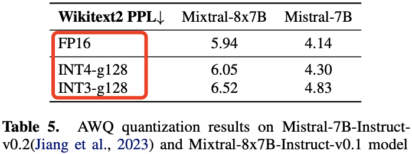
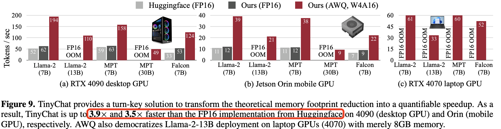
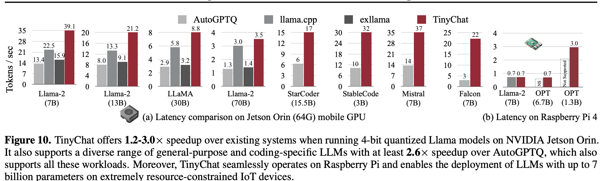

- [1. 摘要](#1-摘要)
- [2. AWQ: 激活感知的权重量化](#2-awq-激活感知的权重量化)
  - [2.1 观点 1-权重并非同等重要，需要基于激活分布来挑选权重的显著通道](#21-观点-1-权重并非同等重要需要基于激活分布来挑选权重的显著通道)
  - [2.2 观点 2-对显著权重进行放大可以降低量化误差](#22-观点-2-对显著权重进行放大可以降低量化误差)
  - [2.3 算法-计算缩放因子 s](#23-算法-计算缩放因子-s)
- [3. 实验](#3-实验)
- [4. 结论](#4-结论)
- [参考资料](#参考资料)

先回顾下 `SmoothQuant` 论文提到的几个关键总结：
1. 激活比权重更难量化。
2. 激活值中的离群值是导致大模型难以量化的重要因素。
3. 激活离群值通常出现于特定通道。

可以发现 SmoothQuant 核心是解决了 LLM 激活难以量化的问题。而 AWQ 论文是 SmoothQuant 的进一步发展，核心作者都是同一批人，那么 AWQ 论文的核心是什么呢？不会是优化权重量化吧。

## 1. 摘要

本文提出了激活感知权重量化 (`AWQ`)，这是一种适合硬件的 LLM 低位权重（比如 `w4`）量化方法。`AWQ` 发现，**并非所有 LLM 权重都同等重要，仅保护 `1%` 的显著权重便能大幅减少量化误差**。而要识别显著权重通道，需要参考的是激活分布而非权重本身分布。为了避免硬件效率低下的混合精度量化，我们通过数学推导得出，放大显著通道可以减少量化误差。AWQ 采用等效变换来放大显著权重通道，用于保留权重显著通道值，保留的比例通过离线收集激活统计数据确定。

`AWQ` 不依赖反向传播或重构，因此可以泛化到不同领域和模态而不会对校准集过拟合。AWQ 在各种语言建模和领域特定的基准测试（编码和数学）中优于现有方法。凭借更好的泛化性，它在**指令微调语言模型以及多模态语言模型**上首次实现了卓越的量化性能，多模态模型量化是前作 `SmoothQuant` 没有测试的领域。

此外，作者还开发了 `TinyChat`，一个高效灵活的 4 位设备端 LLM/VLM 推理框架。通过内核融合和平台适应的权重打包，`TinyChat` 在桌面和移动 GPU 上相比 Huggingface FP16 实现了超过 3 倍的加速，并使 70B 参数的 Llama-2 模型在移动 GPU 上的部署成为可能。
> 值得注意的是，虽然作者开发的 `TinyChat` 使用的是 `w4` 量化，但理论上不考虑精度的前提下，量化位数可以是 `3`、`2`、`1` 任意低比特位数。

## 2. AWQ: 激活感知的权重量化

AWQ: ACTIVATION-AWARE WEIGHT QUANTIZATION

在本节中，作者首先提出了一种**仅针对权重的量化方法**，通过保护更多“重要”权重，在无需训练或回归的情况下提升模型准确性。并开发了一种数据驱动的方法，来搜索能够减少量化误差的最佳缩放比例（见图 2）。

<div align="center">

</div>

图 2b 展示了可以基于激活分布找到 LLM 中 1% 的关键权重，将这些关键权重保留为 FP16 可以显著提升量化后的性能（困惑度从 43.2（左图）降至 13.0（中图））。但这种混合精度格式在硬件上效率较低，基于激活感知原则，作者提出了 AWQ（右图）。AWQ 采用逐通道缩放方式，保护关键权重并减少量化误差。作者测试了 OPT-6.7B 模型上使用 `INT3-g128` 量化下的困惑度 `PPL`(越小越好)表现为 13.0，和前面的混合精度量化一样，说明 AWQ 量化算法有效。

### 2.1 观点 1-权重并非同等重要，需要基于激活分布来挑选权重的显著通道

作者观察到，**LLM 中的权重并非同等重要：仅有 0.1%~1% 的小部分显著权重对模型输出精度影响较大**。如果能保留这部分关键权重，其他权重使用低比特量化推理，那么就能在保持模型精度的前提下，大幅降低模型内存占用和提高推理速度。

这里有个问题是，哪部分权重通道更重要呢？通常评估权重重要性的方法是查看其**大小或 L2-范数** (Han 等，2015；Frankle 和 Carbin，2018)，但在量化推理中也是这样吗？为此，作者做了三个对比实验来判断挑选显著权重方法的有效性，结果发现保留大范数的权重通道（即基于 W 的 FP16%）对量化性能的提升有限，跟随机选择通道带来的提升类似。详细对比结果见表 1 所示：

<div align="center">

</div>

但有趣的是，基于激活幅度来选择权重可以显著提升性能!即使只保留 `0.1%-1%` 的通道为 FP16。作者推测是，幅度较大的输入特征通常更重要，保留相应的权重为 FP16 可以更好地保护这些特征，从而提升模型性能。

到这里可以总结出一个重要结论：**LLM 权重并非同等重要，只有 0.1%~1% 的小部分显著权重对模型输出精度影响较大，又因为幅度较大的输入特征通常更重要，因此需要基于激活分布来挑选权重的显著通道**。

**局限性**：尽管保留 0.1% 的权重为 FP16 可以提升量化性能，且不会显著增加模型的总位数，但混合精度的数据类型会推理系统实现复杂化。因此还需要找到一种方法，可以保护这些关键权重同时又不用实际保留它们为 `FP16`。

### 2.2 观点 2-对显著权重进行放大可以降低量化误差

> 论文描述是基于激活感知缩放保护关键权重 Protecting Salient Weights by Activation-aware Scaling，不是很清楚，这里我换了一种表达。

作者提出一种替代方案，通过**逐通道缩放**减少关键权重的量化误差，避免硬件效率问题。

**量化误差分析**

从权重量化带来的误差分析入手。假设一个权重组或块 $\mathbf{w}$，其线性操作可写为 $y = \mathbf{wx}$，而量化后的对应形式为 $y = Q(\mathbf{w})\mathbf{x}$，由此可定义量化函数为：

$$
Q(\mathbf{w}) = \Delta \cdot \text{Round}\left(\frac{\mathbf{w}}{\Delta}\right), \quad \Delta = \frac{\max(|\mathbf{w}|)}{2^{N-1}}
\tag{1}
$$

其中，$N$ 是量化位数，$\Delta$ 是由**绝对值的最大值**决定的量化缩放系数。

现在考虑对于一个权重元素 $w \in \mathbf{w}$，如果我们引入缩放因子 $s$，并在量化过程中将 $w$ 与 $s$ 相乘同时将激活 $x$ 以同样的缩放因子 $s$ 逆向缩放！即 $Q(w \cdot s)(x / s)$，函数形式为：

$$
Q(w \cdot s) \cdot \frac{x}{s} = \Delta' \cdot \text{Round}\left(\frac{w s}{\Delta'}\right) \cdot x \cdot \frac{1}{s},
\tag{2}
$$

> 虽然公式 1 和公式 2 在数学上是“等效”的，但是带来的精度损失是不一样的。

$\Delta'$ 是在应用 $s$ 之后的新量化缩放系数。作者通过实验发现：
1. 来自 $\text{Round}(\cdot)$ 的期望误差（记为 $\text{RoundErr}(\cdot)$）不变：由于舍入函数将浮点数映射到整数，误差大致在 $[0, 0.5]$ 范围内均匀分布，导致平均误差约为 0.25，即 $\text{RoundErr}(\cdot) \sim 0.25$。
2. 对单个元素 $w$ 进行缩放通常不会改变 $\mathbf{w}$ 组的最大值。因此可以得出 $\Delta' \approx \Delta$ 的结论；
3. 由于 $\Delta$ 和 $x$ 以 FP16 表示，因此它们没有量化误差。

因此，方程 (1) 和 (2) 中的量化误差可以表示为公式（3）：

$$
\text{Err}(Q(w)x) = \Delta \cdot \text{RoundErr}\left(\frac{w}{\Delta}\right) \cdot x
$$

$$
\text{Err}\left(Q(w \cdot s)\left(\frac{x}{s}\right)\right) = \Delta' \cdot \text{RoundErr}\left(\frac{w s}{\Delta'}\right) \cdot x \cdot \frac{1}{s}
\tag{3}
$$

两个误差相除，可得新误差与原始误差的比率为 $\frac{\Delta{\prime}}{\Delta} \cdot \frac{1}{s}$。因为 $\Delta{\prime} \approx \Delta$ 且 $s > 1$，则可推公式（2）的误差小于公式（1），由此，作者认为**量化时对显著权重进行放大，可以降低量化误差**。
> 到这里，论文是通过公式推导证明了观点 2 的由来，下面才是实验证明。

但是前面的设想和公式推导还只是理论层面，因此为了验证该想法，作者在 OPT-6.7B 模型的 `1%` 显著通道上乘以 $s > 1$，并做了相关对比实验，实验结果在表 2 中。

<div align="center">

</div>

先看直接结果（模型精度变化），结果显示，放大显著通道非常有效：模型困惑度 PPL 从 $s = 1$ 时的 23.54（仅为 RTN）降低到 $s = 2$ 时的 11.92。

再看间接结果：
- 随着 $s$ 增加，$\Delta \ne \Delta'$ 的比例逐渐增大，但在 $s < 2$ 时比例还是很低的(<5%)；
- 误差比值 $\frac{\Delta{\prime}}{\Delta} \cdot \frac{1}{s}$ 随 $s$ 增加持续减小，符合前面的推导。

有点意外的是，最佳困惑度在 $s = 2$ 时出现而不是 $4$（s = 4 时误差比值最小）。作者因为如果 $s$ 过大，$\Delta$ 增加会放大非显著通道的相对误差（非显著通道的误差会被 $\frac{\Delta{\prime}}{\Delta}$ 放大，在 $s = 4$ 时 21.2% 的通道比率大于 1），从而可能影响模型整体精度。**因此，在保护显著通道时，我们还需考虑非显著通道的误差**。

到此，表 2 的实验结果证明了**量化时对显著权重进行放大，是可以降低量化误差的，同时，在保护显著通道时，我们还需考虑非显著通道的误差**。

如何选取 $s$ 来平衡显著通道和非显著通道的误差，就是下一节内容了，也是这篇论文相对前作的核心贡献，毕竟权重乘以缩放因子的方法 `smoothquant` 论文已经提出了，**这节更多的是通过公式推导和实验证明了权重乘以 $> 1$ 的缩放因子可以降低（权重）量化误差**！而前作 `smoothquant` 针对权重乘以缩放因子 $s$ 就可以将激活量化难度转移至权重（实际就是降低量化误差）并没有给出一个很详细的理论说明和公式推导（感觉像是有了实验结果了再给出解释）。此外，权重缩放因子 $s$ 的计算方法还是比较粗糙的，因此，awq 论文进一步优化了 $s$ 的计算法。

### 2.3 算法-计算缩放因子 s

**缩放因子的搜索**。

按照前面的分析，我们希望找到权重矩阵通道的每一个缩放系数 $s$，使得量化误差最小，这里 $s$ 如何选择，本质上是优化如下目标函数：

$$
\mathbf{s}^* = \arg\min_{\mathbf{s}} \mathcal{L}(\mathbf{s})
\tag{4}
$$

$$
\mathcal{L}(\mathbf{s}) = \| Q(\mathbf{W} \cdot \text{diag}(\mathbf{s})) (\text{diag}(\mathbf{s})^{-1} \cdot \mathbf{X}) - \mathbf{W} \mathbf{X} \|
$$

上式 $Q$ 表示权重量化函数（例如，组大小为 `128` 的 `INT3/INT4` 量化，以及前文提到的 `per-channel` INT8 量化），$W$ 是原始 `FP16` 权重，$X$ 是从小型校准集缓存的输入特征（从预训练数据集中提取了一个小的校准集，以避免过拟合到特定任务）。$s$ 是逐（输入）通道的缩放因子；对于 $s^{-1} \cdot X$，通常可以将其与前一个操作符融合（参见 Wei 等，2022b；Xiao 等，2022， SmoothQuant 源码分析文章也详细解释了）。

按照作者的观点，激活值越大，对应通道越显著，就应该分配更大的缩放系数降低其量化误差。因此，作者统计了各通道的平均激活值（计算输入矩阵各列绝对值的平均值），并直接将此作为各通道的缩放系数。同时引入一个变量 $\alpha$ 用于平衡显著通道和非显著通道的系数，由此，问题转化为：

$$
s = s {\mathbf{X}}^{\alpha}, \quad \alpha^* = \arg\min_{\alpha} \mathcal{L}(s{\mathbf{X}}^{\alpha})
\tag{5}
$$

值得注意的是，这部分公式的代码实现和论文有个细节不同，阅读源码发现，为了防止 $s$ 过大或者过小，作者还进行了一步数据标准化：

```python
for ratio in range(n_grid):
    ratio = ratio * 1 / n_grid
    scales = x_max.pow(ratio).clamp(min=1e-4).view(-1)
    scales = scales / (scales.max() * scales.min()).sqrt()
    ########################## 省略代码#####################
```

$s{\mathbf{X}}$ 是逐通道计算的激活值的平均幅度，注意在求 $s$ 时，会按照超参数 `group_size` 对通道进行分组，每组共享一个 $\alpha$。到这里还有一个问题是，$alpha$ 如何取值呢？作者认为可以通过在区间 $[0, 1]$ 上进行**快速网格搜索**来找到最佳的 $\alpha$（0 表示不进行缩放；1 表示在搜索空间中最激进的缩放）。但这种方法到底是怎么做的，论文中并没有提。通过阅读源码，发现该方法实际上就是在 `[0,1]` 区间平均取 20 个数，0, 0.05, 0.10, 0.15 …… 然后逐个计算不同 $\alpha$ 下的 `MSE` 损失，损失最小的就是最佳的 $\alpha$。得到最佳 $\alpha$ 后，最佳缩放系数 $s$ 也随之确定。

$\alpha$ 和 $s$ 具体取值的实现代码如下所示:

```python
n_grid = 20 # 搜索网格大小, 即取 20 个 alpha 实验值
history = []
org_sd = {k: v.cpu() for k, v in block.state_dict().items()}
for ratio in range(n_grid):
    ratio = ratio * 1 / n_grid
    # 计算缩放因子 s
    scales = x_max.pow(ratio).clamp(min=1e-4).view(-1)
    scales = scales / (scales.max() * scales.min()).sqrt()
    # 缩放并量化全连接层的权重
    for fc in linears2scale:
        fc.weight.mul_(scales.view(1, -1).to(fc.weight.device))
        fc.weight.data = w_quantize_func(fc.weight.data) / (scales.view(1, -1))
    # 获取缩放后的输出
    out = block(x, **kwargs)
    if isinstance(out, tuple):
        out = out[0]

    # 计算 MSE 损失
    loss = ((org_out - out).float().pow(2).mean().item())  # 使用 float 类型防止溢出
    history.append(loss)
    is_best = loss < best_error
    if is_best:
        best_error = loss
        best_ratio = ratio
        best_scales = scales
    # 恢复模块的原始状态
    block.load_state_dict(org_sd)
    # 最佳缩放因子
    best_scales = best_scales.view(-1)
```

为了验证 AWQ 算法的有效性，作者做了 OPT 模型在 INT3-g128 量化下的消融实验，实验结果显示 AWQ 明显优于 RTN，并实现了和混合精度（1% FP16）相当的精度，同时对硬件更友好。

<div align="center">

</div>

## 3. 实验

实验设置：基于 AWQ 算法作者实现了一个极简 llm 推理框架-`tinychat`，并做了各种性能对比实验，其中关于速度比较的实验结果描述在下面。

**实验结果**

如图 9(a) 所示，TinyChat 在 4090 显卡上相比 Huggingface FP16 实现，为 Llama-2、MPT 和 Falcon 三大系列的 LLM 提供了 2.7-3.9 倍的加速。
- 对于 Llama-2-7B，通过 FP16 内核融合将推理速度从 52 tokens/s 提升至 62 tokens/s。在更强的 FP16 基线之上，快速量化线性内核为带来了 $3.1$ 倍的额外加速。
- 对于 Falcon-7B，由于官方实现未正确支持推理时的 KV 缓存，其速度明显慢于其他模型。在这种情况下，`tinychat` 的 FP16 优化实现了 1.6 倍的加速。在配备 8GB 内存的笔记本 4070 显卡上，`tinychat` 能够以 33 tokens/s 运行 Llama-2-13B，而 FP16 实现无法运行 7B 模型。

<div align="center">

</div>

表 10 还展示了视觉-语言模型加速效果。在 NVIDIA Jetson Orin 上，TinyChat 为 VILA-7B 和 VILA-13B 提供了约 $3$ 倍的加速。值得一提的是，所有 AWQ 模型的前向传播均使用原生 PyTorch API 实现，并支持多种 GPU 架构，因此 `TinyChat` 具备出色的扩展性。

<div align="center">

</div>

与其他系统的比较。在图 10 中，作者将 TinyChat 与现有的边缘 LLM 推理系统 AutoGPTQ、llama.cpp 和 exllama 进行了对比。在 Orin 上，TinyChat 比 llama.cpp 快最高 1.7 倍。此外，llama.cpp 和 exllama 适应性有限，主要针对 LLaMA 和 Llama-2 模型，而 TinyChat 支持更广泛的应用，包括 StarCoder (Li 等，2023c)、StableCode (GPTNeoX) (Black 等，2022)、Mistral (Jiang 等，2023) 和 Falcon (Penedo 等，2023)，且始终显著快于 AutoGPTQ。**TinyChat 甚至在资源极度受限的 Raspberry Pi 4B 上实现了 LLM 部署，7B 模型的速度达到了 0.7 tokens/s**。

<div align="center">

</div>

## 4. 结论

作者提出的激活感知权重量化 (`AWQ`)，是一种用于 LLM 低位权重压缩的简便有效方法。**基于权重在 LLM 中重要性不均的观察，AWQ 采用逐通道缩放来减少关键权重的量化损失**。AWQ 不会对校准集过拟合，并能够保留 LLM 在不同领域和模态中的通用能力。它在语言建模方面优于现有方法，并可应用于指令微调的语言模型和多模态语言模型。和 Huggingface 的 FP16 实现相比，作者实现的 `TinyChat` 系统进一步将 AWQ 实现的内存节省转化为 $3.2-3.3$ 倍的实际加速效果。另外，AWQ 的提出，使得在树莓派和手机端侧部署大模型成为了可落地的存在。

## 参考资料

- [AWQ: Activation-aware Weight Quantization for LLM Compression and Acceleration](https://arxiv.org/pdf/2306.00978)
- [深入理解AWQ量化技术](https://zhuanlan.zhihu.com/p/697761176)
- [https://github.com/mit-han-lab/llm-awq](https://github.com/mit-han-lab/llm-awq/tree/main)