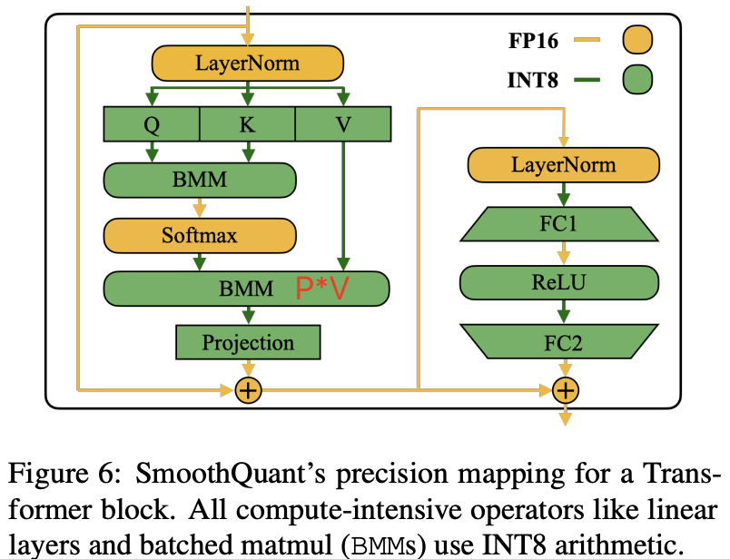
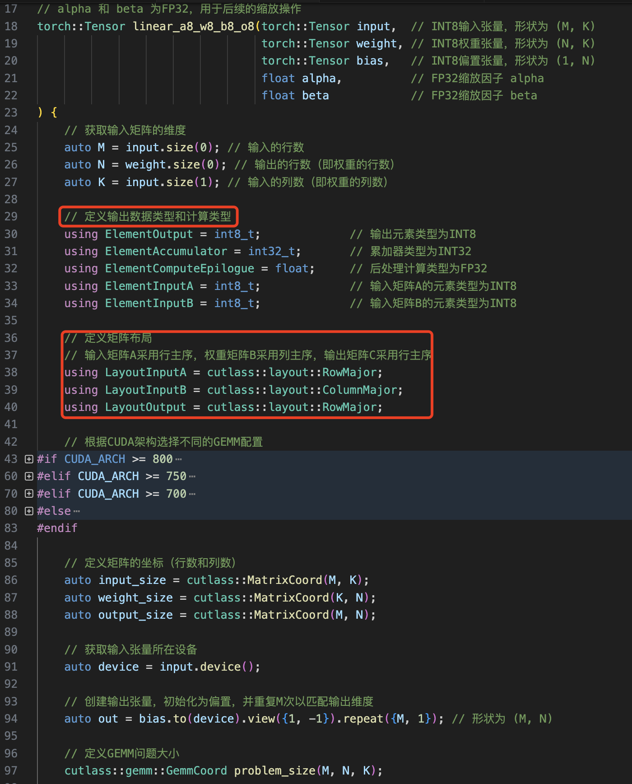
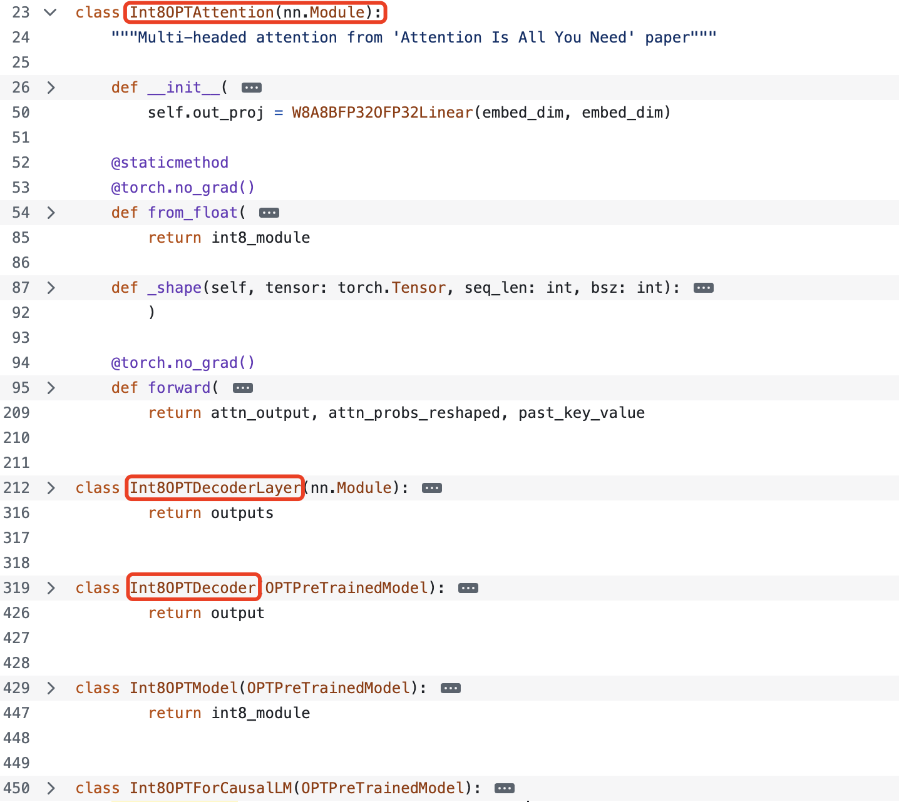

- [一 量化范围和粒度](#一-量化范围和粒度)
  - [1.1 量化范围](#11-量化范围)
  - [1.2 量化粒度](#12-量化粒度)
- [二 SmoothQuant 项目剖析](#二-smoothquant-项目剖析)
  - [2.1 SmoothQuant 代码概述](#21-smoothquant-代码概述)
  - [2.2 激活值范围统计](#22-激活值范围统计)
  - [2.3 离群值平滑](#23-离群值平滑)
  - [2.4 伪量化推理](#24-伪量化推理)
  - [2.5 INT8 量化推理](#25-int8-量化推理)
- [三 总结](#三-总结)
- [参考资料](#参考资料)

## 一 量化范围和粒度

### 1.1 量化范围

量化范围在论文中已经指出来了，`decode layer` 中的量化 `layer` 如下：

- `self-attention` 中的: `q_liner`、`k_liner`、`v_liner` 以及 $QK^T$ 对应的 `BMM`（批量矩阵乘法），以及注意力输出线性层；
- `mlp` 中的全部线性层以及激活层。

到这里我们会发现，transformer 中没有被量化的只有 `Token Bmbedding` 层、`LayerNorm` 层（llama 中是 RMSNorm 层），我个人推测之所以不量化 Token Bmbedding 层，是因为其参数冗余性较小且不存在权重稀疏现象，这个通过可视化 Token Bmbedding 层的权重值统计分布可以观测得到。

<div align="center">

</div>

### 1.2 量化粒度

论文中提到 `SmoothQuant` 一共提供了 `3` 种量化量化粒度，从细到粗分别是：`per-channel`、`per-token`、`per-tensor` 量化，不同的粒度本质上是指**基于不同的粒度去计算量化缩放系数**。它们的定义描述如下:
1. `per-tensor` 量化: 为整个张量使用一个统一的缩放系数（scale）和零点（zero point）;
2. `per-token` 量化：同一 `token`（如序列中的每个单词或子词）才使用统一的缩放系数和零点，量化后缩放系数有 `[batch_size * seq_len]` 个；
3. `per-channel` 量化：同一 `embeeding` 维度的才使用相同的缩放系数和零点，缩放系数总共 `[hidden_size]` 个；对于 CNN 模型，则是为张量的每个通道（例如，卷积层的每个输出通道或线性层的每个输出特征）使用独立的缩放因子和零点。

权重 weight 支持`per-channel`、`per-tensor` 量化，其中获取权重张量最大值的区别如下所示：

```python
import torch
import torch.nn as nn

fc1 = nn.Linear(512, 512,) # shape is [h, h]
w1 = fc1.weight

max1 = w1.abs().max() # 1, per-tensor compute max, max1 is a Scalar
max2 = w1.abs().max(dim=-1, keepdim=True)[0] # 2, per-channel computex, max2 shape is [h, ]
print(f"per-tensor max value is {max1}, per-channel max shape is {max2.shape}")

"""
per-tensor max value is 0.04419414699077606, per-channel max shape is torch.Size([512, 1])
"""
```

激活值 支持`per-token`、`per-tensor` 量化，其中获取权重张量最大值的区别如下所示：

```python
input = torch.randn([16, 64, 512]) # input shape is [batch_size, seq_len, hidden_dim]
input.view(-1, input.shape[-1])

input_max1 = input.abs().max() # input_max1 is Scalar
input_max2 = input.abs().max(dim = -1, keepdim=True)[0] # input_max1 is [batch_size * seq_len, ]
print(f"activation per-tensor max value is {input_max1}, activation per-channel max shape is {input_max2.shape}")

"""
activation per-tensor max value is 4.675, activation per-channel max shape is torch.Size([16, 64, 1])
"""
```

很明显，激活基于 `per-token` 量化去算最大值，其输出维度就是 `[batch_size, seq_len]`, 即保留 `tokens` 维度。这里假设输入是 2D 张量来分析 per-token 和 per-channel 计算的区别，重点在于理解沿着哪个维度做计算，示例代码如下所示：

```python
>>> act
tensor([[4, 5, 5, 6, 6, 6, 6, 6, 8, 9],
        [2, 2, 2, 2, 2, 7, 8, 3, 4, 2],
        [4, 5, 6, 6, 7, 8, 1, 6, 8, 2]])
>>> max = torch.tensor([[2], [2], [2]])
>>> act /max
tensor([[2.0000, 2.5000, 2.5000, 3.0000, 3.0000, 3.0000, 3.0000, 3.0000, 4.0000,
         4.5000],
        [1.0000, 1.0000, 1.0000, 1.0000, 1.0000, 3.5000, 4.0000, 1.5000, 2.0000,
         1.0000],
        [2.0000, 2.5000, 3.0000, 3.0000, 3.5000, 4.0000, 0.5000, 3.0000, 4.0000,
         1.0000]])

>>> weight
tensor([[4, 5, 5, 6, 6, 6, 6, 6, 8, 9],
        [2, 2, 2, 2, 2, 7, 8, 3, 4, 2],
        [4, 5, 6, 6, 7, 8, 1, 6, 8, 2]])
>>> scale = torch.tensor([2,2,2,3,4,5,6,7,8,9])
>>> weight / scale
tensor([[2.0000, 2.5000, 2.5000, 2.0000, 1.5000, 1.2000, 1.0000, 0.8571, 1.0000,
         1.0000],
        [1.0000, 1.0000, 1.0000, 0.6667, 0.5000, 1.4000, 1.3333, 0.4286, 0.5000,
         0.2222],
        [2.0000, 2.5000, 3.0000, 2.0000, 1.7500, 1.6000, 0.1667, 0.8571, 1.0000,
         0.2222]])
```

再结合前面的量化公式：

$$X¯_{\text{INT8}} = \left\lfloor \frac{X_{\text{FP16}}}{\Delta} \right\rceil, \quad \Delta = \frac{\max(|X|)}{2^{N-1} - 1} \tag{1}$$

我们就可以实现权重和激活的量化算法，代码如下所示：

```python
@torch.no_grad()
def quantize_weight_per_channel_absmax(weight, n_bits=8):
    """
    按每个 token 的绝对最大值进行激活量化
    参数:
        - weight (torch.Tensor): 权重张量, shape is (hidden_size, hidden_size).
        - n_bits (int): 量化位数, 默认 8
    返回:
        torch.Tensor: 量化后的激活张量
    """
    weight_max = weight.abs().max(dim = 0, keepdim = True)[0] # 逐 token 计算最大值
    q_max = pow(2, n_bits) - 1
    scales = weight_max.clamp(min=1e-5) / q_max
    quantized = (weight / scales).round().clamp(-q_max, q_max).to(torch.int8)

    return quantized, scales

@torch.no_grad()
def quantize_activation_per_token_absmax(act, n_bits=8):
    """
    按每个 token 的绝对最大值进行激活量化
    参数:
        - act (torch.Tensor): 激活张量, 本质上是线性层的输入张量, shape is (batch_size, seq_len, hidden_size).
        - n_bits (int): 量化位数, 默认 8
    返回:
        torch.Tensor: 量化后的激活张量
    """

    original_shape = act.shape
    act_reshaped = act.view(-1, original_shape[-1]) # 重塑激活张量为  (batch_size * seq_len, hidden_size), 方便逐 token 量化

    act_max = act.abs().max(dim = -1, keepdim = True)[0] # 逐 token 计算最大值
    q_max = pow(2, n_bits) - 1
    scales = act_max.clamp(min=1e-5) / q_max

    quantized = (act_reshaped / scales).round().clamp(-q_max, q_max).to(torch.int8)

    dequantized = quantized.float() * scales
    dequantized = torch.view(original_shape)

    return dequantized, scales

@torch.no_grad()
def quantize_activation_per_tensor_absmax(tensor, n_bits=8):
    """
    按激活整个张量的绝对最大值进行激活量化
    参数:
        - act (torch.Tensor): 激活张量, 本质上是线性层的输入张量, shape is (batch_size, seq_len, hidden_size).
        - n_bits (int): 量化位数, 默认 8
    返回:
        torch.Tensor: 量化后的激活张量
    """
    
    scale = tensor.abs().max()
    q_max = 2 ** (n_bits - 1) - 1  # 对于int8, q_max=127
    scale = max(scale.item(), 1e-5) / q_max
    quantized_tensor = (tensor / scale).round().clamp(-q_max, q_max).to(torch.int8)
    
    return quantized_tensor, scale


def test():
    # weight = torch.randn([32, 32])
    weight = torch.tensor([[1.0, -2.0, 3.0, -4.0],
                            [5.0, -6.0, 7.0, -8.0]], dtype=torch.float32)
    quant_w, scales = quantize_weight_per_channel_absmax(weight)

    print(quant_w)
    print(scales)
    print(f"\nquant_w and scales shape is {quant_w.shape}, {scales.shape}")

if __name__ == "__main__":
    test()
```

程序运行后输出结果如下所示:

```bash
tensor([[  51,  -85,  109, -127],
        [  -1,    1,   -1,    1]], dtype=torch.int8)
tensor([[0.0196, 0.0235, 0.0275, 0.0314]])

quant_w and scales shape is torch.Size([2, 4]), torch.Size([1, 4])
```

经测试 `per-channel`、`per-token`、`per-tensor` 量化函数均正确。

到这里，我们只是理解了三种量化方式的原理，以及实现过程，虽然这还是以前的量化知识，但这是理解 SmoothQuant 源码的先验知识。

## 二 SmoothQuant 项目剖析

### 2.1 SmoothQuant 代码概述

先快速看下整个项目的文件统计情况:

```bash
├── act_scales # 统计得到的激活值
│   ├── opt-13b.pt
│   └── ...
├── examples
│   ├── export_int8_model.py                 # realQunat -如何导出INT8模型
│   ├── generate_act_scales.py               # common-统计激活值
│   ├── smoothquant_opt_demo.ipynb           # fakeQunat -基于 torch 的伪量化
│   └── smoothquant_opt_real_int8_demo.ipynb # realQuant -torch+CUTLASS 量化的过程
├── figures # SQ量化方案与效果图
│   ├── accuracy.png
│   └── ...
├── LICENSE
├── README.md
├── setup.py
└── smoothquant 
    ├── calibration.py # common - 通过校准集，统计得到 act_scales，其实是权重和激活的最大值用于计算 s
    ├── fake_quant.py  # fakeQunat  - 伪量化操作
    ├── __init__.py    # 标识包目录
    ├── opt.py         # realQunat  - 量化 opt 模型
    └── smooth.py      # common - 模型平滑
```

量化算法实现在 `smoothquant/smoothquant` 目录中，它分别实现了基于 pytorch 的 FP32 计算  kernel 的伪量化推理，以及基于 CUTLASS 实现的 INT8 计算 kernel 的真量化模型推理，同时将量化过程分成三个模块，过程拆解和各自对应的文件如下所示:

1. **根据校准集生成激活值 scales**，实际是各 `channel` 的最大值，实现在 `calibration.py`。
2. 使用激活值和权重的 scales（通道最大值）**逐通道计算的平滑因子 $s$**，并融合进线性层权重参数里面，从而实现将激活量化难度转移至权重的目的，实现在 smooth.py。
3. **模型量化及量化模型推理**。
    - 伪量化模型推理（量化算法验证）: 模型权重量化实现是在 `W8A8Linear().from_float(...)` 函数中，采用了经典的最大绝对值量化（对称量化），然后就是伪量化模型推理，实现在 `fake_quant.py`。
    - 真量化模型推理: 量化 kernel 和量化算法实现来源于作者的另外一个仓库-`torch_int`，分别基于 CUTLASS 的 API 实现 Linear 和 BMM 的各种量化 kernel，实现在 [torch_int/nn/linear.py](https://github.com/Guangxuan-Xiao/torch-int/blob/main/torch_int/nn/linear.py)，并有对称和非对称量化权重和激活的函数，实现在 [torch_int/functional/quantization.py](https://github.com/Guangxuan-Xiao/torch-int/blob/main/torch_int/functional/quantization.py)；使用 `from_float` 函数完成量化模型转换，并用量化 kernel 替换之前模型的 FP32 kernel，最后就是正常的模型推理过程，实现在 `opt.py`。
  
上述模块的功能验证在 `example` 目录中，比如到处 INT8 量化模型是 `examples/export_int8_model.py`；基于校准集生成激活值 scales 是 `examples/generate_act_scales.py`，用法如下所示:

```bash
python examples/generate_act_scales.py \
    --model-name <model_name_or_path> \
    --output-path <output_act_scales_file_path> \
    --num-samples <num_samples> \
    --seq-len <sequence_length> \
    --dataset-path <path_to_the_calibration_dataset>
```

### 2.2 激活值范围统计

激活值范围统计实际是基于校准集去做模型推理，并**逐通道统计激活最大值**。这里代码实现核心是两个部分，分别是，逐通道计算激活最大值的实现函数 `get_act_scales`，以及为模型的每个 Linear 层添加 `stat_input_hook` 前向钩子。代码的详细注释如下:

```python

import torch
import torch.nn as nn

from datasets import load_dataset
import functools
from collections import defaultdict

from functools import partial
import numpy as np
from tqdm import tqdm

def get_act_scales(model, tokenizer, dataset_path, num_samples=512, seq_len=512):
    """
    逐通道计算模型中每个线性层的激活最大值（绝对值）的尺度，用于后续的量化或归一化处理。

    参数:
        model (torch.nn.Module): 要分析的PyTorch模型。
        tokenizer (PreTrainedTokenizer): 用于将文本转换为模型输入的分词器。
        dataset_path (str): 数据集的路径，数据集应为JSON格式。
        num_samples (int): 要处理的样本数量，默认512。
        seq_len (int): 输入序列的最大长度，默认512。

    返回:
        act_scales (dict): 包含每个线性层激活最大值的字典，键为层名称，值为对应的最大值张量。
    """
    model.eval()  # 将模型设置为评估模式，禁用dropout等训练特有的操作
    device = next(model.parameters()).device  # 获取模型所在的设备（CPU或GPU）
    act_scales = {}  # 初始化一个字典，用于存储每个层的激活尺度

    def stat_tensor(name, tensor):
        """
        计算张量的绝对值最大值并更新act_scales字典。

        参数:
            name (str): 层的名称。
            tensor (torch.Tensor): 要统计的张量。
        """
        hidden_dim = tensor.shape[-1]  # 获取张量的最后一个维度大小（通常是隐藏维度）
        tensor = tensor.view(-1, hidden_dim).abs().detach()  # 将张量展平并取绝对值
        comming_max = torch.max(tensor, dim=0)[0].float().cpu()  # 计算每个隐藏维度上的最大值并转移到 CPU
        if name in act_scales:
            act_scales[name] = torch.max(act_scales[name], comming_max)  # 更新最大值
        else:
            act_scales[name] = comming_max  # 初始化最大值

    def stat_input_hook(m, x, y, name):
        """
        前向钩子函数，用于在每次前向传播时收集输入张量的统计信息。

        参数:
            m (torch.nn.Module): 当前层的模块。
            x (tuple): 输入到当前层的张量。
            y (torch.Tensor): 当前层的输出张量。
            name (str): 当前层的名称。
        """
        if isinstance(x, tuple):
            x = x[0]  # 如果输入是元组，则取第一个元素
        stat_tensor(name, x)  # 统计输入张量

    hooks = []  # 存储钩子函数，以便后续移除
    for name, m in model.named_modules():
        if isinstance(m, nn.Linear):
            # 对每个线性层注册一个前向钩子，用于统计激活
            hooks.append(
                m.register_forward_hook(functools.partial(stat_input_hook, name=name))
            )

    # 加载数据集，假设数据集为JSON格式，包含"text"字段
    dataset = load_dataset("json", data_files=dataset_path, split="train")
    dataset = dataset.shuffle(seed=42)  # 随机打乱数据集

    # 遍历指定数量的样本，进行前向传播以收集激活信息
    for i in tqdm(range(num_samples), desc="Collecting activation scales"):
        input_ids = tokenizer(
            dataset[i]["text"],  # 获取第i个样本的文本
            return_tensors="pt",  # 返回PyTorch张量
            max_length=seq_len,  # 设置最大序列长度
            truncation=True  # 启用截断
        ).input_ids.to(device)  # 转移到模型所在的设备
        model(input_ids)  # 前向传播

    # 移除所有注册的钩子
    for h in hooks:
        h.remove()

    return act_scales  # 返回收集到的激活尺度
```

有了激活值最大值统计的函数，接下来我们调用这个函数并保存下来即可，使用示例在 `generate_act_scales.py`，添加中文注释的主要代码如下所示:

```python
@torch.no_grad()
def main():
    args = parse_args()
    model, tokenizer = build_model_and_tokenizer(args.model_name)

    if not os.path.exists(args.dataset_path):
        print(f"Cannot find the dataset at {args.dataset_path}")
        print("Please download the Pile dataset and put the validation set at the path")
        print(
            "You can download the validation dataset of the Pile at https://huggingface.co/datasets/mit-han-lab/pile-val-backup/resolve/main/val.jsonl.zst"
        )
        raise FileNotFoundError

    act_scales = get_act_scales(
        model, tokenizer, args.dataset_path, args.num_samples, args.seq_len
    ) # act_scales 是一个字典, key 是层名称

    os.makedirs(os.path.dirname(args.output_path), exist_ok=True)
    torch.save(act_scales, args.output_path) # 保存统计到的激活值最大值


if __name__ == "__main__":
    main()
```

**激活最大值统计字典** `act_scales` 格式如下所示:

```bash
{
    "layers.0.self_attn.q_proj": tensor([...]),
    "layers.0.self_attn.k_proj": tensor([...]),
    # ... 其他层
}
```

### 2.3 离群值平滑

计算平滑因子 $s$（代码中也命名为 `scales`）计算公式为 $s_j = \frac{\max(|\mathbf{X}_j|)^{\alpha}}{\max(|\mathbf{W}_j|)^{1 - \alpha}}$，上一个模块已经逐通道统计了激活最大值 `scales`，再逐通道计算下权重矩阵的最大值，结合 $s_j$ 公式就可以得到平滑因子 $s$ 了，代码如下所示:

```python
# 为了更方便理解，我做了一些简化
# 如果 fcs 是线性层列表，则取整体的最大值，用来计算平滑因子 scales。
weight_scales = torch.cat([fc.weight.abs().max(dim=0, keepdim=True)[0] for fc in fcs], dim=0)
weight_scales = weight_scales.max(dim=0)[0].clamp(min=1e-5)
scales = (act_scales.pow(alpha) / weight_scales.pow(1 - alpha) # 平滑因子 s
```

有了平滑因子，就可以实现离群值平滑了，其本质上是通过将激活难度转移至权重来实现的，公式表现为 $diag(s) * W$。同时为了，同时考虑到输入 $X$ 通常由前面的线性操作（如线性层、层归一化等）产生，我们可以轻松地将平滑因子离线地融合到前一层的参数中 $diag(s) * W_\text{Previous\_Layer}$，不会因额外的缩放操作而导致增加内核调用开销。离群值平滑的核心代码如下所示:

```python
# 将平滑因子离线地融合到前一层的参数中
ln.weight.div_(scales)
ln.bias.div_(scales)

# 将当前层的激活值量化难度转移至权重
for fc in fcs:
    fc.weight.mul_(scales.view(1, -1))
```

上述分析和代码描述其实更多的是体现 `smooth` 平滑算法如何实现的，但是在具体应用上其实有很多细节问题需要我们搞懂，比如我们知道对于自回归 llm，我们量化的主要是 self-attention 和 和 mlp 模块中的线性层，但是这里有一些细节需要注意：
- `attention` 和 `mlp` 的里面线性层是否都需要平滑，看代码发现 attention 的 output 和 mlp 的 down 线性层权重没有做更新；（**推测是一个模块的最前面的线性层才需要做权重更新？**）
- `attention` 的 q_linear、k_linear、v_linear 是共用一个激活 scales，即 attention 的输入 scales["*.attention.q_proj"]，这个应该很明显，因为这这三个线性层的输入就是同一个。
- `mlp` 的 3 个线性层的 up_linear、gatp_linear、down_linear 是共用一个激活 scales 吗，即 mlp 的输入 scales["*.mlp.gate_proj"]，这个也很明显，up_linear 和 gatp_linear 的输入也是一样的。
- 输入是同一个的线性层可以共享量化因子 $s$。

针对平滑 llama 模型的 smooth 代码如下所示:

```python
# 代码做了一些简化，保留核心
@torch.no_grad()
def smooth_ln_fcs_llama_like(ln, fcs, act_scales, alpha=0.5):
    """
    针对LLaMA-like模型的层归一化和平滑全连接层的函数。

    参数:
        ln (LlamaRMSNorm, MistralRMSNorm, MixtralRMSNorm): 要平滑的层归一化层，适用于LLaMA-like模型。
        fcs (nn.Linear 或 list of nn.Linear): 要平滑的一个或多个全连接层。
        act_scales (torch.Tensor): 激活的尺度信息，与层归一化的权重数量相同。
        alpha (float): 平滑因子，用于控制激活尺度和权重尺度的平衡，默认0.5。

    返回:
        None: 该函数直接修改传入的层归一化和全连接层的权重。
    """
    # 确保fcs是一个列表
    if not isinstance(fcs, list):
        fcs = [fcs]
    
    # 确保ln是LlamaRMSNorm, MistralRMSNorm或MixtralRMSNorm的实例
    assert isinstance(ln, (LlamaRMSNorm, MistralRMSNorm, MixtralRMSNorm)), \
        "ln必须是LlamaRMSNorm, MistralRMSNorm或MixtralRMSNorm的实例"
    
    # 检查每个全连接层是否为nn.Linear，并且ln的权重数量与fc的输入特征数及act_scales数量一致
    for fc in fcs:
        assert isinstance(fc, nn.Linear), "fcs必须是nn.Linear的实例"
        assert ln.weight.numel() == fc.in_features == act_scales.numel(), \
            "ln的权重数量、fc的输入特征数和act_scales的数量必须相同"
    
    # 获取设备和数据类型，以便将act_scales转换到相同的设备和类型
    device, dtype = fcs[0].weight.device, fcs[0].weight.dtype
    act_scales = act_scales.to(device=device, dtype=dtype)
    
    # 计算每个全连接层权重的最大绝对值，按隐藏维度汇总
    weight_scales = torch.cat(
        [fc.weight.abs().max(dim=0, keepdim=True)[0] for fc in fcs], dim=0
    )
    # 选择每个隐藏维度上的最大权重尺度，并确保其最小值为1e-5以避免除零错误
    weight_scales = weight_scales.max(dim=0)[0].clamp(min=1e-5)
    
    # 计算平滑尺度，结合激活尺度和权重尺度
    scales = (
        (act_scales.pow(alpha) / weight_scales.pow(1 - alpha))
        .clamp(min=1e-5)  # 确保尺度的最小值为1e-5
        .to(device)
        .to(dtype)
    )
    
    # 调整层归一化的权重
    ln.weight.div_(scales)
    
    # 调整全连接层的权重
    for fc in fcs:
        fc.weight.mul_(scales.view(1, -1))


@torch.no_grad()
def smooth_lm(model, scales, alpha=0.5):
    """
    遍历模型中的所有解码器层，应用平滑层归一化和全连接层的操作。

    参数:
        model (torch.nn.Module): 要平滑的模型。
        scales (dict): 包含各层激活尺度的字典，键为层名称，值为对应的激活尺度张量。
        alpha (float): 平滑因子，用于控制激活尺度和权重尺度的平衡，默认0.5。

    返回:
        None: 该函数直接修改模型中的层归一化和全连接层的权重。
    """
    # 遍历模型中的所有模块
    for name, module in model.named_modules():
        # 针对LlamaDecoderLayer和MistralDecoderLayer类型的模块
        if isinstance(module, (LlamaDecoderLayer, MistralDecoderLayer)):
            # 获取自注意力层的层归一化层
            attn_ln = module.input_layernorm
            # 获取自注意力层的Q, K, V全连接层
            qkv = [
                module.self_attn.q_proj,
                module.self_attn.k_proj,
                module.self_attn.v_proj,
            ]
            # 获取对应的激活尺度
            qkv_input_scales = scales[name + ".self_attn.q_proj"]
            # 应用针对LLaMA-like模型的平滑函数
            smooth_ln_fcs_llama_like(attn_ln, qkv, qkv_input_scales, alpha)

            # 获取前馈网络的层归一化层和全连接层
            ffn_ln = module.post_attention_layernorm
            fcs = [module.mlp.gate_proj, module.mlp.up_proj]
            # 获取对应的激活尺度
            fcs_input_scales = scales[name + ".mlp.gate_proj"]
            # 应用针对LLaMA-like模型的平滑函数
            smooth_ln_fcs_llama_like(ffn_ln, fcs, fcs_input_scales, alpha)
```

### 2.4 伪量化推理

这里其实包括两个过程，对应代码在 `fake_quant.py`：
1. FP32 模型转换为 INT8 模型，对应权重量化函数 `from_float`， 并构建 `W8A8Linear` 类；
2. 伪量化推理，因为是伪量化推理，所以这里没有量化层替换 FP32 层的操作，模型结构和以前一模一样，推理函数 forward 也比较简单，只是加了 `quant` 操作用于验证激活量化函数的正确性。

前面我们计算激活最大值和平滑因子 $s$ 都是逐通道计算的，因为这是确保量化精度的必要条件，但是权重和激活量化的模式我们是可以调整的，以动态调整性能和量化推理精度，具体实现和区别在第一章已经详细描述了，这里不再描述。这部分功能的核心就是在于实现 `W8A8Linear` 类，其中 `from_float` 实现对权重的量化函数，`forward` 函数对激活量化为了评估量化正确性。

为了简化，我只保留了针对 llama 模型权重量化转换和量化推理的部分，添加中文详细注释后的代码如下所示：

```python
import torch
from torch import nn
from functools import partial


@torch.no_grad()
def quantize_weight_per_channel_absmax(w, n_bits=8):
    """
    按通道使用绝对最大值进行权重量化。

    参数:
        w (torch.Tensor): 权重张量，形状为 (out_features, in_features)。
        n_bits (int): 量化位数，默认为8。

    返回:
        torch.Tensor: 量化后的权重张量。
    """
    
    scales = w.abs().max(dim=-1, keepdim=True)[0] # 计算每个输出通道的绝对最大值
    q_max = 2 ** (n_bits - 1) - 1 # 计算量化的最大值，例如8位量化的最大值为 127
    scales.clamp_(min=1e-5).div_(q_max) # 防止除以零，将最小尺度限制为1e-5，并计算缩放因子
    w.div_(scales).round_().mul_(scales) # 对权重进行缩放、四舍五入，并通过 .mul_(scales) 操作重新缩放回原始尺度
    
    return w


@torch.no_grad()
def quantize_activation_per_token_absmax(t, n_bits=8):
    """
    按每个token的绝对最大值进行激活量化。

    参数:
        t (torch.Tensor): 激活张量，形状通常为 (batch_size, seq_len, hidden_size)。
        n_bits (int): 量化位数，默认为8。

    返回:
        torch.Tensor: 量化后的激活张量。
    """
    t_shape = t.shape
    t = t.view(-1, t_shape[-1]) # 将张量重塑为 (batch_size * seq_len, hidden_size) 以便逐token量化
    scales = t.abs().max(dim=-1, keepdim=True)[0] # 计算每个token的绝对最大值
    q_max = 2 ** (n_bits - 1) - 1  # 计算量化的最大值，例如8位量化的最大值为127
    scales.clamp_(min=1e-5).div_(q_max) # 防止除以零，将最小尺度限制为1e-5，并计算缩放因子
    t.div_(scales).round_().mul_(scales) # 对激活进行缩放、四舍五入并重新缩放回原始尺度    
    t = t.view(t_shape) # 恢复原始形状
    
    return t

class W8A8Linear(nn.Module):
    """
    一个自定义的8位权重量化和8位激活量化的线性层。

    参数:
        in_features (int): 输入特征数。
        out_features (int): 输出特征数。
        bias (bool): 是否使用偏置，默认为True。
        act_quant (str): 激活量化方式，可选 "per_token" 或 "per_tensor"，默认为 "per_token"。
        quantize_output (bool): 是否量化输出，默认为False。
    """
    def __init__(
        self,
        in_features,
        out_features,
        bias=True,
        act_quant="per_token",
        quantize_output=False,
    ):
        super().__init__()
        self.in_features = in_features
        self.out_features = out_features

        # 初始化权重为随机数，使用半精度浮点数，并不需要梯度
        self.register_buffer(
            "weight",
            torch.randn(
                self.out_features,
                self.in_features,
                dtype=torch.float16,
                requires_grad=False,
            ),
        )
        
        # 初始化偏置为零，如果需要偏置
        if bias:
            self.register_buffer(
                "bias",
                torch.zeros(
                    (1, self.out_features), dtype=torch.float16, requires_grad=False
                ),
            )
        else:
            self.register_buffer("bias", None)

        # 根据act_quant参数选择激活量化函数
        if act_quant == "per_token":
            self.act_quant_name = "per_token"
            self.act_quant = partial(quantize_activation_per_token_absmax, n_bits=8)
        elif act_quant == "per_tensor":
            self.act_quant_name = "per_tensor"
            self.act_quant = partial(quantize_activation_per_tensor_absmax, n_bits=8)
        else:
            raise ValueError(f"Invalid act_quant: {act_quant}")

        # 根据quantize_output参数决定是否量化输出
        if quantize_output:
            self.output_quant_name = self.act_quant_name
            self.output_quant = self.act_quant
        else:
            self.output_quant_name = "None"
            self.output_quant = lambda x: x  # 如果不量化输出，保持不变

    def to(self, *args, **kwargs):
        """
        重载to方法，以确保权重和偏置也随模块一起移动到指定设备和类型。
        """
        super(W8A8Linear, self).to(*args, **kwargs)
        self.weight = self.weight.to(*args, **kwargs)
        if self.bias is not None:
            self.bias = self.bias.to(*args, **kwargs)
        return self

    @torch.no_grad()
    def forward(self, x):
        """
        前向传播，先量化激活，然后执行线性变换，最后量化输出（如果需要）。

        参数:
            x (torch.Tensor): 输入张量，形状通常为 (batch_size, seq_len, in_features)。

        返回:
            torch.Tensor: 输出张量，形状为 (batch_size, seq_len, out_features)。
        """
        # 量化输入激活
        q_x = self.act_quant(x)
        
        # 执行线性变换
        y = torch.functional.F.linear(q_x, self.weight, self.bias)
        
        # 量化输出激活（如果需要）
        q_y = self.output_quant(y)
        
        return q_y

    @staticmethod
    @torch.no_grad()
    def from_float(
        module, weight_quant="per_channel", act_quant="per_token", quantize_output=False
    ):
        """
        从浮点型线性层创建一个量化后的 W8A8 Linear层。

        参数:
            module (nn.Linear): 要量化的浮点型线性层。
            weight_quant (str): 权重量化方式，可选 "per_channel" 或 "per_tensor"，默认为 "per_channel"。
            act_quant (str): 激活量化方式，可选 "per_token" 或 "per_tensor"，默认为 "per_token"。
            quantize_output (bool): 是否量化输出，默认为False。

        返回:
            W8A8Linear: 量化后的线性层。
        """
        assert isinstance(module, torch.nn.Linear), "module必须是torch.nn.Linear的实例"
        
        # 创建一个新的W8A8Linear实例
        new_module = W8A8Linear(
            module.in_features,
            module.out_features,
            bias=module.bias is not None,
            act_quant=act_quant,
            quantize_output=quantize_output,
        )
        
        # 量化权重
        if weight_quant == "per_channel":
            new_module.weight = quantize_weight_per_channel_absmax(
                module.weight.clone(), n_bits=8
            )  # 使用8位按通道量化
        elif weight_quant == "per_tensor":
            new_module.weight = quantize_weight_per_tensor_absmax(
                module.weight.clone(), n_bits=8
            )  # 使用8位按张量量化
        else:
            raise ValueError(f"Invalid weight_quant: {weight_quant}")
        
        new_module.weight_quant_name = weight_quant
        
        # 如果有偏置，直接复制
        if module.bias is not None:
            new_module.bias = module.bias.clone()
        
        return new_module

    def __repr__(self):
        """
        自定义模块的字符串表示，显示量化参数。
        """
        return f"W8A8Linear({self.in_features}, {self.out_features}, bias={self.bias is not None}, weight_quant={self.weight_quant_name}, act_quant={self.act_quant_name}, output_quant={self.output_quant_name})"


@torch.no_grad()
def quantize_llama_like(
    model, weight_quant="per_channel", act_quant="per_token", quantize_bmm_input=False
):
    """
    对LLaMA-like模型进行量化。

    参数:
        model (nn.Module): 要量化的LLaMA-like模型。
        weight_quant (str): 权重量化方式，可选 "per_channel" 或 "per_tensor"，默认为 "per_channel"。
        act_quant (str): 激活量化方式，可选 "per_token" 或 "per_tensor"，默认为 "per_token"。
        quantize_bmm_input (bool): 是否量化批量矩阵乘法的输入，默认为False。

    返回:
        nn.Module: 量化后的LLaMA-like模型。
    """
    from transformers.models.llama.modeling_llama import (
        LlamaAttention,
        LlamaMLP,
    )
    from transformers.models.mistral.modeling_mistral import (
        MistralAttention,
        MistralMLP,
    )

    # 遍历模型中的所有模块
    for name, m in model.model.named_modules():
        if isinstance(m, (LlamaMLP, MistralMLP)):
            # 量化MLP层中的gate_proj, up_proj和down_proj
            m.gate_proj = W8A8Linear.from_float(
                m.gate_proj, weight_quant=weight_quant, act_quant=act_quant
            )
            m.up_proj = W8A8Linear.from_float(
                m.up_proj, weight_quant=weight_quant, act_quant=act_quant
            )
            m.down_proj = W8A8Linear.from_float(
                m.down_proj, weight_quant=weight_quant, act_quant=act_quant
            )
        elif isinstance(m, (LlamaAttention, MistralAttention)):
            # 量化注意力层中的q_proj, k_proj, v_proj以及o_proj
            m.q_proj = W8A8Linear.from_float(
                m.q_proj,
                weight_quant=weight_quant,
                act_quant=act_quant,
                quantize_output=quantize_bmm_input,
            )
            m.k_proj = W8A8Linear.from_float(
                m.k_proj,
                weight_quant=weight_quant,
                act_quant=act_quant,
                quantize_output=quantize_bmm_input,
            )
            m.v_proj = W8A8Linear.from_float(
                m.v_proj,
                weight_quant=weight_quant,
                act_quant=act_quant,
                quantize_output=quantize_bmm_input,
            )
            m.o_proj = W8A8Linear.from_float(
                m.o_proj, weight_quant=weight_quant, act_quant=act_quant
            )
    return model
```

### 2.5 INT8 量化推理

这里其实包括两个过程：
1. FP32 模型转换为 INT8 模型，核心是实现权重的量化函数；
2. INT8 量化 kernel 替换原来的 FP32 kernel，再执行原来一样的模型推理过程。

代码实现上，其实就是实现权重量化函数 `from_float` 这个步骤跟伪量化基本一样，区别只在于不再将输入缩放回原始尺度，代码如下所示:

```python
@torch.no_grad()
def quantize_weight_per_channel_absmax(w):
    # w: [out_channel, in_channel]
    scales = w.abs().max(dim=1)[0] / 127
    scales = scales.view(-1, 1)
    if not w.is_cuda:
        # half rounding is not supported on CPU
        w = w.float()
    # use inplace operation to save memory
    w.div_(scales).round_().clamp_(-128, 127)
    w_q = w.to(torch.int8)
    return w_q, scales
```

并构造 INT8 量化线性层，并用量化层替换原来的浮点层，这里的难点在于要学会用 cuda/triton 编写 `INT8` 量化 kernel，作者基于 cutlass 库实现了多种量化线性层 kernel。python 版的量化 `W8A8B8O8Linear` 类实现如下所示:

```python
class W8A8B8O8Linear(nn.Module):
    """
    一个自定义的8位权重量化、8位激活量化、8位偏置量化和8位输出量化的线性层。

    参数:
        in_features (int): 输入特征数。
        out_features (int): 输出特征数。
        alpha (float): 输入缩放因子，默认为1.0。
        beta (float): 偏置缩放因子，默认为1.0。
    """
    def __init__(self, in_features, out_features, alpha=1.0, beta=1.0):
        super().__init__()
        self.in_features = in_features
        self.out_features = out_features

        # 注册量化后的权重为 int8 类型的缓冲区，不参与梯度计算
        self.register_buffer('weight', torch.randint(-127, 127, (self.out_features,
                                                                 self.in_features), dtype=torch.int8, requires_grad=False))
        # 注册量化后的偏置为 int8 类型的缓冲区，不参与梯度计算
        self.register_buffer('bias', torch.zeros(
            (1, self.out_features), dtype=torch.int8, requires_grad=False))
        # 注册输入缩放因子和偏置缩放因子
        self.register_buffer('a', torch.tensor(alpha))
        self.register_buffer('b', torch.tensor(beta))

    def to(self, *args, **kwargs):
        """
        重载to方法，以确保权重和偏置也随模块一起移动到指定设备和类型。
        """
        super().to(*args, **kwargs)
        self.weight = self.weight.to(*args, **kwargs)
        self.bias = self.bias.to(*args, **kwargs)
        self.a = self.a.to(*args, **kwargs)
        self.b = self.b.to(*args, **kwargs)
        return self

    @torch.no_grad()
    def forward(self, x):
        """
        前向传播，执行量化后的线性变换。

        参数:
            x (torch.Tensor): 输入张量，形状通常为 (batch_size, seq_len, in_features)。

        返回:
            torch.Tensor: 输出张量，形状为 (batch_size, seq_len, out_features)。
        """
        x_shape = x.shape
        # 将输入重塑为 (batch_size * seq_len, in_features) 以便进行批量矩阵乘法
        x = x.view(-1, x_shape[-1])
        # 调用自定义的量化线性变换函数
        y = linear_a8_w8_b8_o8(x, self.weight, self.bias,
                               self.a.item(), self.b.item())
        # 恢复原始的输入形状
        y = y.view(*x_shape[:-1], -1)
        return y

    @staticmethod
    @torch.no_grad()
    def from_float(module: nn.Linear, input_scale, output_scale):
        """
        从浮点型线性层创建一个量化后的W8A8B8O8Linear层。

        参数:
            module (nn.Linear): 要量化的浮点型线性层。
            input_scale (float): 输入缩放因子。
            output_scale (float): 输出缩放因子。

        返回:
            W8A8B8O8Linear: 量化后的线性层。
        """
        # 创建一个新的量化线性层实例
        int8_module = W8A8B8O8Linear(
            module.in_features, module.out_features)
        
        # 量化权重，并获取缩放因子
        int8_weight, weight_scale = quantize_per_tensor_absmax(module.weight)
        # 量化偏置，并获取缩放因子
        int8_bias, bias_scale = quantize_per_tensor_absmax(module.bias)
        
        # 计算输入缩放因子 alpha 和偏置缩放因子 beta
        alpha = input_scale * weight_scale / output_scale
        beta = bias_scale / output_scale
        
        # 设置量化后的权重和偏置
        int8_module.weight = int8_weight
        int8_module.bias = int8_bias
        # 设置缩放因子
        int8_module.a = alpha
        int8_module.b = beta
        
        return int8_module

    def __repr__(self):
        """
        自定义模块的字符串表示，显示量化参数。
        """
        return f"W8A8B8O8Linear({self.in_features}, {self.out_features}, alpha={self.a.item()}, beta={self.b.item()})"
```

看出区别没，和前面不同，真正的线性量化 kernel 的 forward 是没有使用  pytorch 的 `torch.functional.F.linear` 函数的，而是使用自行变形的 INT8 kernel 函数 `linear_a8_w8_b8_o8`。值的注意的是线性层的量化 kernel 有多重形式，作者提供了如下形式:
- `linear_a8_w8_b8_o8`：激活、权重、bias 和输出都是 INT8，属于完全的量化 kernel。
- `W8A8B8O8LinearReLU`: 激活、权重、bias 和输出都是 INT8，且和 relue 算子做了融合！
- ``W8A8BFP32OFP32Linear` 和 `linear_a8_w8_b32_o32_with_scaling`：激活、权重是 INT8，bias 是 FP32，输出是 FP32，前者对权重做平滑后者没有。
- `W8A8BFP32OFP32Linear`。
- `W8A16Linear`：权重 INT8，激活是 `FP16`，forward 使用的是 `torch.functional.F.linear`，运算依然是浮点操作。

之所以提供这么多中选择，我推测是因为 llm 种类繁多，可能存在特定 `int8` 线性层导致模型精度降低的可能情况，找到了在那个层，用 `W8A16Linear` 或者 `FP32` 层替换，从而可解决量化导致掉点的问题。

再让我们快速看下 `linear_a8_w8_b8_o8` 量化 kernel 的 cuda 实现代码。

<div align="center">

</div>

了解了量化 kernel 种类和定义，我们再回过头来量化模型是如何实现的，通过阅读代码会发现量化模型是一个全新的模型，除了模型结构和原来浮点模型一样，但是在实现上已经是全新了，省略版代码如下所示：

<div align="center">

</div>

## 三 总结

致此，smoothquant 仓库的源码解析已经全部完成，个人经验是读论文更多的是了解算法原理和公式推导，但是真的应用和细节还是得看源码。最后我们再总结下 smoothquant 仓库，其主要分三个部分：
1. 基于校准集统计激活最大值 `calibration.py`；
2. 激活难度迁移至权重的平滑模块 `smooth.py`;
3. 包含模型权重转换的伪量化推理 `fake_quant.py` 和真正量化推理 `opt.py`。

## 参考资料

- [[源码] [万字] SmoothQuant量化深入探究](https://zhuanlan.zhihu.com/p/701436876)
- https://github.com/mit-han-lab/smoothquant/
- https://github.com/Guangxuan-Xiao/torch-int/