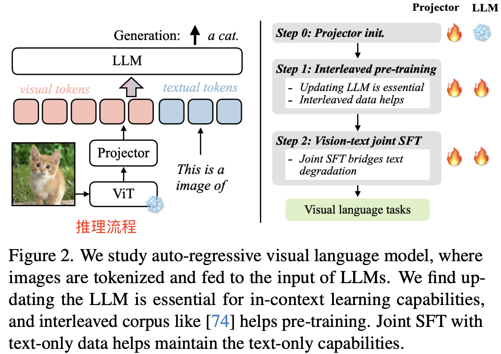
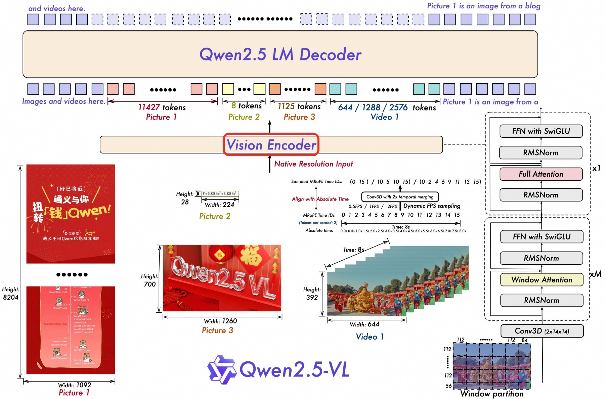
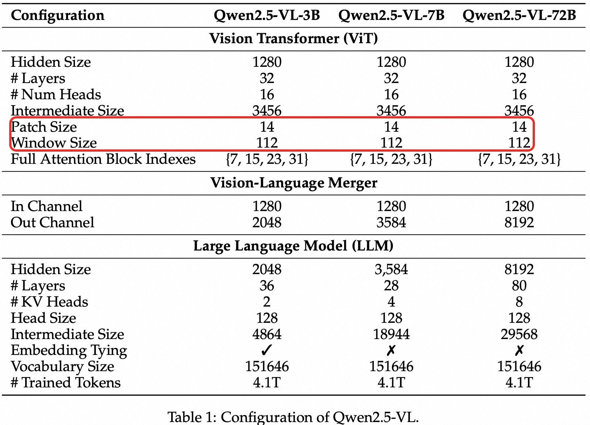
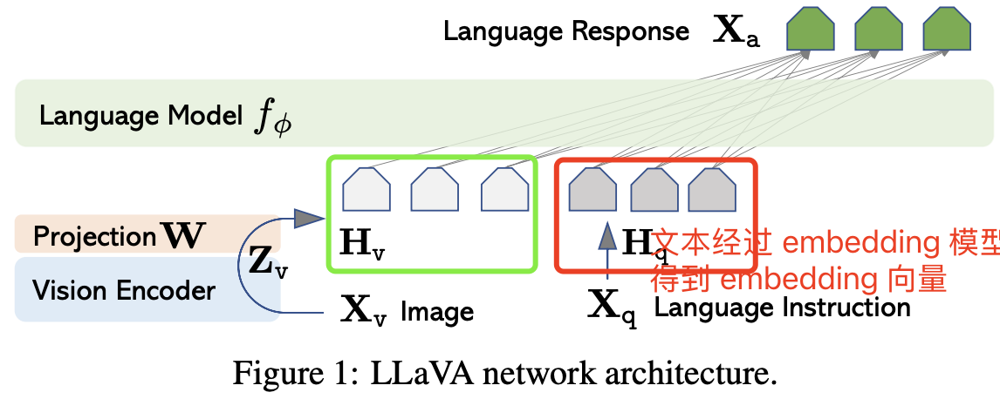
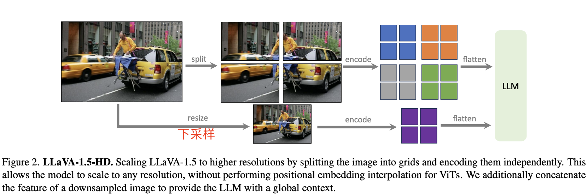

- [一 背景知识](#一-背景知识)
  - [1.1 ViT 模型结构](#11-vit-模型结构)
    - [ViT block 组成](#vit-block-组成)
    - [输入切分为多个 patch](#输入切分为多个-patch)
  - [1.2 常见的多模态模型](#12-常见的多模态模型)
- [二 LLaVA 系列模型](#二-llava-系列模型)
  - [2.1 LLaVA1](#21-llava1)
    - [2.1.1 ViT-L/14 模型结构](#211-vit-l14-模型结构)
  - [2.2. LLaVA1.5](#22-llava15)
    - [2.2.1 LLaVA-1.5-HD](#221-llava-15-hd)
  - [2.3. LLaVA1.6（LLaVA-NeXT）](#23-llava16llava-next)
- [三 查看 llava 模型结构](#三-查看-llava-模型结构)
- [四. LLaVA 模型推理](#四-llava-模型推理)
  - [4.1 模型初始化](#41-模型初始化)
  - [4.2 视觉特征提取和维度对齐](#42-视觉特征提取和维度对齐)
  - [4.3 文本和图像特征合并](#43-文本和图像特征合并)
  - [4.4 前向推理 forward](#44-前向推理-forward)
- [五 文本和图像特征合并](#五-文本和图像特征合并)
  - [5.1 步骤拆解](#51-步骤拆解)
- [参考资料](#参考资料)

## 一 背景知识

### 1.1 ViT 模型结构

<div align="center">

</div>

模型概述：作者将输入的图像划分为固定大小的图像块，对**每个图像块**都进行线性嵌入，添加位置嵌入，并将生成的向量序列输入到标准的 Transformer 编码器中。为了进行分类，参考前人经验，使用标准方法，即**在序列中添加一个额外的可学习“分类令牌”**。

#### ViT block 组成

一个 `ViT block` 由以下 5 部分组成：

1. `Patch Embeddings`: 将输入图像划分为固定大小的补丁（patch），每个 patch 被展平为一个向量，并通过一个线性投影层（相当于将 patch 转换为 token embedding），Embedding 维度通常设为 768。
2. `Position Embeddings`: 添加位置编码（positional embedding），因为 Transformer 本身不具有处理图像空间信息的能力，位置编码能帮助模型了解每个 patch 在图像中的位置。
3. `Transformer Encoder`: 与 NLP 中的 Transformer 类似，包括多个堆叠的 Transformer blocks。每个 block 包含以下两部分：
   - Multi-Head Self Attention (MHSA): 允许每个 patch 关注其他 patch 的信息。
   - Feed-Forward Network (FFN): 一个两层的全连接网络，其中使用新的激活函数（`GELU`）。
4. `Classification Head`: 将 Transformer Encoder 的输出（通常是第一个 token）传入全连接层（MLP Head）以生成最终的分类输出。
5. `Layer Normalization and Skip Connections`: 在每个子层之后使用层归一化（Layer Normalization）和残差连接（skip connections）。

#### 输入切分为多个 patch

ViT 将输入图片分为多个 patch（`16x16`），再将每个 patch 投影为固定长度的向量送入 Transformer，后续 encoder 的操作和原始 Transformer 中完全相同。如果是对于图片分类问题，则会在输入序列中加入一个特殊的 token，该 token 对应的输出即为最后的预测类别。

举个例子来理解 patch embedding 过程: 假设输入图片大小为 $224 \times224$，patch 大小为 $16\times 16$，则：
1. 每张图片都会生成 $(224\times224)/(16\times16) = 196$ 个 patch，类似于 transformer 模型的输入序列长度为 196；
2. 每个 patch 维度大小 = $16\times 16\times 3 = 768$，类似于每个 `token` 映射成的向量长度为 768；
3. 输入序列会加上一个特殊令牌 `cls`，最终经过切分 patch 后的输入图像张量形状为 = $197\times 768$（一共有 `197` 个 token）。线性投影层的维度为 $768\times N (N=768)$，因此输入通过**线性投影层**之后的维度依然为 $197\times 768$。

到此，我们详细的解析了 `patch embedding` 过程。

### 1.2 常见的多模态模型

VILA 是 NVIDIA 和 MIT 的研究人员推出的**视觉语言模型**(`VLM`, 也叫多模态模型)，模型架构如下图图左所示：

<div align="center">

</div>

上图可以看出 VILA 模型架构是由视觉特征 encoder（ViT）、映射层（线性层）和 LLM 组成。

`Qwen2.5-VL` 的整体模型架构也由三个部分组成：
1. **大语言模型**（Large Language Model）：Qwen2.5-VL 系列, 以 Qwen2.5 LLM 的预训练权重作为初始化。为了更好地支持多模态任务，对原始使用的一维旋转位置编码（`1D RoPE`）进行了升级，设计了对齐绝对时间的多模态位置编码（`Multimodal RoPE`），让语言模型具备更强的时序感知能力，特别适用于视频等带有时间信息的多模态输入。
2. **视觉编码器**（Vision Encoder）：Qwen2.5-VL 的视觉编码器采用了重新设计的 Vision Transformer（`ViT`）架构。在结构上，引入了**二维旋转位置编码（2D-RoPE）和窗口注意力机制**（window attention），以支持原生输入分辨率的同时加速视觉编码器整体计算。为了适配模型的 patch 切分机制，所有图像会在输入前将宽高对齐为 `28` 的整数倍，并以 `stride=14` 切分为 `patch`，最终生成结构化的图像特征序列（image features）。
3. **基于 MLP 的视觉语言融合模块**（MLP-based Vision-Language Merger）：针对图像特征序列较长带来的效率问题，采用了一种简单但高效的方法，**对特征序列进行压缩后再输入大语言模型（LLM）**, 即并不直接使用原始的 patch 序列，而是进行特征压缩处理。



目前常见的视觉语言模型（也叫多模态模型）的类别有如下所示，它们的模型架构都很相似，都是: **视觉编码器 + 映射层 + LLM 的组合**。
- VILA-1.5 (B/8B/13B/40B)
- LLaVA(1.5,1.6) (7B-34B)
- InternLM-XComposer2 (7B, 4khd-7B)
- QWen-VL (7B)
- DeepSeek-VL (7B)

下表 1 详细列出了 Qwen2.5-VL 系列模型的架构和配置。



## 二 LLaVA 系列模型

### 2.1 LLaVA1

`Llava1` 的模型结构很简洁，**CLIP 模型的视觉编码器 + 映射层 + LLM（Vicuna、LLama）** ，利用 `CLIP` 模型的 Vison Encoder 结构对输入图片提取视觉特征，即转换为形状为 `[N=1, grid_H x grid_W, hidden_dim]` 的 feature map，然后通过一个映射层（线性层）将图像特征对齐到文本特征维度，即得到形状为 `[N=1, grid_H x grid_W, embedding_dim]` 的 image tokens embedding 向量，再然后将图片 tokens 向量和输入文本 tokens 向量 `concat` 后作为 `LLM` 的输入，生成回答文本。

LLaVA 模型架构如下图所示：



具体来说，对于输入图像 $X_v$，采用预训练 `CLIP` 模型的视觉编码器 `ViT-L/14(224²)`，其生成的视觉特征为 $Z_v = g(X_v)$，在作者的实验中，只用最后一个 Transformer 层之前和之后的网格特征。并使用一个**简单的线性层**将图像特征连接（映射）到词嵌入空间，通过一个可训练的投影矩阵 $W$ 将 $Z_v$ 转换为语言嵌入标记 $H_v$，$Z_v$ 向量的最后一个维度就是 `LLM` 的**词嵌入空间维度** `embedding_dim`。

$$H_v = W\cdot X_v, with Z_v = g(X_v)$$

#### 2.1.1 ViT-L/14 模型结构

`ViT-L/14` 模型的 `L` 表示模型的规模，为 “Large”，ViT(Vision Transformer) 模型有不同规模的模型，例如：
- `ViT-B`（Base）：通常有 12 层 Transformer。
- `ViT-L`（Large）：通常有 24 层 Transformer。
- `ViT-H`（Huge）：通常有 32 层 Transformer。

`ViT` 会将输入图像分割成固定大小的 `patch`（例如 14x14），`ViT-L/14` 即表示 `patch` 大小为 14，
> CLIP 模型的视觉部分使用 ViT 来编码图像的特征，文本部分使用 Transformer 来编码文本的特征。

不同版本 `ViT` 模型的参数总结：

| 模型版本   | Transformer 层数 | 隐藏维度 | 参数量  | Patch 分辨率 |
|------------|------------------|----------|---------|--------------|
| ViT-B/16   | 12               | 768      | 86M     | 16x16        |
| ViT-L/16   | 24               | 1024     | 307M    | 16x16        |
| ViT-L/14   | 24               | 1024     | 307M    | 14x14        |
| ViT-H/14   | 32               | 1280     | 632M    | 14x14        |

### 2.2. LLaVA1.5

模型结构上和前作相比，`LLaVA1.5` 将之前用于维度映射的的简单一层线性层替换为 `2` 层 线性层的 `MLP` 结构，并将 `clip-L/14` 的输入分辨率从 `224*224` 提升到 `336*336`，因为作者发现提高输入图像分辨率能够增强模型性能，LLM 换成了 Vicuna1.5（在 `LLama2` 上微调的模型）

#### 2.2.1 LLaVA-1.5-HD

目前开源的 `CLIP` 视觉编码器的分辨率上限为 `336*336`，这意味着无法简单地替换视觉编码器来支持更高分辨率的图像。为了解决这个问题，论文探索了一种方法，既能让多模态语言模型（LMM）处理高分辨率图像，又能保持 LLaVA-1.5 的高效数据使用。

将输入图像划分为若干小块，每块的分辨率与视觉编码器原始训练时一致，然后分别对这些块进行编码。编码完成后，我们将这些块的特征图合并为目标分辨率的大特征图，并将其输入到 LLM 中。同时，为了给 `LLM` 提供**全局上下文信息**并减少图像分割、编码和合并操作带来的不良影响，我们还将一个经过下采样（`resize`）的图像特征连接到合并后的特征图中。



这样的设计允许我们处理任意分辨率的图像，同时保持 LLaVA-1.5 的数据高效性。这一新模型被作者命名为 `LLaVA-1.5-HD`。

### 2.3. LLaVA1.6（LLaVA-NeXT）

模型推理层面新的升级点在于，**Vision Encoder 支持更大的分辨率**，包括 672x672, 336x1344, 1344x336 几种分辨率的输入，并且支持通过图片裁切，编码，合并来实现，和前作一样的方法。毕竟，当提供高分辨率图像和保留细节的表征时，模型感知图像中复杂细节的能力会显著提高。它减少了面对低分辨率图像时的模型幻觉，即猜测想象的视觉内容。

## 三 查看 llava 模型结构

查看模型结构信息最简单直接的办法是去看模型源代码，但是直接源代码可能没那么直观，因此也可以通过 `transformers` 库加载模型并打印模型结构信息的方式，代码如下所示：

```python
from accelerate import init_empty_weights, load_checkpoint_and_dispatch
from transformers import LlavaConfig
import sys, os

# 获取 lite_llama 目录的绝对路径并添加到 sys.path 中
sys.path.append(os.path.abspath(os.path.join(os.path.dirname(__file__), '..')))
from lite_llama.models.llava import LlavaLlama

hf_model_path = "/gemini/code/liuhaotian/llava-v1.5-7b"

def test_LlavaLlama_structure(hf_model_path):
    
    # 使用 init_empty_weights 初始化空模型
    with init_empty_weights():
        config = LlavaConfig.from_pretrained(hf_model_path)
        model = LlavaLlama(config)
        
        # 打印没有加载权重的 LlavaLlama 模型结构
        print(model)
        # 打印模型的简单摘要
        print(f"模型总参数量: {sum(p.numel() for p in model.parameters()) / 1e6:.2f} M")

        # 可选择打印部分参数信息
        for name, param in list(model.named_parameters())[:]:  # 打印模型参数
            print(name, param.shape)

if __name__ == "__main__":
    test_LlavaLlama_structure(hf_model_path)
```

模型结构信息输出如下所示:

```bash
LlavaForConditionalGeneration(
  (vision_tower): CLIPVisionModel(
    (vision_model): CLIPVisionTransformer(
      (embeddings): CLIPVisionEmbeddings(
        (patch_embedding): Conv2d(3, 1024, kernel_size=(14, 14), stride=(14, 14), bias=False)
        (position_embedding): Embedding(577, 1024)
      )
      (pre_layrnorm): LayerNorm((1024,), eps=1e-05, elementwise_affine=True)
      (encoder): CLIPEncoder(
        (layers): ModuleList(
          (0-23): 24 x CLIPEncoderLayer(
            (self_attn): CLIPSdpaAttention(
              (k_proj): Linear(in_features=1024, out_features=1024, bias=True)
              (v_proj): Linear(in_features=1024, out_features=1024, bias=True)
              (q_proj): Linear(in_features=1024, out_features=1024, bias=True)
              (out_proj): Linear(in_features=1024, out_features=1024, bias=True)
            )
            (layer_norm1): LayerNorm((1024,), eps=1e-05, elementwise_affine=True)
            (mlp): CLIPMLP(
              (activation_fn): QuickGELUActivation()
              (fc1): Linear(in_features=1024, out_features=4096, bias=True)
              (fc2): Linear(in_features=4096, out_features=1024, bias=True)
            )
            (layer_norm2): LayerNorm((1024,), eps=1e-05, elementwise_affine=True)
          )
        )
      )
      (post_layernorm): LayerNorm((1024,), eps=1e-05, elementwise_affine=True)
    )
  )
  (multi_modal_projector): LlavaMultiModalProjector(
    (linear_1): Linear(in_features=1024, out_features=4096, bias=True)
    (act): GELUActivation()
    (linear_2): Linear(in_features=4096, out_features=4096, bias=True)
  )
  (language_model): LlamaForCausalLM(
    (model): LlamaModel(
      (embed_tokens): Embedding(32064, 4096)
      (layers): ModuleList(
        (0-31): 32 x LlamaDecoderLayer(
          (self_attn): LlamaSdpaAttention(
            (q_proj): Linear(in_features=4096, out_features=4096, bias=False)
            (k_proj): Linear(in_features=4096, out_features=4096, bias=False)
            (v_proj): Linear(in_features=4096, out_features=4096, bias=False)
            (o_proj): Linear(in_features=4096, out_features=4096, bias=False)
            (rotary_emb): LlamaRotaryEmbedding()
          )
          (mlp): LlamaMLP(
            (gate_proj): Linear(in_features=4096, out_features=11008, bias=False)
            (up_proj): Linear(in_features=4096, out_features=11008, bias=False)
            (down_proj): Linear(in_features=11008, out_features=4096, bias=False)
            (act_fn): SiLU()
          )
          (input_layernorm): LlamaRMSNorm((4096,), eps=1e-05)
          (post_attention_layernorm): LlamaRMSNorm((4096,), eps=1e-05)
        )
      )
      (norm): LlamaRMSNorm((4096,), eps=1e-05)
      (rotary_emb): LlamaRotaryEmbedding()
    )
    (lm_head): Linear(in_features=4096, out_features=32064, bias=False)
  )
)
```

从上述模型结构信息也能明显看出 LlaVA **模型结构**主要包括 3 个模块: 

1. `vision_tower` 视觉模块：`CLIPVisionModel`；
2. `multi_modal_projector` 映射层: `LlavaMultiModalProjector`（实际是两个直连的线性层）。
3. `language_model` 大语言模型: `LlamaForCausalLM`。

占据 `LLaVa1.5` 模型主要参数量和计算量的是 `LlamaForCausalLM`, 视觉模块和特征映射模块只有几百 `MB` 的参数量。

## 四. LLaVA 模型推理

`LLaVA` 多模态模型推理 `pipline`：
1. prompts 预处理；
2. 视觉特征预处理；
3. 视觉特征模型 `clip` 推理；
4. 视觉特征和文本特征合并成一组 tokens；
5. 语言模型 llama 推理。

### 4.1 模型初始化

主要是解析模型配置类，主要是**获取视觉模块配置 + 映射层配置 + llama 模型配置**，代码如下所示:

```python
class LlavaLlama(nn.Module):
    def __init__(self, llava_config: LlavaConfig):
        super().__init__()
        self.device = "cuda"  # 默认运行在 GPU 上
        self.llava_config = llava_config

        # 提取文本模型配置并转为 LlamaConfig 类型（为了自定义加载）
        text_config = self.llava_config.text_config
        self.llama_config = LlamaConfig.from_dict(text_config.to_dict())

        # 指定提取哪一层视觉特征
        self.select_layer = llava_config.vision_feature_layer
        self.select_feature = llava_config.vision_feature_select_strategy

        # 初始化视觉编码器（比如 CLIP）
        self.vision_tower = AutoModel.from_config(llava_config.vision_config)

        # 初始化多模态投影模块
        self.multi_modal_projector = LlavaMultiModalProjector(
            vision_hidden_size=llava_config.vision_config.hidden_size,
            text_hidden_size=llava_config.text_config.hidden_size,
            projector_hidden_act=llava_config.projector_hidden_act
        )

        # 初始化 LLaMA 语言模型
        self.language_model = LlamaModel(self.llama_config)

        # 设置 pad token（防止 None 类型报错）
        self.pad_token_id = self.llava_config.pad_token_id if self.llava_config.pad_token_id is not None else -1
```

LlavaLlama 类继承自 PyTorch 的基础模块类 nn.Module，并在初始化 `__init__` 函数中接收一个 `LlavaConfig` 类型的配置对象，该对象包含了模型各个组件的详细参数设置。LlavaConfig 从 transformers 库导入。

```python
from transformers import AutoModel, LlavaConfig
```

LlavaLlama 类继承自 PyTorch 的基础模块类 nn.Module，并在初始化 `__init__` 函数中接收一个 `LlavaConfig` 类型的配置对象，该对象包含了模型各个组件的详细参数设置。LlavaConfig 从 transformers 库导入。

```python
from transformers import AutoModel, LlavaConfig
```

### 4.2 视觉特征提取和维度对齐

`__init__` 初始化函数通过解析 `LlavaConfig` 配置，并通过 transformers 库的 `AutoModel.from_config` 从配置中获取 `vision_tower` 模型结构，也就是初始化函数中已经定义好了视觉编码模块结构。

视觉编码函数的流程：

1. **视觉特征提取**：提取图像（视频）视觉特征；
2. **特征筛选**：根据策略选择图像特征是 `"default"` 还是 `"pad"`;
3. **特征空间对齐**：最后通过 `multi_modal_projector` 特征投影模块，将提取的视觉特征投影到与文本模型相同的表示空间中，本质上是让**视觉特征张量的最后一个维度是 `hidden_size`**。这一步是多模态融合的关键，它确保视觉信息能够以语言模型理解的方式表示。

```python
def vision_encode(self, image_tensor):
    x = image_tensor.half().to(device=self.device)

    # 1. 通过视觉处理模块提取图像特征
    x = self.vision_tower(x, output_hidden_states = True)
    x = x.hidden_states[self.select_layer]
    x = self._select_image_features(x, self.select_feature)

    # 2. 通过多模态投影器将图像特征转换为多模态(llm) embedding 维度
    image_features = self.multi_modal_projector(x)

    assert not torch.isnan(image_features).any(), f"After vision_tower image_features tensor contains NaN values!"
    return image_features
```

代码中的 `vision_tower` 就是初始化函数中解析配置得到的视觉编码器类，`llava` 中是 `clip` 模型。

### 4.3 文本和图像特征合并

`get_multi_modal_input_embeddings` 函数作用是，实现文本和视觉嵌入特征的合并，函数输入有两个参数，其实现流程可以总结如下:

1. **获取文本的嵌入向量**：使用语言模型的嵌入层（`nn.Embedding`）将 `input_ids` 映射到固定尺寸的连续稠密向量（`embedding vectors`）。
2. **合并文本 `embedding` 向量和视觉 `embedding` 向量**：这个过程很复杂，通过抽象出一个专门的函数 `merge_input_ids_with_image_features` 将文本嵌入和图像特征合并。

```python
def get_multi_modal_input_embeddings(
    self,
    input_ids: torch.Tensor,
    vision_embeddings = None,
) -> torch.Tensor:
    """获取输入嵌入，包括文本和视觉嵌入的合并。"""
    # torch.Size([1, 22]) --> torch.Size([1, 22, 4096])
    llm_inputs_embeds = self.language_model.get_input_embeddings(input_ids) 
    
    if vision_embeddings is not None:
        inputs_embeds, position_ids = merge_input_ids_with_image_features(
            input_ids,              # 文本 token ID
            llm_inputs_embeds,      # 文本嵌入向量 torch.Size([1, 22, 4096]) 
            vision_embeddings,      # 视觉嵌入向量 shape torch.Size([1, 576, 4096])
            self.llava_config.pad_token_id,       # pad token ID
            self.llava_config.image_token_index,  # 图像 token 的插入索引 32000
        )

    return inputs_embeds, position_ids
```

### 4.4 前向推理 forward

> 基于自回归生成的特性，`prefill` 阶段: 会输入完整提示词，后续生成 `decode` 阶段时每次只输入一个 `token`。

`forward` 函数的参数作用解释如下:
- `input_ids`: 输入的 prompts token 序列。
- `position_ids`: prompts 对应的位置编码。【这个参数可省略，get_multi_modal_input_embeddings 参数也会生成该参数】
- `atten_info`: token_attention 优化定义的相关信息结构体（包含 kv_buffer b_start_loc、b_req_tokens_table、b_req_idx 等信息）。
- `image_tensor`: 输入图像经过预处理后的张量，维度通常为 [B, 3, H, W]。

`forward` 函数是 `LLaVA` 模型的推理流程实现，主要分为以下几个步骤：

1. `prefill/decode` 处理阶段判断：通过检查 input_ids.shape[1] != 1 来判断当前是 prefill 阶段还是 decode 阶段,
	- `prefill` 阶段：将图像（原始尺寸 [1, 3, 336, 336]）转换为视觉特征（[1, 576, 4096]），并将文本嵌入和视觉特征合并，同时更新位置编码。
	- `decode` 阶段：无需视觉处理。

2. 调用底层语言模型（如 Llama），传入处理好的输入 tokens，这个步骤跟正常 llm 的 forward 函数一模一样，可复用。

```python
def forward(
    self, 
    input_ids: torch.Tensor, 
    position_ids: torch.Tensor,  
    atten_info, 
    image_tensor: Optional[torch.FloatTensor] = None,
):
    input_ids = input_ids.to(self.device) # 将 input_ids 移动到设备
    if position_ids is not None: # 如果提供了 position_ids，将其移动到设备
        position_ids = position_ids.to(self.device)
        
    if input_ids.shape[1] != 1: # 判断是不是首次 token 输出
        vision_embeddings = self.vision_encode(image_tensor) #  torch.Size([1, 3, 336, 336]) --> torch.Size([1, 576, 4096])
        inputs_embeds, position_ids = self.get_multi_modal_input_embeddings(input_ids, vision_embeddings)
    else: # 进入 decode 阶段, 无需再做视觉编码
        inputs_embeds = None
    
    hidden_states = self.language_model(input_ids = input_ids,
                                        position_ids = position_ids,
                                        atten_info = atten_info,
                                        inputs_embeds = inputs_embeds
                                        )
    
    return hidden_states
```

## 五 文本和图像特征合并

函数声明如下:

```python
def merge_input_ids_with_image_features(
    input_ids: torch.Tensor, 
    inputs_embeds: torch.Tensor, 
    image_features: torch.Tensor,
    pad_token_id: int,
    image_token_index: int
):
```

先看下函数参数的意义和作用：
- `input_ids`: 输入的 `token IDs`, 形状为 (batch_size, sequence_length)。

- `inputs_embeds`: 文本嵌入，形状为 (batch_size, sequence_length, embed_dim)。
- `image_features (torch.Tensor)`: 视觉编码后的图像特征，形状为 (num_images, num_image_patches, embed_dim)。
- `pad_token_id` (int): 填充 token 的 ID，因为 `batch` 输入的请求长短不一。
- `image_token_index` 参数用于**标识输入文本中预留来插入图像特征的位置**。也就是说，当输入的 token 序列中出现值等于 `image_token_index` 的 token 时，说明这个位置不是真正的文本 token，而是一个**占位符**，后续将用图像特征来替换或扩展该位置的信息。示例：llava 系列模型，image_token_index = 32000。

**merge_input_ids_with_image_features 主要步骤详解**：
1. **提取图像尺寸**：获取图像特征尺寸如 (1, 576, 1024) 和输入文本序列尺寸 (1, 22)
2. **计算 mask 和 padding 方向**：
	- 创建注意力掩码区分真实 token 和填充 token
	- 检测填充方向（左填充或右填充）
	- 创建图像标记掩码，找出所有特殊图像 token 的位置
3. **计算新序列总长度 max_embed_dim**：
	- 对于每个图像 token，需要将其扩展为 576 个位置（对应 576 个图像 patch）
	- 总序列长度 = **原始文本长度 + (图像 patchs 数量-1)**
	- 例如：22 + (576-1) × 1 = 597
4. **计算每个原始 token 在新序列中的位置`new_token_positions`**：
	- 使用累积和 `torch.cumsum` 计算每个原始 token 在新序列中的位置 new_token_positions
	- 对于普通 `token`，在新序列中占一个位置
	- 对于图像 `token`，在新序列中占用 576 个位置
	- 处理可能的填充偏移
5. **构建最终文本和图像特征融合后的 embedding 张量**：
	- 创建空的目标嵌入张量 (1, 597, 4096)；
	- 文本嵌入按 new_token_positions 填入；
	- 找到剩余全零（即图像特征）位置，按顺序铺入 image_features；
	- 将图像特征重塑并填充到这些位置
6. **生成新的位置编码**：创建对应的位置 ID 张量，用于后续的 transformer 位置编码
7. **处理填充位置**：将填充 token 对应的嵌入重置为零。

`ASCII` 形式的函数流程图总结如下：

```bash
┌─────────────────────────────────────────────────┐
│ merge_input_ids_with_image_features(...)       │
└─────────────────────────────────────────────────┘
              │
    1. 提取 Shapes (shape extraction)
              │
    2. 计算 Mask 和 padding 方向 (mask & padding flag)
              │
    3. 计算新序列总长度 max_embed_dim
              │
    4. 计算每个原始 token 在新序列中的位置 new_token_positions
              │
    5. 构建融合后的嵌入 final_embedding
              │
    6. 生成位置 IDs position_ids
              │
    7. 将 pad token 对应位置嵌入置零（mask pads）
              ↓
  返回 final_embedding, position_ids
```

代码来源 [transformers 库](https://github.com/jianxx/transformers/blob/72d1a4cd53d90d5db384df948ccc293b3c1e3b9d/src/transformers/models/llava/modeling_llava.py)，代码详解如下所示：

```python
def merge_input_ids_with_image_features(
    input_ids: torch.Tensor, 
    inputs_embeds: torch.Tensor, 
    image_features: torch.Tensor,
    pad_token_id: int,
    image_token_index: int
):
    """
    将 input_ids 与 image_features 合并，生成最终的嵌入和位置 ID。
    
    Args:
        input_ids (torch.Tensor): 输入的 token IDs, 形状为 (batch_size, sequence_length)
        inputs_embeds (torch.Tensor): 文本嵌入，形状为 (batch_size, sequence_length, embed_dim)
        image_features (torch.Tensor): 视觉编码后的图像特征，形状为 (num_images, num_image_patches, embed_dim)
        pad_token_id (int): 填充 token 的 ID
        image_token_index (int): 图像 token 的 ID
    
    Returns:
        final_embedding (torch.Tensor): 合并后的嵌入张量，形状为 (batch_size, max_embed_dim, embed_dim)
        position_ids (torch.Tensor): 位置 ID, 形状为 (batch_size, max_embed_dim)
    """
    # 1, 基础 shape 信息提取
    num_images, num_image_patches, embed_dim = image_features.shape # torch.Size([1, 576, 4096])
    batch_size, sequence_length = input_ids.shape # torch.Size([1, 22])

    # 2, 掩码与填充处理
    attention_mask = (input_ids != pad_token_id).long()
    left_padding = not torch.sum(input_ids[:, -1] == pad_token_id).bool().any()
    batch_image_token_mask  = input_ids == image_token_index
    
    # 3, 计算新序列长度
    num_special_image_tokens = torch.sum(batch_image_token_mask , dim=-1) # 统计每个样本（batch 中每条序列）里出现了多少个“图像占位符” token。
    max_embed_dim = (num_special_image_tokens.max() * (num_image_patches - 1)) + sequence_length
    batch_indices, non_image_indices = torch.where(input_ids != image_token_index) 

    # 4, 位置映射计算
    # 得到每个原始 token 在新序列中占据的开始位置索引。
    new_token_positions = torch.cumsum((batch_image_token_mask  * (num_image_patches - 1) + 1), -1) - 1 
    nb_image_pad = max_embed_dim - 1 - new_token_positions[:, -1] 
    if left_padding:
        new_token_positions += nb_image_pad[:, None]  # offset for left padding
    text_to_overwrite = new_token_positions[batch_indices, non_image_indices]
    
    # 5，构建融合张量
    final_embedding = torch.zeros(
        batch_size, max_embed_dim, embed_dim, dtype=inputs_embeds.dtype, device=inputs_embeds.device
    )
    final_embedding[batch_indices, text_to_overwrite] = inputs_embeds[batch_indices, non_image_indices] # 填充文本嵌入

    # 确定图像特征插入位置，通过找到 final_embedding 中所有全 0 的位置
    image_to_overwrite = torch.all(final_embedding == 0, dim=-1)  # 找出 final_embedding 中所有维度为0的位置
    image_to_overwrite &= image_to_overwrite.cumsum(-1) - 1 >= nb_image_pad[:, None].to(target_device)

    # 将 image_features 重新排列为 (num_images * num_image_patches, embed_dim)，并填充到 final_embedding 的相应位置。
    final_embedding[image_to_overwrite] = image_features.contiguous().view(-1, embed_dim).to(target_device)
    
    # 6，生成新的 position_ids
    position_ids = torch.arange(max_embed_dim, dtype=torch.long, device=inputs_embeds.device).unsqueeze(0).expand(batch_size, -1)

    # 7，处理填充位置的嵌入, 将填充位置的嵌入设为0
    batch_indices_pad, pad_indices = torch.where(input_ids == pad_token_id)
    indices_to_mask = new_token_positions[batch_indices_pad, pad_indices]

    final_embedding[batch_indices_pad, indices_to_mask] = 0

    return final_embedding, position_ids
```

### 5.1 步骤拆解

通过示例来理解函数效果和每个步骤作用:

```python
# === 输入示例 ===
# batch_size=1, seq_len=5, embed_dim=3; num_images=1, num_patches=2
input_ids       = torch.tensor([[11, 99, 22, 0, 0]])       # 99 代表 image_token_index，0 是 pad_token_id
inputs_embeds   = torch.arange(1, 1+1*5*3).reshape(1,5,3).float()
image_features  = torch.tensor([[[9,9,9],[8,8,8]]]).float()  # shape (1,2,3)
pad_token_id    = 0
image_token_index = 99

fe, pids = merge_input_ids_with_image_features(
    input_ids,
    inputs_embeds,
    image_features,
    pad_token_id,
    image_token_index
)

print("final_embedding shape:", fe.shape)
print("position_ids      shape:", pids.shape)
print("final_embedding:\n", fe)
print("position_ids:\n", pids)
```

上述代码运行后输出结果如下所示：

```bash
final_embedding shape: torch.Size([1, 6, 3])
position_ids      shape: torch.Size([1, 6])
final_embedding:
 tensor([[[1., 2., 3.],
         [9., 9., 9.],
         [8., 8., 8.],
         [7., 8., 9.],
         [0., 0., 0.],
         [0., 0., 0.]]])
position_ids:
 tensor([[0, 1, 2, 3, 4, 5]])
```

1，构建 `Mask` 与填充方向：

```python
attention_mask = (input_ids != pad_token_id)        # [[True,True,True,False,False]]
left_padding   = not (input_ids[:, -1] == pad_token_id).any()  # False
is_image_token = (input_ids == image_token_index)   # [[False,True,False,False,False]]
```

- `attention_mask`：区分真实 token 与 pad。
- `left_padding`：检查 pad 是在序列尾部（常见）还是头部（Rare）。
- `is_image_token`：定位将被替换成图像特征的**占位符**。

2, 计算融合后序列的总长度

```python
# 统计每个样本（batch 中每条序列）里出现了多少个“图像占位符” token。
num_images = is_image_token.sum(dim=-1)  # [1]
max_len = Seq_len + num_images.max()*(num_patches-1)  
# 5 + 1*(2-1) = 6
```

- 原理：每个 image token 会在最终序列中占 `num_patches` 个位置；每个文本 token 只占 1 个位置。
- 结果：max_len=6

3, 统计每个样本（batch 中每条序列）里出现了多少个“图像占位符” `token`。

```python
input_ids = tensor([
    [10, 99, 20, 99,  0],   # 第一条序列里有两个“99”
    [99,  0, 99, 30, 99]    # 第二条序列里有三个“99”
])
image_token_index = 99
batch_image_token_mask  = (input_ids == image_token_index)
# → tensor([
#     [False, True, False, True, False],
#     [True,  False, True,  False, True ]
#   ])

# 统计每个样本（batch 中每条序列）里出现了多少个“图像占位符” token。
max_num_images = batch_image_token_mask.sum(dim=-1)
print("num_images per batch sample:", max_num_images) 

# num_images per batch sample: tensor([2, 3])
```

## 参考资料

- [Visual Instruction Tuning](https://arxiv.org/pdf/2304.08485)
- [Improved Baselines with Visual Instruction Tuning](https://arxiv.org/pdf/2310.03744)
- [【多模态大模型】llava系列：llava、llava1.5、llava-next](https://zhuanlan.zhihu.com/p/695100288)
- [Qwen2.5-VL Technical Report](https://arxiv.org/pdf/2502.13923)