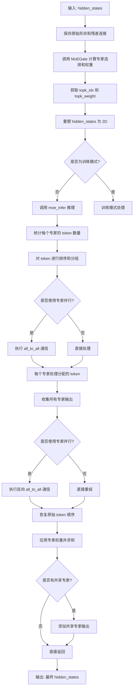

# DeepseekV3MoE Forward 函数详细分析

## 1. 流程图



## 2. 原理总结

### 2.1 MoE (Mixture of Experts) 核心思想
- **专家路由**: 每个 token 通过门控网络选择最相关的专家
- **并行计算**: 多个专家可以并行处理不同的 token
- **稀疏激活**: 每个 token 只激活少数几个专家，提高计算效率

### 2.2 DeepseekV3MoE 的关键特性

#### 2.2.1 专家选择机制
- **Top-K 选择**: 每个 token 选择 top-k 个专家 (k=2)
- **分组选择**: 使用 `noaux_tc` 方法，先选择专家组，再在组内选择专家
- **权重归一化**: 确保选择的专家权重和为1

#### 2.2.2 专家并行支持
- **分布式专家**: 支持将专家分布在不同设备上
- **通信优化**: 使用 `all_to_all` 进行高效的 token 重分布
- **负载均衡**: 自动平衡各设备的计算负载

#### 2.2.3 共享专家
- **额外专家**: 除了路由专家外，还有共享专家处理所有 token
- **残差连接**: 共享专家输出与路由专家输出相加

### 2.3 计算流程详解

#### 阶段1: 专家路由
1. **门控计算**: `MoEGate` 计算每个 token 对每个专家的偏好分数
2. **专家选择**: 选择 top-k 个专家及其对应权重
3. **权重归一化**: 确保权重和为1，并应用缩放因子

#### 阶段2: Token 重分布
1. **统计分配**: 统计每个专家需要处理的 token 数量
2. **排序分组**: 将 token 按专家ID排序，便于批量处理
3. **并行通信**: 如果使用专家并行，执行 `all_to_all` 通信

#### 阶段3: 专家计算
1. **批量处理**: 每个专家批量处理分配给它的 token
2. **并行执行**: 多个专家可以并行计算

#### 阶段4: 结果聚合
1. **收集输出**: 收集所有专家的输出结果
2. **恢复顺序**: 将结果恢复到原始 token 顺序
3. **权重应用**: 应用专家权重并求和
4. **共享专家**: 添加共享专家的输出

## 3. 实例代码

```python
import torch
import torch.nn as nn
import numpy as np
from typing import Dict, Any

class MockDeepseekV3Config:
    """模拟 DeepseekV3 配置"""
    def __init__(self):
        self.hidden_size = 512
        self.n_routed_experts = 8
        self.num_experts_per_tok = 2
        self.moe_intermediate_size = 1024
        self.n_shared_experts = 1
        self.routed_scaling_factor = 1.0
        self.scoring_func = "sigmoid"
        self.topk_method = "noaux_tc"
        self.n_group = 2
        self.topk_group = 1
        self.norm_topk_prob = True
        self.ep_size = 1  # 不使用专家并行

class MockDeepseekV3MLP(nn.Module):
    """模拟 MLP 专家"""
    def __init__(self, config, expert_id):
        super().__init__()
        self.expert_id = expert_id
        self.gate_proj = nn.Linear(config.hidden_size, config.moe_intermediate_size, bias=False)
        self.up_proj = nn.Linear(config.hidden_size, config.moe_intermediate_size, bias=False)
        self.down_proj = nn.Linear(config.moe_intermediate_size, config.hidden_size, bias=False)
        self.act_fn = nn.SiLU()
        
    def forward(self, x):
        print(f"    Expert {self.expert_id} 处理 {x.shape[0]} 个 token")
        down_proj = self.down_proj(self.act_fn(self.gate_proj(x)) * self.up_proj(x))
        return down_proj

class MockMoEGate(nn.Module):
    """模拟 MoE 门控网络"""
    def __init__(self, config):
        super().__init__()
        self.config = config
        self.top_k = config.num_experts_per_tok
        self.n_routed_experts = config.n_routed_experts
        self.routed_scaling_factor = config.routed_scaling_factor
        self.n_group = config.n_group
        self.topk_group = config.topk_group
        self.norm_topk_prob = config.norm_topk_prob
        
        # 初始化门控权重
        self.weight = nn.Parameter(torch.randn(self.n_routed_experts, config.hidden_size))
        self.e_score_correction_bias = nn.Parameter(torch.randn(self.n_routed_experts))
        
    def forward(self, hidden_states):
        bsz, seq_len, h = hidden_states.shape
        print(f"  MoEGate 输入形状: {hidden_states.shape}")
        
        # 计算门控分数
        hidden_states_flat = hidden_states.view(-1, h)
        logits = torch.matmul(hidden_states_flat, self.weight.t())
        scores = torch.sigmoid(logits)
        
        print(f"  门控分数形状: {scores.shape}")
        print(f"  门控分数示例 (前3个token):\n{scores[:3]}")
        
        # 使用 noaux_tc 方法选择专家
        scores_for_choice = scores + self.e_score_correction_bias.unsqueeze(0)
        
        # 分组选择
        group_scores = (
            scores_for_choice.view(bsz * seq_len, self.n_group, -1)
            .topk(2, dim=-1)[0].sum(dim=-1)
        )
        group_idx = torch.topk(group_scores, k=self.topk_group, dim=-1, sorted=False)[1]
        
        # 创建组掩码
        group_mask = torch.zeros_like(group_scores)
        group_mask.scatter_(1, group_idx, 1)
        
        # 扩展到专家级别
        score_mask = (
            group_mask.unsqueeze(-1)
            .expand(bsz * seq_len, self.n_group, self.n_routed_experts // self.n_group)
            .reshape(bsz * seq_len, -1)
        )
        
        # 应用掩码并选择 top-k
        tmp_scores = scores_for_choice.masked_fill(~score_mask.bool(), float("-inf"))
        _, topk_idx = torch.topk(tmp_scores, k=self.top_k, dim=-1, sorted=False)
        topk_weight = scores.gather(1, topk_idx)
        
        # 权重归一化
        if self.top_k > 1 and self.norm_topk_prob:
            denominator = topk_weight.sum(dim=-1, keepdim=True) + 1e-20
            topk_weight = topk_weight / denominator
            
        topk_weight = topk_weight * self.routed_scaling_factor
        
        print(f"  选择的专家索引 (前3个token):\n{topk_idx[:3]}")
        print(f"  专家权重 (前3个token):\n{topk_weight[:3]}")
        
        return topk_idx, topk_weight

class MockDeepseekV3MoE(nn.Module):
    """模拟 DeepseekV3MoE"""
    def __init__(self, config):
        super().__init__()
        self.config = config
        self.num_experts_per_tok = config.num_experts_per_tok
        
        # 创建路由专家
        self.experts = nn.ModuleList([
            MockDeepseekV3MLP(config, i) for i in range(config.n_routed_experts)
        ])
        
        # 创建门控网络
        self.gate = MockMoEGate(config)
        
        # 创建共享专家
        if config.n_shared_experts is not None:
            self.shared_experts = MockDeepseekV3MLP(config, "shared")
        
    def forward(self, hidden_states):
        print(f"\n=== DeepseekV3MoE Forward 开始 ===")
        print(f"输入形状: {hidden_states.shape}")
        
        # 保存原始形状和残差连接
        identity = hidden_states
        orig_shape = hidden_states.shape
        
        # 专家路由
        print(f"\n1. 专家路由阶段:")
        topk_idx, topk_weight = self.gate(hidden_states)
        
        # 重塑输入
        hidden_states = hidden_states.view(-1, hidden_states.shape[-1])
        print(f"\n2. 重塑输入形状: {hidden_states.shape}")
        
        # 推理模式处理
        if not self.training:
            print(f"\n3. 推理模式处理:")
            y = self.moe_infer(hidden_states, topk_idx, topk_weight).view(*orig_shape)
        
        # 添加共享专家
        if hasattr(self, 'shared_experts'):
            print(f"\n4. 添加共享专家:")
            print(f"  共享专家处理所有 {identity.shape[0]} 个 token")
            y = y + self.shared_experts(identity)
        
        print(f"\n=== DeepseekV3MoE Forward 结束 ===")
        print(f"输出形状: {y.shape}")
        return y
    
    @torch.no_grad()
    def moe_infer(self, x, topk_ids, topk_weight):
        print(f"  moe_infer 开始:")
        print(f"  输入 x 形状: {x.shape}")
        print(f"  topk_ids 形状: {topk_ids.shape}")
        print(f"  topk_weight 形状: {topk_weight.shape}")
        
        # 统计每个专家的 token 数量
        cnts = topk_ids.new_zeros((topk_ids.shape[0], len(self.experts)))
        cnts.scatter_(1, topk_ids, 1)
        tokens_per_expert = cnts.sum(dim=0)
        
        print(f"  每个专家的 token 数量: {tokens_per_expert}")
        
        # 对 token 进行排序
        idxs = topk_ids.view(-1).argsort()
        sorted_tokens = x[idxs // topk_ids.shape[1]]
        sorted_tokens_shape = sorted_tokens.shape
        
        print(f"  排序后的 token 形状: {sorted_tokens.shape}")
        
        # 转换为 numpy 数组
        tokens_per_expert = tokens_per_expert.cpu().numpy()
        
        # 每个专家处理分配的 token
        print(f"\n  专家处理阶段:")
        outputs = []
        start_idx = 0
        
        for i, num_tokens in enumerate(tokens_per_expert):
            end_idx = start_idx + num_tokens
            if num_tokens == 0:
                continue
                
            expert = self.experts[i]
            tokens_for_this_expert = sorted_tokens[start_idx:end_idx]
            expert_out = expert(tokens_for_this_expert)
            outputs.append(expert_out)
            start_idx = end_idx
        
        # 收集所有输出
        outs = torch.cat(outputs, dim=0) if len(outputs) else sorted_tokens.new_empty(0)
        print(f"  收集的输出形状: {outs.shape}")
        
        # 恢复原始顺序
        new_x = torch.empty_like(outs)
        new_x[idxs] = outs
        
        # 应用权重并求和
        final_out = (
            new_x.view(*topk_ids.shape, -1)
            .type(topk_weight.dtype)
            .mul_(topk_weight.unsqueeze(dim=-1))
            .sum(dim=1)
            .type(new_x.dtype)
        )
        
        print(f"  最终输出形状: {final_out.shape}")
        return final_out

def demo_deepseek_moe():
    """演示 DeepseekV3MoE 的使用"""
    print("=== DeepseekV3MoE 演示 ===\n")
    
    # 创建配置
    config = MockDeepseekV3Config()
    
    # 创建 MoE 模块
    moe = MockDeepseekV3MoE(config)
    
    # 创建输入数据
    batch_size, seq_len, hidden_size = 2, 4, config.hidden_size
    hidden_states = torch.randn(batch_size, seq_len, hidden_size)
    
    print(f"输入数据形状: {hidden_states.shape}")
    print(f"输入数据示例 (第一个token):\n{hidden_states[0, 0, :10]}")  # 显示前10个维度
    
    # 前向传播
    with torch.no_grad():
        output = moe(hidden_states)
    
    print(f"\n输出数据形状: {output.shape}")
    print(f"输出数据示例 (第一个token):\n{output[0, 0, :10]}")  # 显示前10个维度
    
    # 验证形状一致性
    assert output.shape == hidden_states.shape, f"输出形状 {output.shape} 与输入形状 {hidden_states.shape} 不匹配"
    print(f"\n✅ 形状验证通过!")
    
    return output

if __name__ == "__main__":
    # 运行演示
    output = demo_deepseek_moe()
```

## 4. 关键特性总结

### 4.1 计算效率
- **稀疏激活**: 每个 token 只激活 2 个专家，而不是所有专家
- **并行处理**: 多个专家可以并行计算
- **负载均衡**: 通过专家并行实现计算负载的均衡分布

### 4.2 内存效率
- **专家分片**: 支持将专家分布在不同设备上
- **通信优化**: 使用高效的 `all_to_all` 通信模式
- **缓存友好**: 批量处理相同专家的 token

### 4.3 模型质量
- **专家专业化**: 不同专家可以学习不同的特征
- **共享知识**: 共享专家确保所有 token 都能获得基础处理
- **动态路由**: 根据输入内容动态选择最相关的专家

### 4.4 扩展性
- **专家数量**: 可以轻松增加专家数量
- **设备扩展**: 支持多设备专家并行
- **配置灵活**: 支持多种路由策略和并行模式
</rewritten_file> 