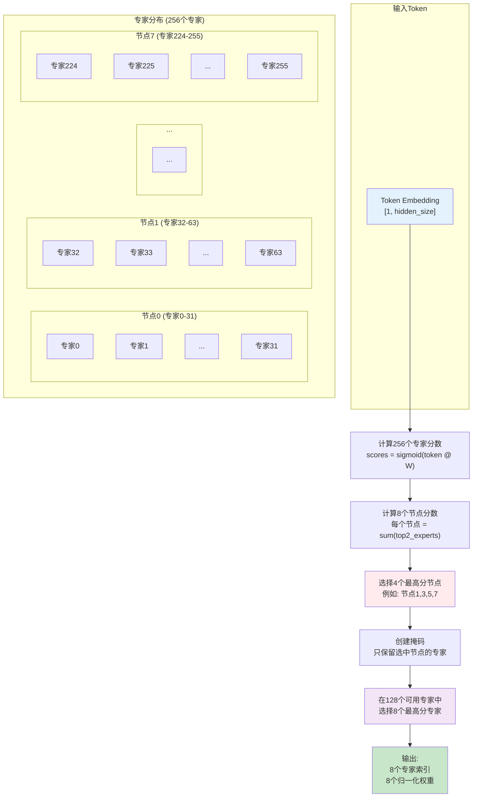
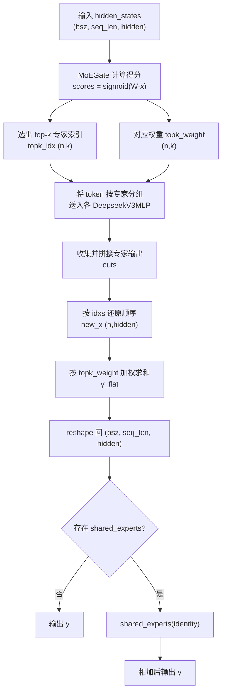

- [一 MoEGate 门控](#一-moegate-门控)
  - [1.1 MoEGate forward 函数流程拆解](#11-moegate-forward-函数流程拆解)
    - [1.1.1 输入处理阶段](#111-输入处理阶段)
    - [1.1.2 门控分数计算](#112-门控分数计算)
    - [1.1.3 无辅助损失负载均衡](#113-无辅助损失负载均衡)
    - [1.1.4 节点受限路由策略](#114-节点受限路由策略)
      - [步骤1：计算节点分数](#步骤1计算节点分数)
      - [步骤2：选择Top-K个节点](#步骤2选择top-k个节点)
      - [步骤3：创建专家掩码](#步骤3创建专家掩码)
    - [1.1.5 专家选择](#115-专家选择)
    - [1.1.6 权重归一化](#116-权重归一化)
  - [1.2 MoEGate Forward 函数流程图](#12-moegate-forward-函数流程图)
  - [1.3 MoEGate 类解析及测试](#13-moegate-类解析及测试)
- [二 DeepseekV3MoE](#二-deepseekv3moe)
  - [2.1 moe\_infer 函数流程拆解](#21-moe_infer-函数流程拆解)
  - [2.2 DeepseekV3MoE 核心函数流程图](#22-deepseekv3moe-核心函数流程图)
  - [2.3 DeepseekV3MoE 类解析及测试](#23-deepseekv3moe-类解析及测试)

## 一 MoEGate 门控

MoEGate 是 DeepSeek-V3 中混合专家（MoE）架构的门控机制核心组件，负责**为每个 token 动态选择合适的专家进行处理**。其主要创新点包括：

1. **无辅助损失的负载均衡策略**：通过可学习的偏置项实现负载均衡，避免传统辅助损失对模型性能的负面影响
2. **节点受限路由**：每个token最多路由到4个节点，大幅降低跨节点通信开销
3. **无token丢弃机制**：确保所有token都能被处理，提高模型稳定性

### 1.1 MoEGate forward 函数流程拆解

#### 1.1.1 输入处理阶段

```python
# 输入: hidden_states [batch_size, seq_len, hidden_size]
# 重塑为二维张量便于矩阵运算
hidden_states = hidden_states.view(-1, h)  # [batch_size * seq_len, hidden_size]
```

#### 1.1.2 门控分数计算

```python
# 线性变换：计算每个token对每个专家的原始亲和度
logits = F.linear(hidden_states, self.weight)  # [batch_size * seq_len, n_routed_experts]

# Sigmoid激活：将分数归一化到[0,1]区间
scores = logits.sigmoid()
```

**原理解析**：
- `self.weight`是一个`[n_routed_experts, hidden_size]`的可学习参数矩阵
- 每一行代表一个专家的"偏好向量"
- 通过内积计算 `token` 与专家的匹配度

#### 1.1.3 无辅助损失负载均衡

```python
# 添加专家分数修正偏置
scores_for_choice = scores + self.e_score_correction_bias.unsqueeze(0)
```

**创新点**：
- 传统MoE使用辅助损失函数强制负载均衡，但会干扰主任务优化
- DeepSeek-V3通过可学习的偏置项 `e_score_correction_bias` 调整专家选择概率
- 该偏置在推理时固定，实现稳定的负载均衡

#### 1.1.4 节点受限路由策略

这是 DeepSeek-V3 的核心创新之一，分为以下步骤：

##### 步骤1：计算节点分数
```python
# 将专家按节点分组
group_scores = scores_for_choice.view(bsz * seq_len, self.n_group, -1)
                                .topk(2, dim=-1)[0]  # 每组选top-2
                                .sum(dim=-1)         # 求和得到节点分数
```

**原理**：
- 假设有 256 个专家分布在 8 个节点上，每个节点 32 个专家
- 每个节点的分数 = 该节点上**最高 2 个专家分数之和**
- 这种设计确保选择的是"强专家集中"的节点

##### 步骤2：选择Top-K个节点

```python
# 选择分数最高的4个节点
group_idx = torch.topk(group_scores, k=self.topk_group, dim=-1)[1]
```

**通信优化考虑**：
- 限制每个 `token` 最多访问 `4` 个节点
- 相比全局选择，大幅减少跨节点 `All-to-All` 通信量

##### 步骤3：创建专家掩码

```python
# 创建节点掩码
group_mask = torch.zeros_like(group_scores)
group_mask.scatter_(1, group_idx, 1)

# 扩展到专家级别的掩码
score_mask = group_mask.unsqueeze(-1)
                      .expand(bsz * seq_len, self.n_group, experts_per_group)
                      .reshape(bsz * seq_len, -1)
```

#### 1.1.5 专家选择

```python
# 屏蔽未选中节点的专家
tmp_scores = scores_for_choice.masked_fill(~score_mask.bool(), float("-inf"))

# 在可用专家中选择top-8
_, topk_idx = torch.topk(tmp_scores, k=self.top_k, dim=-1, sorted=False)
topk_weight = scores.gather(1, topk_idx)
```

**设计巧思**：
- 使用 `-inf` 屏蔽确保只从选中的节点中选择专家
- `gather` 操作获取原始 scores（未加偏置），保证权重的真实性

#### 1.1.6 权重归一化

```python
# 归一化使权重和为1
if self.top_k > 1 and self.norm_topk_prob:
    denominator = topk_weight.sum(dim=-1, keepdim=True) + 1e-20
    topk_weight = topk_weight / denominator

# 应用缩放因子
topk_weight = topk_weight * self.routed_scaling_factor
```

**目的**：
- 确保多个专家的贡献权重和为 $1$，保持输出稳定
- 缩放因子允许灵活调整 `MoE` 层的整体贡献度

### 1.2 MoEGate Forward 函数流程图

下图展示了 MoEGate forward 函数的完整执行流程，从输入到输出的 15 个关键步骤。


下图直观展示了 256 个专家如何分布在 8 个节点上，以及 token 如何通过节点受限策略选择专家。



### 1.3 MoEGate 类解析及测试

带注释的 `MoEGate` 类代码如下所示:

```python
class MoEGate(nn.Module):
    """
    DeepSeek-V3 MoE门控机制实现
    
    核心功能:
    1. 计算每个token对每个专家的亲和度分数
    2. 基于节点受限路由策略选择top-k专家
    3. 实现无辅助损失的负载均衡
    
    主要创新:
    - 无辅助损失负载均衡策略
    - 节点受限路由(每个token最多路由到4个节点)
    - 无token丢弃机制
    """
    
    def __init__(self, config):
        """
        初始化MoE门控模块
        
        Args:
            config: 配置对象，包含以下关键参数:
                - num_experts_per_tok: 每个token路由到的专家数量 (默认8)
                - n_routed_experts: 总专家数量 (默认64)
                - routed_scaling_factor: 路由缩放因子 (默认1.0)
                - scoring_func: 评分函数类型 ("sigmoid")
                - topk_method: top-k选择方法 ("noaux_tc")
                - n_group: 专家分组数量 (默认16)
                - topk_group: 每个token最多路由到的节点数 (默认4)
                - norm_topk_prob: 是否归一化top-k概率
                - hidden_size: 隐藏层维度
        """
        super().__init__()
        self.config = config
        
        # 核心参数
        self.top_k = config.num_experts_per_tok  # 每个token选择的专家数: 8
        self.n_routed_experts = config.n_routed_experts  # 总专家数: 64
        self.routed_scaling_factor = config.routed_scaling_factor  # 路由缩放因子
        self.scoring_func = config.scoring_func  # 评分函数: "sigmoid"
        self.topk_method = config.topk_method  # top-k方法: "noaux_tc"
        self.n_group = config.n_group  # 专家分组数: 16
        self.topk_group = config.topk_group  # 最多路由节点数: 4
        
        # 算法参数
        self.norm_topk_prob = config.norm_topk_prob  # 是否归一化概率
        self.gating_dim = config.hidden_size  # 门控维度
        
        # 门控权重矩阵: [n_routed_experts, hidden_size]
        # 用于计算每个token对每个专家的亲和度分数
        self.weight = nn.Parameter(
            torch.empty((self.n_routed_experts, self.gating_dim))
        )
        
        # 专家分数修正偏置 (仅用于noaux_tc方法)
        # 用于实现无辅助损失的负载均衡
        if self.topk_method == "noaux_tc":
            self.e_score_correction_bias = nn.Parameter(
                torch.empty((self.n_routed_experts))
            )
        
        # 初始化参数
        self.reset_parameters()
        
        print(f"🔧 MoE门控初始化完成:")
        print(f"   - 总专家数: {self.n_routed_experts}")
        print(f"   - 每个token选择专家数: {self.top_k}")
        print(f"   - 专家分组数: {self.n_group}")
        print(f"   - 最多路由节点数: {self.topk_group}")
        print(f"   - 门控维度: {self.gating_dim}")

    def reset_parameters(self) -> None:
        """
        初始化模型参数
        
        使用Kaiming均匀初始化门控权重，确保训练稳定性
        """
        import torch.nn.init as init
        
        # Kaiming均匀初始化门控权重
        init.kaiming_uniform_(self.weight, a=math.sqrt(5))
        
        # 初始化专家分数修正偏置
        if self.topk_method == "noaux_tc":
            nn.init.zeros_(self.e_score_correction_bias)
        
        print("✅ 参数初始化完成")

    def forward(self, hidden_states: torch.Tensor) -> Tuple[torch.Tensor, torch.Tensor]:
        """
        前向传播: 计算路由决策
        
        Args:
            hidden_states: 输入隐藏状态 [batch_size, seq_len, hidden_size]
            
        Returns:
            topk_idx: 选择的专家索引 [batch_size * seq_len, top_k]
            topk_weight: 对应的权重 [batch_size * seq_len, top_k]
        """
        bsz, seq_len, h = hidden_states.shape
        
        print(f"\n🚀 MoE门控前向传播开始:")
        print(f"   - 输入形状: {hidden_states.shape}")
        print(f"   - 批次大小: {bsz}, 序列长度: {seq_len}, 隐藏维度: {h}")
        
        # ==================== 步骤1: 计算门控分数 ====================
        print(f"\n📊 步骤1: 计算门控分数")
        
        # 重塑输入: [batch_size, seq_len, hidden_size] -> [batch_size * seq_len, hidden_size]
        hidden_states = hidden_states.view(-1, h)
        print(f"   - 重塑后形状: {hidden_states.shape}")
        
        # 计算logits: [batch_size * seq_len, n_routed_experts]
        # 使用线性变换计算每个token对每个专家的亲和度
        logits = F.linear(
            hidden_states.type(torch.float32), 
            self.weight.type(torch.float32), 
            None
        )
        print(f"   - Logits形状: {logits.shape}")
        print(f"   - Logits统计: min={logits.min():.4f}, max={logits.max():.4f}, mean={logits.mean():.4f}")
        
        # 应用激活函数得到最终分数
        if self.scoring_func == "sigmoid":
            scores = logits.sigmoid()
        else:
            raise NotImplementedError(
                f"不支持的评分函数: {self.scoring_func}"
            )
        print(f"   - Sigmoid分数统计: min={scores.min():.4f}, max={scores.max():.4f}, mean={scores.mean():.4f}")
        
        # ==================== 步骤2: 选择top-k专家 ====================
        print(f"\n🎯 步骤2: 选择top-k专家 (方法: {self.topk_method})")
        
        if self.topk_method == "noaux_tc":
            # 确保在推理模式下运行
            assert not self.training, "noaux_tc方法仅支持推理模式"
            
            # 应用专家分数修正偏置 (负载均衡)
            scores_for_choice = scores.view(bsz * seq_len, -1) + self.e_score_correction_bias.unsqueeze(0)
            print(f"   - 修正后分数形状: {scores_for_choice.shape}")
            print(f"   - 修正偏置统计: min={self.e_score_correction_bias.min():.4f}, max={self.e_score_correction_bias.max():.4f}")
            
            # 计算每个节点的组分数
            # 将专家按节点分组，计算每个节点上最高K_r/M个专家的分数之和
            group_scores = (
                scores_for_choice.view(bsz * seq_len, self.n_group, -1)
                .topk(2, dim=-1)[0]  # 选择每个组内前2个最高分数
                .sum(dim=-1)  # 求和得到组分数
            )  # [batch_size * seq_len, n_group]
            print(f"   - 组分数形状: {group_scores.shape}")
            print(f"   - 组分数统计: min={group_scores.min():.4f}, max={group_scores.max():.4f}")
            
            # 选择top-k_group个节点
            group_idx = torch.topk(
                group_scores, k=self.topk_group, dim=-1, sorted=False
            )[1]  # [batch_size * seq_len, topk_group]
            print(f"   - 选择的节点索引形状: {group_idx.shape}")
            print(f"   - 节点索引范围: {group_idx.min()} - {group_idx.max()}")
            
            # 创建节点掩码
            group_mask = torch.zeros_like(group_scores)  # [batch_size * seq_len, n_group]
            group_mask.scatter_(1, group_idx, 1)  # 将选中的节点标记为1
            print(f"   - 节点掩码形状: {group_mask.shape}")
            print(f"   - 选中节点数: {group_mask.sum().item()}")
            
            # 创建专家掩码
            score_mask = (
                group_mask.unsqueeze(-1)
                .expand(
                    bsz * seq_len, self.n_group, self.n_routed_experts // self.n_group
                )
                .reshape(bsz * seq_len, -1)
            )  # [batch_size * seq_len, n_routed_experts]
            print(f"   - 专家掩码形状: {score_mask.shape}")
            print(f"   - 可用专家数: {score_mask.sum().item()}")
            
            # 应用掩码，将未选中节点的专家分数设为负无穷
            tmp_scores = scores_for_choice.masked_fill(~score_mask.bool(), float("-inf"))
            print(f"   - 掩码后分数统计: min={tmp_scores.min():.4f}, max={tmp_scores.max():.4f}")
            
            # 选择top-k个专家
            _, topk_idx = torch.topk(
                tmp_scores, k=self.top_k, dim=-1, sorted=False
            )
            topk_weight = scores.gather(1, topk_idx)
            print(f"   - 选择的专家索引形状: {topk_idx.shape}")
            print(f"   - 专家权重形状: {topk_weight.shape}")
            
        else:
            raise NotImplementedError(
                f"不支持的TopK方法: {self.topk_method}"
            )
        
        # ==================== 步骤3: 权重归一化 ====================
        print(f"\n⚖️ 步骤3: 权重归一化")
        
        # 如果选择多个专家且需要归一化，则进行概率归一化
        if self.top_k > 1 and self.norm_topk_prob:
            denominator = topk_weight.sum(dim=-1, keepdim=True) + 1e-20
            topk_weight = topk_weight / denominator
            print(f"   - 归一化后权重统计: min={topk_weight.min():.4f}, max={topk_weight.max():.4f}")
        
        # 应用路由缩放因子
        topk_weight = topk_weight * self.routed_scaling_factor
        print(f"   - 缩放后权重统计: min={topk_weight.min():.4f}, max={topk_weight.max():.4f}")
        
        print(f"\n✅ MoE门控前向传播完成")
        print(f"   - 输出专家索引形状: {topk_idx.shape}")
        print(f"   - 输出权重形状: {topk_weight.shape}")
        
        return topk_idx, topk_weight

    def visualize_routing_process(self, hidden_states: torch.Tensor, save_path: str = "moe_routing.png"):
        """
        可视化MoE路由过程
        
        Args:
            hidden_states: 输入隐藏状态
            save_path: 保存路径
        """
        print(f"\n🎨 开始生成路由过程可视化...")
        
        # 获取路由结果
        with torch.no_grad():
            topk_idx, topk_weight = self.forward(hidden_states)
        
        # 创建图形
        fig, axes = plt.subplots(2, 2, figsize=(16, 12))
        fig.suptitle('DeepSeek-V3 MoE路由过程可视化', fontsize=16, fontweight='bold')
        
        # 1. 专家分布热力图
        ax1 = axes[0, 0]
        expert_usage = torch.zeros(self.n_routed_experts)
        for idx in topk_idx.flatten():
            expert_usage[idx] += 1
        
        sns.heatmap(
            expert_usage.view(self.n_group, -1).numpy(),
            ax=ax1,
            cmap='YlOrRd',
            annot=True,
            fmt='.0f',
            cbar_kws={'label': '使用次数'}
        )
        ax1.set_title('专家使用分布热力图')
        ax1.set_xlabel('组内专家索引')
        ax1.set_ylabel('节点组索引')
        
        # 2. 权重分布直方图
        ax2 = axes[0, 1]
        ax2.hist(topk_weight.flatten().numpy(), bins=30, alpha=0.7, color='skyblue', edgecolor='black')
        ax2.set_title('专家权重分布')
        ax2.set_xlabel('权重值')
        ax2.set_ylabel('频次')
        ax2.grid(True, alpha=0.3)
        
        # 3. 节点选择统计
        ax3 = axes[1, 0]
        bsz, seq_len, _ = hidden_states.shape
        n_tokens = bsz * seq_len
        
        # 计算每个token选择的节点分布
        with torch.no_grad():
            scores = F.linear(
                hidden_states.view(-1, self.gating_dim).type(torch.float32),
                self.weight.type(torch.float32),
                None
            ).sigmoid()
            
            scores_for_choice = scores + self.e_score_correction_bias.unsqueeze(0)
            group_scores = (
                scores_for_choice.view(n_tokens, self.n_group, -1)
                .topk(2, dim=-1)[0]
                .sum(dim=-1)
            )
            _, group_idx = torch.topk(group_scores, k=self.topk_group, dim=-1, sorted=False)
        
        # 统计每个节点被选择的次数
        node_usage = torch.zeros(self.n_group)
        for idx in group_idx.flatten():
            node_usage[idx] += 1
        
        bars = ax3.bar(range(self.n_group), node_usage.numpy(), color='lightgreen', alpha=0.7)
        ax3.set_title('节点选择统计')
        ax3.set_xlabel('节点索引')
        ax3.set_ylabel('被选择次数')
        ax3.set_xticks(range(self.n_group))
        
        # 添加数值标签
        for bar, value in zip(bars, node_usage.numpy()):
            ax3.text(bar.get_x() + bar.get_width()/2, bar.get_height() + 0.5,
                    f'{int(value)}', ha='center', va='bottom')
        
        # 4. 路由流程图
        ax4 = axes[1, 1]
        ax4.set_xlim(0, 10)
        ax4.set_ylim(0, 8)
        ax4.axis('off')
        
        # 绘制流程图
        steps = [
            ('输入\nHidden States', 1, 6, 'lightblue'),
            ('计算\n门控分数', 3, 6, 'lightyellow'),
            ('节点受限\n路由', 5, 6, 'lightgreen'),
            ('专家选择\nTop-K', 7, 6, 'lightcoral'),
            ('权重归一化', 9, 6, 'lightpink')
        ]
        
        for text, x, y, color in steps:
            rect = patches.Rectangle((x-0.5, y-0.5), 1, 1, linewidth=2, 
                                   edgecolor='black', facecolor=color, alpha=0.7)
            ax4.add_patch(rect)
            ax4.text(x, y, text, ha='center', va='center', fontsize=10, fontweight='bold')
        
        # 添加箭头
        for i in range(len(steps)-1):
            ax4.arrow(steps[i][1]+0.5, steps[i][2], 1, 0, head_width=0.1, 
                     head_length=0.1, fc='black', ec='black')
        
        ax4.set_title('MoE路由流程')
        
        plt.tight_layout()
        plt.savefig(save_path, dpi=300, bbox_inches='tight')
        print(f"✅ 可视化图表已保存到: {save_path}")
        plt.show()
```

测试代码的 MoE 配置是基于论文中的配置：

| 参数 | 值 | 说明 |
|------|-----|------|
| n_routed_experts | 256 | 总专家数 |
| num_experts_per_tok | 8 | 每个token选择的专家数 |
| n_group | 8 | 节点数（专家分组数） |
| topk_group | 4 | 每个token最多路由到的节点数 |
| experts_per_group | 32 | 每个节点上的专家数 |

测试代码如下所示:

```python
import torch
import torch.nn as nn
import torch.nn.functional as F
import math
import matplotlib.pyplot as plt
import matplotlib.patches as patches
import numpy as np
from typing import Tuple, Optional
import seaborn as sns

# 设置中文字体
plt.rcParams['font.sans-serif'] = ['SimHei', 'Arial Unicode MS', 'DejaVu Sans']
plt.rcParams['axes.unicode_minus'] = False

def create_moe_config():
    """
    创建MoE配置对象
    
    Returns:
        配置对象
    """
    class Config:
        def __init__(self):
            self.num_experts_per_tok = 8  # 每个token选择的专家数
            self.n_routed_experts = 256    # 总专家数
            self.routed_scaling_factor = 1.0  # 路由缩放因子
            self.scoring_func = "sigmoid"  # 评分函数
            self.topk_method = "noaux_tc"  # top-k方法
            self.n_group = 8  # 专家分组数 (节点数)
            self.topk_group = 4  # 每个token最多路由到的节点数
            self.norm_topk_prob = True  # 是否归一化概率
            self.hidden_size = 7168  # 隐藏层维度
    
    return Config()

def demo_moe_gate():
    """
    MoE门控机制演示函数
    """
    print("=" * 80)
    print("🚀 DeepSeek-V3 MoE门控机制演示")
    print("=" * 80)
    
    # 创建配置
    config = create_moe_config()
    print(f"📋 配置信息:")
    print(f"   - 总专家数: {config.n_routed_experts}")
    print(f"   - 每个token选择专家数: {config.num_experts_per_tok}")
    print(f"   - 专家分组数: {config.n_group}")
    print(f"   - 最多路由节点数: {config.topk_group}")
    print(f"   - 隐藏层维度: {config.hidden_size}")
    
    # 创建MoE门控模块
    moe_gate = MoEGate(config)
    print(f"\n🔧 MoE门控模块创建完成")
    
    # 创建示例输入
    batch_size = 4
    seq_len = 64
    hidden_size = config.hidden_size
    
    hidden_states = torch.randn(batch_size, seq_len, hidden_size)
    print(f"\n📥 示例输入:")
    print(f"   - 形状: {hidden_states.shape}")
    print(f"   - 数据类型: {hidden_states.dtype}")
    print(f"   - 数值范围: [{hidden_states.min():.4f}, {hidden_states.max():.4f}]")
    
    # 设置为推理模式
    moe_gate.eval()
    
    # 执行前向传播
    print(f"\n🔄 执行前向传播...")
    with torch.no_grad():
        topk_idx, topk_weight = moe_gate(hidden_states)
    
    # 分析结果
    print(f"\n📊 路由结果分析:")
    print(f"   - 选择的专家索引形状: {topk_idx.shape}")
    print(f"   - 专家权重形状: {topk_weight.shape}")
    
    # 统计专家使用情况
    expert_usage = torch.zeros(config.n_routed_experts)
    for idx in topk_idx.flatten():
        expert_usage[idx] += 1 # 4 * 64 * 8
    
    print(f"\n🎯 专家使用统计:")
    print(f"   - 被使用的专家数: {(expert_usage > 0).sum().item()}")
    print(f"   - 使用最多的专家: {expert_usage.argmax().item()} (使用{expert_usage.max().item()}次)")
    print(f"   - 使用最少的专家: {expert_usage.argmin().item()} (使用{expert_usage.min().item()}次)")
    
    # 统计权重分布
    print(f"\n⚖️ 权重分布统计:")
    print(f"   - 权重最小值: {topk_weight.min():.4f}")
    print(f"   - 权重最大值: {topk_weight.max():.4f}")
    print(f"   - 权重平均值: {topk_weight.mean():.4f}")
    print(f"   - 权重标准差: {topk_weight.std():.4f}")
    
    # 检查负载均衡
    print(f"\n⚖️ 负载均衡检查:")
    total_usage = expert_usage.sum()
    expected_usage = batch_size * seq_len * config.num_experts_per_tok
    print(f"   - 总专家使用次数: {total_usage}")
    print(f"   - 期望使用次数: {expected_usage}")
    print(f"   - 负载均衡度: {1 - abs(total_usage - expected_usage) / expected_usage:.4f}")
    
    # 生成可视化
    print(f"\n🎨 生成路由过程可视化...")
    moe_gate.visualize_routing_process(hidden_states, save_path="moe_routing_visualization.png")
    
    print(f"\n✅ 演示完成!")
    print("=" * 80)

if __name__ == "__main__":
    # 运行演示
    demo_moe_gate() 
```

测试代码运行后输出结果如下所示:

```bash
================================================================================
🚀 DeepSeek-V3 MoE门控机制演示
================================================================================
📋 配置信息:
   - 总专家数: 256
   - 每个token选择专家数: 8
   - 专家分组数: 8
   - 最多路由节点数: 4
   - 隐藏层维度: 7168
✅ 参数初始化完成
🔧 MoE门控初始化完成:
   - 总专家数: 256
   - 每个token选择专家数: 8
   - 专家分组数: 8
   - 最多路由节点数: 4
   - 门控维度: 7168

🔧 MoE门控模块创建完成

📥 示例输入:
   - 形状: torch.Size([4, 64, 7168])
   - 数据类型: torch.float32
   - 数值范围: [-4.9245, 4.7857]

🔄 执行前向传播...

🚀 MoE门控前向传播开始:
   - 输入形状: torch.Size([4, 64, 7168])
   - 批次大小: 4, 序列长度: 64, 隐藏维度: 7168

📊 步骤1: 计算门控分数
   - 重塑后形状: torch.Size([256, 7168])
   - Logits形状: torch.Size([256, 256])
   - Logits统计: min=-2.7834, max=2.2485, mean=0.0016
   - Sigmoid分数统计: min=0.0582, max=0.9045, mean=0.5004

🎯 步骤2: 选择top-k专家 (方法: noaux_tc)
   - 修正后分数形状: torch.Size([256, 256])
   - 修正偏置统计: min=0.0000, max=0.0000
   - 组分数形状: torch.Size([256, 8])
   - 组分数统计: min=1.2179, max=1.7676
   - 选择的节点索引形状: torch.Size([256, 4])
   - 节点索引范围: 0 - 7
   - 节点掩码形状: torch.Size([256, 8])
   - 选中节点数: 1024.0
   - 专家掩码形状: torch.Size([256, 256])
   - 可用专家数: 32768.0
   - 掩码后分数统计: min=-inf, max=0.9045
   - 选择的专家索引形状: torch.Size([256, 8])
   - 专家权重形状: torch.Size([256, 8])

⚖️ 步骤3: 权重归一化
   - 归一化后权重统计: min=0.1119, max=0.1445
   - 缩放后权重统计: min=0.1119, max=0.1445

✅ MoE门控前向传播完成
   - 输出专家索引形状: torch.Size([256, 8])
   - 输出权重形状: torch.Size([256, 8])

📊 路由结果分析:
   - 选择的专家索引形状: torch.Size([256, 8])
   - 专家权重形状: torch.Size([256, 8])

🎯 专家使用统计:
   - 被使用的专家数: 256
   - 使用最多的专家: 90 (使用18.0次)
   - 使用最少的专家: 23 (使用2.0次)

⚖️ 权重分布统计:
   - 权重最小值: 0.1119
   - 权重最大值: 0.1445
   - 权重平均值: 0.1250
   - 权重标准差: 0.0054

⚖️ 负载均衡检查:
   - 总专家使用次数: 2048.0
   - 期望使用次数: 2048
   - 负载均衡度: 1.0000

🎨 生成路由过程可视化...

🎨 开始生成路由过程可视化...

🚀 MoE门控前向传播开始:
   - 输入形状: torch.Size([4, 64, 7168])
   - 批次大小: 4, 序列长度: 64, 隐藏维度: 7168

📊 步骤1: 计算门控分数
   - 重塑后形状: torch.Size([256, 7168])
   - Logits形状: torch.Size([256, 256])
   - Logits统计: min=-2.7834, max=2.2485, mean=0.0016
   - Sigmoid分数统计: min=0.0582, max=0.9045, mean=0.5004

🎯 步骤2: 选择top-k专家 (方法: noaux_tc)
   - 修正后分数形状: torch.Size([256, 256])
   - 修正偏置统计: min=0.0000, max=0.0000
   - 组分数形状: torch.Size([256, 8])
   - 组分数统计: min=1.2179, max=1.7676
   - 选择的节点索引形状: torch.Size([256, 4])
   - 节点索引范围: 0 - 7
   - 节点掩码形状: torch.Size([256, 8])
   - 选中节点数: 1024.0
   - 专家掩码形状: torch.Size([256, 256])
   - 可用专家数: 32768.0
   - 掩码后分数统计: min=-inf, max=0.9045
   - 选择的专家索引形状: torch.Size([256, 8])
   - 专家权重形状: torch.Size([256, 8])

⚖️ 步骤3: 权重归一化
   - 归一化后权重统计: min=0.1119, max=0.1445
   - 缩放后权重统计: min=0.1119, max=0.1445

✅ MoE门控前向传播完成
   - 输出专家索引形状: torch.Size([256, 8])
   - 输出权重形状: torch.Size([256, 8])
✅ 可视化图表已保存到: moe_routing_visualization.png
```

节点数为8，代码生成的可视化图表如下图所示:


## 二 DeepseekV3MoE

DeepSeek-V3MoE 结合了 `MoEGate` 门控机制和多个专家网络 Experts。

核心组件：

1. **MoEGate**: 门控网络，负责计算 `token` 与专家的亲和度分数，并动态路由 `tokens` 到不同的专家网络进行处理。
2. **专家网络**: 多个 `DeepSeekV3MLP` 专家，每个专家处理特定的 `token` 子集
3. **共享专家**: 可选的共享专家，所有token都会经过
4. **专家并行**: 支持跨节点的专家并行计算

关键参数:

- `n_routed_experts`: 路由专家数量 (256)
- `num_experts_per_tok`: 每个 `token`选择的专家数 (8)
- `moe_intermediate_size`: 专家中间层维度 (2048)
- `n_shared_experts`: 共享专家数量 (1)
- `ep_size`: 专家并行大小，定义了设备组的大小（即每组包含多少设备）。如 ep_size = 2，即每组 2 个 GPU 负责所有专家。

### 2.1 moe_infer 函数流程拆解

### 2.2 DeepseekV3MoE 核心函数流程图

Forward 函数流程图如下所示：



moe_infer 函数流程图如下所示:


### 2.3 DeepseekV3MoE 类解析及测试

DeepseekV3MoE 类的核心代码注释如下所示:

```python
# 前向传播主流程
def forward(self, hidden_states):
    # 保存原始形状和输入
    identity = hidden_states
    orig_shape = hidden_states.shape
    
    # 通过门控网络获取路由决策
    topk_idx, topk_weight = self.gate(hidden_states)
    
    # 重塑输入为2D
    hidden_states = hidden_states.view(-1, hidden_states.shape[-1])
    flat_topk_idx = topk_idx.view(-1)
    
    # 推理模式使用优化的moe_infer
    if not self.training:
        y = self.moe_infer(hidden_states, topk_idx, topk_weight).view(*orig_shape)
    
    # 添加共享专家输出
    if self.config.n_shared_experts is not None:
        y = y + self.shared_experts(identity)
    
    return y

@torch.no_grad()
def moe_infer(self, x, topk_ids, topk_weight):
    """
    推理模式下的专家计算（优化版本）
    
    核心优化:
    1. 按专家分组处理token，减少内存访问
    2. 批量计算提高GPU利用率
    3. 避免重复计算
    """
    print(f"   - 推理模式专家计算开始")
    
    # 步骤1: 统计每个专家处理的token数量
    cnts = topk_ids.new_zeros((topk_ids.shape[0], len(self.experts)))
    cnts.scatter_(1, topk_ids, 1)
    tokens_per_expert = cnts.sum(dim=0)
    print(f"   - 每个专家处理的token数: {tokens_per_expert.tolist()}")
    print(f"   - 活跃专家数: {(tokens_per_expert > 0).sum().item()}")
    
    # 步骤2: 对token按专家ID排序
    idxs = topk_ids.view(-1).argsort()
    sorted_tokens = x[idxs // topk_ids.shape[1]]
    print(f"   - 排序后token形状: {sorted_tokens.shape}")
    
    ######################跳过专家并行代码##########################
    # 步骤3: 按专家分组处理
    outputs = []
    start_idx = 0
    
    for i, num_tokens in enumerate(tokens_per_expert):
        end_idx = start_idx + num_tokens
        if num_tokens == 0:
            continue
            
        # 获取当前专家
        expert = self.experts[i]
        tokens_for_this_expert = sorted_tokens[start_idx:end_idx]
        
        print(f"   - 专家{i}: 处理{num_tokens}个token")
        
        # 专家前向传播
        expert_out = expert(tokens_for_this_expert)
        outputs.append(expert_out)
        start_idx = end_idx
    
    # 步骤4: 合并所有专家输出
    if len(outputs) > 0:
        outs = torch.cat(outputs, dim=0)
    else:
        outs = sorted_tokens.new_empty(0)
    
    print(f"   - 合并后输出形状: {outs.shape}")
    
    # 步骤5: 恢复原始token顺序
    new_x = torch.empty_like(outs)
    new_x[idxs] = outs
    
    # 步骤6: 加权聚合
    final_out = (
        new_x.view(*topk_ids.shape, -1)
        .type(topk_weight.dtype)
        .mul_(topk_weight.unsqueeze(dim=-1))
        .sum(dim=1)
        .type(new_x.dtype)
    )
    
    print(f"   - 最终输出形状: {final_out.shape}")
    return final_out
```

测试代码如下所示:

```python
    def visualize_moe_process(self, hidden_states, save_path="moe_process_visualization.png"):
        """
        可视化MoE处理过程
        """
        print(f"\n🎨 开始生成MoE处理过程可视化...")
        
        # 获取MoE处理结果
        with torch.no_grad():
            output = self.forward(hidden_states)
            topk_idx, topk_weight = self.gate(hidden_states)
        
        # 创建图形
        fig, axes = plt.subplots(2, 2, figsize=(16, 12))
        fig.suptitle('DeepSeek-V3 MoE处理过程可视化', fontsize=16, fontweight='bold')
        
        # 1. 专家使用分布
        ax1 = axes[0, 0]
        expert_usage = torch.zeros(self.config.n_routed_experts)
        for idx in topk_idx.flatten():
            expert_usage[idx] += 1
        
        bars = ax1.bar(range(self.config.n_routed_experts), expert_usage.numpy(), 
                      alpha=0.7, color='skyblue', edgecolor='black')
        ax1.set_title('专家使用分布')
        ax1.set_xlabel('专家索引')
        ax1.set_ylabel('使用次数')
        ax1.set_xticks(range(0, self.config.n_routed_experts, 32))
        
        # 添加数值标签
        for i, bar in enumerate(bars):
            if expert_usage[i] > 0:
                ax1.text(bar.get_x() + bar.get_width()/2, bar.get_height() + 0.5,
                        f'{int(expert_usage[i])}', ha='center', va='bottom', fontsize=8)
        
        # 2. 权重分布热力图
        ax2 = axes[0, 1]
        sns.heatmap(topk_weight[:min(20, topk_weight.shape[0])].numpy(), 
                   ax=ax2, cmap='YlOrRd', cbar_kws={'label': '权重值'})
        ax2.set_title('Token-专家权重热力图 (前20个token)')
        ax2.set_xlabel('专家索引')
        ax2.set_ylabel('Token索引')
        
        # 3. 输入输出对比
        ax3 = axes[1, 0]
        bsz, seq_len, hidden_size = hidden_states.shape
        
        # 选择第一个token进行可视化
        input_token = hidden_states[0, 0].detach().numpy()
        output_token = output[0, 0].detach().numpy()
        
        x_pos = np.arange(min(50, hidden_size))
        ax3.plot(x_pos, input_token[:50], 'b-', alpha=0.7, label='输入', linewidth=2)
        ax3.plot(x_pos, output_token[:50], 'r-', alpha=0.7, label='输出', linewidth=2)
        ax3.set_title('Token向量对比 (前50维)')
        ax3.set_xlabel('隐藏维度')
        ax3.set_ylabel('数值')
        ax3.legend()
        ax3.grid(True, alpha=0.3)
        
        # 4. MoE处理流程图
        ax4 = axes[1, 1]
        ax4.set_xlim(0, 10)
        ax4.set_ylim(0, 8)
        ax4.axis('off')
        
        # 绘制流程图
        steps = [
            ('输入\nHidden States', 1, 6, 'lightblue'),
            ('门控网络\n路由决策', 3, 6, 'lightyellow'),
            ('专家并行\n计算', 5, 6, 'lightgreen'),
            ('加权聚合\n输出', 7, 6, 'lightcoral'),
            ('共享专家\n融合', 9, 6, 'lightpink')
        ]
        
        for text, x, y, color in steps:
            rect = patches.Rectangle((x-0.5, y-0.5), 1, 1, linewidth=2, 
                                   edgecolor='black', facecolor=color, alpha=0.7)
            ax4.add_patch(rect)
            ax4.text(x, y, text, ha='center', va='center', fontsize=10, fontweight='bold')
        
        # 添加箭头
        for i in range(len(steps)-1):
            ax4.arrow(steps[i][1]+0.5, steps[i][2], 1, 0, head_width=0.1, 
                     head_length=0.1, fc='black', ec='black')
        
        ax4.set_title('MoE处理流程')
        
        plt.tight_layout()
        plt.savefig(save_path, dpi=300, bbox_inches='tight')
        print(f"✅ 可视化图表已保存到: {save_path}")
        plt.show()

def create_moe_config():
    """
    创建MoE配置对象
    """
    class Config:
        def __init__(self):
            self.hidden_size = 7168  # 隐藏层维度
            self.intermediate_size = 18432  # 标准MLP中间层大小
            self.moe_intermediate_size = 2048  # MoE专家中间层大小
            self.n_routed_experts = 256  # 路由专家数量
            self.num_experts_per_tok = 8  # 每个token选择的专家数
            self.n_shared_experts = 1  # 共享专家数量
            self.norm_topk_prob = True  # 是否归一化top-k概率
    
    return Config()

def demo_deepseekv3_moe():
    """
    DeepSeek-V3 MoE模块演示函数
    """
    print("=" * 80)
    print("🚀 DeepSeek-V3 MoE模块演示")
    print("=" * 80)
    
    # 创建配置
    config = create_moe_config()
    print(f"📋 配置信息:")
    print(f"   - 隐藏层维度: {config.hidden_size}")
    print(f"   - 路由专家数: {config.n_routed_experts}")
    print(f"   - 每个token选择专家数: {config.num_experts_per_tok}")
    print(f"   - 专家中间层大小: {config.moe_intermediate_size}")
    print(f"   - 共享专家数: {config.n_shared_experts}")
    
    # 创建MoE模块
    moe_module = DeepseekV3MoE(config)
    print(f"\n🔧 MoE模块创建完成")
    
    # 创建示例输入
    batch_size = 2
    seq_len = 8
    hidden_size = config.hidden_size
    
    hidden_states = torch.randn(batch_size, seq_len, hidden_size)
    print(f"\n📥 示例输入:")
    print(f"   - 形状: {hidden_states.shape}")
    print(f"   - 数据类型: {hidden_states.dtype}")
    print(f"   - 数值范围: [{hidden_states.min():.4f}, {hidden_states.max():.4f}]")
    
    # 设置为推理模式
    moe_module.eval()
    
    # 执行前向传播
    print(f"\n🔄 执行MoE前向传播...")
    with torch.no_grad():
        output = moe_module(hidden_states)
    
    # 分析结果
    print(f"\n📊 MoE处理结果分析:")
    print(f"   - 输出形状: {output.shape}")
    print(f"   - 输出数值范围: [{output.min():.4f}, {output.max():.4f}]")
    print(f"   - 输入输出差异: {torch.abs(output - hidden_states).mean():.6f}")
    
    # 统计专家使用情况
    with torch.no_grad():
        topk_idx, topk_weight = moe_module.gate(hidden_states)
    
    expert_usage = torch.zeros(config.n_routed_experts)
    for idx in topk_idx.flatten():
        expert_usage[idx] += 1
    
    print(f"\n🎯 专家使用统计:")
    print(f"   - 被使用的专家数: {(expert_usage > 0).sum().item()}")
    print(f"   - 使用最多的专家: {expert_usage.argmax().item()} (使用{expert_usage.max().item()}次)")
    print(f"   - 使用最少的专家: {expert_usage.argmin().item()} (使用{expert_usage.min().item()}次)")
    print(f"   - 平均每个专家使用次数: {expert_usage.mean():.2f}")
    
    # 检查负载均衡
    print(f"\n⚖️ 负载均衡检查:")
    total_usage = expert_usage.sum()
    expected_usage = batch_size * seq_len * config.num_experts_per_tok
    print(f"   - 总专家使用次数: {total_usage}")
    print(f"   - 期望使用次数: {expected_usage}")
    print(f"   - 负载均衡度: {1 - abs(total_usage - expected_usage) / expected_usage:.4f}")
    
    # 生成可视化
    print(f"\n🎨 生成MoE处理过程可视化...")
    moe_module.visualize_moe_process(hidden_states, save_path="deepseekv3_moe_visualization.png")
    
    print(f"\n✅ 演示完成!")
    print("=" * 80)

if __name__ == "__main__":
    # 运行演示
    demo_deepseekv3_moe() 
```

测试代码运行后输出结果如下所示:

```bash
================================================================================
🚀 DeepSeek-V3 MoE模块演示
================================================================================
📋 配置信息:
   - 隐藏层维度: 7168
   - 路由专家数: 256
   - 每个token选择专家数: 8
   - 专家中间层大小: 2048
   - 共享专家数: 1
🚀 初始化DeepSeek-V3 MoE模块:
   - 总专家数: 256
   - 每个token选择专家数: 8
   - 专家中间层大小: 2048
   - 单GPU模式
🔧 创建MLP专家: hidden_size=7168, intermediate_size=2048
🔧 创建MLP专家: hidden_size=7168, intermediate_size=2048
🔧 创建MLP专家: hidden_size=7168, intermediate_size=2048
   ...
   - 共享专家中间层大小: 2048

🔧 MoE模块创建完成

📥 示例输入:
   - 形状: torch.Size([2, 8, 7168])
   - 数据类型: torch.float32
   - 数值范围: [-3.9982, 4.0675]

🔄 执行MoE前向传播...

🔄 DeepSeek-V3 MoE前向传播开始:
   - 输入形状: torch.Size([2, 8, 7168])

📊 步骤1: 门控网络计算路由决策
   - 专家索引形状: torch.Size([16, 8])
   - 专家权重形状: torch.Size([16, 8])
   - 第一个token选择的专家: [134, 142, 138, 137, 135, 129, 127, 0]
   - 第一个token的专家权重: [0.125, 0.125, 0.125, 0.125, 0.125, 0.125, 0.125, 0.125]
   - 重塑后输入形状: torch.Size([16, 7168])

🎯 步骤2: 推理模式专家计算
   - 推理模式专家计算开始
   - 每个专家处理的token数: [1, 0, 0, 0, 0, 0, 0, 0, 0, 0, 0, 0, 0, 0, 0, 0, 0, 0, 0, 0, 0, 0, 0, 0, 0, 0, 0, 0, 0, 0, 0, 0, 0, 0, 0, 0, 0, 0, 0, 0, 0, 0, 0, 0, 0, 0, 0, 0, 0, 0, 0, 0, 0, 0, 0, 0, 0, 0, 0, 0, 0, 0, 0, 0, 0, 0, 0, 0, 0, 0, 0, 0, 0, 0, 1, 1, 1, 0, 1, 2, 2, 2, 0, 1, 1, 3, 2, 3, 2, 1, 2, 2, 3, 1, 3, 1, 2, 3, 2, 0, 1, 1, 1, 1, 0, 0, 0, 1, 1, 2, 1, 1, 0, 0, 0, 0, 1, 0, 1, 1, 0, 0, 1, 2, 1, 1, 2, 2, 2, 3, 1, 1, 1, 2, 2, 3, 1, 2, 1, 1, 0, 1, 2, 1, 2, 0, 0, 0, 0, 1, 1, 0, 0, 0, 0, 0, 0, 0, 0, 0, 0, 1, 1, 1, 1, 1, 0, 1, 0, 1, 1, 1, 0, 1, 0, 0, 0, 0, 1, 1, 0, 1, 0, 0, 0, 1, 1, 2, 2, 1, 0, 1, 1, 0, 0, 0, 1, 1, 0, 0, 1, 2, 0, 2, 1, 1, 0, 0, 0, 0, 1, 0, 1, 0, 0, 1, 0, 0, 0, 0, 0, 0, 0, 0, 0, 0, 0, 0, 0, 0, 0, 0, 0, 0, 0, 0, 0, 0, 0, 0, 0, 0, 0, 0, 0, 0, 0, 0, 0, 0, 1, 0, 0, 0, 0, 0]
   - 活跃专家数: 91
   - 排序后token形状: torch.Size([128, 7168])
   - 专家0: 处理1个token
   - 专家74: 处理1个token
   ...
   - 专家79: 处理2个token
   - 专家80: 处理2个token
   - 专家81: 处理2个token
   - 专家83: 处理1个token
   - 专家84: 处理1个token
   - 专家85: 处理3个token
   - 专家86: 处理2个token
   - 专家87: 处理3个token
   - 专家88: 处理2个token
   - 专家89: 处理1个token
   ...
   - 专家250: 处理1个token
   - 合并后输出形状: torch.Size([128, 7168])
   - 最终输出形状: torch.Size([16, 7168])

🔗 步骤3: 添加共享专家输出
   - 共享专家输出形状: torch.Size([2, 8, 7168])

✅ MoE前向传播完成
   - 输出形状: torch.Size([2, 8, 7168])

📊 MoE处理结果分析:
   - 输出形状: torch.Size([2, 8, 7168])
   - 输出数值范围: [-0.5116, 0.5427]
   - 输入输出差异: 0.805103

🎯 专家使用统计:
   - 被使用的专家数: 91
   - 使用最多的专家: 85 (使用3.0次)
   - 使用最少的专家: 1 (使用0.0次)
   - 平均每个专家使用次数: 0.50

⚖️ 负载均衡检查:
   - 总专家使用次数: 128.0
   - 期望使用次数: 128
   - 负载均衡度: 1.0000

🎨 生成MoE处理过程可视化...

🎨 开始生成MoE处理过程可视化...

🔄 DeepSeek-V3 MoE前向传播开始:
   - 输入形状: torch.Size([2, 8, 7168])

📊 步骤1: 门控网络计算路由决策
   - 专家索引形状: torch.Size([16, 8])
   - 专家权重形状: torch.Size([16, 8])
   - 第一个token选择的专家: [134, 142, 138, 137, 135, 129, 127, 0]
   - 第一个token的专家权重: [0.125, 0.125, 0.125, 0.125, 0.125, 0.125, 0.125, 0.125]
   - 重塑后输入形状: torch.Size([16, 7168])

🎯 步骤2: 推理模式专家计算
   - 推理模式专家计算开始
   - 每个专家处理的token数: [1, 0, 0, 0, 0, 0, 0, 0, 0, 0, 0, 0, 0, 0, 0, 0, 0, 0, 0, 0, 0, 0, 0, 0, 0, 0, 0, 0, 0, 0, 0, 0, 0, 0, 0, 0, 0, 0, 0, 0, 0, 0, 0, 0, 0, 0, 0, 0, 0, 0, 0, 0, 0, 0, 0, 0, 0, 0, 0, 0, 0, 0, 0, 0, 0, 0, 0, 0, 0, 0, 0, 0, 0, 0, 1, 1, 1, 0, 1, 2, 2, 2, 0, 1, 1, 3, 2, 3, 2, 1, 2, 2, 3, 1, 3, 1, 2, 3, 2, 0, 1, 1, 1, 1, 0, 0, 0, 1, 1, 2, 1, 1, 0, 0, 0, 0, 1, 0, 1, 1, 0, 0, 1, 2, 1, 1, 2, 2, 2, 3, 1, 1, 1, 2, 2, 3, 1, 2, 1, 1, 0, 1, 2, 1, 2, 0, 0, 0, 0, 1, 1, 0, 0, 0, 0, 0, 0, 0, 0, 0, 0, 1, 1, 1, 1, 1, 0, 1, 0, 1, 1, 1, 0, 1, 0, 0, 0, 0, 1, 1, 0, 1, 0, 0, 0, 1, 1, 2, 2, 1, 0, 1, 1, 0, 0, 0, 1, 1, 0, 0, 1, 2, 0, 2, 1, 1, 0, 0, 0, 0, 1, 0, 1, 0, 0, 1, 0, 0, 0, 0, 0, 0, 0, 0, 0, 0, 0, 0, 0, 0, 0, 0, 0, 0, 0, 0, 0, 0, 0, 0, 0, 0, 0, 0, 0, 0, 0, 0, 0, 0, 1, 0, 0, 0, 0, 0]
   - 活跃专家数: 91
   - 排序后token形状: torch.Size([128, 7168])
   - 专家0: 处理1个token
   - 专家74: 处理1个token
   - 专家75: 处理1个token
   - 专家76: 处理1个token
   ....
   - 专家250: 处理1个token
   - 合并后输出形状: torch.Size([128, 7168])
   - 最终输出形状: torch.Size([16, 7168])

🔗 步骤3: 添加共享专家输出
   - 共享专家输出形状: torch.Size([2, 8, 7168])

✅ MoE前向传播完成
   - 输出形状: torch.Size([2, 8, 7168])
```

可视化结果如下所示:

