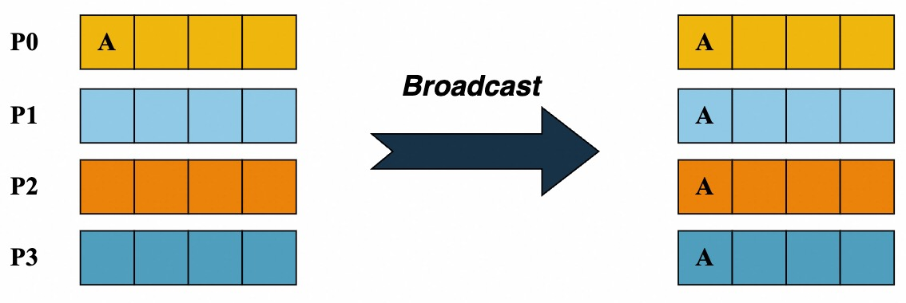
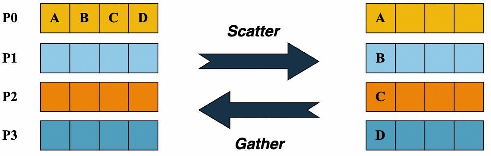
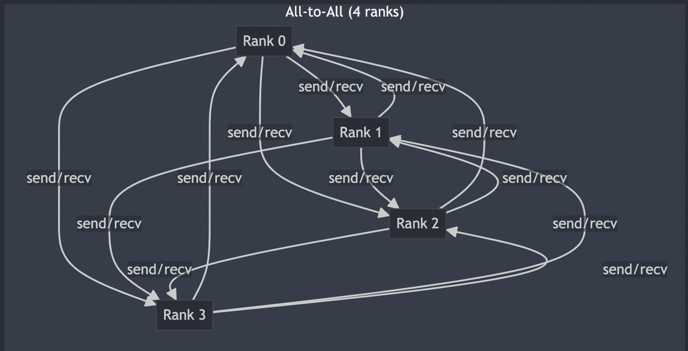

- [一 集合通信概述](#一-集合通信概述)
  - [1.1 p2p 和 mpi 概述](#11-p2p-和-mpi-概述)
  - [1.2 MPI 和 Torchrun](#12-mpi-和-torchrun)
    - [mpi4py 简单实例](#mpi4py-简单实例)
    - [torchrun 简单实例](#torchrun-简单实例)
- [二 mpi4py.MPI.Comm 类总结](#二-mpi4pympicomm-类总结)
  - [核心属性](#核心属性)
  - [主要实例方法（按功能归类）](#主要实例方法按功能归类)
- [三 Broadcast](#三-broadcast)
- [四 Scatter 和 Gather](#四-scatter-和-gather)
- [五 All-Gather 和 All-Reduce](#五-all-gather-和-all-reduce)
- [六 Alltoall](#六-alltoall)
- [参考资料](#参考资料)


## 一 集合通信概述

### 1.1 p2p 和 mpi 概述

`P2P` 是点对点通信，是消息传递系统的基础功能。`P2P` 支持**在进程对之间进行数据传输，一端发送，另一端接收**。

集合通信允许在组内**多个进程间同时传输数据**，即通信参与方是不止 $2$ 个。同时，集合通信还引入了同步点，所有代码在达到同步点后才能继续执行后续的代码。常见的集体通信操作如下：

1. 跨所有组成员的屏障同步，**这里的成员是指进程**。
2. 全局通信函数：
    - Broadcast（广播）： 将数据从一个成员广播至组内所有成员。
    - Gather（汇聚）：将数据从所有成员收集至组内某个成员。
    - Scatter（发散）：将数据从一个成员分散至组内所有成员。
3. 求和、求最大值、求最小值等全局规约操作。

### 1.2 MPI 和 Torchrun 

常见的分布式程序需要一个 launcher，例如 mpi、torchrun、ray 等，本文的实例代码使用 mpiexec 和 torchrun 两种。

MPI 是跨语言的并行计算标准，用于在分布式系统中协调多进程通信。在 PyTorch 分布式训练中可作为后端（如 gloo 或 mpi）。mpi4py 是 Python 的 MPI 软件包，为 Python 编程语言提供了 MPI 接口，使任何 Python 程序都能利用多处理器优势。该软件包基于 MPI 规范构建，提供了严格遵循 MPI-2 C++绑定的面向对象接口。

mpi4py 安装方式如下:

```bash
apt-get update && apt-get install mpich
mpirun --version

pip install mpi4py
pip install torch
```

#### mpi4py 简单实例

mpi4py 基本实例代码如下:

```python
# mpi_hello.py
from mpi4py import MPI

comm = MPI.COMM_WORLD
rank = comm.Get_rank()
size = comm.Get_size()

print(f"Hello from process {rank}/{size}")
```

运行命令:

```bash
mpiexec -n 4 python mpi_hello.py
```

输出实例：

```bash
Hello from process 0/4
Hello from process 1/4
Hello from process 2/4
Hello from process 3/4
```

#### torchrun 简单实例

torchrun 是 PyTorch 官方推荐的分布式训练启动工具（取代 torch.distributed.launch），自动处理进程初始化。基本命令格式如下:

```bash
torchrun \
    --nnodes={总节点数} \
    --nproc_per_node={每节点GPU数} \
    --node_rank={当前节点ID} \
    --master_addr={主节点IP} \
    --master_port={端口号} \
    YOUR_SCRIPT.py
```

torchrun 自动注入以下变量，无需手动设置：
- RANK：全局进程 ID
- WORLD_SIZE：总进程数
- LOCAL_RANK：当前节点内的进程 ID
- MASTER_ADDR：主节点 IP
- MASTER_PORT：主节点端口

下述代码是使用分布式数据并行（`DistributedDataParallel`，简称 `DDP`）进行简单训练的演示脚本，让每个进程都在单独的 `GPU` 上执行模型计算。

```python
import torch
import torch.distributed as dist
from torch.nn.parallel import DistributedDataParallel as DDP

def main():
    # 初始化分布式环境，并使用 NCCL 作为通信后端。
    dist.init_process_group(backend="nccl")
    rank = dist.get_rank()
    device = rank
    
    # 1. 验证数据是否相同
    data = torch.randn(20, 10).to(device)  # 每个进程独立生成随机数据
    print(f"Rank {rank}: Data mean={data.mean().item():.6f}, std={data.std().item():.6f}")
    
    # 2. 验证模型初始参数是否相同
    model = torch.nn.Linear(10, 10).to(device) # 各进程独立初始化
    print(f"Rank {rank}: Weight mean={model.weight.mean().item():.6f}")
    
    # 3. DDP包装后参数同步验证
    ddp_model = DDP(model, device_ids=[device]) # DDP同步参数
    print(f"Rank {rank}: DDP Weight mean={ddp_model.module.weight.mean().item():.6f}")
    
    # 4. 计算输出
    result = ddp_model(data)
    print(f"Rank {rank}: Output mean={result.mean().item():.6f}")

if __name__ == "__main__":
    main()
```

运行命令如下:

```bash
torchrun --nproc_per_node=2 train_torchrun.py
```

上述代码运行后输出结果如下所示:

```bash
[2025-06-28 16:29:17,453] torch.distributed.run: [WARNING] 
[2025-06-28 16:29:17,453] torch.distributed.run: [WARNING] *****************************************
[2025-06-28 16:29:17,453] torch.distributed.run: [WARNING] Setting OMP_NUM_THREADS environment variable for each process to be 1 in default, to avoid your system being overloaded, please further tune the variable for optimal performance in your application as needed. 
[2025-06-28 16:29:17,453] torch.distributed.run: [WARNING] *****************************************
Rank 1: Data mean=-0.012511, std=1.087953
Rank 1: Weight mean=-0.014889
Rank 0: Data mean=0.059724, std=0.959770
Rank 0: Weight mean=0.000033
Rank 1: DDP Weight mean=0.000033
Rank 0: DDP Weight mean=0.000033
Rank 1: Output mean=-0.065272
Rank 0: Output mean=0.049773
```

rank0 和 rank1 输出结果不同是因为 torch.randn **使用各进程各自的随机状态生成数据**，因为没有显式设置相同的随机种子，所以 rank 0 与 rank 1 产生的 data 自然内容不同。

DDP 的设计就是 “数据并行”：每个进程／GPU 负责一份不同的小批数据，前向结果不要求相同；它只在反向时通信梯度，保证各进程参数同步更新。实例代码中没有反向与优化步骤，只做一次前向打印，所以看到输出差异是正常的。

## 二 mpi4py.MPI.Comm 类总结

mpi4py.MPI.Comm 类是 MPI（Message Passing Interface）在 Python 中的核心通信器类，用于管理进程组间的通信上下文。MPI 所有点对点 / 集体通信均以 Comm 为起点调用。典型实例：
- `MPI.COMM_WORLD`：包含启动作业的全部进程
- `MPI.COMM_SELF`：仅包含自身
- 派生子通信域：由 Comm.Split、Comm.Create、Cartcomm、Graphcomm 等方法生成

### 核心属性

| 方法/属性      | 描述                          | 示例                     |
|---------------|-------------------------------|--------------------------|
| `Get_size()`  | 获取通信器(域)包含的进程总数      | `size = comm.Get_size()` |
| `Get_rank()`  | 获取当前进程在组内的排名(rank) | `rank = comm.Get_rank()` |
| `Get_group()` | 获取关联的进程组对象          | `group = comm.Get_group()` |
| `Get_name()`  | 获取通信器名称                | `name = comm.Get_name()` |


### 主要实例方法（按功能归类）

A) 点对点通信
- send(obj, dest, tag=0): 以标准模式发送。
- recv(source=MPI.ANY_SOURCE, tag=MPI.ANY_TAG, status=None)
- isend / irecv：立即返回 Request，可与 Wait/Test 配合
- sendrecv(sendobj, dest, sendtag, recvobj, source, recvtag, status=None)
- ssend / bsend：同步或缓冲发送

B) 集体通信

| 方法                                   | 描述                                   |
| -------------------------------------- | -------------------------------------- |
| `Bcast(buf[, root])`                   | 将数据从根进程广播至所有其他进程       |
| `Scatter(sendbuf, recvbuf[, root])`    | 根进程分发数据                         |
| `Gather(sendbuf, recvbuf[, root])`     | 将数据从所有进程收集到一个进程(根进程) |
| `Allgather(sendbuf, recvbuf)`          | 所有进程收集所有数据                   |
| `Reduce(sendbuf, recvbuf[, op, root])` | 归约操作到根进程                       |
| `Allreduce(sendbuf, recvbuf[, op])`    | 全归约操作（所有进程获结果）           |

## 三 Broadcast

`Broadcast` 广播将一个进程中的数据发送到所有其他进程。通常用于将一个进程的消息或数据复制到所有参与者。



Broadcast 操作的 mpi4py 实例代码：

```python
from mpi4py import MPI
import numpy as np

comm = MPI.COMM_WORLD
rank = comm.Get_rank()
size = comm.Get_size()

def demo_broadcast():
    """
    Broadcast：root 进程准备一份数据，把它广播给通信域内所有进程。
    """
    if rank == 0:
        data = {"msg": "Hello", "vec": np.arange(4)}
        print(f"[BCAST] Rank 0 初始化数据 -> {data}")
    else:
        data = None                 # 非 root 必须占位
    data = comm.bcast(data, root=0) # 广播
    print(f"[BCAST] Rank {rank} 收到数据 -> {data}")

if __name__ == "__main__":
    if rank == 0:
        print(f"=== 进程总数: {size} ===\n")

    comm.Barrier()   # 让所有进程同步后再开始演示
    if rank == 0: print("\n*** Broadcast 演示 ***")
    demo_broadcast()
```

## 四 Scatter 和 Gather

`Comm.Scatter` 和 `Comm.Gather` 是一组相对应的操作。

- `Comm.Scatter`: Scatter 将一个进程中的数据分发到多个进程中。源进程将数据分成多个部分，并将每部分发送到不同的目标进程。其他进程接收并存储各自的块。`Scatter` 操作适用于将一个较大的数据集分割成多个小块。
- `Comm.Gather` 与 `Comm.Scatter` 相反，其将多个进程中的数据汇聚到一个进程中。每个参与进程将其数据发送到指定的根进程，根进程将所有数据整合在一起。



Broadcast、Scatter、Gather 的运行实例代码如下所示：

```python
# comm_ops.py
from mpi4py import MPI
import numpy as np

comm = MPI.COMM_WORLD
rank = comm.Get_rank()
size = comm.Get_size()

def demo_broadcast():
    """
    Broadcast：root 进程准备一份数据，把它广播给通信域内所有进程。
    """
    if rank == 0:
        data = {"msg": "Hello", "vec": np.arange(4)}
        print(f"[BCAST] Rank 0 初始化数据 -> {data}")
    else:
        data = None                 # 非 root 必须占位
    data = comm.bcast(data, root=0) # 广播
    print(f"[BCAST] Rank {rank} 收到数据 -> {data}")

def demo_scatter():
    """
    Scatter：root 进程按进程数把一个可迭代对象切块，分别送到各进程。
    最终每个进程仅拿到自己的“那一块”。
    """
    if rank == 0:
        big_array = np.arange(size * 3, dtype='i')   # 举例：总长度 = 进程数 × 3
        chunks = np.split(big_array, size)           # 均匀切成 size 份
        print(f"[SCATTER] Rank 0 切割后 chunks = {chunks}")
    else:
        chunks = None
    local_arr = comm.scatter(chunks, root=0)  # 本进程获得一个形状 (3,) 的子数组
    print(f"[SCATTER] Rank {rank} 拿到 {local_arr}, 平均={local_arr.mean():.1f}")

def demo_gather(local_data):
    """
    Gather：把各进程局部结果收集到 root 进程，root 获得列表，其他进程得 None
    Allgather：所有进程都得到完整列表
    """
    gathered = comm.gather(local_data, root=0)
    if rank == 0:
        print(f"[GATHER] Root 收到来自所有进程的数据 -> {gathered}\n")

    gathered_all = comm.allgather(local_data)
    print(f"[ALLGATHER] Rank {rank} 收到完整数据列表 -> {gathered_all}")

if __name__ == "__main__":
    if rank == 0:
        print(f"\n=== 进程总数: {size} ===")

    comm.Barrier()
    if rank == 0: print("\n*** Broadcast 演示 ***")
    demo_broadcast()

    comm.Barrier()
    if rank == 0: print("\n*** Scatter + Gather 演示 ***")
    local = demo_scatter()

    comm.Barrier()
    demo_gather(local)
```

按下述命令运行代码:

```bash
mpiexec -np 4 --allow-run-as-root python mpi4py_bcast.py
```

运行后输出结果如下所示:

```bash
=== 进程总数: 4 ===

*** Broadcast 演示 ***
[BCAST] Rank 0 初始化数据 -> {'msg': 'Hello', 'vec': array([0, 1, 2, 3])}
[BCAST] Rank 0 收到数据 -> {'msg': 'Hello', 'vec': array([0, 1, 2, 3])}
[BCAST] Rank 1 收到数据 -> {'msg': 'Hello', 'vec': array([0, 1, 2, 3])}
[BCAST] Rank 2 收到数据 -> {'msg': 'Hello', 'vec': array([0, 1, 2, 3])}
[BCAST] Rank 3 收到数据 -> {'msg': 'Hello', 'vec': array([0, 1, 2, 3])}

*** Scatter + Gather 演示 ***
[SCATTER] Rank 0 切割后 chunks = [array([0, 1, 2], dtype=int32), array([3, 4, 5], dtype=int32), array([6, 7, 8], dtype=int32), array([ 9, 10, 11], dtype=int32)]
[SCATTER] Rank 1 拿到 [3 4 5], 平均=4.0
[SCATTER] Rank 0 拿到 [0 1 2], 平均=1.0
[SCATTER] Rank 3 拿到 [ 9 10 11], 平均=10.0
[SCATTER] Rank 2 拿到 [6 7 8], 平均=7.0
[GATHER] Root 收到来自所有进程的数据 -> [array([0, 1, 2], dtype=int32), array([3, 4, 5], dtype=int32), array([6, 7, 8], dtype=int32), array([ 9, 10, 11], dtype=int32)]

[ALLGATHER] Rank 0 收到完整数据列表 -> [array([0, 1, 2], dtype=int32), array([3, 4, 5], dtype=int32), array([6, 7, 8], dtype=int32), array([ 9, 10, 11], dtype=int32)]
[ALLGATHER] Rank 2 收到完整数据列表 -> [array([0, 1, 2], dtype=int32), array([3, 4, 5], dtype=int32), array([6, 7, 8], dtype=int32), array([ 9, 10, 11], dtype=int32)]
[ALLGATHER] Rank 3 收到完整数据列表 -> [array([0, 1, 2], dtype=int32), array([3, 4, 5], dtype=int32), array([6, 7, 8], dtype=int32), array([ 9, 10, 11], dtype=int32)]
[ALLGATHER] Rank 1 收到完整数据列表 -> [array([0, 1, 2], dtype=int32), array([3, 4, 5], dtype=int32), array([6, 7, 8], dtype=int32), array([ 9, 10, 11], dtype=int32)]
```

## 五 All-Gather 和 All-Reduce

**Comm.Allgather 是 Comm.Gather 的进阶版**。`All Gather` 操作是将所有进程中的数据汇聚到每个进程中。每个进程不仅接收来自根进程的数据，还接收来自其他所有进程的数据。


`Reduce` 操作将多个进程中的数据通过某种运算（如求和、取最大值等）整合成一个结果，并将该结果发送到一个指定的根进程。


`All Reduce` 操作是将所有进程中的数据进行归约运算，并将结果发送到所有进程。每个进程都能获得归约后的结果。


三者对比图如下所示:


三者实例代码如下所示:

```python
# collective_ops.py
from mpi4py import MPI
import numpy as np

comm = MPI.COMM_WORLD
rank, size = comm.Get_rank(), comm.Get_size()

def demo_allgather():
    """
    每个进程发出局部向量，所有进程都得到完整列表
    """
    local_vec = np.arange(rank*3, rank*3 + 3, dtype='i')  # eg Rank2->[6 7 8]
    gathered = comm.allgather(local_vec)
    print(f"[ALLGATHER] Rank {rank}: local={local_vec} → gathered={gathered}")

def demo_reduce():
    """
    将标量归约到 root；这里只做求和
    """
    local_val = (rank + 1) ** 2          # 1,4,9,16
    total = comm.reduce(local_val, op=MPI.SUM, root=0)
    if rank == 0:
        print(f"\n[REDUCE] 汇总结果 (sum) = {total}")  # 1+4+9+16=30

def demo_allreduce():
    """
    所有进程都同时得到归约值；这里做 max
    """
    local_val = (rank + 1) * 2           # 2,4,6,8
    global_max = comm.allreduce(local_val, op=MPI.MAX)
    print(f"[ALLREDUCE] Rank {rank}: local={local_val}, global_max={global_max}")

if __name__ == "__main__":
    if rank == 0:
        print(f"\n=== 进程总数: {size} ===\n")

    comm.Barrier();  demo_allgather()
    comm.Barrier();  demo_reduce()
    comm.Barrier();  demo_allreduce()
```

运行命令:

```bash
mpiexec -np 4 --allow-run-as-root python mpi4py_allreduce.py 
```

输出结果:

```bash
=== 进程总数: 4 ===

[ALLGATHER] Rank 0: local=[0 1 2] → gathered=[array([0, 1, 2], dtype=int32), array([3, 4, 5], dtype=int32), array([6, 7, 8], dtype=int32), array([ 9, 10, 11], dtype=int32)]
[ALLGATHER] Rank 2: local=[6 7 8] → gathered=[array([0, 1, 2], dtype=int32), array([3, 4, 5], dtype=int32), array([6, 7, 8], dtype=int32), array([ 9, 10, 11], dtype=int32)]
[ALLGATHER] Rank 1: local=[3 4 5] → gathered=[array([0, 1, 2], dtype=int32), array([3, 4, 5], dtype=int32), array([6, 7, 8], dtype=int32), array([ 9, 10, 11], dtype=int32)]
[ALLGATHER] Rank 3: local=[ 9 10 11] → gathered=[array([0, 1, 2], dtype=int32), array([3, 4, 5], dtype=int32), array([6, 7, 8], dtype=int32), array([ 9, 10, 11], dtype=int32)]

[REDUCE] 汇总结果 (sum) = 30
[ALLREDUCE] Rank 0: local=2, global_max=8
[ALLREDUCE] Rank 2: local=6, global_max=8
[ALLREDUCE] Rank 3: local=8, global_max=8
[ALLREDUCE] Rank 1: local=4, global_max=8
```

## 六 Alltoall

Comm.Alltoall 是 Comm.Scatter 和 Comm.Gather 的组合，先进行 Comm.Scatter，再进行 Comm.Gather。`Alltoall` 作用：每个进程向其他所有进程发送不同的数据块，同时从所有进程接收对应的数据块。其本质是全局数据重组（如矩阵转置）。

在 mpi4py 中，有以下三种类型的 Alltoall 集体通讯。
- comm.Alltoall(sendbuf, recvbuf)
- comm.Alltoallv(sendbuf, recvbuf)
- comm.Alltoallw(sendbuf, recvbuf)

comm.alltoall 方法将 task j 的中 sendbuf 的第 i 个对象拷贝到 task i 中 recvbuf 的第 j 个对象（接收者收到的对象和发送者一一对应，发送者发送的对象和接收者一一对应）。

下图可以表示这个发送过程。


从发送和接收的接收的角度来理解，4个 rank 的 alltoall 的可视化过程如下图:



实例代码:

```python
# alltoall_equal.py
from mpi4py import MPI
import numpy as np
comm = MPI.COMM_WORLD
rank, size = comm.Get_rank(), comm.Get_size()

# 准备发送缓冲区：一个二维数组 shape=(size, k)
k = 2
sendbuf = np.arange(rank*size*k, (rank+1)*size*k, dtype='i').reshape(size, k)
# 发送给自己的那一行可用作“自环”数据
print(f"Rank {rank} sendbuf=\n{sendbuf}")

# 预先分配接收同形数组
recvbuf = np.empty_like(sendbuf)
comm.Alltoall(sendbuf, recvbuf)

print(f"Rank {rank} recvbuf=\n{recvbuf}")
```

运行命令:

```bash
mpiexec -np 4 --allow-run-as-root python mpi4py_alltoall.py 
```

输出结果:

```bash
Rank 0 sendbuf=
[[0 1]
 [2 3]
 [4 5]
 [6 7]]
Rank 1 sendbuf=
[[ 8  9]
 [10 11]
 [12 13]
 [14 15]]
Rank 3 sendbuf=
[[24 25]
 [26 27]
 [28 29]
 [30 31]]
Rank 2 sendbuf=
[[16 17]
 [18 19]
 [20 21]
 [22 23]]
Rank 2 recvbuf=
[[ 4  5]
 [12 13]
 [20 21]
 [28 29]]
Rank 0 recvbuf=
[[ 0  1]
 [ 8  9]
 [16 17]
 [24 25]]
Rank 3 recvbuf=
[[ 6  7]
 [14 15]
 [22 23]
 [30 31]]
Rank 1 recvbuf=
[[ 2  3]
 [10 11]
 [18 19]
 [26 27]]
```

## 参考资料

- [集合通信入门](https://blog.niuhemoon.win/posts/tech/collective-communication-introduction/#broadcast)
- [11.4. 集合通信](https://scale-py.godaai.org/ch-mpi/collective.html)
- [使用Alltoall通讯](https://python-parallel-programmning-cookbook.readthedocs.io/zh-cn/latest/chapter3/17_Collective_communication_using_Alltoall.html)