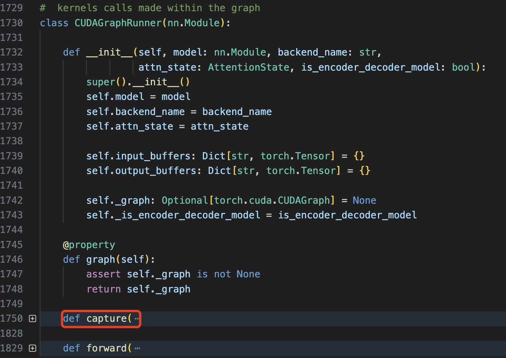

- [一 vllm 中的 cuda graph](#一-vllm-中的-cuda-graph)
  - [1.1 总结](#11-总结)
- [二 vllm 的 cuda graph 源码剖析](#二-vllm-的-cuda-graph-源码剖析)
- [三 cuda graph 原理](#三-cuda-graph-原理)
- [三 cuda graph 实践](#三-cuda-graph-实践)
- [参考资料](#参考资料)

## 一 vllm 中的 cuda graph

vllm 是 pythonic 的 llm 推理框架，在 cpu 进行 cuda kernel launch（启动）的 eager mode 时，其存在可较大的 kernel launch 开销，尤其是对于 batch较小/模型较小的情况，kernel 启动开销过大！由此，作者基于 torch 使用 cuda graph 来直接减少 kernel launch 的开销。

> 这里解释下 **cuda kernel launch，其实际是 CPU 向 GPU 发送指令的过程，即算子下发过程**！

CUDA Graph 是 NVIDIA 在 CUDA 10 中引入的一种新特性，旨在优化 GPU 上的任务提交和执行流程。通过将一系列 CUDA 操作（如内核启动、内存拷贝等）表示为**一个图结构**，并在 GPU 上执行该图，可以显著减少 CPU 与 GPU 之间的通信开销，提高整体性能。

因为 cuda graph 必须限制输入输出的的形状，而在 llm 推理中，prefill 阶段输入的 batch，seq_len，这两个维度都是动态变化的，因此 cuda graph 只能应用在 `decode` 阶段，同时需要提前预设一批 `batch`，针对每个不同 `batch` `capture` 不同的 `cuda graph`，运行时根据输入的 `batch` 找到匹配的 cuda_graph_runner 即可。当然，这也会带来一个问题，就是预设的 batch 数越多，使用 cuda graph 优化后带来的额外显存消耗也增加。

> 值得一提的是，如果想看作者实现的 cuda graph 的思路来源，可以参考文章 [Speed, Python: Pick Two. How CUDA Graphs Enable Fast Python Code for Deep Learning](https://fireworks.ai/blog/speed-python-pick-two-how-cuda-graphs-enable-fast-python-code-for-deep-learning) 和 llama 仓库代码 [ llama-cuda-graph-example-masked_attn](https://github.com/fw-ai/llama-cuda-graph-example/blob/masked_attn/llama/generation.py#L123)。

在代码实现上，主要是基于 `GPUModelRunnerBase`、`ModelRunner` 和 `CUDAGraphRunner` 两个类，github 完整代码在[这里](https://github.com/vllm-project/vllm/blob/main/vllm/worker/model_runner.py#L1730)，作者 commit 提交历史记录关键的 commit 在[这里](https://github.com/vllm-project/vllm/pull/1926/commits/87e565488aac528f6dd2161e9355d950fa74bfd1)。

### 1.1 总结

`cuda graph` 解决了可能存在的所有 CPU 开销的来源：**如用户编写的逻辑、PyTorch 调度逻辑、内存分配开销以及 GPU 驱动/内核开销**（静态图优势）。

## 二 vllm 的 cuda graph 源码剖析

下面是我针对 `vllm` 仓库上应用 cuda graph 的代码分析。

1，`ModelRunner` 类实际是对之前 `Model` 类的包装，封装了模型的前向传播逻辑，并管理与推理相关的资源。其中推理执行函数 `execute_model` 是核心，其负责接收输入数据，执行模型的前向传播，输出结果是 `sample` 采样后的结果，而不是模型推理结果 `logits`。`ModelRunner` 类的初始化如下所示：

```python
class ModelRunner(GPUModelRunnerBase[ModelInputForGPUWithSamplingMetadata]):
    """
    带有采样步骤的 GPU 模型运行器。

    继承自 GPUModelRunnerBase，使用 ModelInputForGPUWithSamplingMetadata 作为模型输入类型。
    """
    # 指定模型输入的类型
    _model_input_cls: Type[ModelInputForGPUWithSamplingMetadata] = ModelInputForGPUWithSamplingMetadata
    _builder_cls: Type = ModelInputForGPUBuilder  # 假设存在 ModelInputForGPUBuilder 类
```

`ModelRunner` 类的继承比较复杂，但这对于支持众多模型和推理模式的 vllm 来说是无可厚非的，如果是自己想要测试下 cuda graph，初始化很简单，只要如下所示：

```python
class ModelRunner():
    def __init__(self, model):
        self.model = model
        self.graph_runners = {}  # (int, CUDAGraphRunner)
```

`execute_model` 函数执行模型的前向传播和采样步骤，其中和 cuda graph 相关的代码如下所示:

```python
# 当前 CUDA 图仅支持解码阶段
assert model_input.attn_metadata is not None
prefill_meta = model_input.attn_metadata.prefill_metadata
decode_meta = model_input.attn_metadata.decode_metadata
# 如果需要 CUDA 图，并且没有填充元数据，使用预构建的模型执行器
virtual_engine = model_input.virtual_engine
if prefill_meta is None and decode_meta.use_cuda_graph:
	assert model_input.input_tokens is not None
	graph_batch_size = model_input.input_tokens.shape[0]
	model_executable = self.graph_runners[virtual_engine][graph_batch_size]
else:
	model_executable = self.model
```

其中 `prefill_metadata` 和 `decode_metadata` 都是一个抽象属性，需要在子类中实现此方法。代表的意义分别是指应返回预填充注意力阶段所需的元数据，和应返回解码注意力阶段所需的元数据。
> 在 vllm 中，实现了多种 “元数据” 用来描述注意力机制在预填充和解码阶段各方面的辅助信息。这些信息对于管理令牌的处理和存储至关重要，尤其是在处理多模态数据或需要精确控制令牌位置的复杂模型中，具体代码在 `vllm/attention/backends/abstract.py` 中。

到这里，还有一个问题就是 `self.graph_runners` 是在哪里完成初始化的，按照学习 cuda graph 的经验，`self.graph_runners` 一般是在 `capture_model` 函数中完成初始化。且以往简单模型推理场景我们习惯把 `capture_model` 函数定义在 `ModelRunner` 类中，但在 vllm 中，`capture_model` 是定义在 `GPUModelRunnerBase` 中。

2，`GPUModelRunnerBase` 类是一个**基类**，它提供了模型加载、初始化等核心功能，为子类如 `ModelRunner` 和 `CUDAGraphRunner` 提供了通用的操作接口。和 cuda graph 优化相关的是 `capture_model` 函数，其核心实现逻辑代码如下所示:

```python
# 代码有所省略
_BATCH_SIZE_ALIGNMENT = 8
_BATCH_SIZES_TO_CAPTURE = [1, 2, 4] + [_BATCH_SIZE_ALIGNMENT * i for i in range(1, 1025)

class GPUModelRunnerBase():
	def __init__():
		self.max_batchsize_to_capture = _get_max_graph_batch_size(self.scheduler_config.max_num_seqs)
		# 为了方便理解代码，去除了外层的 virtual_engine，直接以 batch_size 为键
        self.graph_runners: Dict[int, CUDAGraphRunner] = {}

	@torch.inference_mode()
	def capture_model(self, kv_caches: List[List[torch.Tensor]]) -> None:
		# 创建全零的输入标记张量，形状为 (max_batch_size,)
		input_tokens = torch.zeros(max_batch_size, dtype=torch.long).cuda()
		# 创建全零的输入位置张量，形状为 (max_batch_size,)
		input_positions = torch.zeros(max_batch_size, dtype=torch.long).cuda()
		# 获取要捕获的批量大小列表，确保批量大小不超过最大批量大小
		graph_batch_size = self.max_batchsize_to_capture
		batch_size_capture_list = [bs for bs in _BATCH_SIZES_TO_CAPTURE if bs <= graph_batch_size]
		
		# 使用注意力状态的图捕获上下文和通用的图捕获上下文
    	with self.attn_state.graph_capture(max_batch_size), graph_capture() as graph_capture_context:
			# 反向遍历批量大小列表，从大到小
            for batch_size in reversed(batch_size_capture_list):

				# 获取指定批量大小的注意力元数据
                attn_metadata = self.attn_state.graph_capture_get_metadata_for_batch(
                    batch_size,
                    is_encoder_decoder_model=self.model_config.is_encoder_decoder
                )
				# 创建 CUDA 图运行器
                graph_runner = CUDAGraphRunner(
                    self.model,
                    self.attn_backend.get_name(),
                    self.attn_state.graph_clone(batch_size),
                    self.model_config.is_encoder_decoder
                )
				# 准备捕获输入的字典
                capture_inputs = {
                    "input_ids": input_tokens[:batch_size],
                    "positions": input_positions[..., :batch_size],
                    "intermediate_inputs": intermediate_inputs[:batch_size] if intermediate_inputs is not None else None,
                    "kv_caches": kv_caches[virtual_engine],
                    "attn_metadata": attn_metadata,
                    "memory_pool": self.graph_memory_pool,
                    "stream": graph_capture_context.stream
                }

				# 在前向传播上下文中，捕获模型的执行过程
                with set_forward_context(attn_metadata):
                    graph_runner.capture(**capture_inputs)

                # 更新图内存池
                self.graph_memory_pool = graph_runner.graph.pool()
                # 将捕获的图运行器存储到 graph_runners 中
        		self.graph_runners[batch_size] = graph_runner
```

`SchedulerConfig` 是调度配置类，`max_num_seqs`  是 `SchedulerConfig` 类的初始化参数之一，表示单次迭代中可处理的最大序列数，可以理解为传统意义上的 `max_batch_size`。`batch_size_capture_list` 是一个 batch_size 列表，前三个元素是 1 2 4 后面的元素值间隔 8 并小于调度类中的 `max_num_seqs` 参数值。

`capture_model` 函数流程可总结如下:
1. 创建虚拟输入数据。
2. 确定要捕获的批量大小列表。
3. 开始 `CUDA Graph` 捕获上下文，并循环处理不同的批量大小，捕获 `CUDA Graph`:
   - 创建 `CUDA Graph Runner`：创建 CUDAGraphRunner 对象 `graph_runner`;
   - 准备用于捕获的输入：将之前创建的虚拟输入和其他必要的参数组合成一个字典 `capture_inputs`;
   - 捕获 CUDA Graph：在前向传播上下文中，使用 `graph_runner.capture(**capture_inputs)` 捕获模型的执行过程;
   - 存储捕获的 `CUDA Graph`: self.graph_runners[batch_size] = graph_runner。

3，`CUDAGraphRunner` 是 ModelRunner 的扩展类，目的是利用 CUDA 图（CUDA Graph）技术优化模型的推理执行。其包括三个函数 `__init__`、`capture` 和 `forward`，对应功能如下：

- 图(`graph`)实例化： 对捕获的 CUDA 图进行实例化，生成可执行的图实例。
- `CUDA` 图捕获： 将模型的前向传播过程捕获为 CUDA 图。
- 图执行： 在推理过程中，执行已实例化的 CUDA 图，提高执行效率。

<div align="center">

</div>

其中关键的 `capture` 函数看起来代码很多，但核心逻辑就是执行捕获 `graph` 和定义输入输出 `placeholder` 的操作，具体的精简版代码如下所示：

```python
# 省略了部分代码
def capture()：
	# Capture the graph.
	self._graph = torch.cuda.CUDAGraph()
	with torch.cuda.graph(self._graph, pool=memory_pool, stream=stream):
		output_hidden_or_intermediate_states = self.model(
			input_ids=input_ids,
			positions=positions,
			kv_caches=kv_caches,
			attn_metadata=attn_metadata,
			intermediate_tensors=intermediate_inputs,
			**kwargs,
		)
	# 定义 graph 输入 placeholder（输入数据比较复杂）
	self.input_buffers = {
		"input_ids": input_ids, "positions": positions，
		"kv_caches": kv_caches, 
		**self.attn_state.get_graph_input_buffers(attn_metadata, self._is_encoder_decoder_model),
        **kwargs,
        }
	# 定义 graph 输出 placeholder
	self.output_buffers = hidden_or_intermediate_states
```

## 三 cuda graph 原理

CUDA Graph 是 NVIDIA 引入的一项技术，旨在降低 CUDA 操作的 CPU 开销并优化 GPU 上的执行。其**核心原理**包括：

- 捕获操作序列：CUDA Graph 可以捕获一系列的 CUDA 操作（如内核调用、内存拷贝等）及其依赖关系，形成一个有向无环图（DAG）。
- 静态执行计划：一旦图被捕获，它就成为一个静态的执行计划，可以被多次复用，而无需每次都通过 CPU 重新调度各个操作。这减少了 CPU 与 GPU 之间的交互开销。
- 优化执行路径：CUDA Graph 允许更好地优化操作的调度顺序和资源分配，因为整个操作序列在图中是已知的。

CUDA Graph 实现的基本流程：

1. 创建图：在捕获模式下执行一系列 CUDA 操作，这些操作被记录到一个 CUDA Graph 中。
2. 实例化图：将捕获的图转换为一个可执行的图实例。
3. 执行图：多次执行已实例化的图，而不需要重新捕获或重新调度操作。

CUDA Graph 的性能优化的关键点在于：

1. **减少 kernel launch 导致的 CPU 开销**。CUDA 图允许将多个内核和操作捕获为一个图结构，之后可以一次性启动整个图，从而显著减少内核启动的开销。
2. **内存优化**：
    - **提前预分配内存**：在捕获图时，可以预先分配所需的内存，避免在执行时动态分配，减少内存管理的开销。
    - 优化数据传输：通过图的结构，可以更好地优化数据传输路径和时机，减少数据传输的瓶颈。
3. **提高 GPU 利用率**：
    - **减少 kernel 同步**：图内的操作依赖关系已经明确，减少了不必要的同步操作，提高了并行度。
    - 优化调度：由于整个操作序列在图中是已知的，CUDA Graph 可以更有效地调度内核和内存操作，减少 GPU 空闲时间。

## 三 cuda graph 实践

cuda graph 适用于具有固定计算图的模型，使用需要按照以下步骤进行：
1. 预热模型： 在捕获 CUDA 图之前，建议先运行几次模型，以确保所有 CUDA 内核已初始化并缓存。
2. **设置输入输出占位符**： 创建用于捕获的输入张量和输出张量的占位符。
3. 捕获 CUDA 图： 使用 torch.cuda.CUDAGraph 类捕获模型的前向传播过程。
4. 重放 CUDA 图： 在推理时，将新的输入数据复制到输入占位符中，然后重放捕获的 CUDA 图以获得输出。

基于 gpt2 模型的推理应用 cuda graph 优化的代码如下所示:

```python
import torch
import torch.nn as nn
from transformers import GPT2Tokenizer
from dataclasses import dataclass
import time

@dataclass
class ModelConfig:
    num_layers: int = 12
    embedding_dim: int = 768
    num_heads: int = 12
    vocab_size: int = 50257

class SimpleGPT2(nn.Module):
    def __init__(self, model_config: ModelConfig):
        super(SimpleGPT2, self).__init__()
        self.num_layers = model_config.num_layers
        self.embedding_dim = model_config.embedding_dim
        self.num_heads = model_config.num_heads
        self.vocab_size = model_config.vocab_size

        self.embed_layer = nn.Embedding(self.vocab_size, self.embedding_dim)
        self.transformer_blocks = nn.ModuleList([
            nn.TransformerEncoderLayer(d_model=self.embedding_dim, nhead=self.num_heads)
            for _ in range(self.num_layers)
        ])
        self.lm_head = nn.Linear(self.embedding_dim, self.vocab_size)

    def forward(self, x):
        h = self.embed_layer(x)
        for transformer_block in self.transformer_blocks:
            h = transformer_block(h)
        logits = self.lm_head(h)
        return logits

class CUDAGraphRunner:
    def __init__(self, model):
        self.model = model
        self.cuda_graph = None
        self.graph_input = None
        self.graph_output = None

    def capture(self, x):
        # 捕获 CUDA 图
        assert self.cuda_graph is None, "CUDA graph has already been captured."
        torch.cuda.synchronize()
        
        # 创建图的输入输出占位符
        self.graph_input = x.clone().detach().cuda()
        self.graph_output = torch.empty_like(self.model(self.graph_input))

        # 开始捕获 CUDA 图
        self.cuda_graph = torch.cuda.CUDAGraph()
        with torch.cuda.graph(self.cuda_graph):
            self.graph_output = self.model(self.graph_input)

        torch.cuda.synchronize()

    def forward(self, x):
        self.graph_input.copy_(x)
        self.cuda_graph.replay()
        return self.graph_output

    def __call__(self, *args, **kwargs):
        return self.forward(*args, **kwargs)

class ModelRunner:
    def __init__(self, model, seq_len=64):
        self.model = model
        self.seq_len = seq_len
        self.graph_runners = {}

    def capture_decode_graph(self):
        # 在 decode 阶段捕获 CUDA 图
        for batch in [1, 2, 4, 8, 16, 24, 32, 40, 48, 56, 64, 128]:  # 设置一些常用 batch size
            input = torch.randint(0, self.model.vocab_size, (batch, self.seq_len)).cuda()
            graph_runner = CUDAGraphRunner(self.model)
            graph_runner.capture(input)
            self.graph_runners[batch] = graph_runner

    def decode(self, x):
        batch_size = x.shape[0]
        if batch_size in self.graph_runners:
            model_executable = self.graph_runners[batch_size]
        else:
            print("Warning: CUDA graph not captured for this batch size, falling back to original model.")
            model_executable = self.model
        return model_executable(x)

# 主程序入口
if __name__ == "__main__":
    # 配置模型并构造
    config = ModelConfig()
    model = SimpleGPT2(config).cuda().eval()
    runner = ModelRunner(model, seq_len=6)
    runner.capture_decode_graph()

    # 测试用例输入
    tokenizer = GPT2Tokenizer.from_pretrained("gpt2")
    input_ids = torch.tensor(tokenizer.encode("Hello, how are you?", add_special_tokens=True)).unsqueeze(0).cuda()
    input_ids = input_ids.expand(128, -1)

    # 推理时间对比
    # 不使用 CUDA 图推理时间
    start = time.time()
    output_no_graph = model(input_ids)
    end = time.time()
    print(f"不使用 CUDA 图推理时间: {end - start:.4f} 秒")

    # 使用 CUDA 图推理时间
    start = time.time()
    output_with_graph = runner.decode(input_ids)
    end = time.time()
    print(f"使用 CUDA 图推理时间: {end - start:.4f} 秒")

    # 检查输出是否匹配
    torch.testing.assert_close(output_no_graph, output_with_graph, rtol=1e-03, atol=1e-03)
```

程序运行后输出结果如下所示:

```bash
不使用 CUDA 图推理时间: 0.0298 秒
使用 CUDA 图推理时间: 0.0007 秒
```

## 参考资料

- [浅谈cuda graph在llm推理中的应用](https://zhuanlan.zhihu.com/p/715863693)
