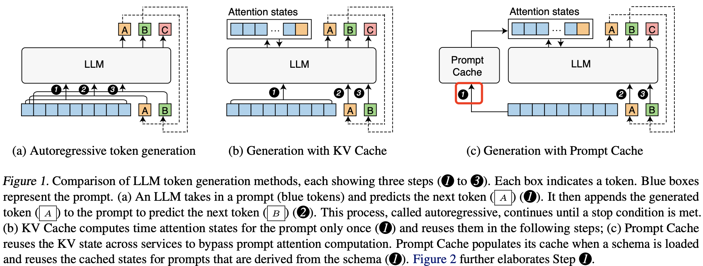

## 摘要

在 多轮对话、DocQA 和 RAG 客服系统场景下中，提示词会包含重复的文本段落，如系统消息、提示模板和用于上下文的文档，也就是说常见文本段的注意力状态（也就是 kv 缓冲向量）$\{(k_1,v_1), (k_2,v_2),..,(k_n,v_n)\}$ 是可以重复利用的。[Prompt Cache](https://arxiv.org/abs/2311.04934) 论文基于这一关键观察，设计了一个**提示词模块**提出来明确定义这些可重用的文本段，确保选择正确的 kv 缓冲向量避免在 prefill 阶段的 kv 重复计算，本质上也是以空间换时间的技术。

## 介绍

基于 KV 缓存，Prompt Cache 通过使**注意力状态（kv 向量）复用**模块化，将重用范围从单个提示词扩展到多个提示词，或者说不仅在 decode 阶段还在 prefill 阶段复用 kv。在 Prompt Cache 模块中，频繁复用的文本段会被单独预计算并存储在内存中。当这些“缓存”段出现在输入提示词中时，系统使用内存中预先计算的键值注意力状态，而无需重新计算。
> 注意力状态的计算开销随输入序列的大小呈二次方增长（Keles 等，2022；Tay 等，2023），而 Prompt Cache 的空间和计算复杂度仅随大小线性增长。

Prompt Cache 和之前全自回归生成、KV 缓存方法之间的区别如下图所示:



> LLM token 生成方法的比较，每种方法展示了三个步骤（1 到 3）。每个方框表示一个 token。蓝色方框代表提示词。(a) 一个 LLM 接收一个提示词（蓝色 token）并预测下一个 token (A) (1)。然后将生成的 token (A) 添加到提示词中以预测下一个 token (B) (2)。这一过程称为自回归，直到满足停止条件。(b) KV Cache 仅对提示词的注意力状态计算一次 (1)，并在后续步骤中复用这些状态；(c) Prompt Cache 跨服务复用 KV 状态，从而省略提示词的注意力计算。在加载模式时，Prompt Cache 填充缓存，并在基于该模式的提示词中复用缓存状态 (1)。

通过上图可以发现，比 KV cache，Prompt cache 多了一个组件，这个组件有两个功能：复用和缓冲 prompt 的 kv。复用注意力状态（prompt 的 kv）有两个挑战：
1. 注意力状态是依赖位置编码的，文本段的注意力状态只有在该段出现在相同位置时才能复用，怎么保证复用的注意力状态和当前 prompt 的位置相同呢？
2. 系统如何**高效地识别可能已缓存的文本段**？

为了解决这两个问题，Prompt Cache 结合了两个想法。第一个是通过提示标记语言 (Prompt Markup Language, `PML`) 来**格式化提示词的结构**。`PML` 将可复用的文本段标记为模块，即提示模块。这不仅解决了第二个问题，也为解决第一个问题提供了途径，因为每个提示模块都可以分配独特的位置 `ID`。第二个想法是，我们通过实验发现 LLMs 可以处理具有不连续位置 ID 的注意力状态。这意味着我们可以提取不同的注意力状态段并将它们拼接，形成子集含义。我们利用这一点，让用户能够根据需求选择提示模块，甚至在运行时更新某些提示模块。

这里先简单描述下 Prompt Cache 工作过程: LLM 用户需要使用 `PML` 语言编写提示词，这样才能基于提示模块去复用注意力状态，同样的也需要从 PML 编写的 `schema` 中派生出提示词。

图 2 显示了一个基于示例 `schema` 的提示词示例。当 Prompt Cache 接收到提示词时，会首先处理 `schema` 并计算提示模块的注意力状态。随后，这些状态会被复用于提示词中的提示模块及所有从相同 `schema` 派生的其他提示词。


## 3. Prompt Cache 的设计

### schema 编码系统

日常的对话为例，LLM API 的输入通常包含系统提示、元模板、背景文档、对话历史等元素，以及用户自定义的部分。

```bash
(SystemPrompt | MetaTemplate | Context | ConversationHistory | ...) + UserPrompt
```

这其中，系统提示、元模板、背景文档等都是通用的元素，**同一类型的任务**仅在用户自定义的部分不同，因此可以这些通用的元素看作前文提到的特定“结构”，并把这个结构抽象出来和形式化就能得到需要的 `schema`。

基于上述前提，论文中定义了提示标记语言（Prompt Markup Language, PML），将一类 `prompt`（通常对应一类任务）定义成一个模式（`schema`），这个模式又将一个“结构”定义成一个模块（module）。通过 `PML` 可以将前面的提示词格式化为如下 schema：

```json
<schema name="TaskPrompt">
  <module name="SystemPrompt">...</module>
  <module name="MetaTemplate">...</module>
  <module name="Context">...</module>
  <module name="Examples">...</module>
</schema>

```

直接看一个例子，假设用户输入的提示词是这样，

```bash
PROMPT = """
SystemPrompt
Context
Examples

Query: who are you?
Answer: ?
"""
```

基于前面定义的 schema，上述提示词会被编码成如下形式的新提示词:

```bash
<prompt schema="TaskPrompt">
  <SystemPrompt/>
  <Context/>
  <Examples/>
  Query: who are you? Answer: ?
</prompt>
```

其中 SystemPrompt、Context、Examples 模块（module）都是可以从缓冲中复用注意力状态，换句话说，我们首次需要缓冲的也是这些模块。

为简化 PML 编写，Prompt Cache 可以自动将提示程序（例如用 Python 编写的程序）转换为 PML，省去手动编写模式的需求。通过一个 Python API 就可以实现，该 API 将 Python 函数转换为对应的 PML 模式。转换过程非常直接：if 语句在 PML 中变为 `<module>` 结构，封装条件提示。当条件为真时，相应的模块被激活。if-else 或 switch 语句映射为 `<union>` 标签，函数调用则转换为嵌套的提示模块。此外，还实现了一个修饰器来管理参数，尤其是限制最大参数长度，这与 `<param>` 标签的 len 属性对应。

### 总结

prompt cache 实现的一种方式是通过 `PML` 形式化输入序列，手动定义并可复用部分。在推理时，只计算未缓存的文本。官方实现代码在 [prompt-cache](https://github.com/yale-sys/prompt-cache)。

## 参考资料

- [AI 推理加速利器：提示缓存技术解析](https://www.ultrasev.com/blog/2024/prompt-cache-0815)
- [Prompt Cache: Modular Attention Reuse for Low-Latency Inference](https://arxiv.org/abs/2311.04934)