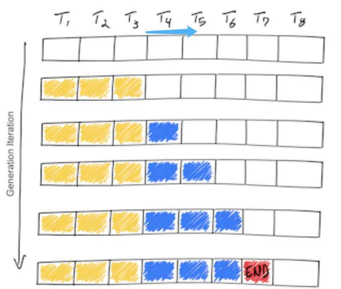
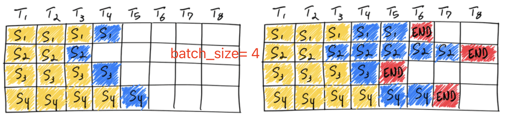
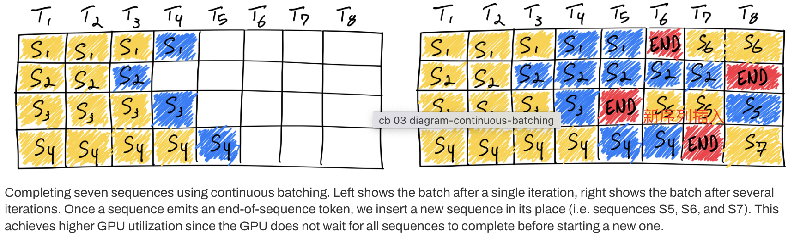
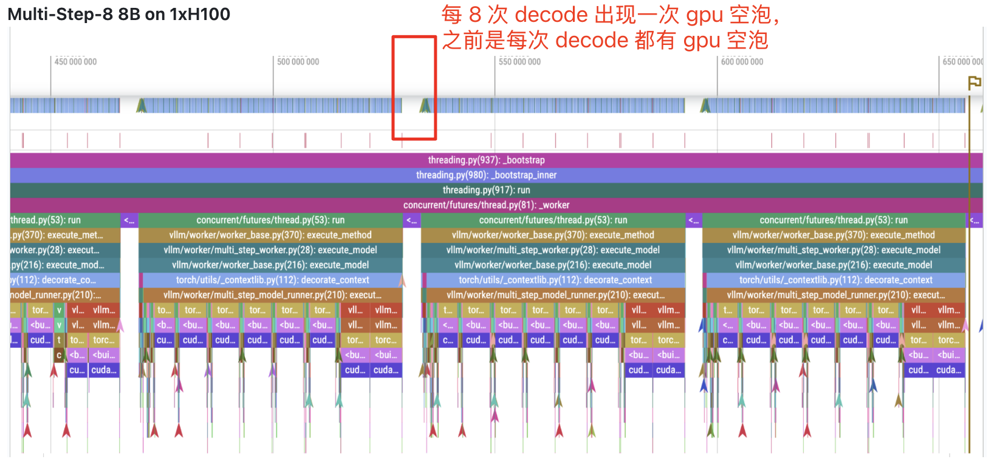
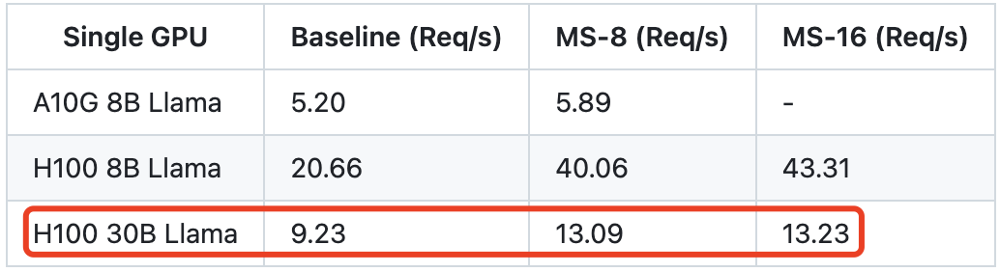

- [一 PagedAttention](#一-pagedattention)
	- [1.1 PagedAttention 方案](#11-pagedattention-方案)
	- [1.2 PagedAttention 的内存共享优势](#12-pagedattention-的内存共享优势)
	- [1.3 和 TokenAttention 的区别](#13-和-tokenattention-的区别)
- [二 连续批处理](#二-连续批处理)
	- [2.1 静态批处理概述](#21-静态批处理概述)
	- [2.2 动态批处理方案](#22-动态批处理方案)
- [三 Prefix Caching: RadixAttention](#三-prefix-caching-radixattention)
	- [prefix caching](#prefix-caching)
- [四 cuda graph](#四-cuda-graph)
	- [4.1 源码剖析](#41-源码剖析)
	- [4.2 cuda graph 实践](#42-cuda-graph-实践)
	- [4.3 总结](#43-总结)
- [五 预先多步批量调度策略](#五-预先多步批量调度策略)
- [性能基准测试](#性能基准测试)
	- [测试配置](#测试配置)
	- [基准测试结果](#基准测试结果)
		- [Llama 3 8B on 1xA100](#llama-3-8b-on-1xa100)
		- [Llama 3 70B on 4xA100](#llama-3-70b-on-4xa100)
		- [Llama 3 8B on 1xH100](#llama-3-8b-on-1xh100)
		- [Llama 3 70B on 4xH100](#llama-3-70b-on-4xh100)
- [参考资料](#参考资料)

vLLM 是一个快速且易于使用且大模型推理服务框架，声称有以下快速特性：
- `SOTA` 的 serving 吞吐量
- `PagedAttention` 对 kv cache 的有效管理
- 传入请求的 `continus batching`，而不是 static batching
- 借助 CUDA/HIP 图实现的高速模型运行
- 支持多种量化方案：GPTQ、AWQ、INT4、INT8 和 FP8
- 高性能 CUDA kernel，如 Flashattention
- 支持张量并行、采样并行(parallel sampling)
- 支持分块的预填充处理（Chunked prefill）

## 一 PagedAttention

PagedAttention 技术本质上是 kv cache 管理、存取技术的优化，毕竟之前的 kv cache 技术是存在显存浪费问题的。每个序列的 kv cache 大小依赖于 `seq_len`，由于 llm 都是批处理推理，而 batch 中每个序列长度和输出 tokens 数是不一样的！为了避免 kv cache 申请的内存空间不够的问题，早期 kv cache 统一按照 `max_seq_len` 来申请内存空间的，这明显导致了 decode 阶段的显存资源浪费。

```python
class Attention(nn.Module):
    def __init__(self, args: ModelArgs):
        super().__init__()
        # Initialize caches to store Key, Values at start. (KV Cache Implementation)
        self.cache_k = torch.zeros((args.max_batch_size, args.max_seq_len, self.n_kv_heads, self.head_dim), device=args.device)
        self.cache_v = torch.zeros((args.max_batch_size, args.max_seq_len, self.n_kv_heads, self.head_dim), device=args.device)
```

### 1.1 PagedAttention 方案

> [vAttention](https://arxiv.org/pdf/2405.04437v1) 论文提出利用 CUDA 底层的虚拟内存和物理内存分配 API 直接分配连续的虚拟内存以及做物理内存映射从而避免 PagedAttention 由于要手动维护 Block Table 和物理内存分配带来的一系列工程麻烦以及高 Overhead 。另外对于新的 Attention 架构，想用上 PagedAttention，需要从 GPU Kernel 的角度去适配 PagedAttention 和重构 Attention kernel 的代码。

受操作系统中虚拟内存和分页机制启发，vLLM 提出了 PagedAttention 注意力算法，以实现 KV Cache 的**动态内存分配**，而不是像之前一样为每个 seq 都分配固定大小的 [max_seq_len, hidden_dim] 连续内存空间用于存储 kv cache。

具体来说，PagedAttention 将每个序列从逻辑上划分为一定数量的 `blocks`（块），每个 block 包含每个 seq 一定数量 tokens 的 key 和 value，并把这些逻辑 blocks 通过 block table 映射到固定大小的 物理 blocks 上，物理 blocks 可能不连续，即 kv 可能不连续分布。一句话总结就是构建 blocks 表， 并将 seq 的 kv tokens 划分成逻辑 blocks 并映射到物理 blocks 上。使用 PagedAttention 的请求的生成过程如下图所示：

<div align="center">

</div>

这种方式带来的内存浪费仅出现在序列的最后一个块中，实际中带来了近乎最优的内存使用，浪费不到 4%。这种内存效率的提升大大提高了系统能够同时处理的序列数量，增加了 GPU 的利用率，并显著提升了处理吞吐量。

PagedAttention 这种结构类似于操作系统中的虚拟内存，其中将块视为页，将 tokens 视为字节，将序列视为进程。序列的逻辑连续块通过块表映射到非连续的物理块中。当新的 tokens 被生成时，这些物理块会按需分配。

### 1.2 PagedAttention 的内存共享优势

PagedAttention 还具备高效的内存共享能力。例如，在**并行采样**中，多个输出序列可以从同一个 prompt 生成。在这种情况下，prompt 的计算和内存可以在输出序列之间共享。PagedAttention 通过其块表自然地实现了内存共享，类似于进程共享物理页的方式。不同的序列可以通过将它们的逻辑块映射到相同的物理块来实现共享。为了确保共享的安全，PagedAttention 通过引用计数跟踪物理块，并实现了“写时复制”（Copy-on-Write）机制。

<div align="center">

</div>

PagedAttention 的内存共享显著降低了复杂采样算法（如并行采样和束搜索）的内存开销，可将其内存使用降低最多 55%，吞吐量提升最高可达 2.2 倍。这使得这些采样方法在 LLM 服务中变得更加实用。

PagedAttention 借助块表实现了灵活的内存共享机制。类似于进程间共享物理页面的方式，PagedAttention 中的不同序列可以通过将各自的逻辑块映射到相同的物理块来共享内存资源。为了确保共享的安全性，PagedAttention 跟踪物理块的引用次数，并采用写时复制策略以防止数据冲突。

<div align="center">

</div>

### 1.3 和 TokenAttention 的区别

**不同点**：
1. 虽然两者都是精细化管理、分配 kv 向量的技术，tokenAttention 是粒度为 token 级别的 动态 kv cache 内存管理技术，pagedattention 是 block 粒度。
2. `TokenAttention` 本质上是 `PagedAttention` 的一种特例，PagedAttention 当块大小为 1 时即为 TokenAttention。
3. PagedAttention 会造成一定程度的显存浪费，作者推算是小于 4%，而 tokenAttention 最大的优化点是确保不会浪费显存。


## 二 连续批处理

看图理解连续批处理（Continuous batching）技术原理。

### 2.1 静态批处理概述

理解静态批处理之前，先来回顾下 LLM 的推理过程：LLM 推理分为两个阶段：prefill 和 decode 阶段，严格来讲 decode 阶段才是循环迭代过程，每次循环都只生成一个 token。LLM 推理过程如下图所示：

<div align="center">

</div>


llm 推理迭代过程有一些特点:

1. decode 阶段的迭代计算过程是内存受限的，输入 q 只有 1 个 token，无法充分发挥 gpu 并行计算能力。
2. gpu 显存的消耗量随着模型大小和输入 token 序列长度的增加而增加。

上图是一个序列的 llm 推理过程，下面再来看下传统的一个批次的 llm 推理过程，也叫静态批处理，表现出来就是，只有当前批次完全推理完，下一个批次的序列才能进行推理。但是这有个问题是，我们之前一个批次中，序列长度不一，输出 tokens 数也不一样，即迭代结束时间不一样，那这自然会造成 gpu 利用率不高。LLM 静态批处理示意图如下所示：

<div align="center">

</div>

上图显示了一个 batch_size = 4 的静态批处理过程。在第一次迭代（左侧），每个序列从提示 tokens（黄色）生成一个 token（蓝色）。经过几次迭代后（右侧），完成的各序列长度不同，因为每个序列在不同迭代中发出各自的终止 token（红色）。尽管序列 3 在两次迭代后就完成了，但静态批处理意味着之前分配的 GPU 线程资源将一直未被充分利用，直到批次中的最后一个序列完成生成（在此示例中，为六次迭代后完成的序列 2）。

很明显，静态批处理，只有当批次中的不同序列的输入输出 tokens 数完全一致时，静态批次才能实现最佳的GPU 利用率。

### 2.2 动态批处理方案

动态批处理，也叫连续批处理技术，首次提出是在 2022 年发表的论文 [Orca: A Distributed Serving System for Transformer-Based Generative Models](https://www.usenix.org/conference/osdi22/presentation/yu)中，它大幅提升了 llm 推理服务系统的吞吐量，可有效避免 GPU 资源的浪费。

连续批出理技术的原理是动态调整迭代过程中的批次大小，不再等待批次中的所有序列都完成生成才推理下一个批次，而是根据每次迭代序列的完成情况和当前剩余显存资源来确定当前批次大小，批次中的部分序列完成后，新的序列可以立即插入其位置，这样有效避免了 GPU 空转。

<div align="center">

</div>

上图显示了通过连续批处理技术连续完成 7 个序列的推理情况。左图显示了第一次迭代后的批次，右图显示了几次迭代后的批次。每当一个序列发出终止 token 时，我们会将一个新的序列插入其位置（例如序列 S5、S6 和 S7），这样 GPU 无需等待所有序列完成即可开始处理新的序列，从而实现更高的 GPU 利用率。

上述的简要描述忽略了 llm 推理的 prefill（预填充）过程，因为预填充阶段和生成阶段的计算模式是不同的，所以它无法简单的与生成阶段的 tokens 一起批处理。由此，一般连续批处理框架会通过一个超参数 waiting_served_ratio 来管理此问题（实际框架不止一个超参数会有多个超参数和调度策略），该参数表示等待预填充请求与等待终止 token 请求数的比率。假设该值为 1.3，当预填充请求数/等待终止 token 请求数 > 1.3，此时推理框架会暂停批次的 decode 过程，而是去插入相应数量的新请求，并做预填充处理。

## 三 Prefix Caching: RadixAttention

### prefix caching

`vllm` 中开启 prefix caching 推理的代码如下所示：

```python
# Create an LLM with prefix caching enabled.
prefix_cached_llm = LLM(model="facebook/opt-125m",
                        enable_prefix_caching=True,
                        gpu_memory_utilization=0.4)

# Warmup so that the shared prompt's KV cache is computed.
prefix_cached_llm.generate(generating_prompts[0], sampling_params)

# Generate with prefix caching.
outputs = prefix_cached_llm.generate(generating_prompts, sampling_params)

print("Results with `enable_prefix_caching`")
```

## 四 cuda graph

vllm 是 pythonic 的 llm 推理卡框架，在 cpu 进行 cuda kernel launch（启动）的 eager mode 时，其存在可较大的 kernel launch 开销，尤其是对于 batch较小/模型较小的情况，kernel 启动开销过大！由此，作者基于 torch 使用 cuda graph 来直接减少 kernel launch 的开销。

> 这里解释下 **cuda kernel launch，其实际是 CPU 向 GPU 发送指令的过程，即算子下发过程**！

CUDA Graph 是 NVIDIA 在 CUDA 10 中引入的一种新特性，旨在优化 GPU 上的任务提交和执行流程。通过将一系列 CUDA 操作（如内核启动、内存拷贝等）表示为**一个图结构**，并在 GPU 上执行该图，可以显著减少 CPU 与 GPU 之间的通信开销，提高整体性能。

因为 cuda graph 必须限制输入输出的的形状，而在 llm 推理中，prefill 阶段输入的 batch，seq_len，这两个维度都是动态变化的，因此 cuda graph 仅应用在 `decode` 阶段，且是通过提前预设一批 batch，针对每个不同 batch capture 不同的 cuda graph，运行时根据输入的 shape 找到匹配的 cuda_graph_runner 即可。这也带来一个问题，预设的 batch 数越多，使用 cuda graph 优化后带来的额外显存消耗也增加。

> 值得一提的是，如果想看作者实现的 cuda graph 的思路来源，可以参考文章 [Speed, Python: Pick Two. How CUDA Graphs Enable Fast Python Code for Deep Learning](https://fireworks.ai/blog/speed-python-pick-two-how-cuda-graphs-enable-fast-python-code-for-deep-learning) 和 llama 仓库代码 [ llama-cuda-graph-example-masked_attn](https://github.com/fw-ai/llama-cuda-graph-example/blob/masked_attn/llama/generation.py#L123)。

在代码实现上，主要是基于 `GPUModelRunnerBase`、`ModelRunner` 和 `CUDAGraphRunner` 两个类，github 完整代码在[这里](https://github.com/vllm-project/vllm/blob/main/vllm/worker/model_runner.py#L1730)，作者 commit 提交历史记录关键的 commit 在[这里](https://github.com/vllm-project/vllm/pull/1926/commits/87e565488aac528f6dd2161e9355d950fa74bfd1)。

### 4.1 源码剖析

下面是我针对 `llama` 仓库上应用 cuda graph 的代码分析。

1，`ModelRunner` 类实际是对之前 `Model` 类的包装，封装了模型的前向传播逻辑，并管理与推理相关的资源。其中 `execute_model` 推理执行函数是核心，其负责接收输入数据，执行模型的前向传播，输出结果是 `sample` 采样后的结果，而不是模型推理结果 `logits`。`ModelRunner` 类的初始化如下所示：

```python
class ModelRunner(GPUModelRunnerBase[ModelInputForGPUWithSamplingMetadata]):
    """
    带有采样步骤的 GPU 模型运行器。

    继承自 GPUModelRunnerBase，使用 ModelInputForGPUWithSamplingMetadata 作为模型输入类型。
    """
    # 指定模型输入的类型
    _model_input_cls: Type[ModelInputForGPUWithSamplingMetadata] = ModelInputForGPUWithSamplingMetadata
    _builder_cls: Type = ModelInputForGPUBuilder  # 假设存在 ModelInputForGPUBuilder 类
```

`ModelRunner` 类的继承比较复杂，但这对于支持众多模型和推理模式的 vllm 来说是无可厚非的，如果是自己想要测试下 cuda graph，初始化很简单，只要如下所示：

```python
class ModelRunner():
    def __init__(self, model):
        self.model = model
        self.graph_runners = {}  # (int, CUDAGraphRunner)
```

`execute_model` 函数执行模型的前向传播和采样步骤，其中和 cuda graph 相关的代码如下所示:

```python
# 当前 CUDA 图仅支持解码阶段
assert model_input.attn_metadata is not None
prefill_meta = model_input.attn_metadata.prefill_metadata
decode_meta = model_input.attn_metadata.decode_metadata
# 如果需要 CUDA 图，并且没有填充元数据，使用预构建的模型执行器
virtual_engine = model_input.virtual_engine
if prefill_meta is None and decode_meta.use_cuda_graph:
	assert model_input.input_tokens is not None
	graph_batch_size = model_input.input_tokens.shape[0]
	model_executable = self.graph_runners[virtual_engine][graph_batch_size]
else:
	model_executable = self.model
```

其中 `prefill_metadata` 和 `decode_metadata` 都是一个抽象属性，需要在子类中实现此方法。代表的意义分别是指应返回预填充注意力阶段所需的元数据，和应返回解码注意力阶段所需的元数据。
> 在 vllm 中，实现了多种 “元数据” 用来描述注意力机制在预填充和解码阶段各方面的辅助信息。这些信息对于管理令牌的处理和存储至关重要，尤其是在处理多模态数据或需要精确控制令牌位置的复杂模型中，具体代码在 `vllm/attention/backends/abstract.py` 中。

到这里，还有一个问题就是 `self.graph_runners` 是在哪里完成初始化的，按照学习 cuda graph 的经验，`self.graph_runners` 一般是在 `capture_model` 函数中完成初始化。且以往简单模型推理场景我们习惯把 `capture_model` 函数定义在 `ModelRunner` 类中，但在 vllm 中，`capture_model` 是定义在 `GPUModelRunnerBase` 中。

2，`GPUModelRunnerBase` 类是一个**基类**，它提供了模型加载、初始化等核心功能，为子类如 `ModelRunner` 和 `CUDAGraphRunner` 提供了通用的操作接口。和 cuda graph 优化相关的是 `capture_model` 函数，其核心实现逻辑代码如下所示:

```python
# 代码有所省略
_BATCH_SIZE_ALIGNMENT = 8
_BATCH_SIZES_TO_CAPTURE = [1, 2, 4] + [_BATCH_SIZE_ALIGNMENT * i for i in range(1, 1025)

class GPUModelRunnerBase():
	def __init__():
		self.max_batchsize_to_capture = _get_max_graph_batch_size(self.scheduler_config.max_num_seqs)
		# 为了方便理解代码，去除了外层的 virtual_engine，直接以 batch_size 为键
        self.graph_runners: Dict[int, CUDAGraphRunner] = {}

	@torch.inference_mode()
	def capture_model(self, kv_caches: List[List[torch.Tensor]]) -> None:
		# 创建全零的输入标记张量，形状为 (max_batch_size,)
		input_tokens = torch.zeros(max_batch_size, dtype=torch.long).cuda()
		# 创建全零的输入位置张量，形状为 (max_batch_size,)
		input_positions = torch.zeros(max_batch_size, dtype=torch.long).cuda()
		# 获取要捕获的批量大小列表，确保批量大小不超过最大批量大小
		graph_batch_size = self.max_batchsize_to_capture
		batch_size_capture_list = [bs for bs in _BATCH_SIZES_TO_CAPTURE if bs <= graph_batch_size]
		
		# 使用注意力状态的图捕获上下文和通用的图捕获上下文
    	with self.attn_state.graph_capture(max_batch_size), graph_capture() as graph_capture_context:
			# 反向遍历批量大小列表，从大到小
            for batch_size in reversed(batch_size_capture_list):

				# 获取指定批量大小的注意力元数据
                attn_metadata = self.attn_state.graph_capture_get_metadata_for_batch(
                    batch_size,
                    is_encoder_decoder_model=self.model_config.is_encoder_decoder
                )
				# 创建 CUDA 图运行器
                graph_runner = CUDAGraphRunner(
                    self.model,
                    self.attn_backend.get_name(),
                    self.attn_state.graph_clone(batch_size),
                    self.model_config.is_encoder_decoder
                )
				# 准备捕获输入的字典
                capture_inputs = {
                    "input_ids": input_tokens[:batch_size],
                    "positions": input_positions[..., :batch_size],
                    "intermediate_inputs": intermediate_inputs[:batch_size] if intermediate_inputs is not None else None,
                    "kv_caches": kv_caches[virtual_engine],
                    "attn_metadata": attn_metadata,
                    "memory_pool": self.graph_memory_pool,
                    "stream": graph_capture_context.stream
                }

				# 在前向传播上下文中，捕获模型的执行过程
                with set_forward_context(attn_metadata):
                    graph_runner.capture(**capture_inputs)

                # 更新图内存池
                self.graph_memory_pool = graph_runner.graph.pool()
                # 将捕获的图运行器存储到 graph_runners 中
        		self.graph_runners[batch_size] = graph_runner
]

```

`SchedulerConfig` 是调度配置类，`max_num_seqs`  是 `SchedulerConfig` 类的初始化参数之一，表示单次迭代中可处理的最大序列数，可以理解为传统意义上的 `max_batch_size`。`batch_size_capture_list` 是一个 batch_size 列表，前三个元素是 1 2 4 后面的元素值间隔 8 并小于调度类中的 `max_num_seqs` 参数值。

`capture_model` 函数流程可总结如下:
1. 创建虚拟输入数据。
2. 确定要捕获的批量大小列表。
3. 开始 `CUDA Graph` 捕获上下文，并循环处理不同的批量大小，捕获 `CUDA Graph`:
   - 创建 `CUDA Graph Runner`：创建 CUDAGraphRunner 对象 `graph_runner`;
   - 准备用于捕获的输入：将之前创建的虚拟输入和其他必要的参数组合成一个字典 `capture_inputs`;
   - 捕获 CUDA Graph：在前向传播上下文中，使用 `graph_runner.capture(**capture_inputs)` 捕获模型的执行过程;
   - 存储捕获的 `CUDA Graph`: self.graph_runners[batch_size] = graph_runner。

3，`CUDAGraphRunner` 是 ModelRunner 的扩展类，目的是利用 CUDA 图（CUDA Graph）技术优化模型的推理执行。其包括三个函数 `__init__`、`capture` 和 `forward`，对应功能如下：

- 图(`graph`)实例化： 对捕获的 CUDA 图进行实例化，生成可执行的图实例。
- `CUDA` 图捕获： 将模型的前向传播过程捕获为 CUDA 图。
- 图执行： 在推理过程中，执行已实例化的 CUDA 图，提高执行效率。

<div align="center">

</div>

其中关键的 `capture` 函数看起来代码很多，但核心逻辑就是执行捕获 `graph` 和定义输入输出 `placeholder` 的操作，具体的精简版代码如下所示：

```python
# 省略了部分代码
def capture()：
	# Capture the graph.
	self._graph = torch.cuda.CUDAGraph()
	with torch.cuda.graph(self._graph, pool=memory_pool, stream=stream):
		output_hidden_or_intermediate_states = self.model(
			input_ids=input_ids,
			positions=positions,
			kv_caches=kv_caches,
			attn_metadata=attn_metadata,
			intermediate_tensors=intermediate_inputs,
			**kwargs,
		)
	# 定义 graph 输入 placeholder（输入数据比较复杂）
	self.input_buffers = {
		"input_ids": input_ids, "positions": positions，
		"kv_caches": kv_caches, 
		**self.attn_state.get_graph_input_buffers(attn_metadata, self._is_encoder_decoder_model),
        **kwargs,
        }
	# 定义 graph 输出 placeholder
	self.output_buffers = hidden_or_intermediate_states
```

### 4.2 cuda graph 实践

基于 gpt2 模型的推理应用 cuda graph 优化的代码如下所示:

```python
import torch
import torch.nn as nn
from transformers import GPT2Tokenizer
from dataclasses import dataclass
import time

@dataclass
class ModelConfig:
    num_layers: int = 12
    embedding_dim: int = 768
    num_heads: int = 12
    vocab_size: int = 50257

class SimpleGPT2(nn.Module):
    def __init__(self, model_config: ModelConfig):
        super(SimpleGPT2, self).__init__()
        self.num_layers = model_config.num_layers
        self.embedding_dim = model_config.embedding_dim
        self.num_heads = model_config.num_heads
        self.vocab_size = model_config.vocab_size

        self.embed_layer = nn.Embedding(self.vocab_size, self.embedding_dim)
        self.transformer_blocks = nn.ModuleList([
            nn.TransformerEncoderLayer(d_model=self.embedding_dim, nhead=self.num_heads)
            for _ in range(self.num_layers)
        ])
        self.lm_head = nn.Linear(self.embedding_dim, self.vocab_size)

    def forward(self, x):
        h = self.embed_layer(x)
        for transformer_block in self.transformer_blocks:
            h = transformer_block(h)
        logits = self.lm_head(h)
        return logits

class CUDAGraphRunner:
    def __init__(self, model):
        self.model = model
        self.cuda_graph = None
        self.graph_input = None
        self.graph_output = None

    def capture(self, x):
        # 捕获 CUDA 图
        assert self.cuda_graph is None, "CUDA graph has already been captured."
        torch.cuda.synchronize()
        
        # 创建图的输入输出占位符
        self.graph_input = x.clone().detach().cuda()
        self.graph_output = torch.empty_like(self.model(self.graph_input))

        # 开始捕获 CUDA 图
        self.cuda_graph = torch.cuda.CUDAGraph()
        with torch.cuda.graph(self.cuda_graph):
            self.graph_output = self.model(self.graph_input)

        torch.cuda.synchronize()

    def forward(self, x):
        self.graph_input.copy_(x)
        self.cuda_graph.replay()
        return self.graph_output

    def __call__(self, *args, **kwargs):
        return self.forward(*args, **kwargs)

class ModelRunner:
    def __init__(self, model, seq_len=64):
        self.model = model
        self.seq_len = seq_len
        self.graph_runners = {}

    def capture_decode_graph(self):
        # 在 decode 阶段捕获 CUDA 图
        for batch in [1, 2, 4, 8, 16, 24, 32, 40, 48, 56, 64, 128]:  # 设置一些常用 batch size
            input = torch.randint(0, self.model.vocab_size, (batch, self.seq_len)).cuda()
            graph_runner = CUDAGraphRunner(self.model)
            graph_runner.capture(input)
            self.graph_runners[batch] = graph_runner

    def decode(self, x):
        batch_size = x.shape[0]
        if batch_size in self.graph_runners:
            model_executable = self.graph_runners[batch_size]
        else:
            print("Warning: CUDA graph not captured for this batch size, falling back to original model.")
            model_executable = self.model
        return model_executable(x)

# 主程序入口
if __name__ == "__main__":
    # 配置模型并构造
    config = ModelConfig()
    model = SimpleGPT2(config).cuda().eval()
    runner = ModelRunner(model, seq_len=6)
    runner.capture_decode_graph()

    # 测试用例输入
    tokenizer = GPT2Tokenizer.from_pretrained("gpt2")
    input_ids = torch.tensor(tokenizer.encode("Hello, how are you?", add_special_tokens=True)).unsqueeze(0).cuda()
    input_ids = input_ids.expand(128, -1)

    # 推理时间对比
    # 不使用 CUDA 图推理时间
    start = time.time()
    output_no_graph = model(input_ids)
    end = time.time()
    print(f"不使用 CUDA 图推理时间: {end - start:.4f} 秒")

    # 使用 CUDA 图推理时间
    start = time.time()
    output_with_graph = runner.decode(input_ids)
    end = time.time()
    print(f"使用 CUDA 图推理时间: {end - start:.4f} 秒")

    # 检查输出是否匹配
    torch.testing.assert_close(output_no_graph, output_with_graph, rtol=1e-03, atol=1e-03)
```

程序运行后输出结果如下所示:

```bash
不使用 CUDA 图推理时间: 0.0298 秒
使用 CUDA 图推理时间: 0.0007 秒
```

### 4.3 总结

`cuda graph` 解决了可能存在的所有 CPU 开销的来源：**如用户编写的逻辑、PyTorch 调度逻辑、内存分配开销以及 GPU 驱动/内核开销**（静态图优势）。

## 五 预先多步批量调度策略

Batch scheduling multiple steps ahead（早期称 `Multi-step Scheduling`），本质上是一种**服务调度策略**，用来解决 GPU 空泡的问题，或者说 `python/cpu` 的 `overhead` 一直很大的问题。
> vllm 的这种调度策略，其实早在 `TGI` 框架实现了类似的效果，而且就目前来看，`TGI` 的服务调度策略依然比 vllm 更灵活，具体算法请参考我的[文章](https://github.com/harleyszhang/llm_note/blob/main/3-llm_infer_deploy/llm_infer/tgi%E6%A1%86%E6%9E%B6%E7%AE%80%E5%8D%95%E6%80%BB%E7%BB%93.md)。

准确的说，由于输入/输出的处理和生成的原因，**每个解码批次（`decoding batch`）都会带来较高的 CPU 开销**，带来的直接代价就是 `GPU` 常常处于空闲状态，等待 `CPU` 操作结束，这会产生 $5-13$ 毫秒的 `GPU` 空闲时间!

具体讲就是 GPU 在每次从 CPU 接收下一步的输入，以及从 GPU 传输采样后的 token，到 CPU 生成用户响应时，都会产生一定的 “GPU bubble”（GPU 等待 CPU 处理的时间，5-13ms of GPU bubble），这部分空泡时间具体是这四个：

- 将采样到的 token 从 GPU 传送到 CPU 进行反标记化并返回客户端
- 生成用户所需的输出——将张量转换为 Python 对象
- CPU 准备并生成下一步的输入元数据
- vLLM 调度器（vLLM scheduler）

由此，作者提出**多步解码调度**优化，即在调用 `vLLM` 调度器并处理采样的 `tokens` 之前，**执行多次解码**，从而将这些开销均摊到每 $n$ 步解码中。

<div align="center">

</div>

下方两个图是官方提供的对比图，这两个时长大约为 200ms。第一行是 CUDA 核心操作，底部是 Python 跟踪。每个红框大约代表 4ms 的 GPU 空闲时间，两张图均如此。

首先是 baseline，每个 decode 步骤都会导致 4 ms的 GPU 空泡（使用 Pytorch profiler 打印）：

<div align="center">

</div>

使用 Multi-Step-8 之后，4ms 的开销仅在每 `8` 次解码中出现一次：

<div align="center">

</div>

具体的吞吐量提升效果如下表所示：

<div align="center">

</div>

## 性能基准测试

vllm-v0.6.0 版本的详细性能测试结果。

### 测试配置

1，llm 推理服务引擎

将 vLLM v0.6.0 与 `TensorRT-LLM r24.07`、`SGLang v0.3.0` 和 `lmdeploy v0.6.0a0` 进行了基准测试。对于其他基准测试，我们使用其默认设置。对于 vLLM，作者设置了 `--num-scheduler-steps 10` 启用了**多步调度**功能，这个功能即将默认启用。

2，性能测试数据集

使用以下三个数据集对不同的推理引擎进行基准测试：
- `ShareGPT`：从 ShareGPT 数据集中随机抽取 500 条提示语，使用固定的随机种子。平均输入token 数为 202，平均输出 token 数为 179。
- `Prefill-heavy` 数据集：从 sonnet 数据集中合成生成 500 条提示语，平均包含约 462 个输入 token 和 16 个输出token。
- `Decode-heavy` 数据集：同样从 sonnet 数据集中合成生成 500 条提示语，平均包含约 462 个输入 token 和 256 个输出token。

3，模型和硬件

- 模型：Llama 3 8B 和 70B。
- 硬件：使用 A100 和 H100 进行基准测试。

4，评估指标：

- `TTFT`（Time-to-first-token，单位：毫秒）：在图表中显示均值及均值的标准误差。
- `TPOT`（Time-per-output-token，单位：毫秒）：在图表中显示均值及均值的标准误差。
- **吞吐量**（单位：请求每秒）：吞吐量在 `QPS` inf（即所有请求同时到达）下进行测量。

### 基准测试结果

#### Llama 3 8B on 1xA100

在 Llama 3 8B 上，
- **从延时角度看**，vLLM 在 ShareGPT 和解码密集型数据集上与 TensorRT-LLM 和 SGLang 的 `TTFT` 和 `TPOT` 表现相当。相比其他 llm 推理服务引擎，LMDeploy 的 TPOT 较低，但其 TTFT 普遍较高。
- **从吞吐量来看**，TensorRT-LLM 在所有引擎中具有最高的吞吐量，而 vLLM 在 ShareGPT 和解码密集型数据集上的吞吐量位列第二。

<div align="center">

</div>

#### Llama 3 70B on 4xA100

在 Llama 3 70B 上，
- **从延时看**，vLLM、SGLang 和 TensorRT-LLM 的 `TTFT` 和 `TPOT` 指标基本一致（LMDeploy 的 TPOT 较低，但 TTFT 较高）。
- 从吞吐量来看，vLLM 在 ShareGPT 数据集上实现了最高吞吐量，并且在其他数据集上的吞吐量与其他引擎相当。

<div align="center">

</div>

#### Llama 3 8B on 1xH100

vLLM 在 ShareGPT 和解码密集型数据集上实现了 SOTA（当前最佳）的吞吐量表现，尽管在填充密集型数据集上的吞吐量稍低。

<div align="center">

</div>

#### Llama 3 70B on 4xH100

vLLM 在 ShareGPT 和解码密集型数据集上具有最高吞吐量（尽管仅略高于 TensorRT-LLM），但在填充密集型数据集上的吞吐量较低。

<div align="center">

</div>

## 参考资料

- [How continuous batching enables 23x throughput in LLM inference while reducing p50 latency](https://www.anyscale.com/blog/continuous-batching-llm-inference)
- [vLLM: Easy, Fast, and Cheap LLM Serving with PagedAttention](https://blog.vllm.ai/2023/06/20/vllm.html)
- [Prompt Cache: Modular Attention Reuse for Low-Latency Inference](https://arxiv.org/abs/2311.04934)
- [浅谈cuda graph在llm推理中的应用](https://zhuanlan.zhihu.com/p/715863693)
- [Speed, Python: Pick Two. How CUDA Graphs Enable Fast Python Code for Deep Learning](https://fireworks.ai/blog/speed-python-pick-two-how-cuda-graphs-enable-fast-python-code-for-deep-learning)
- [vLLM v0.6.0: 2.7x Throughput Improvement and 5x Latency Reduction](https://blog.vllm.ai/2024/09/05/perf-update.html)
- [vLLM这一年的新特性以及后续规划](https://mp.weixin.qq.com/s/ISltFRwFSNlgsnrzUnBTiw)