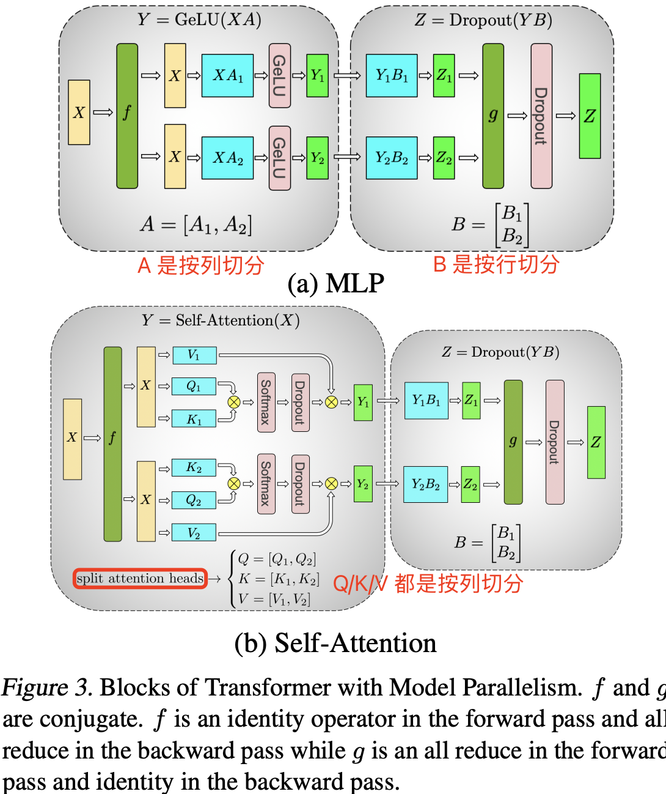
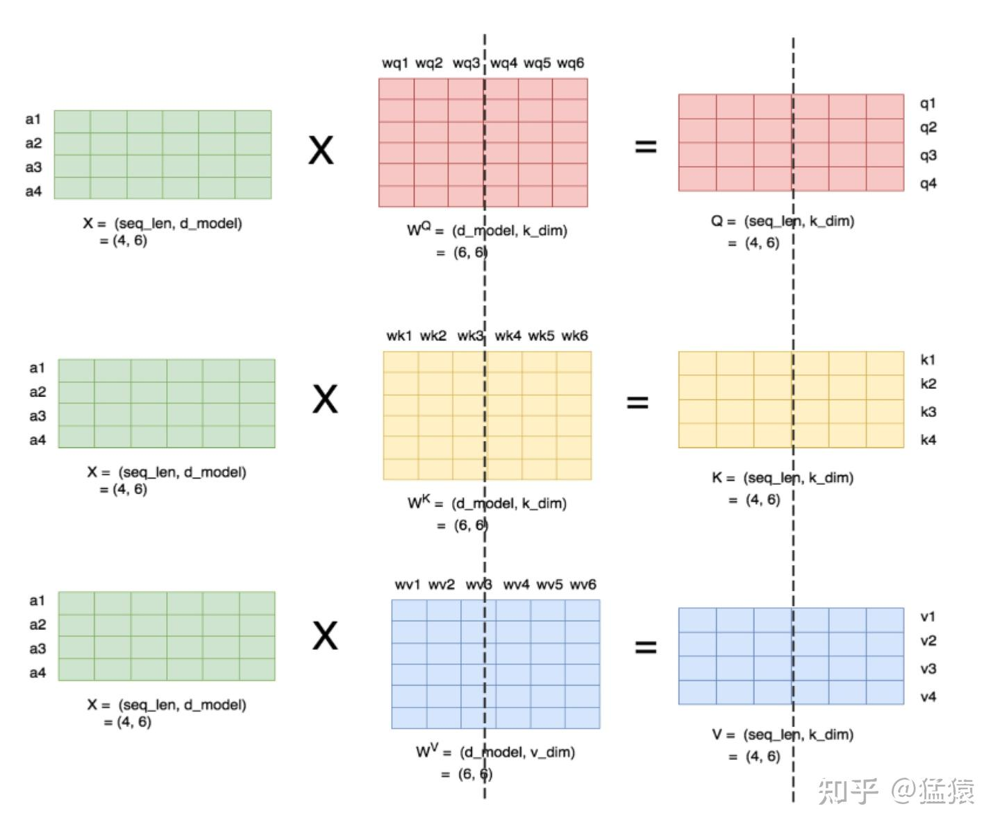
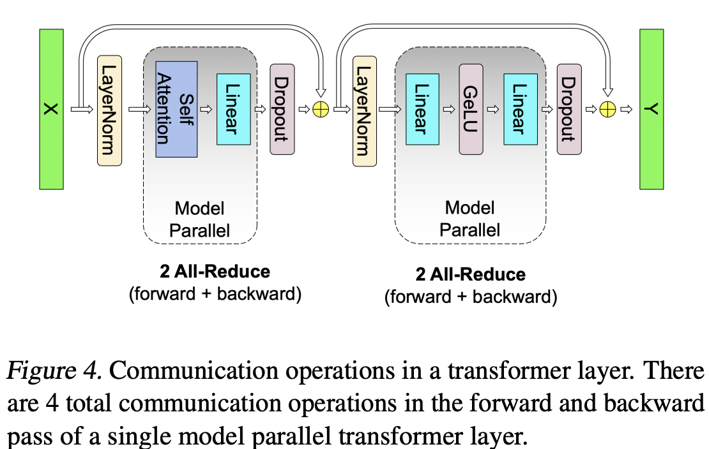

## 摘要

为了训练更大的 transformer 模型，作者引入了一种简单高效的 `intra-layer model parallel`（层内模型并行，也叫张量并行）方法，这种方法不需要安装的新的编译器和库，它和 pipeline model parallelism 互为正交且互补，并且只需在 native PyTorch 中插入少量 `communication operations` 就能完全实现。

## 1. 介绍

随着模型参数量的不断扩大（模型参数内存），它们往往会超出现代处理器的内存承载能力，这就需要采用额外的内存管理策略，比如 `activation checkpointing` (Chen et al., 2016) 技术。另外常，用的优化算法 `Adam` 需要为每个参数分配额外内存来存储动量及其他状态信息（即优化器内存），这也限制了能够高效训练的模型规模。为了解决这一问题，模型并行技术通过对模型进行分割，使得各部分权重和对应的优化状态不必同时加载到同一处理器上，从而突破内存瓶颈。例如，`GPipe` (Huang et al., 2018) 和 Mesh-Tensorflow (Shazeer et al., 2018) 分别为不同类型的模型并行提供了框架，但它们**通常需要重写模型结构代码**，并依赖仍在不断完善的自定义编译器和框架。

由此，论文作者在本论文研究中提出了一种基于 `intra-layer model-parallelism` 的简单高效的模型并行方案。直接基于 transformer 的语言模型的固有结构（即不改变模型本身结构），开发了一种在 PyTorch 中高效训练的简单模型并行实现，无需自定义 `C++` 代码或编译器。层内并行与 `GPipe` (Huang et al., 2018) 等方法所倡导的 pipeline-based model parallelism 相互独立、互补，可为大规模模型训练提供更多灵活性。

可以在现有的 PyTorch transformer 实现基础上，**仅需要少量针对性的代码修改**，就实现了一种简单而高效的模型并行（张量并行）方案。

## 2. 背景和挑战

### 2.1 神经语言模型预训练

预训练语言模型如今已成为  NLP  研究者工具箱中不可缺少的一部分。过去十年来，利用大规模语料进行预训练以获得鲁棒的语言神经表征，一直是一个非常活跃的研究方向。早期的研究表明，与从头开始训练的词嵌入表相比，预训练的词嵌入表能显著提升下游任务的效果 (Mikolov et al., 2013; Pennington et al., 2014; Turian et al., 2010)。

### 2.2 Transformer 语言模型和多头注意力

`GPT-2` 和 `BERT` 在 `multi-head attention` 和 `feed forward` 层的输入端都使用了 `GeLU` (Hendrycks & Gimpel, 2016) 激活函数及 layer normalization (Ba et al., 2016)，而原始 transformer (Vaswani et al., 2017) 则采用了 `ReLU` 激活函数，并在输出端应用了 layer normalization。

### 2.3 深度学习中的数据和模型并行

目前，将深度神经网络训练扩展到多个硬件加速器的有两种主要方法：
-  **数据并行 data parallelism**（Valiant, 1990），即将一个训练 minibatch 划分到多个 worker 上；
- **模型并行 model parallelism**，即将一个模型的内存使用和计算分布到多个 worker 上。

增加可用 `worker` 数量成比例增加 `minibatch` 大小（即弱扩展），可以观察到训练数据吞吐量近乎线性提升；但是大批量训练会给优化过程引入复杂性，可能导致准确率降低或收敛时间延长，从而抵消了训练吞吐量提升带来的好处 (Keskar et al., 2017)。

为进一步扩展训练规模，一些并行工作 (Chen et al., 2016) 将 **data parallelism** 与 **activation checkpointing** 结合起来：在反向传播中重新计算激活值而不在正向传播中存储它们，从而减少内存需求。

随着模型参数量的增加，模型参数所占用的内存已接近和超过单个 GPU 的内存上限。论文作者的解决办法是利用 **model parallelism** **将模型分割并分布到多个加速器上**，这不仅缓解了内存压力，而且使并行性不再依赖于 microbatch 的大小。

在 **model parallelism** 内部，还有两种常见策略：
- 一种是 **layer-wise pipeline parallelism**，即将一系列操作在一个设备上执行完后，再将结果传递到下一个设备继续处理；
- 另一种是更通用的 **distributed tensor computation**，它将单个 tensor 操作拆分到多个设备上，从而加速计算或支持更大模型。

在 **pipeline model parallelism**（流水线并行）中，**一组操作先在一个设备上执行，然后将输出传递到流水线中的下一个设备，在那里执行另一组操作**。一些方法 (Harlap et al., 2018; Chen et al., 2018) 结合了 **parameter server**（参数并行） (Li et al., 2014) 与流水线并行，但这些方法存在一致性问题。TensorFlow 的 **GPipe** 框架 (Huang et al., 2018) 通过采用**同步梯度下降**来克服这一一致性问题。该方法需要额外逻辑来高效处理通信与计算操作的流水线调度，同时会受到流水线空泡的影响而降低效率，或需对优化器本身进行修改，从而影响准确率。

**distributed tensor computation** 是一种正交且更通用的方法，它将一个 `tensor` 操作划分到多个设备上，以加速计算或增加模型规模。**FlexFlow** (Jia et al., 2018) 是一个 `orchestrating` 此类并行计算的深度学习框架，提供了一种选择最佳并行策略的方法。最近，**Mesh-TensorFlow** (Shazeer et al., 2018) 在 TensorFlow (Abadi et al., 2015) 中引入了一种用于指定一类通用 **distributed tensor computations** 的语言，用户在语言中指定并行维度，生成的计算图则使用适当的 collective primitives 进行编译。

论文借鉴了 **Mesh-TensorFlow** 的类似思想，并在计算 transformer 的 `attention` `heads` 时利用并行计算能力来实现模型并行。而且，论文提出的方法并不依赖全新的框架或编译器，而只需要在现有的 PyTorch transformer 代码实现中做几处有针对性的调整。整个方案简单易行，无需新的编译器或大规模代码重构，只需插入几个简单的 `primitives` 即可实现，具体细节会在下一节详细说明。

## 3. 模型并行 Transformers

在充分利用了 transformer networks 的内部结构 pytorch 代码的基础上，只需在代码中添加几个**同步操作**（synchronization primitives），就可实现一个简单的模型并行方案。

$$Y = GeLU(XA)$$

为了实现 `GEMM` 的并行计算，一个方法是**将权重矩阵 A 按行拆分，同时将输入矩阵 X 按列拆分**，如下图所示：

$$X = [X_1, X_2], A = \begin{bmatrix}
A_1 \\
A_2 \end{bmatrix}$$

这种切分方式会得到 $Y = GeLU(X_1A_1 + X_2A_2)$，因为 `GeLU` 是一个**非线性函数**，所以 $GeLU(X1A1 + X2A2) \ne GeLU(X1A1) + GeLU(X2A2)$，因此这种方法在 `GeLU` 函数之前需要一个同步点（synchronization point）。

所谓**同步点**是指，在执行 `GeLU` 函数之前，需要等待各个设备的并行计算（即 $X_1A_1$ 和 $X_2A_2$）都完成，同时将各个设备输出的中间结果正确地聚合（synchronize），可通过 reduce + broadcast 操作在 GPU 0 上计算完整 XA，然后广播 `GeLU(XA)` 到 GPU 1。

> 权重 $W$ 如果按照**行维度**进行切分切开后，那么 `GEMM` 的矩阵乘法 $XW_1$ 和 $XW_2$ 的维度无法对齐，需要**再把 $X$ 按列切开**才能做到矩阵乘法的维度对齐。

另一种方案是将**权重矩阵** $A$ **沿列方向**拆分为 $A = [A1, A2]$。这种分割方式使得每个部分独立完成 $\text{GEMM}$ 运算后，即输入激活矩阵 X 无需做拆分，**都可以各自应用 `GeLU` 激活函数**。这种分割方式的优势在于**可以消除一次同步操作**。

$$[Y1, Y2] = [GeLU(XA1), GeLU(XA2)$$

在将第一个 `GEMM` 按照列并行方式切分后，第二个 `GEMM` 自然沿行方向拆分，即**将第二个线性层的权重矩阵 B 沿着行方向拆分**，使其能够直接处理来自 `GeLU` 层的输出而无需任何通信，如图 3a 所示。

<center>

</center>

随后，将第二个 `GEMM` 的输出在所有 GPU 之间进行归约，然后再传递给 `dropout` 层。这种方法将 MLP 模块中的两个 `GEMM` 分布到多个 GPU 上，在正向传播过程中只需要一次  all-reduce 操作（即 `g operator`），在反向传播过程中只需要一次 `all-reduce` 操作（即 `f operator`）。这两个操作符互为共轭，可以在 PyTorch 中仅用几行代码实现。例如，下面给出了 `f operator` 的实现代码：

```python
class f(torch.autograd.Function):
    def forward(ctx, x):
        return x
    def backward(ctx, gradient):
        all_reduce(gradient)
        return gradient
```

如图 3b 所示，对于自注意力模块，可以充分挖掘**多头**注意力的内在并行特性：将计算键 (K)、查询 (Q) 和数值 (V) 的 **GEMM 操作按列拆分**，**这样每个注意力头的矩阵乘法便可以在单个 GPU 上独立完成**。这样不仅可以将每个注意力头的参数和计算负载均匀分摊到多个 GPU 上，而且完成自注意力计算时无需立即进行跨 GPU 通信。

下图展示了当 `num_heads` = 2 时 attention kernel 的并行计算方法。即对每一块权重，我们都沿着列方向（k_dim）维度切割一刀。此时每个 `head` 上的 $W^Q、W^K、W^V$  的维度都变成 `(d_model, k_dim//2)`。每个 `head` 上单独做矩阵计算，最后将计算结果 `concat`起来即可。整个流程如下图所示：

<center>

</center>

可以发现，attention 的**多头**注意力计算机制真的是天然适合模型的张量并行计算。因为**每个头上都可以独立计算**，最后再将结果 concat 起来。也就是说，**可以把每个头的参数放到一块 GPU 上**。则整个过程如图 3(b) 所示：

**对三个权重参数矩阵 Q，K，V，按照“列切割”，每个头放到一块 GPU 上，做并行计算**。对注意力输出线性层 $B$，按照“行切割”。切割的方式和 `MLP` 层基本一致，其 forward 与 backward 原理也一致，这里不再赘述。最后，在实际应用中，并不一定按照一个 head 占用一块GPU来切割权重，我们也可以一个多个 head 占用一块 GPU，这依然不会改变单块 GPU 上独立计算的目的。所以实际设计时，我们尽量保证 head 总数能被 GPU 个数整除。

很明显上述的设计对 MLP 和自注意力层均采用了**将两组 GEMM 运算融合的策略**，从而消除了一个同步步骤，并获得了更好的扩展性。基于此技术方案，在一个标准 transformer 层中，前向传播只需执行两次 all-reduce 操作，反向传播也仅需两次 all-reduce（详见图 4）。

<center>

</center>

Transformer 语言模型的输出嵌入矩阵尺寸为 `[batch_size, vocab_size, hidden_size]`。因为当前 transformer 语言模型的词汇表通常至少有数万个 token（例如，GPT-2 的词汇表大小为 50,257），因此对**输出 embedding 层**的 GEMM 计算进行并行化很有加速效果。但是，又因为在 transformer 语言模型中，**输出嵌入层与输入嵌入层通常共享权重**，这就要求对两者都需要进行修改。

我们将**输入嵌入的权重矩阵** E（权重矩阵尺寸为 `[hidden_size, vocab_size]`）**按词汇维度进行列拆分**，得到 $E = [E_1, E_2]$。因为每个分块仅包含嵌入表的一部分，因此
**在完成输入嵌入后需要执行一次 `all-reduce`（即 g operator）**。对于输出嵌入，一种方案是先并行计算 $[Y1, Y2] = [XE_1, XE_2]$ 得到 `logits`，然后通过 `all-gather` 操作将其拼接成 $Y = \text{all-gather}([Y1, Y2])$，接着再将结果输入到交叉熵损失函数中。但是，这样的 `all-gather` 操作需要传输 $b \times s \times v$ 个元素（其中 $b$ 为批次大小，$s$ 为序列长度），而且**因为词汇表通常很大，这会带来巨大的通信负担**。因此，为了降低通信成本，我们将并行 GEMM 的输出 [Y1, Y2] 与交叉熵损失融合，从而将数据维度压缩至 $b \times s$。相比传输完整的 `logits`，仅传输标量损失大幅减少了通信量，从而显著提高了模型并行方案的效率。

模型并行方法大部分**可以归纳为旨在减少通信并使 GPU 保持计算密集状态的技术**。与其让一个 GPU 计算部分的 dropout、 layer normalization 或 residual connections 并将结果广播到其他 GPU，我们选择在所有 GPU 上复制这些计算。具体来说，我们在每个 GPU 上维护 layer normalization 参数的重复副本，并将模型并行区域的输出张量经过 dropout 和 residual connection 处理后，再作为输入传递给下一个模型并行区域。为了优化模型，我们允许每个模型并行工作单元独立优化自己的一套参数。由于所有数值均在单个 GPU 上局部存在或被复制，因此在这种方案中无需通信更新参数值。我们在附录 B 中提供了有关混合模型与数据并行以及随机数生成处理的更多细节供参考。总之，上述方法易于实现，在前向和反向传播过程中只需额外添加几次 all-reduce 操作。该方法不需要新的编译器，并且与例如 (Huang et al., 2018) 所倡导的 pipeline model parallelism 互为正交且互补。

## 参考资料

- [Megatron-LM: Training Multi-Billion Parameter Language Models Using Model Parallelism](https://arxiv.org/pdf/1909.08053)
- [图解大模型训练之：张量模型并行(TP)，Megatron-LM](https://zhuanlan.zhihu.com/p/622212228)