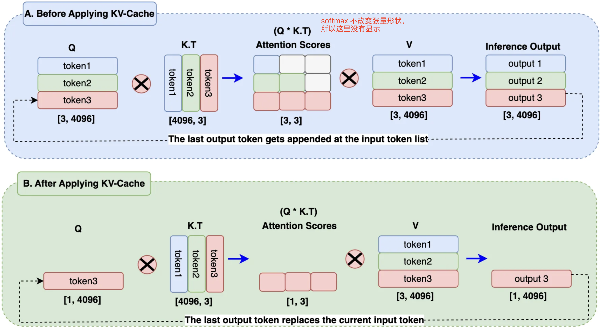
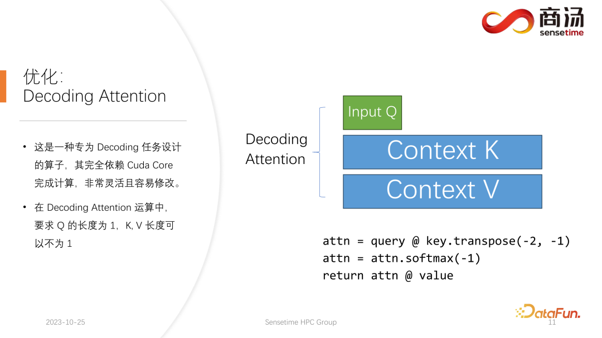
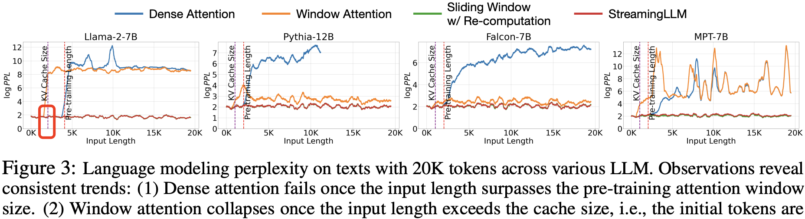
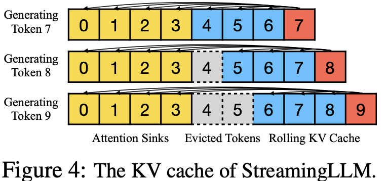

- [一 kv cache 原理](#一-kv-cache-原理)
  - [1.1 `kv cache` 显存占用量计算](#11-kv-cache-显存占用量计算)
- [二 prefill 和 decode 阶段的 kv 计算](#二-prefill-和-decode-阶段的-kv-计算)
  - [2.1 kv cache 节省了多少计算量](#21-kv-cache-节省了多少计算量)
- [三 kv cache 实现代码](#三-kv-cache-实现代码)
- [四 kv cache 技术的进一步优化](#四-kv-cache-技术的进一步优化)
  - [4.1 kv cache 计算优化-FlashDecoding](#41-kv-cache-计算优化-flashdecoding)
  - [4.2 kv cache 访存优化-GQA、StreamingLLM](#42-kv-cache-访存优化-gqastreamingllm)
- [参考资料](#参考资料)

## 一 kv cache 原理

**背景**：生成式模型的推理过程很有特点，**推理生成 `tokens` 的过程是迭代式的**。简单来说就是，用户给一个输入文本，模型会输出一个回答（长度为 $N$），但该过程中实际执行了 $N$ 次模型前向传播过程。即 `GPT` 类模型一次推理只输出一个 `token`，**当前轮输出的 token 与之前输入 tokens 拼接，并作为下一轮的输入 tokens**，反复多次直到遇到终止符 `EOS` 或生成的 `token` 数目达到设置的 `max_new_token` 才会停止。用代码描述就是如下所示:

```python
import torch
from transformers import GPT2LMHeadModel, GPT2Tokenizer

model = GPT2LMHeadModel.from_pretrained("/WORK/Test/gpt", torchscript=True).eval()

# tokenizer
tokenizer = GPT2Tokenizer.from_pretrained("/WORK/Test/gpt")
in_text = "Lionel Messi is a"
in_tokens = torch.tensor(tokenizer.encode(in_text))

# 定义终止token为句号
token_eos = torch.tensor([tokenizer.encode('.', add_special_tokens=False)[0]])
out_token = None
i = 0

with torch.no_grad():
    while out_token != token_eos:
        logits, _ = model(in_tokens)
        out_token = torch.argmax(logits[-1, :], dim=0, keepdim=True)
        # 将当前轮输出的 token 与之前输入 tokens 拼接，并作为下一轮的输入 tokens
        in_tokens = torch.cat((in_tokens, out_token), 0)
        # 解码当前的 token 序列
        text = tokenizer.decode(in_tokens) 
        print(f'step {i} input: {text}', flush=True)
        i += 1

out_text = tokenizer.decode(in_tokens)
print(f' Input: {in_text}')
print(f'Output: {out_text}')
```

程序输出结果如下所示:

```bash
step 0 input: Lionel Messi is a player
step 1 input: Lionel Messi is a player who
step 2 input: Lionel Messi is a player who has
step 3 input: Lionel Messi is a player who has been
step 4 input: Lionel Messi is a player who has been a
step 5 input: Lionel Messi is a player who has been a key
step 6 input: Lionel Messi is a player who has been a key part
step 7 input: Lionel Messi is a player who has been a key part of
step 8 input: Lionel Messi is a player who has been a key part of the
step 9 input: Lionel Messi is a player who has been a key part of the team
step 10 input: Lionel Messi is a player who has been a key part of the team's
step 11 input: Lionel Messi is a player who has been a key part of the team's success
step 12 input: Lionel Messi is a player who has been a key part of the team's success.
step 13 input: Lionel Messi is a player who has been a key part of the team's success.

Input: Lionel Messi is a
Output: Lionel Messi is a player who has been a key part of the team's success.
```

从代码运行结果可以明显，看出第 $i$ 轮输入数据只比第 $i+1$ 轮输入数据新增了一个 `token`，其他全部相同！因此第 $i+1$ 轮推理时必然包含了第 $i$ 轮的部分计算。`KV Cache` 优化的起因就在这里，**缓存当前轮可重复利用的计算结果**，下一轮计算时直接读取缓存结果，原理很简单，**本质就是用空间换时间**。

另外，**每一层 decode layer 都需要单独缓存 $K$ 和 $V$，因为每层的 `attention` 运算是独立的，即第 $L$ 层的 $K_L$ 和 $V_L$ 是独立的、与其他层不同的**。如果不缓存每一层的 $K$ 和 $V$，在生成下一个 token 时，模型就需要重新计算之前所有 `token` 的 $K$ 和 $V$，这将导致大量冗余计算，通过缓存，避免了重复计算 $K$ 和 $V$，从而加速了生成过程。


在代码中体现就是 `kv_cache` 张量是创建在 `Attention` 类中的，在 `__init__` 函数中完成初始化！

```python
class Attention(nn.Module):
    def __init__(self, args: ModelArgs):
        super().__init__()
        self.args = args

        # KV cache 实现, 在 Attention 初始化时，初始化缓存张量以存储键和值, 每一层 decode layer 都会单独缓冲 K 和 V
        self.cache_k = torch.zeros((args.max_batch_size, args.max_seq_len, self.n_kv_heads, self.head_dim), device=args.device)
        self.cache_v = torch.zeros((args.max_batch_size, args.max_seq_len, self.n_kv_heads, self.head_dim), device=args.device)
```

很明显，单论对话的 kv cache 优化是应用在 `decode` 推理阶段过程中的，下图很好的展示了不使用 kv cache 和使用 kv cache 的区别。

<div align="center">

</div>

在 B 区块 中，输出 token 替换了查询嵌入中的输入 token，而 KV 缓存则存储之前生成的 token。在计算注意力分数时，只需要使用一个查询 token，再加上键和值缓存中的已有 token 就可以了。这将矩阵乘法从 A 区块 的 3x3 减少到 B 区块 的 1x3，节省了近 66% 的计算量。在处理大规模序列和批量数据时，这将显著降低计算开销。

> self-attention 中，单个 `token` kv 矩阵计算开销为 ${4nh^2}$。

### 1.1 `kv cache` 显存占用量计算

假设输入序列的长度为 $s$ ，输出序列的长度为 $o$，decoder layers 数目为 $n$，以 `float16` 来保存 `KV cache`，那么 `KV cache` 的峰值显存占用计算公式为:

$$\text{memory\_kv-cache} = 2*2*nh*b(s+o) = 4nh*b(s+o)$$

上式，第一个 `2` 表示 K/V cache，第二个 `2`表示 float16 占 2 个 bytes。**每个 token 的 kv 缓冲大小 $ = 4nh$，单位为字节 `byte`**。

## 二 prefill 和 decode 阶段的 kv 计算

一个典型的自回归模型的生成式推理过程包含了两个阶段：

1. **预填充阶段**（prefill phase）：输入一个 prompt 序列，为每个 transformer 层生成 key cache 和 value cache（KV cache）。这个阶段可以充分利用并行计算的优势。
2. **解码阶段**（decoding phase）：使用并更新 KV cache，一个接一个地生成词（**无并行性**），当前生成的词依赖于之前已经生成的词。该阶段的推理计算分两部分：**更新 KV cache 和计算 decoder layers 的输出**。

这两个阶段的差别在于 $Q$ 的维度不同。在 `prefill` 阶段时，用户输入的所有 token 都需要参与运算，所以此时 $Q$ 的形状为 $[b, s, h]$。在第 `decode` 阶段时，只有新生成的 `token` 作为第二次迭代过程的输入，所以此时 $Q$ 的维度为 $[b, 1, h]$，即**只有新 token 作为 Q**。

**在预填充阶段，多头注意力（`MHA`）模块生成 `KV` 键值对并存储在 KV 缓存中**。设输入到 Transformer 层的输入为 $X_{pre}\in \mathbb{R}^{s\times h}$，其中 $h$ 是隐藏维度，$s$ 是提示词 token 序列的长度。`MHA` 模块的 $4$ 个线性层权重用 $W_q$，$W_k$，$W_v$ 和 $W_o$ 表示。查询、键和值（Q、K、V）的计算过程如下：

$$\text{Query}: Q_{pre}=X_{pre} * W_{q} \\
\text{Key}: K_{pre}=X_{pre} * W_{k} \\
\text{Value}: V_{pre}=X_{pre} * W_{v}$$

生成的 $K_{pre}$ 和 $V_{pre}$ 被存储在 KV 缓存中，每个 transformer layer 都独立的存储 KV 键值对。其余的 `MHA` 计算如下：

$$O_{pre }=\text{softmax}(\frac{Q_{pre } * K_{pre }^{T}}{\sqrt{d_k}}) * V_{pre } * W_{o}+X_{pre }$$

> $d_k = h/n_{heads}$。

MHA 的输出 $O_{pre }\in \mathbb{R}^{s\times h}$ 将传递到 MLP。MLP 的输出作为下一层 Transformer 层的输入。

解码阶段是 LLM 推理的关键部分。在这一阶段，模型使用预填充阶段生成的 **KV 缓存**，同时逐步添加新信息。目标是**逐步迭代的生成新 token**，每个新 token 的生成都会参考之前生成的 token。

**在解码阶段**，MHA 加载先前存储的 KV 缓存 $K_{cache}$ 和 $V_{cache}$。输入为 $X_{dec}\in \mathbb{R}^{1\times h}$。新的键值对被计算并拼接到现有缓存：

$$\text{Query}: Q_{dec}=X_{dec}*W_{q} \\
\text{Key}: K_{cat }=[K_{cache }, X_{dec } * W_{k}] \\
\text{Value}: V_{cat }=[V_{cache }, X_{dec } * W_{v}]$$

新计算的 $X_{dec}\cdot W_{k}$ 和 $X_{dec}\cdot W_{v}$ 紧接着被拼接到 $KV$ 缓存得到新的 $K_{cat}$、$V_{cat}$ 向量。MHA 中的剩下的计算如下进行：

$$O_{dec}=\text{softmax}(\frac{Q_{dec}\cdot K_{cat}^{T}}{\sqrt{d_k}}) * V_{cat } * W_{o}+X_{dec}$$

其中 MHA 的输出 $O_{dec}\in \mathbb{R}^{1\times h}$ 被传递到 MLP。最后一个 Transformer 层的输出被发送到最终的预测层，以预测下一个 token。

<div align="center">

</div>

### 2.1 kv cache 节省了多少计算量

设隐藏层维度大小为 $h$，上下文长度为 $s$，分析每个时间步的计算量，不使用 kv cache 的情况下 attention 总计算量为 $O(s^2h)$，使用后的总计算量近似为 $Osh$。计算量节省比率如下：

$$\text{节省比率} = \frac{O(s^2 h) - O(sh)}{O(sh)} = 1 - \frac{1}{s}$$

当 $s$ 较大时，$\frac{1}{s}$ 接近于 0，节省比率接近于 100%！

换种说法，计算复杂度从 $O(s^2 h)$  降低到 $O(sh)$，**即使用 kv cache 可节省约 $s$ 倍的计算量，输出 tokens 数越多，计算量节省越可观**。

## 三 kv cache 实现代码

kv cache 优化的实现代码是在 Attention 类中，逻辑比较简单分为两个过程：保存上一轮计算的 key 和 vale 拼接到 cache_k 和 cache_v 中，将拼接后的 kv 张量作为新的 kv 用于 self-attention 计算。核心代码如下所示：

```python
# 部分无关代码做了省略
class Attention(nn.Module):
    def __init__(self, args: ModelArgs):
        super().__init__()
        self.args = args

        # KV cache 实现, 在 Attention 初始化时，初始化缓存张量以存储键和值, 每一层 decode layer 都会单独缓冲 K 和 V
        self.cache_k = torch.zeros((args.max_batch_size, args.max_seq_len, self.n_kv_heads, self.head_dim), device=args.device)
        self.cache_v = torch.zeros((args.max_batch_size, args.max_seq_len, self.n_kv_heads, self.head_dim), device=args.device)
    def forward(self, x: torch.Tensor, start_pos, inference):
        bsz, seq_len, _ = x.shape
        # 这里没有用 concat，通过索引存取 kv 相对更快，start_pos 是这轮 decode 起点，decode 阶段 seq_len 实际是等于 1
        # Store Keys and Values token embedding into their respective cache [KV Cache Implementation]
        self.cache_k[:bsz, start_pos:start_pos + seq_len] = xk
        self.cache_v[:bsz, start_pos:start_pos + seq_len] = xv

        # Assign all the previous tokens embeddings upto current tokens position to Keys and Values variable for Attention Calculation
        keys = self.cache_k[:bsz, :start_pos + seq_len]
        values = self.cache_v[:bsz, :start_pos + seq_len]
```

还有一种比较直观的实现方法是 transformers 库代中 modeling_gpt2.py 的实现，逻辑实现在 GPT2Attention 中，精简版代码如下所示:

```python
class GPT2Attention(nn.Module):
    #省略了其他函数和 forward 的其他参数
    def forward( self,layer_past: Optional[Tuple[torch.Tensor]], ) -> Tuple[Union[torch.Tensor, Tuple[torch.Tensor]], ...]:
    query = self._split_heads(query, self.num_heads, self.head_dim)
    key = self._split_heads(key, self.num_heads, self.head_dim)
    value = self._split_heads(value, self.num_heads, self.head_dim)

    if layer_past is not None:
        past_key, past_value = layer_past
        key = torch.cat((past_key, key), dim=-2)
        value = torch.cat((past_value, value), dim=-2)
    
    attn_output, _ = self._attn(query, key, value, attention_mask, head_mask)
```

## 四 kv cache 技术的进一步优化

目前的 KV Cache 至少有两个问题：

1. 解码阶段 Attention 的计算从计算密集型变成访存密集型了，其 GPU 利用率不到 1%，换句话说 GPU 算力在解码阶段不是瓶颈了，要想加速解码，要么从访存方面下手，要么优化现有 Attention 的计算方法，这个就是[Flash-Decoding](https://arxiv.org/pdf/2407.08608)的工作。
2. KV Cache 随着序列长度增加会越来越大，直至不可接受，典型的就是多论对话场景。

### 4.1 kv cache 计算优化-FlashDecoding

decoding 阶段的 attention 运算当中，有一个特点是**输入 q 的长度是 1，而 k 和 v 的长度是可变的**。这是 Decoding Attention 的限制，在这种限制下，是可以做一些特定的优化，如 `FlashDecoding`。



FlashDecoding 是针对 decoding 阶段上的 kv cache 在计算上的优化。Flash-Decoding 在前作对 `batch size` 和 `query length` 并行的基础上增加了一个新的并行化维度：`keys/values` 的序列长度，代价是最后一个小的归约步骤。

<div align="center">

</div>

Flash-Decoding 的工作流程分为三个步骤：
1. 首先，将键/值拆分成更小的块。
2. 然后，使用 FlashAttention 并行计算**查询与每个拆分块的注意力值**，同时为每行和每个块记录一个额外的标量：注意力值的 log-sum-exp。
3. 最后，通过对所有拆分块进行归约，结合 log-sum-exp 调整各个块的贡献，计算出最终的结果。

### 4.2 kv cache 访存优化-GQA、StreamingLLM

**1，MQA/GQA 优化**：

常见的技术手段有 MQA/GQA，详细原理参考我的另一篇[文章](https://www.armcvai.cn/2024-10-21/llama1-3-model.html)，MQA 和 GQA 有个局限是都需要模型在训练阶段就这么设定，如果模型已经训练好了，将KV Cache 强行换成这俩方法，效果将会变得不可用。

**2，StreamingLLM**：

StreamingLLM 的出发点是想让大模型支持极限情况的多论对话可以无限输出，达到 “Streaming”，这里首要需要解决的问题就是模型本身支持的上下文长度有限且当 KV cache 显存占用随长度增长，也不可能无限。StreamingLLM 给出的方法是一种间接思路，即**丢弃一些 KV cache**。
> 插句题外话，StreamingLLM、和经典量化论文 SmoothQuant、AWQ 的一作都有华人 Guangxuan Xiao *。

StreamingLLM 之前做法是 `window attention`，即只保留和当前 token 距离相近的 token。这个直观上好理解，解码下一个 token 是临近 token 影响得比较大，距离远的 token 则影响小。

StreamingLLM 作者在包含 `20K` 个 token 的文本上，做了不同 LLM 的语言建模困惑度测试，**发现了一些趋势**：

1. 当输入长度超出预训练的注意力窗口大小时，密集注意力效果开始失效。
2. 当输入长度超过缓存容量（即初始 tokens 被逐出）时，窗口注意力性能下降。
3. 而 StreamingLLM 表现出稳定的性能，其困惑度几乎与重新计算的滑动窗口基线相当。

<div align="center">

</div>

作者进一步发现，window attention 只要加上开头的几个 `token` 比如 4 个，再操作一下位置编码，模型输出的PPL 就不会爆了，输出到 20k 长度都很平稳。文中将这种现象叫做 `Attention Sink`。就好像文本的注意力被“沉溺”到了开头的位置。

由此，作者提出了 StreamingLLM ，这是一种**能在不做模型微调的情况下恢复窗口注意力困惑度的简单方法**。具体来说，除了当前的滑动窗口 tokens，还在注意力计算中重新引入了一些**起始 tokens 的 KV**。

如图 4 所示，StreamingLLM 的 KV 缓存可以概念上分为两部分：
1. 注意力锚点（前四个 token）用于稳定注意力计算；
2. 滑动 KV 缓存保存最新的 tokens，这对语言建模非常重要。

总结一下 StreamingLLM 算法原理就是，**基于 StreamingLLM 算法后 Attention 中的 kv cache 实际上变成了 `Attention Sinks` 和 `Rolling KV Cache` 的拼接，形式如 [Rolling KV Cache, Rolling KV Cache]，另外，在确定相对距离并向 tokens 添加位置信息时，StreamingLLM 关注缓存中的位置，而不是原始文本中的位置**。这种新的操作位置编码的方式对 StreamingLLM 的性能至关重要！

<div align="center">

</div>

举个例子，如果当前缓存（见图 4）包含 tokens 为 `[0, 1, 2, 3, 6, 7, 8]`，并正在解码第 9 个 token，则所分配的位置是当前缓存 tokens 的位置信息 `[0, 1, 2, 3, 4, 5, 6, 7]`，而不是原始文本中的位置 `[0, 1, 2, 3, 6, 7, 8, 9]`。这个当前缓存 tokens 的位置信息的概念不太好理解，再举个直观例子，如果当前缓冲 tokens 有 100 个，则位置信息变为 `[0,1,2,3,..,99]`。代码实现如下所示：

```python
def apply_rotary_pos_emb_single(x, cos, sin, position_ids):
    # The first two dimensions of cos and sin are always 1, so we can `squeeze` them.
    cos = cos.squeeze(1).squeeze(0)  # [seq_len, dim]
    sin = sin.squeeze(1).squeeze(0)  # [seq_len, dim]
    cos = cos[position_ids].unsqueeze(1)  # [bs, 1, seq_len, dim]
    sin = sin[position_ids].unsqueeze(1)  # [bs, 1, seq_len, dim]
    x_embed = (x * cos) + (rotate_half(x) * sin)
    return x_embed

def llama_pos_shift_attention_forward():
    ############省略了非相关代码和函数参数###################
	### rotary_emb 是原始的 rope 函数, 实现在 https://github.com/huggingface/transformers/blob/main/src/transformers/models/llama/modeling_llama.py#L204
	cos, sin = self.rotary_emb(value_states, seq_len=kv_seq_len)
    ### Shift Pos: key pos is the pos in cache
    key_position_ids = torch.arange(kv_seq_len, device=position_ids.device).unsqueeze(0)
    key_states = apply_rotary_pos_emb_single(key_states, cos, sin, key_position_ids)
```

StreamingLLM 设计非常灵活，能够无缝集成到任何使用相对位置编码的自回归语言模型中，比如 RoPE (Su 等，2021) 和 ALiBi (Press 等，2022)。对于 RoPE 编码，会在应用旋转变换之前缓存 tokens 的键，然后在每次解码时对滚动缓存中的键进行位置变换。而与 ALiBi 的集成更为简单，直接将连续线性偏差应用于注意力得分，而不是跳跃式偏差。
> StreamingLLM 的官方实现仓库地址在[这里](https://github.com/mit-han-lab/streaming-llm/blob/main/streaming_llm/pos_shift/modify_llama.py)。

StreamingLLM 的缺点是过程太过暴力，没有识别出重要性 tokens，直接按照位置把中间的 token 都丢掉了，如果中间的 tokens 是重要的会造成精度问题。

## 参考资料

- [大模型推理性能优化之KV Cache解读](https://zhuanlan.zhihu.com/p/630832593)
- [大模型推理加速：KV Cache Sparsity(稀疏化)方法](https://zhuanlan.zhihu.com/p/701580870)
- [Efficient Streaming Language Models with Attention Sinks](https://arxiv.org/abs/2309.17453)
- [Build Your Own Llama 3 Architecture from Scratch Using PyTorch](https://pub.towardsai.net/build-your-own-llama-3-architecture-from-scratch-using-pytorch-2ce1ecaa901c)
- [高性能 LLM 推理框架的设计与实现](https://mp.weixin.qq.com/s?__biz=MzU1NTMyOTI4Mw==&mid=2247707241&idx=1&sn=c62888f9ff2865be05ce7d220f973531&chksm=fa0a1a06cc7b1fbd30818b177422f304e4b1ec447da40a439f3546aec140b76d894e9977dafc&scene=0&xtrack=1)