- [摘要](#摘要)
- [1. 介绍](#1-介绍)
- [2. 预备知识](#2-预备知识)
- [3. 量化难点总结](#3-量化难点总结)
- [4. SmoothQuant 算法](#4-smoothquant-算法)
  - [4.1 SmoothQuant 算法实现及简单实验](#41-smoothquant-算法实现及简单实验)
- [5. 实验](#5-实验)
  - [5.1 实验设置](#51-实验设置)
  - [5.2 量化后精度对比实验](#52-量化后精度对比实验)
  - [5.3 加速和节省内存对比实验](#53-加速和节省内存对比实验)
  - [5.4 扩展：在单节点内运行 530B 模型](#54-扩展在单节点内运行-530b-模型)
  - [5.5 消融研究](#55-消融研究)
- [参考资料](#参考资料)

> 先验知识：激活值是指模型中需要进行量化的计算密集层的输入，典型的就是线性层的输入，self-attention 层的输入等等。

## 摘要

SmoothQuant 是 PTQ（训练后量化）方案，量化位宽为 `W8A8`，即权重和激活都是用 8bit 量化，SmoothQuant 的核心贡献是，基于权重易量化而激活难量化的观察提出了一个解决办法：引入平滑因子 $s$ 来平滑激活中的异常值，**并通过数学上的等效转换将量化的难度从激活迁移至权重上**。这个方法可以使 INT8 量化能够应用于 LLMs 中所有的矩阵乘法运算。SmoothQuant 量化算法在保持模型精度不变的情况下，使得 LLMs 推理速度提升至 1.56 倍，内存需求减少至 50%。

## 1. 介绍

和 CNN 模型或较小的 Transformer 模型（如 BERT，Devlin 等，2019）不同，大型语言模型 (LLMs) 的激活非常难以量化。因为，将 LLMs 扩展至超过 `67B` 参数时，激活中会出现具有**大幅度**的系统性异常值 (Dettmers 等，2022)，导致较大的量化误差和准确性下降。这些**离群值(outier)与正常值相比会有数百倍的数值差距**。如果直接进行量化，会导致大部分数值清零，产生很大的精度损失。但同时又有研究表明，这部分**离群值会对模型的性能产生显著影响**，因此必须想办法保留离群值而不是直接清零，这就产生了一个难以调和的矛盾。
> `Outliers` 是指激活中的 `Outliers`，权重的整体变化幅度还是比较小的。`Outliers` 的出现会使得量化更难进行，因为原始权重数值的变化范围变大了，而量化编码的精度是有限的，如 **INT4 就只有 16 个数**，这会导致了更大的量化误差。

`ZeroQuant` 和 `LLM.int8()` 提出了各自的解决办法：

1. `ZeroQuant` (Yao 等，2022) 应用了动态逐 `token` 激活量化和分组权重量化（定义见图 3 第 2 节）来解决激活离群值(outier)问题。虽然该方法实现效率较高，且对 GPT-3-350M 和 GPT-J-6B 提供了良好的准确性，但对于 `175B` 参数的 OPT 模型的准确性较差。
2. `LLM.int8()` (Dettmers 等，2022) 通过引入混合精度分解（即对异常值保持 FP16，其他激活使用 INT8）解决了该准确性问题，但是这种方法在工程上很难在 AI 加速器上高效实现，是一种硬件不友好的量化方案。

因此，寻找一种高效、对硬件友好且无需训练的量化方案，使得 LLMs 中所有计算密集型操作均采用 INT8，仍然是一个未解决的难题。由此，论文提出了 `SmoothQuant` 量化方案，和过去相比，SmoothQuant 是高效且准确的 PTQ 方案。SmoothQuant 的提出是基于一个关键观察：之所以激活比权重更难量化是因为其存在离群值[(Dettmers et al., 2022)](https://arxiv.org/pdf/2208.07339), 不同 tokens 在其通道上表现出类似的变化。基于这一现象，**SmoothQuant 离线地将量化难度从激活迁移至权重（如下图图 2 所示），并提出了逐通道的等效缩放转换，使跨通道的数值更为平滑，从而显著提升模型的量化友好性**。

<div align="center">
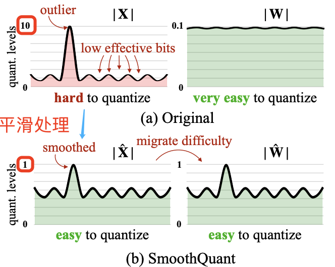
</div>

`SmoothQuant` 的核心思路是：激活 $X$ 之所以难以量化，是因为存在离群值拉伸了量化的线性映射范围，导致大部分数值的有效位数减少。我们在离线阶段将激活中的尺度变化转移到权重 $W$ 上，从而降低激活的量化难度。经过平滑处理的激活 $\hat{X}$ 和调整后的权重 $\hat{W}$ 均易于量化。
> 到这里可以看出 SmoothQuant 算法有两个难点：如何通过数学上的等效转换将量化的难度从激活迁移至权重上，以及如何实现逐通道的等效缩放转换。

## 2. 预备知识

**1，量化公式**：

在描述 SmoothQuant 的算法过程之前，得先掌握了解一些预备知识。**量化是将高精度连续浮点数映射为低精度的离散整数**，这里以经典的整数均匀量化（`INT8`）为例描述量化过程，量化公式如下所示：

$$X¯_{\text{INT8}} = \left\lfloor \frac{X_{\text{FP16}}}{\Delta} \right\rceil, \quad \Delta = \frac{\max(|X|)}{2^{N-1} - 1} \tag{1}$$

其中 $X$ 是浮点张量，$X¯$ 是量化后的整数张量，$\Delta$ 是缩放系数，$\left\lfloor·\right\rceil$ 表示四舍五入函数，$N$ 为量化位数（此处为 `8` 位）。这里假设张量围绕 $0$ 对称；对于非对称情况（例如经过 `ReLU` 激活后的数据），可以通过添加零点来进行调整（Jacob 等，2018）。

该量化方法基于浮点数绝对值最大值来计算缩放系数 $\Delta$，这会保留激活中的异常值，而这些异常值对模型的准确性至关重要 (Dettmers 等，2022)。我们可以基于部分校准样本集的激活值离线计算缩放系数 $\Delta$，称为静态量化；也可以在模型运行时根据激活统计数据来动态计算缩放系数，称为动态量化。

**2，量化粒度**

所谓量化有不同的粒度其实是指**基于不同的粒度去计算量化缩放系数**。

常见量化粒度的可视化如图 3 所示，其中逐张量量化是整个矩阵共用一个缩放系数 $\Delta$，而逐 token 量化和逐通道量化则为每个 token 或权重的输出通道设定不同的缩放系数。逐通道量化的粗略形式是分组量化，即通道组之间使用不同缩放系数 (Shen 等，2020；Yao 等，2022)。
> 论文用 setp size 表示 $\Delta$，这不易理解，所以本文中描述为缩放系数。

<div align="center">
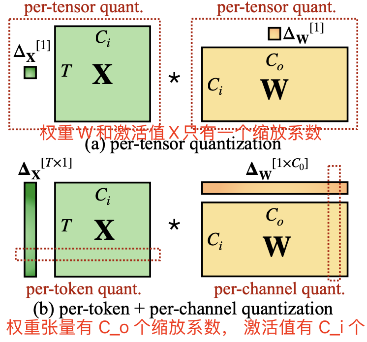
</div>

其中逐张量量化实现最简单、效率最高。**为了在向量级量化中充分利用 INT8 GEMM 内核**，我们只能在外部维度（如 token 维度 T 和输出通道维度 Co）上应用缩放因子，而无法在内部维度（如输入通道维度 Ci）上应用。

**3，transformer 模型中的线性层**。

Transformer(Vaswani 等，2017) 中的线性层计算公式如下所示：

$$Y = X \cdot W, \quad Y \in \mathbb{R}^{T \times C_o}, \quad X \in \mathbb{R}^{T \times C_i}, \quad W \in \mathbb{R}^{C_i \times C_o}$$

其中 $T$ 表示 token 数，$C_i$ 为输入通道数，$C_o$ 为输出通道数（为简化省略批量维度，见图 3）。通过将权重量化为 INT8，可将存储需求减半。然而，为了加速推理，我们需要同时将权重和激活量化为 INT8（即 W8A8）以充分利用支持整数运算的内核（例如 INT8 GEMM），这些内核广泛支持于多种硬件（例如 NVIDIA GPUs、Intel CPUs、Qualcomm DSPs 等）。

> 很明显这里 Transformer 线性层中的通道数其实就是隐藏层大小，即 $C_i = C_o = \mathrm{hidden\_ size}$。之所以用逐通道的概念，我猜是为了对应 CNN 模型中的张量通道概念，反正一般都是张量的最后一个维度。

## 3. 量化难点总结

**1，激活比权重更难量化**。

权重分布较均匀，易于量化。有研究表明 LLMs 的权重量化到 INT8 甚至 INT4 并不会影响精度 (Dettmers 等，2022；Yao 等，2022；Zeng 等，2022)，这与本论文的观察一致。

**2，激活值中的离群值是导致大模型难以量化的重要因素**。

激活中的离群值幅度比其他激活值大约 100 倍。对于逐张量量化（公式 1），异常值主导了最大幅度测量，从而压缩了非异常通道的有效量化位数（图 2）：假设某通道 $i$ 的最大幅度为 $m_i$，而整个矩阵的最大值为 $m$，则该通道的有效量化级别为 $2^8\cdot m_{i}/m$。对于非异常通道，有效量化级别会非常小（仅有 2-3 个级别），从而导致较大的量化误差。

**3，离群值通常出现于特定通道**。

作者对激活值进行了统计分析，发现离群值主要集中在少数通道中，一旦某个通道出现异常值，它会在所有 tokens 中持续存在（见图 4 红色标记）。对于特定 token，不同通道的激活值差异很大（少部分通道激活值很大，大部分通道较小），但同一通道内不同 tokens 的激活值幅度差异小（异常值通道幅度持续较大）。

<div align="center">
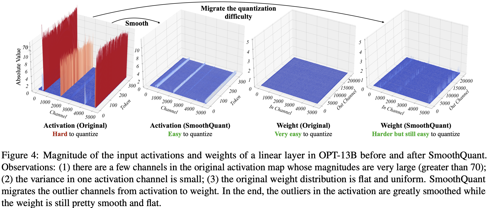
</div>

上述现象总结起来就是，**离群值跟通道相关跟 token 无关**，由此很明显，**应该对激活采用逐通道量化 (Bondarenko 等，2021)（即每个通道使用不同的量化系数），这可以大幅降低量化误差，逐 token 量化则帮助不大**。表 1 验证了这一假设：模拟的逐通道激活量化能使精度接近 FP16，与 Bondarenko 等的发现一致。

<div align="center">
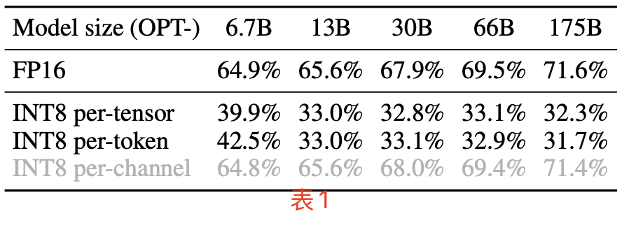
</div>

但是，逐通道激活量化并不适合硬件加速的 `GEMM` 内核（线性层计算），因为这些内核依赖于高吞吐量的连续操作（如 Tensor Core MMAs），无法容忍低吞吐量指令（如转换或 CUDA Core FMAs）的插入，而量化公式中无论是量化系数还是浮点数到定点数的转换都是用 CUDA Core 计算单元。

因此，在 `GEMM` 内核中，**为了不降低 `GEMM` 内核本身的吞吐量，量化的缩放操作只能沿矩阵乘法的外部维度进行（即激活的 `token` 维度和权重的输出通道维度 $C_o$，见图 3）**，通常在矩阵乘法完成后应用：

$$Y = \text{diag}(\Delta_X^{\text{FP16}}) \cdot (X¯^{\text{INT8}} \cdot W¯^{\text{INT8}}) \cdot \text{diag}(\Delta_W^{\text{FP16}}) \tag{2}$$

因此，尽管逐 `token` 激活量化精度只比逐张量量化稍高一点，但是为了不降低`GEMM` 内核本身的吞吐量，过往的研究依然还是在线性层中采用了它(Dettmers 等，2022；Yao 等，2022)。
> CUDA Core：用于执行传统的单一指令流任务，比如 FMA、加法、乘法等操作。每个 CUDA Core 每次只能执行一个简单的操作（如乘法和加法）。
Tensor Core：专门设计用于深度学习中的矩阵运算，特别适用于加速矩阵乘法和积累（MMA）操作。能直接支持混合精度运算（例如 FP16 运算），可以在单个时钟周期内执行多次乘法和累加操作，非常适合深度学习中的卷积操作和矩阵乘法。

## 4. SmoothQuant 算法

作者引入了一个 `smoothing factor` 向量，对激活值按通道除以 `smoothing factor`，从而降低激活值整体的方差。为了保持线性层在数学上的等价性，以相反的方式对权重进行对应调整：

$$Y = (X \cdot \text{diag}(s)^{-1}) \cdot (\text{diag}(s) \cdot W) = \hat{X} \cdot \hat{W} \tag{3}$$

> 简简单单的公式（3）就完成了对激活值中含有”离群值“的通道进行了平滑，把离群值“转移”到了权重上，这就是前面描述的将激活量化难度前移到权重上的原理，公式就一行，果然大道至简。

考虑到输入 $X$ 通常由前面的线性操作（如线性层、层归一化等）产生，我们可以轻松地**将平滑因子离线地融合到前一层的参数中，不会因额外的缩放操作而导致增加内核调用开销**。在一些其他情况下，例如当输入来自残差相加时，我们可以在残差分支中添加额外的缩放，类似于 Wei 等 (2022) 的方法。

**1，将激活的量化难度迁移到权重上。**

选择合适的**逐通道的平滑因子 $s$**，使得迁移后的激活 $\hat{X}  = X \cdot \text{diag}(s)^{-1}$ 更易于量化，这个很关键也很难（后续的AWQ 量化算法就是改进了 $s$ 的计算策略）。那么如何选择合适的 smoothing factor 向量 $s$ 呢：

- 一种极端情况，是令 $s_j = \max(\vert\mathbf{X}_j\vert), \quad j = 1, 2, \dots, C_i$，这会使得激活值的离群值全部转移到权重上面，激活值变得很好量化，权重反而难以量化。
- 另一种极端情况，是令 $s_j = \frac{1}{\max(\vert\mathbf{W}_j\vert)}$，即**将所有量化难度从权重迁移到激活**，这会使得原本方差较小的权重方差更小，激活值方差更大。

因此，作者通过引入一个超参数 $\alpha$，来平衡这两种极端情况，如以下公式：

$$
s_j = \frac{\max(|\mathbf{X}_j|)^{\alpha}}{\max(|\mathbf{W}_j|)^{1 - \alpha}} \tag{4}
$$

对于大多数模型，$\alpha = 0.5$ 是一个理想的平衡点，能够均匀分配量化难度，尤其是在对权重和激活使用相同量化器时（如逐张量、静态量化），公式（4）确保权重和激活的相应通道具有相似的最大值，从而共享相同的量化难度。图 5 展示了当 $\alpha = 0.5$ 时的平滑变换过程。

<div align="center">
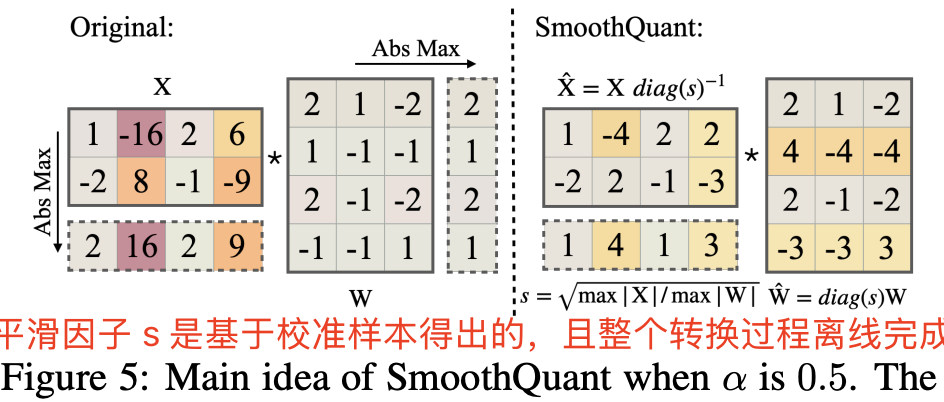
</div>

合适的迁移强度 $\alpha$（最佳平衡点）能够让激活和权重都便于量化。若 $\alpha$ 过大，权重的量化会变得困难；而若 $\alpha$ 过小，激活的量化会受到影响。对于一些激活异常值更显著的模型（如 GLM-130B (Zeng 等，2022)，其异常值约占 30%，使激活量化更具挑战），可以选择更大的 $\alpha$ 值，例如 0.75，以将更多量化难度迁移至权重。

**2, 将 SmoothQuant 应用于 Transformer 模型中**。

线性层占据了大型语言模型中大部分的参数量和计算开销。默认情况下，我们对自注意力和前馈层的输入激活进行平滑处理，并将所有线性层量化为 W8A8。同时，我们对注意力机制中的 `BMM` 操作进行量化。图 6 展示了我们针对 Transformer 模块设计的量化流程：对于计算密集的操作（如线性层和注意力层中的 BMM），我们将其输入和权重量化为 INT8，而对于 ReLU、Softmax、LayerNorm 等轻量级元素操作，则保持激活为 FP16。这样的设计使我们在准确性和推理效率间达到了良好的平衡。

<div align="center">
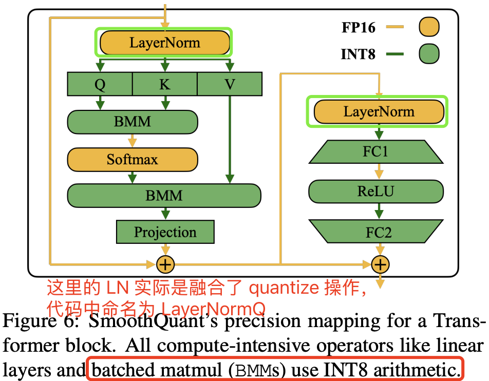
</div>

### 4.1 SmoothQuant 算法实现及简单实验

下述代码模仿官方仓库的量化算法，简单实现了对激活值、权重参数值进行了统计分析并可视化，以及应用了 smoothquant 后的平滑激活和权重统计值的可视化。真实的模型量化算法比这更复杂，校准集也更大，本代码只是尝试对特定层的特定线性层权重应用 SmoothQuant 量化，优点是代码可直接运行，更容易快速阅读来了解 SmoothQuant 的计算逻辑，仅供参考。

```python
import torch
import numpy as np
import matplotlib
# 使用更快的非交互式后端，适合批量渲染
matplotlib.use('Agg')
import matplotlib.pyplot as plt
from mpl_toolkits.mplot3d import Axes3D
from transformers import AutoModelForCausalLM, AutoTokenizer
import os
import plotly.graph_objects as go
import plotly.io as pio
pio.renderers.default = 'svg'

# 加载模型和分词器
def load_model_and_tokenizer(model_name, device):
    from transformers import AutoTokenizer, AutoModelForCausalLM
    
    tokenizer = AutoTokenizer.from_pretrained(model_name)
    if tokenizer.pad_token is None:
        tokenizer.pad_token = tokenizer.eos_token  # 设置 eos_token 为 pad_token
    
    model = AutoModelForCausalLM.from_pretrained(model_name, torch_dtype=torch.float16 if device.type == 'cuda' else torch.float32).to(device)
    model.eval()
    return model, tokenizer

# 运行推理并获取激活值和权重
@torch.no_grad()
def get_activations_and_weights(model, tokenizer, texts, layer_index=4, channel_indexs=200, device=None):
    inputs = tokenizer(texts, return_tensors="pt", padding=True, truncation=True).to(device)
    with torch.no_grad():
        outputs = model(**inputs, output_hidden_states=True)
    print("outputs.hidden_states shape is ", len(outputs.hidden_states))
    activation = outputs.hidden_states[layer_index].abs()[:, :, :]  # 激活值

    # 尝试兼容不同模型结构
    try:
        layers = model.model.layers
    except AttributeError:
        try:
            layers = model.transformer.h
        except AttributeError:
            raise RuntimeError("无法自动识别 transformer 层结构，请手动指定。")
        
    q_weight = layers[layer_index].self_attn.q_proj.weight.abs()[:, :]
    k_weight = layers[layer_index].self_attn.k_proj.weight.abs()[:, :]
    v_weight = layers[layer_index].self_attn.v_proj.weight.abs()[:, :]
    weights = [q_weight, k_weight, v_weight]
    print(f"activation shape is {activation.shape} self_attn.q_proj.weight shape is {weights[0].shape}")
    return activation, weights

# 计算 SmoothQuant 的缩放因子
@torch.no_grad()
def calculate_scales(activation, fcs, alpha=0.5):
    original_shape = activation.shape
    act_reshaped = activation.view(-1, original_shape[-1]).abs().detach()
    device = activation.device
    act_max = torch.max(act_reshaped, dim=0)[0].float().to(device)
    weight_max_list = torch.cat([fc.abs().max(dim=0, keepdim=True)[0] for fc in fcs], dim=0)
    w_max = weight_max_list.max(dim=0)[0].clamp(min=1e-5).to(device)
    print(f"act_max shape is {act_max.shape}, w_max shape is {w_max.shape}")
    scales = act_max.pow(alpha) / w_max.pow(1 - alpha)
    print(f"scales shape is {scales.shape}")
    return scales

# 应用 SmoothQuant 缩放因子到激活值和权重
@torch.no_grad()
def apply_smoothquant_scaling(activation, weights, scales):
    smooth_activation = activation / scales.view(1, 1, -1)
    q_proj_weight = weights[0]
    smooth_q_weight = q_proj_weight * scales.view(1, -1)
    print(f"smooth_activation_sample shape is {smooth_activation.shape} q_proj smooth_weight shape is {smooth_q_weight.shape}")
    return smooth_activation, smooth_q_weight

# 检测离群值并打印通道索引
def find_outlier_channels(act, threshold=10):
    # 对每一列判断是否有元素 > threshold，得到布尔 mask，形状 [C]
    col_mask = (act > threshold).any(dim=0)

    # 提取列索引
    idx = torch.where(col_mask)[0]
    print("存在元素 >20 的通道索引:", idx.tolist())

# 3D 绘图函数
def plot_3d_plotly(data, title, html_file):
    """使用 plotly 画 3D Surface，并保存为 html。data 应为 numpy 2D。"""
    fig = go.Figure(data=[go.Surface(z=data.astype(np.float32))])
    fig.update_layout(title=title, autosize=True,
                      scene=dict(xaxis_title='Channel', yaxis_title='Token', zaxis_title='Absolute Value'))
    fig.write_html(html_file)
    print(f"已保存图表 {html_file}")

# 主函数，执行各个步骤
def main():
    model_name = "/llm_weights/Qwen3-1.7B"
    layer_index=2
    device = torch.device('cuda' if torch.cuda.is_available() else 'cpu')
    try:
        model, tokenizer = load_model_and_tokenizer(model_name, device)
    except Exception as e:
        print(f"模型加载失败: {e}")
        return
    input_texts = [
        "The quick brown fox jumps over the lazy dog. " * 2,
        "Artificial intelligence is revolutionizing the world. " * 2,
        "Large language models are powerful tools for NLP tasks. " * 2,
        "The meaning of life is to find " * 2
    ]

    activation_sample, weight_sample = get_activations_and_weights(model, tokenizer, input_texts, layer_index=layer_index, device=device)

    # 检查离群值所在通道
    find_outlier_channels(activation_sample)

    # 计算 SmoothQuant 缩放因子并应用平滑转换
    scales = calculate_scales(activation_sample, weight_sample)
    smooth_activation_sample, smooth_weight_sample = apply_smoothquant_scaling(activation_sample, weight_sample, scales)
 
    try:
        y_max = max(
            np.max(activation_sample.cpu().numpy()),
            np.max(smooth_activation_sample.cpu().numpy()),
            np.max(weight_sample[0].cpu().numpy()),
            np.max(smooth_weight_sample.cpu().numpy())
        )
        batch_size, seq_len, hidden_size = activation_sample.shape
        activation_sample_2d = activation_sample.view(-1, hidden_size)
        smooth_activation_sample_2d = smooth_activation_sample.view(-1, hidden_size)

        # 使用 plotly 绘图并保存 html
        plot_3d_plotly(activation_sample_2d.detach().cpu().numpy(),
                       f"Layer {layer_index} Activation (Original) - Hard to quantize",
                       "activation_original.html")
        plot_3d_plotly(smooth_activation_sample_2d.detach().cpu().numpy(),
                       f"Layer {layer_index} Activation (SmoothQuant) - Easy to quantize",
                       "activation_smooth.html")
        plot_3d_plotly(weight_sample[0].detach().cpu().numpy(),
                       f"Layer {layer_index} Weight (Original) - Very easy to quantize",
                       "weight_original.html")
        plot_3d_plotly(smooth_weight_sample.detach().cpu().numpy(),
                       f"Layer {layer_index} Weight (SmoothQuant) - Harder but still easy to quantize",
                       "weight_smooth.html")
        # 保存张量数据
        torch.save({
            'activation_original': activation_sample.cpu(),
            'activation_smooth': smooth_activation_sample.cpu()
        }, 'activation_tensors.pt')

        torch.save({
            'weight_original': weight_sample[0].cpu(),
            'weight_smooth': smooth_weight_sample.cpu()
        }, 'weight_tensors.pt')
        print("激活和权重张量已保存为 activation_tensors.pt 与 weight_tensors.pt")
    except Exception as e:
        print(f"绘图失败: {e}")
        return

if __name__ == "__main__":
    main()
```

代码运行分别测试了好几个层的输入激活值和 q、k 线性层权重及其平滑后的可视化结果如下图所示，我的实验没有完全复现出了作者观察到的现象“离群值通常出现于特定通道”的那种完美现象，但是确实离群值会倾向在特定通道。

<div align="center">
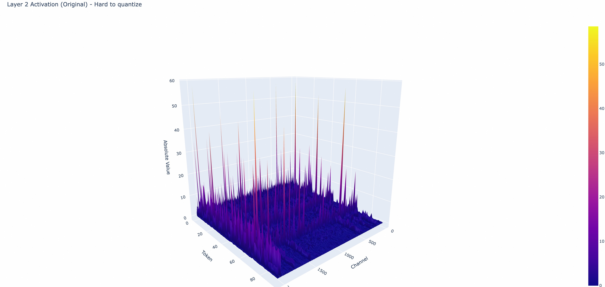
</div>

## 5. 实验

### 5.1 实验设置

作者在两个后端实现了 SmoothQuant：(1) PyTorch Huggingface，用于概念验证；(2) FasterTransformer，作为高性能生产环境框架的示例。

在 PyTorch Huggingface 和 FasterTransformer 框架中，作者基于 CUTLASS INT8 GEMM 内核实现了 INT8 线性模块和批量矩阵乘法 (BMM) 功能，并直接将原先的浮点（FP16）线性模块和 BMM 函数替换为 INT8 内核，从而构建 INT8 模型推理。

### 5.2 量化后精度对比实验

作者做了大量的实验证明了，SmoothQuant 在不同类型、不同规模的 LLM 上，都能 INT8 量化下保持与 FP16 相当的精度。即使是最新的 Llama-2 (Touvron 等，2023b)、Falcon (Almazrouei 等，2023)、Mistral (Jiang 等，2023) 和 Mixtral (Jiang 等，2024) 模型，也能实现无损的 W8A8 量化，如下表 7 所示:

<div align="center">

</div>

> SmoothQuant 中使用逐 token 激活量化和逐通道权重量化。

### 5.3 加速和节省内存对比实验

本节中的实验展示了集成到 PyTorch 和 FasterTransformer 中的 SmoothQuant-O3 的实际加速和内存节省效果。

**Prefill 阶段 PyTorch 实现**。

图 8 展示了基于 PyTorch 实现的推理延迟和峰值内存使用情况。SmoothQuant 一直比 FP16 基线更快，在 OPT-30B 模型（序列长度为 256）上实现了 1.51 倍的加速。同时，观察到，**模型越大，加速越显著**。与之对比，LLM.int8() 几乎总是比 FP16 基线慢，因为它的混合精度激活表示产生了较大的开销。在内存使用上，SmoothQuant 和 LLM.int8() 都能将 FP16 模型的内存占用几乎减半；其中，SmoothQuant 节省的内存略多一些，因为它采用了全 INT8 GEMM 运算。

<div align="center">
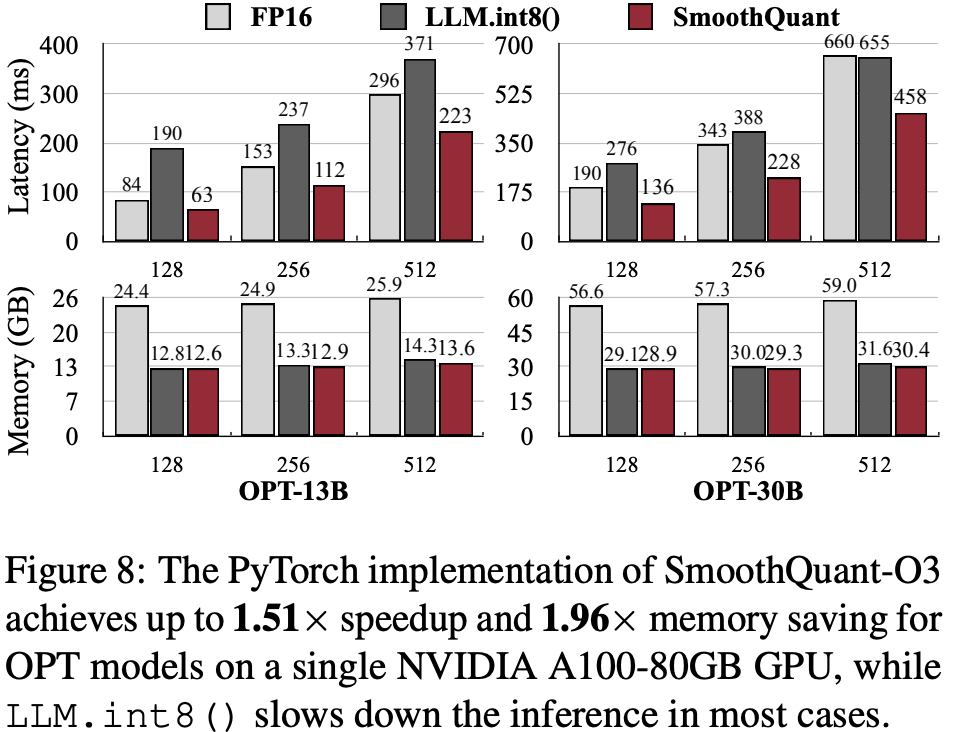
</div>

**Prefill 阶段 FasterTransformer 实现**

如图 9（顶部）所示，与 FasterTransformer 的 FP16 实现的 OPT 相比，单 GPU 情况下 SmoothQuant-O3 可以进一步减少 OPT-13B 和 OPT-30B 的执行延迟，最高可达 1.56 倍加速。值得一提的是，对于必须分布在多个 GPU 上的大型模型，SmoothQuant 在使用一半 GPU 数量的情况下实现了相似甚至更好的延迟表现。

<div align="center">
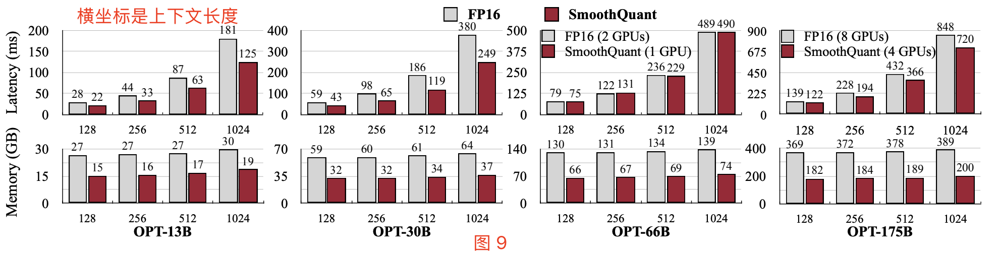
</div>

**decode 阶段**。

表 8 显示 SmoothQuant 可以大幅加速 LLM 的自回归解码阶段。相比 FP16，SmoothQuant 持续降低了逐 token 解码的延迟，**最高达 1.42 倍加速**。此外，SmoothQuant 将 LLM 推理的内存占用减半，使得部署成本大幅降低.

<div align="center">
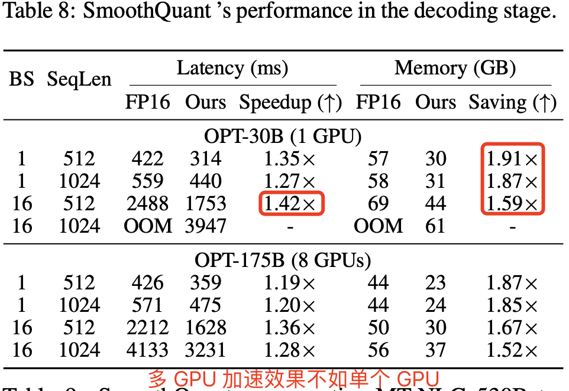
</div>

### 5.4 扩展：在单节点内运行 530B 模型

如表 9 和表 10 所示，SmoothQuant 能够在几乎无精度损失的情况下量化 530B 模型。模型尺寸的减小使得我们在相似的延迟下，仅需一半的 GPU 数量（从 16 减至 8）即可运行该模型，从而支持在单个节点（8×A100 80GB GPU）上部署超过 500B 的模型。

<div align="center">
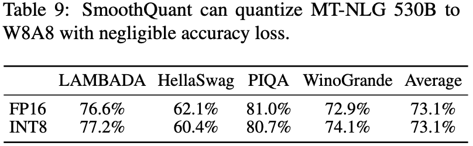
</div>

### 5.5 消融研究

**量化方案：量化粒度对延迟的影响**。表 11 显示了基于我们 PyTorch 实现的不同量化方案的推理延迟。可以看到，**量化粒度越粗（从 O1 到 O3），延迟越低**。此外，**静态量化可以显著加速推理，因为不再需要在运行时计算量化步长**。在所有设置下，SmoothQuant 的速度都比 FP16 基线更快，而 LLM.int8() 通常较慢。如果精度允许，我们建议使用较粗的量化方案。

<div align="center">
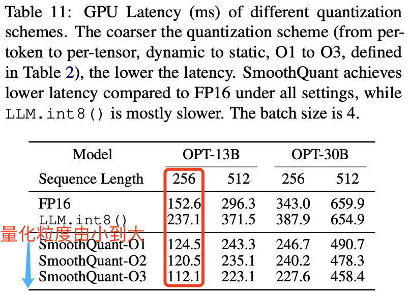
</div>

**迁移强度：$\alpha$ 超参数对精度的影响**。我们需要找到合适的迁移强度 $\alpha$（参见方程 4）来平衡权重和激活的量化难度。图 10 显示了在 OPT-175B 上使用 LAMBADA 测试不同 $\alpha$ 值的效果。当 $\alpha$ 过小（<0.4）时，激活难以量化；当 $\alpha$ 过大（>0.6）时，权重难以量化。只有在选择位于最佳平衡区间（0.4-0.6）的 $\alpha$ 时，才能同时减少权重和激活的量化误差，并在量化后保持模型性能。

<div align="center">
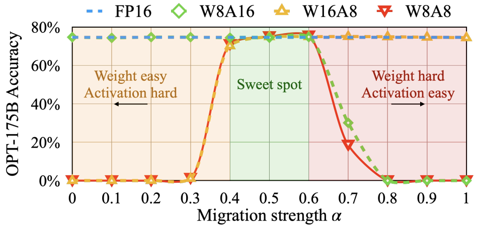
</div>

## 参考资料

- [深入理解SmoothQuant量化技术](https://zhuanlan.zhihu.com/p/703928680)
- [SmoothQuant: Accurate and Efficient Post-Training Quantization for Large Language Models](https://arxiv.org/pdf/2211.10438)
- [https://github.com/mit-han-lab/smoothquant](https://github.com/mit-han-lab/smoothquant)