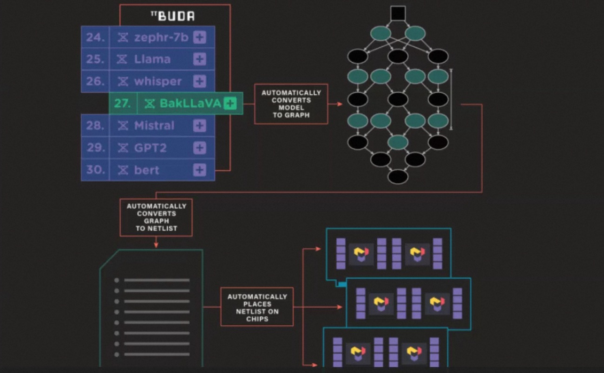
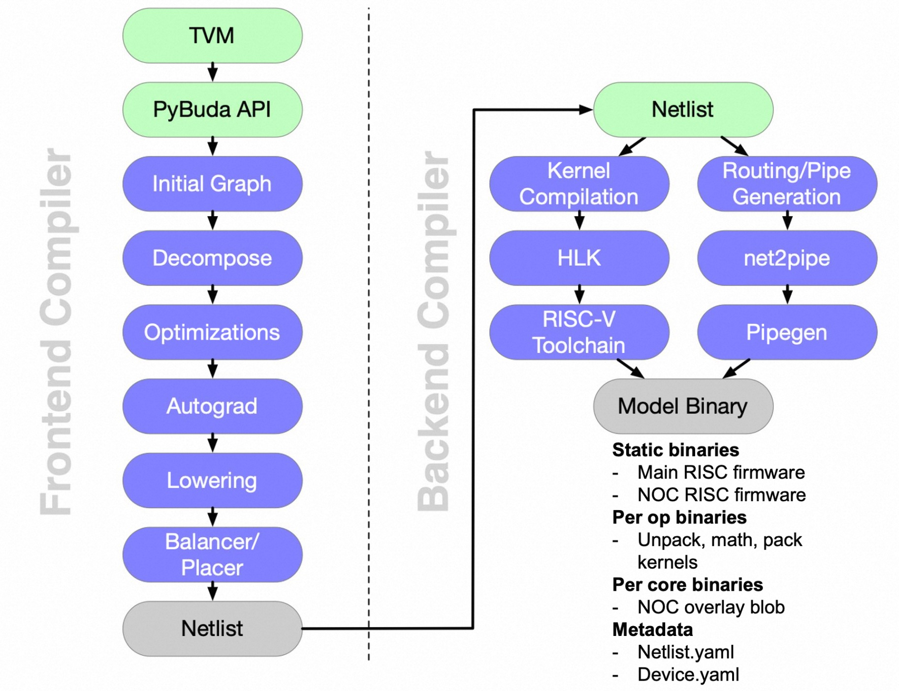

- [整体架构分析](#整体架构分析)
  - [Frontend](#frontend)
  - [Backend](#backend)
- [runtime API 实例](#runtime-api-实例)
- [参考资料](#参考资料)

`TT-BUDA` 是为 `Tenstorrent` 芯片开发的 `AI` 软件栈，兼容主流深度学习框架如 Pytorch、TensorFlow 等，通过 TT-BUDA 软件栈能够生成可执行文件，用于在 Tenstorrent 芯片上运行的 AI 模型。

## 整体架构分析

深度学习模型在 `TT-BUDA` 软件栈下的编译执行流程过程如下图所示：



从上图可以看出 tt-buda 编译执行过程分成 3 部分：

1. 根据深度学习模型生成**计算图**；
2. 解析计算图生成算子（网络层）列表 `Netlist`；
3. `Netlist` 映射到具体计算设备上。

上述 3 步的详细过程如下图所示:



和其他 AI 芯片的编译器相同点是，tt-buda 软件栈也分为：前端 frontend 和后端 backend 两部分，不同点是 tt-buda 用 Netlist 作为模型的中间表示。

Netlist 是 tt-buda 软件栈的中间表示（也可理解为 Tenstorrent 芯片深度学习框架的**自定义模式格式文件**），格式为 YAML 文件。它描述了 BUDA 后端的工作负载，包含了几个组成部分：设备、队列、图、操作（op）、程序等等（详细分析见下期教程）。

### Frontend

使用 TVM 将深度学习模型转换成 `PyBuda` `API`，然后生成计算图，经过图优化、自动微分、Lowering、Balancer/Placer 步骤得到中间表示 `Netlist`。

### Backend

Backend 这部分跟芯片架构强相关，其主要分为两部分：
- **生成可执行文件**：将 Netlist 中描述的算子（op）翻译成 HLK（high level kernel，高层次算子），然后调用自定义的 RISC-V 编译器（gcc），将算子编译成可执行文件（包含 RISC-V 标准指令和自定义指令）。
- **生成路由文件**：将 Netlist 中描述的数据传输信息，通过工具 net2pipe 和 pipegen，翻译成 NOC overlay blob（一种 NoC 配置文件）。

## runtime API 实例

下面代码是基于 `runtime` `API` 运行 `bert` 模型推理的示例。因为 `bert` 模型的输入是指定形状的随机张量，所以省略了输入前处理和输出后处理的代码。

```python
import pybuda
import torch
from transformers import BertModel, BertConfig

# 省略了配置 PyBUDA 参数 代码

# Download the model from huggingface
model = BertModel.from_pretrained("bert-base-uncased") # 1

# Create a PyBUDA module from PyTorch model
module = pybuda.PyTorchModule("bert_encoder", model.encoder) # 2

# Instantiate a tenstorrent device
tt0 = pybuda.TTDevice(
    "tt0",
    module=module,
    arch=pybuda.BackendDevice.Wormhole_B0,
    devtype=pybuda.BackendType.Silicon,
) # 3

# Create an input tensor
seq_len = 128
input = torch.randn(1, seq_len, model.config.hidden_size)

# Compile + runtime inference on Tenstorrent device
output_queue = pybuda.run_inference(inputs=[input]) # 4
print(output_queue.get()) # get last value from output queue
```

整体来看，`runtime api` 调用的流程可以总结为以下 4 个：
1. transformers 下载和加载模型；
2. PyTorchModule 类对 nn.Module 模型的重新包装（解析）；
3. 使用 pybuda.TTDevice 接口创建 TT 设备；
4. 调用 pybuda.run_inference 接口在设备上推理模型。

`pybuda.run_inference` 是封装好的一键推理接口，会自动识别已有的设备。设备类型有 `CPUDevice` 和 `TTDevice`（tenstorrent 设备，Grayskull、Wormhole）两种，如果存在 `TTDevice` 不支持的算子，则需要将将算子映射到 `CPUDevice` 上执行（可以通过编译参数控制是否自动执行，而不需要手动创建 CPUDevice）。`pybuda.PyTorchModule` 是 Pytorch 模型的 `Wrapper`，使用外部框架模型前，需要使用包装器封装一下。

另外，tt-buda 对第三方框架的兼容性很好，Pytorch 和 Tensorflow 完全支持，Onnx 和 Tensorflow Lite 部分支持。

## 参考资料

- [TT buda 官方文档](https://docs.tenstorrent.com/pybuda/latest/api.html#module-pybuda)
- [tt-buda-demos/first_5_steps/2_running_nlp_models.ipynb](https://github.com/tenstorrent/tt-buda-demos/blob/main/first_5_steps/2_running_nlp_models.ipynb)
- [探索 Tenstorrent 的 AI 开发软件栈：TT-BUDA](https://1nfinite.ai/t/tenstorrent-ai-tt-buda/102)
