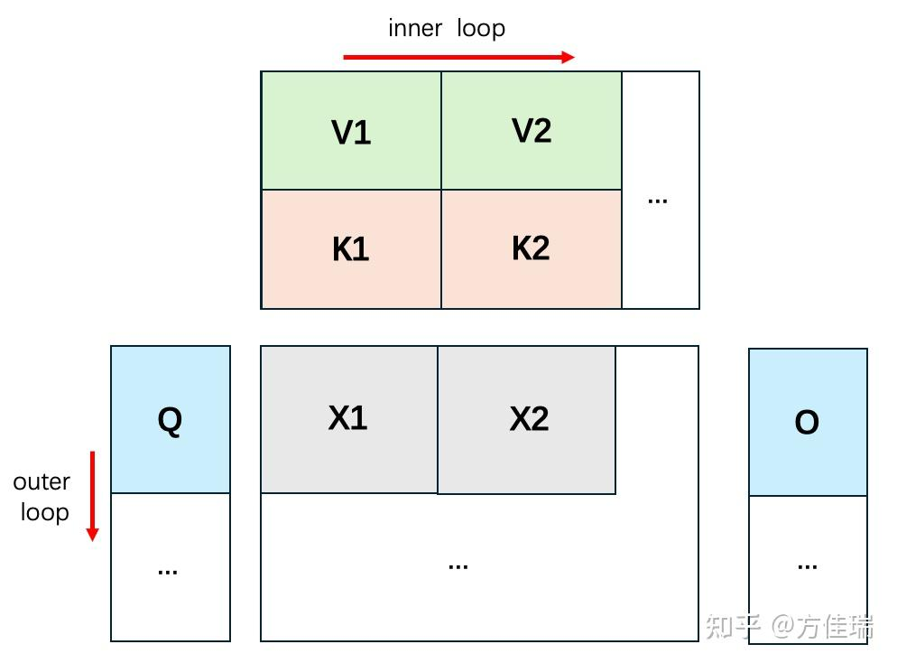

- [1. flash-attention 算法原理](#1-flash-attention-算法原理)
  - [背景知识](#背景知识)
  - [flash-attention 算法推导](#flash-attention-算法推导)
- [2. flashattention 代码](#2-flashattention-代码)
  - [参考资料](#参考资料)

## 1. flash-attention 算法原理

### 背景知识

先看下标准 attention 计算公式：

$$\text{S = QK}^\text{T} \in \mathbb{R}^{N\times N},\quad \text{P = softmax(S)} \in \mathbb{R}^{N\times N},\quad \text{O = PV}\in \mathbb{R}^{N\times d}$$

而 flashattention 是基于分块思想，如下图所示，我们从左向右计算有颜色的部分，对于 Q 增加一个外层循环，KV 增加内层循环长度，K1, K2, K3,… & V1, V2, V3, …，图中规模较小，但是泛化到更多块数据是一样的公式。

<div align="center">

</div>

### flash-attention 算法推导

前面的总结文章已经知道了 flashattention 是基于 online softmax 进一步延伸到 attention 的计算中去的，由此，先看下 online softmax 的简化公式。

- `softmax = exp(x - m) / sum(exp(x - m))`, 其中 m = max(x), softmax 输出可迭代和分块求解。

下面再总结下 flashattention 的算法公式，这里为了方便从公式推导代码，公式部分我做了简化。

1，计算 QK^T:

- S1 = QK1^T
- S2 = QK2^T

2，寻找 S1 S2 的最大值，这里的 m1 其实并不准确，需要算好 m2 后再回头看是否需要更新 m1：
- `m1 = max(S1)`
- `m2 = max(S1, S2) = max(m1, max(S2))`

3, 计算 `online-softmax` 分子(`numerator`):

- `n1 = exp(S1 - m1)`
- `n2 = exp(S2 - m2)`

迭代更新后的 n1' = exp(S1 - m2) = exp(S1 - m1) * exp(m1 - m2)，设常数 `alpha = exp(m1 - m2)`，则可知:

- `n1' = n1 * alpha`

4，计算 online-softmax 分母(`Denominator`)，即归一化项 `d`:

- `d1 = sum(exp(S1 - m1))`
- `d2 = sum(exp(S2 - m2))`

同样的迭代更新后的 d1' = sum(exp(S1 - m2)) = sum(exp(S1 - m1) * alpha) = d1 * alpha。

- `d1' = d1 * alpha`

另外，[d1', d2] 的归一化项可由分块 1 和 分块 2 的归一化项直接相加得到，即 [d1', d2] = d12 = d1' * alpha + d2。

- `d12 = d1' * alpha + d2`

5，计算 attention 输出 O

- `O1 = (n1'/d1') * V1 = (n1 * alpha / d1 * alpha) * V1 = n1 * V1 / d1`
- `O2 = (n2/d2) * V2 = n2 * V2/ d2`

上面的都是分块的结果，那么如何结合在一起呢，首先很明显：

O = [n1', n2] / (d1' + d2) * [V1, V2]

先省略推导，根据论文算法 1 可知：

`O = O1 × d1 / d12 × alpha + n2 x V2 / d12 x beta`，其中 `beta = exp(m2 - m12), alpha = exp(m1 - m12)`

> 这部分推导可能有问题，后续更新。

<!-- 根据矩阵乘法性质：[N1, N2] * [V1, V2]^T = A1V1 + A2V2，可推：O = n1' * V1 / (d1' + d2) + n2 * V2 / (d1' + d2) = n1 * alpha * V1 / d12 + n2 * V2 / d12；又因为 O1 = n1 * V1/d1 => V1 = O1 * d1 / n1，可得，`O` 的迭代更新公式:

- `O = O1 * d1 / d12 * alpha + (n2 / d12) * V2`

> 网上有资料也写成将右边公式这样转换：因为 O2 = n2 * V2/d2 => n2 * V2 = O2 * d2，所以右边部分可写成 `O2 * d2 / d12`。但这样有重复计算的嫌疑，我上面的式子直接计算 第二个块的 O2 = softmax(qk^t) * V，应该更快些。 -->

## 2. flashattention 代码

在代码实现中，其中 m、d、O 的初始化项都设为 0。这里我先省略偏移地址计算的代码，重点先在于写 flashattention 的计算代码。

```python
# 初始化用于计算 softmax 归一化项的 m 和 d, 意义见 online-softmax, 这里
m_i = tl.zeros((BLOCK_M_SIZE,), dtype=tl.float32) - float("inf")
d_i = tl.zeros((BLOCK_M_SIZE,), dtype=tl.float32)
o_i = tl.zeros((BLOCK_M_SIZE, BLOCK_DHEAD_SIZE), dtype=tl.float32)

q_mask = m_offs[:, None] < m_size
q = tl.load(q_ptrs, mask=q_mask, other=0.0)

for block_n_start_idx in range(0, n_size, BLOCK_N_SIZE):
    block_n_offs = block_n_start_idx + n_range_offs
    k_mask = block_n_offs[:, None] < n_size
    k = tl.load(k_ptrs + block_n_start_idx * k_seq_stride, mask=k_mask, other=0.0

    # qk^t 初始化赋值 0
    qk = tl.zeros((BLOCK_M_SIZE, BLOCK_N_SIZE), dtype=tl.float32)
    qk = tl.dot(q, tl.trans(k))
    qk *= scale # scale 是 \sqrt{d_k}

    m_j = tl.max(qk, 1)
    n_j = tl.exp(qk - m_j[:, None])   # 计算 softmax 的分子项
    d_j = tl.sum(n_j, 1)     # 计算 softmax 的分母项，即归一化项

    m_new = tl.maximum(m_j, m_i) # 更新 qk^t 最大值
    
    alpha = tl.exp(m_i - m_new)
    beta = tl.exp(m_j - m_new)
    d_new = alpha * d_i + beta * d_j

    scale1 = d_i / d_new * alpha 
    o_i = o_i * scale[:, None]
    
    p_scale = beta / d_new
    qk_softmax = n_j * p_scale[:, None]
    V = tl.load(v_ptrs + block_n_start_idx * v_k_stride, mask=v_ptr_mask, other=0.0)
    o_i += tl.dot(qk_softmax, V)

    # 更新 m_i、d_i、o_i 用于下一轮计算
    m_i = m_new
    d_i = d_new
```

值得注意的是，本文的代码的实现是针对 flashattention1 论文的算法 1。

<div align="center">

</div>

### 参考资料

- [FlashAttentions](https://jcf94.com/2024/02/24/2024-02-24-flash-attention/)
- [榨干 GPU 效能的 Flash Attention 3](https://tomohiroliu22.medium.com/%E6%A6%A8%E4%B9%BEgpu%E6%95%88%E8%83%BD%E7%9A%84flashattention%E7%AC%AC%E4%B8%89%E4%BB%A3-4a8b0a2a812e)
- [FlashAttention算法之美：极简推导版](https://zhuanlan.zhihu.com/p/4264163756)