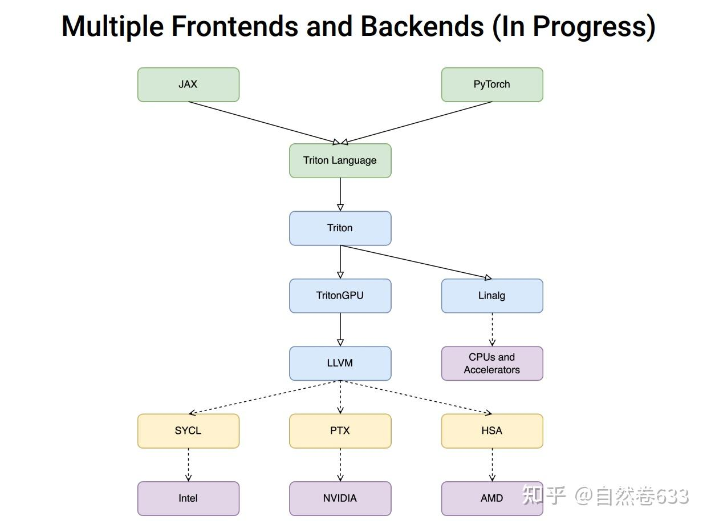

- [一 Triton 概述](#一-triton-概述)
- [二 Triton 编译（JIT）入口](#二-triton-编译jit入口)
  - [2.1 jit() 函数](#21-jit-函数)
  - [2.2 JITFunction 类](#22-jitfunction-类)
  - [2.3 ASTSource 类](#23-astsource-类)
- [三 内核编译函数 compile](#三-内核编译函数-compile)
  - [AST -\> TritonIR](#ast---tritonir)
- [四 内核 compile 流程解析](#四-内核-compile-流程解析)
  - [Backend 系统](#backend-系统)
  - [4.1 make\_ttir](#41-make_ttir)
  - [4.2 make\_ttgir](#42-make_ttgir)
  - [4.3 make\_llir](#43-make_llir)
  - [4.4 make\_ptx](#44-make_ptx)
  - [4.5 make\_cubin](#45-make_cubin)
- [参考资料](#参考资料)

## 一 Triton 概述

Triton 既是语言，可用于编写高性能计算 GPU kernel，使用 Triton 编写核函数必须按照其提供的 DSL 进行编写，否则运行失败。也是编译器（根据配置自动生成 kernel），采用 just-in-time 机制进行编译。如果你编写了一个用 `triton.jit` 修饰的核函数，那么在运行时其会被编译成底层 GPU 二进制（`PTX / SASS`），并马上执行。

Triton编译器的架构，包括**前端、优化器以及后端等部件**。

1. **前端**（Frontend）： 用于将用户使用 Python 编写的 kernel 或者 Pytorch 2.0 中通过 Inductor 生成的 TritonKernel 转换为对应的 Triton IR。
2. **优化器**（Optimizer）：通过各类 pass 将 Triton IR 逐步转换并优化为 TritonGPU IR。
3. **后端**（Backend）：将 TritonGPU IR 逐步转换为 LLVM IR，对于 NVIDIA GPU 最终会被编译为 `cubin` 文件。

## 二 Triton 编译（JIT）入口

Triton kernel 入口：python 代码中使用 `triton.jit` 装饰器修饰的函数，被视为“Triton Kernel”，函数内部可使用 Triton 的 DSL（域专用语言）来编写 GEMM、reduce 算子等。

下面以官方给出的经典张量 Add 的 kernel 来简单剖析 triton 编译流程：

```python
@triton.jit
def add_kernel(x_ptr,  # *Pointer* to first input vector.
               y_ptr,  # *Pointer* to second input vector.
               output_ptr,  # *Pointer* to output vector.
               n_elements,  # Size of the vector.
               BLOCK_SIZE: tl.constexpr,  # Number of elements each program should process.
               # NOTE: `constexpr` so it can be used as a shape value.
               ):
    pid = tl.program_id(axis=0)  # We use a 1D launch grid so axis is 0.
    block_start = pid * BLOCK_SIZE
    offsets = block_start + tl.arange(0, BLOCK_SIZE)
    # Create a mask to guard memory operations against out-of-bounds accesses.
    mask = offsets < n_elements
    # Load x and y from DRAM, masking out any extra elements in case the input is not a multiple of the block size.
    x = tl.load(x_ptr + offsets, mask=mask)
    y = tl.load(y_ptr + offsets, mask=mask)
    output = x + y
    # Write x + y back to DRAM.
    tl.store(output_ptr + offsets, output, mask=mask) 

def add(x: torch.Tensor, y: torch.Tensor):
    output = torch.empty_like(x) # preallocate the output.
    assert x.device == DEVICE and y.device == DEVICE and output.device == DEVICE
    n_elements = output.numel()
    # In this case, we use a 1D grid where the size is the number of blocks:
    grid = lambda meta: (triton.cdiv(n_elements, meta['BLOCK_SIZE']), )
    # NOTE:
    #  - Each torch.tensor object is implicitly converted into a pointer to its first element.
    #  - `triton.jit`'ed functions can be indexed with a launch grid to obtain a callable GPU kernel.
    #  - Don't forget to pass meta-parameters as keywords arguments.
    add_kernel[grid](x, y, output, n_elements, BLOCK_SIZE=1024)
    
    return output 
```

### 2.1 jit() 函数

`python/triton/runtime/jit.py`: `jit()` 装饰器函数将原始函数 fn 封装为 JIT 函数: `JITFunction`，**JITFunction 被调用的时候，是以 `fn[grid](*args, **kwargs)` 的形式被调用的**。jit() 函数执行流程：
1. decorator 装饰器定义：检查环境变量 TRITON_INTERPRET：
    - 如果设置为 "1"，返回 `InterpretedFunction` （用于调试）
    - 否则返回 `JITFunction` （正常编译模式）
2. 装饰器将原始函数封装为 JIT 函数并返回。

### 2.2 JITFunction 类

JITFunction 类继承自 `KernelInterface`，KernelInterface 类定义了内核函数的**基本接口和启动机制**，其代码实现如下所示，很明显，通过 `__getitem__` 方法允许使用方括号语法 `[grid]` 来设置内核的执行网格，这里的网格参数定义了 **kernel 的并行执行结构**。
> `__getitem_` 是 Python 的**魔法方法**，通常用来定义 `obj[key]` 的行为。KernelInterface 类继承自 `Generic`：泛型类型的抽象基类。Generic 作为所有泛型类的基类，提供类型参数化的基础设施。

```python
class KernelInterface(Generic[T]):
    run: T

    def __getitem__(self, grid) -> T:
        """
        A JIT function is launched with: fn[grid](*args, **kwargs).
        Hence JITFunction.__getitem__ returns a callable proxy that
        memorizes the grid.
        """
        return lambda *args, **kwargs: self.run(grid=grid, warmup=False, *args, **kwargs)
        # return cast(T, functools.partial(cast(Callable, self.run), grid=grid))
```

`__getitem__` 会返回一个匿名函数（lambda），其调用了 `self.run` 函数，并记住了 grid 参数。self.run() 函数在子类 `JITFunction` 中实现，函数执行流程包括:

1. **获取/设置编译、执行环境**: 通过 driver.active.get_current_device() 与 driver.active.get_current_stream(device) 来获取当前设备和流（stream）。
2. **调用预处理钩子（pre_run_hooks）**: 在运行或编译前，可以执行一些用户自定义的操作（例如日志、数据检查、统计）。
3. **绑定参数、生成内核缓存键**: 与 binder 交互，将传入的 `*args, **kwargs` 绑定成特定的参数结构并生成 “specialization” 信息。然后使用 `specialization + options` 组合成一个字符串 str 类型的**缓存键 key**。
4. **通过 `kernel = kernel_cache.get(key, None)` 查找或编译内核**: 如果缓存中已有对应内核，则复用；否则就走编译流程并把新编译的内核写回缓存。
5. **执行内核（可选）**: 如果 warmup=False，则真正将内核提交到 GPU 执行，传入相应的网格大小（grid）及参数；否则仅完成编译预热（不执行），返回编译后的 kernel。
6. **返回编译（或缓存）得到的内核对象**。

这里重点分析下 triton 编译内核的过程代码:

```python
# 当内核未缓存时执行编译流程
if kernel is None:
    # -------------------- 选项处理 --------------------
    # 从kwargs解析后端编译选项（如GPU架构参数等）
    options = backend.parse_options(kwargs)
    
    # -------------------- 签名构建 --------------------
    # 从类参数中获取参数名称列表
    sigkeys = [x.name for x in self.params]
    # 从特化参数中获取参数值列表（第一个元素为参数值）
    sigvals = [x[0] for x in specialization]
    # 构建参数名-值映射的签名字典
    signature = {k: v for (k, v) in zip(sigkeys, sigvals)}
    
    # -------------------- 参数校验 --------------------
    # 检查是否使用了已弃用的设备相关参数
    assert "device_type" not in kwargs, "device_type选项已弃用，将使用当前目标设备"
    assert "device" not in kwargs, "device选项已弃用，将使用当前设备"
    assert "stream" not in kwargs, "stream选项已弃用，将使用当前流"
    # 验证所有传入参数是否合法
    for k in kwargs:
        if k not in options.__dict__ and k not in sigkeys:
            raise KeyError(f"检测到未识别的关键字参数: {k}")

    # -------------------- 常量表达式处理 --------------------
    # 查找标记为constexpr的常量参数路径
    constexprs = find_paths_if(sigvals, lambda _, val: val == "constexpr")
    # 获取这些常量参数的实际值（用于编译时优化）
    constexprs = {path: get_iterable_path(list(bound_args.values()), path) for path in constexprs}

    # -------------------- 属性处理 --------------------
    # 从特化参数中获取属性值（第二个元素为属性）
    attrvals = [x[1] for x in specialization]
    # 查找字符串类型的属性路径（如GPU内存配置参数）
    attrs = find_paths_if(attrvals, lambda _, x: isinstance(x, str))
    # 解析属性配置（转换为后端需要的格式）
    attrs = {k: backend.parse_attr(get_iterable_path(attrvals, k)) for k in attrs}

    # -------------------- 编译前钩子 --------------------
    # 执行预编译钩子函数（如缓存检查、日志记录等）
    if self._call_hook(key, signature, device, constexprs, options, [attrs], warmup, before=True):
        return None  # 如果钩子返回True则中止编译

    # -------------------- 编译流程 --------------------
    # 生成抽象语法树（AST）形式的源代码
    src = self.ASTSource(self, signature, constexprs, attrs)
    # 调用后端编译器生成可执行内核
    kernel = self.compile(src, target=target, options=options.__dict__)
    # 将编译结果缓存
    kernel_cache[key] = kernel
    
    # -------------------- 编译后钩子 --------------------
    # 执行后编译钩子函数（如性能分析、资源注册等）
    self._call_hook(key, signature, device, constexprs, options, [attrs], warmup, before=False)
```

上述代码看着很复杂，但大部分都是预处理流程代码，真正的内核编译代码就三行：通过抽象语法树 `AST` **生成中间代码**，调用编译器函数 self.compile，并缓存结果。

```python
src = self.ASTSource(self, signature, constexprs, attrs)
# print(src.code) 可直接打印生成的 GPU 代码
kernel = self.compile(src, target=target, options=options.__dict__)
kernel_cache[key] = kernel
```

### 2.3 ASTSource 类

triton/compiler/compiler.py: `ASTSource` 是 Triton 编译器中的一个关键类，负责**管理和处理源代码的抽象语法树**(AST)。

JITFunction.run 函数调用 ASTSource 类的代码是：`src = self.ASTSource(self, signature, constexprs, attrs)`。

这段代码的作用是将内核的参数、常量表达式和属性配置转换为**中间表示（IR）的抽象语法树（AST）**，**这是实现跨平台代码生成和即时编译（JIT）的关键步骤**，其步骤包括：语义解析、类型推导、常量替换、属性注入、多后端适配（CUDA/ROCm/Metal）。这里举个例子理解其作用：

假设用户编写如下 Triton 核函数：

```python
@triton.jit
def matmul_kernel(
    a_ptr, b_ptr, c_ptr,
    M: tl.constexpr, N: tl.constexpr, K: tl.constexpr
):
    # ... 矩阵乘法逻辑
```

上述内核函数对应的输入参数结构：

1. **signature（函数签名）**：描述参数名称和类型。

```python
{
    "a_ptr": "pointer",
    "b_ptr": "pointer",
    "c_ptr": "pointer",
    "M": "int32",
    "N": "int32",
    "K": "int32"
}
```
2. constexprs（编译时常量）: 标记需要在编译时确定的参数值。

```python
{"M": 1024, "N": 512, "K": 2048}  # 矩阵维度
```
3. attrs（硬件属性）: 配置 GPU 核函数的执行参数。

```python
{
    "num_warps": 1,     # 每个线程块的 warp 数量
    "num_stages": 1,    # 流水线阶段数（用于异步拷贝优化）
    "static_shared": 4096  # 预分配的静态共享内存大小
}
```

`ASTSource.make_ir` 方法会调用 `ast_to_ttir` 函数将 Python AST 转换为**目标平台中间表示（如 MLIR 中间表示）**，如下所示：

```cpp
// Triton 生成的 MLIR 中间表示（简化版）
module attributes {
  "triton_gpu.num-warps" = 8,
  "triton_gpu.threads-per-warp" = 32,
  "triton_gpu.shared" = 4096
} {
  func.func @matmul_kernel(
      %a_ptr: !tt.ptr<f32>,
      %b_ptr: !tt.ptr<f32>,
      %c_ptr: !tt.ptr<f32>
  ) {
    // 常量替换后的参数（M=1024, N=512, K=2048）
    %M = arith.constant 1024 : i32
    %N = arith.constant 512 : i32
    %K = arith.constant 2048 : i32

    // 计算逻辑（伪代码）
    %row = tt.get_program_id(0) : i32
    %col = tt.get_program_id(1) : i32
    %a = tt.load %a_ptr[%row, %col] : !tt.ptr<f32>
    %b = tt.load %b_ptr[%col, %row] : !tt.ptr<f32>
    %c = tt.dot %a, %b : f32
    tt.store %c_ptr[%row, %col] = %c : !tt.ptr<f32>
    return
  }
}
```

## 三 内核编译函数 compile

`triton/compiler/compiler.py`: `compile()` 函数最终返回 `CompiledKernel` 对象，输入参数 src 为 ASTSource 对象，ASTSource 主要作用是将 JITFunction 从 ast tree 转换为 `Triton IR`。

`compile()` 函数其简化版代码如下所示:

```python
def compile(src, target=None, options=None):
    if target is None:
        target = driver.active.get_current_target()
    assert isinstance(target, GPUTarget), "target must be of GPUTarget type"
    backend = make_backend(target)
    ir_source = not isinstance(src, ASTSource)
    #################省略部分代码#################
    # try:
    # 1. AST -> TritonIR
    module = src.make_ir(options, codegen_fns, module_map, context)
    # except Exception as e:
    #     filter_traceback(e)
    #     raise
    use_ir_loc = os.environ.get("USE_IR_LOC", None)
    # 2. 遍历执行 backend 中定义的 stages 的 pass
    for ext, compile_ir in list(stages.items())[first_stage:]:
        next_module = compile_ir(module, metadata)
        ir_filename = f"{file_name}.{ext}"
        if (fn_override_manager is not None and (full_name := fn_override_manager.get_file(ir_filename)) is not None):
            print(f"\nOverriding kernel with file {full_name}")
            next_module = parse(full_name, ext, context)
        metadata_group[ir_filename] = fn_cache_manager.put(next_module, ir_filename)
        if fn_dump_manager is not None:
            fn_dump_manager.put(next_module, ir_filename)
        # use an env variable to parse ir from file
        if use_ir_loc == ext:
            ir_full_name = fn_cache_manager.get_file(ir_filename)
            next_module.create_location_snapshot(ir_full_name)
            print(f"Creating new locations for {ir_full_name}")
        module = next_module
    # write-back metadata
    metadata_group[metadata_filename] = fn_cache_manager.put(json.dumps(metadata, default=vars), metadata_filename,
                                                             binary=False)
    fn_cache_manager.put_group(metadata_filename, metadata_group)
    # Compilation completed, disabling multithreading in context.
    # This is needed to safely finalize threads pool inside context: if current process forks before
    # python GC deletes context object, thread pool in child process will be invalid, which could
    # lead to child crash or hang.
    #
    # However disabling multithreading causes the code to hang if the ASAN pass is enabled
    # this is likely due to the llvm-symbolizer forking a process
    # TODO: Reconcile the difference here between the ASAN and non-ASAN path with enabling
    # multithreading in the MLIR context
    if not os.environ.get("TRITON_ENABLE_ASAN", "0") == "1":
        context.disable_multithreading()
    # return handle to compiled kernel
    return CompiledKernel(src, metadata_group, hash)
```

complie 函数的核心流程如下，最终的返回值就是编译完成后的内核，其内部通常包含 GPU 二进制（`PTX/Cubin`）或相应后端需要的可执行形式，也可能包括若干中间表征和完整的元数据。
1. AST -> TritonIR
2. 遍历执行 backend 中定义的 stages 的 pass

### AST -> TritonIR

make_ir 函数实现如下所示：

```python
class ASTSource:
    def __init__(self, fn, signature, constexprs=None, attrs=None) -> None:
        ############## 省略代码 ##############

    def make_ir(self, options, codegen_fns, module_map, context):
        return ast_to_ttir(self.fn, self, context=context, options=options, codegen_fns=codegen_fns,
                            module_map=module_map)
```

`make_ir` 函数的第一个参数 self 实际是 JITFunction 对象，**其作用是将 JITFunction 从 ast tree 转换为 Triton IR**，通过调用 ast_to_ttir 实现。

ast_to_ttir 函数定义如下：

```python
def ast_to_ttir(fn, src, context, options, codegen_fns, module_map):
    arg_types = list(map(str_to_ty, src.signature.values()))
    prototype = ASTFunction([], arg_types, src.constants, src.attrs)
    file_name, begin_line = get_jit_fn_file_line(fn)
    # query function representation
    from collections import namedtuple
    leaves = filter(lambda v: len(v) == 1, src.constants)
    constants = {fn.arg_names[i[0]]: src.constants[i] for i in leaves}
    signature = src.signature
    proxy = namedtuple("SpecializationProxy", ["constants", "signature"])(constants, signature)
    generator = CodeGenerator(context, prototype, gscope=fn.__globals__.copy(), function_name=fn.repr(proxy), jit_fn=fn,
                              is_kernel=True, file_name=file_name, begin_line=begin_line, options=options,
                              codegen_fns=codegen_fns, module_map=module_map)
    generator.visit(fn.parse())
    ret = generator.module
    # module takes ownership of the context
    ret.context = context
    return ret
```

函数实现最关键的部分是初始化 CodeGenerator 对象，和使用 `JITFunction.parse()` 方法会将 kernel 代码转换为 ast tree，返回ast tree 的 root 节点。

## 四 内核 compile 流程解析

### Backend 系统

Triton 在高层提供了一个 `compile`(src, target, options) 这样的统一编译函数(在 python/triton/compiler/compiler.py 文件中)，但具体如何把 `ASTSource` 转成可执行文件（PTX / Cubin / GCN / etc.）则由各个后端模块在 backends 目录下完成，如英伟达 GPU 的后端实现目录 :vthird_party/nvidia/backend。

`python/triton/backends` 目录下的 `__init__.py`、`compiler.py`（BaseBackend 类）、`driver.py`（DriverBase 类）代码实现了跨硬件平台支持，提供了一套子类，定义了一系列抽象方法 `abstractmethod` 统一接口，用于将 Triton 的中间表示（IR）或 AST 编译成不同 GPU 平台所需的可执行内核。

Triton 定义了一个抽象后端 `BaseBackend` 类，定义所有硬件后端必须实现的接口：

```python
class Backend(ABC):
    @abstractmethod
    def add_stages(self, stages: dict, options):
        """定义编译流水线阶段（如 TTIR→LLVMIR→PTX）"""
        
    @abstractmethod
    def get_codegen_implementation(self, options):
        """返回平台特定的代码生成回调函数"""

    @abstractmethod
    def get_module_map(self):
        """获取依赖的预编译模块（如数学函数库）"""

    ################## 省略代码 ####################
```

Triton 内核的通用编译流程总结如下图所示:


> 图片来源 [Triton概念与编程入门笔记（以Matmul为例）](https://zhuanlan.zhihu.com/p/12789107689)

不同的GPU 硬件 backend 定义了不同的编译 `stages`：

1. `third_party/nvidia/backend/compiler.py` 文件: `class CUDABackend(BaseBackend)`:

```python
def add_stages(self, stages, options):
    capability = self._parse_arch(options.arch)
    stages["ttir"] = lambda src, metadata: self.make_ttir(src, metadata, options)
    stages["ttgir"] = lambda src, metadata: self.make_ttgir(src, metadata, options, capability)
    stages["llir"] = lambda src, metadata: self.make_llir(src, metadata, options, capability)
    stages["ptx"] = lambda src, metadata: self.make_ptx(src, metadata, options, self.target.arch)
    stages["cubin"] = lambda src, metadata: self.make_cubin(src, metadata, options, self.target.arch)
```

很明显英伟达 cuda 后端的编译流程分为 5 个 stages，将 kernel 函数的**中间表示（IR）**转换为最终的二进制 cubin 代码。

2. `third_party/amd/backend/compiler.py` 文件: `class HIPBackend(BaseBackend)`:

```python
def add_stages(self, stages, options):
    stages["ttir"] = lambda src, metadata: self.make_ttir(src, metadata, options)
    stages["ttgir"] = lambda src, metadata: self.make_ttgir(src, metadata, options)
    stages["llir"] = lambda src, metadata: self.make_llir(src, metadata, options)
    stages["amdgcn"] = lambda src, metadata: self.make_amdgcn(src, metadata, options)
    stages["hsaco"] = lambda src, metadata: self.make_hsaco(src, metadata, options)
```

下面以 CUDABackend 后端类为例简单描述下 kernel 编译流程和对应函数作用。

### 4.1 make_ttir

`make_ttir` 函数会构建并将 py 文件转换 `Triton IR` 文件，Triton IR 是 **Triton 编译器的高级中间表示**，用于表示深度学习模型的计算图，**是硬件无关的**。其特点包括：
1. **高级抽象**：使开发者用接近于高级深度学习框架的方式来描述计算图。 
2. **操作表示**：包含了一系列的操作，如矩阵乘法、卷机、激活函数等。 
3. **优化**：编译器可以应用一些高级优化，如死代码消除（DCE）、共子表达式消除（CSE）等。 
4. **转换**：可以被转换为更接近硬件特性的低阶表示：Triton GPU IR。

> ttir 的全称是 Triton Tensor IR。

```python
@staticmethod
def make_ttir(mod, metadata, options):
    pm = ir.pass_manager(mod.context)
    pm.enable_debug()
    passes.common.add_inliner(pm)
    passes.ttir.add_rewrite_tensor_pointer(pm)
    passes.common.add_canonicalizer(pm)
    passes.ttir.add_combine(pm)
    passes.ttir.add_reorder_broadcast(pm)
    passes.common.add_cse(pm)
    passes.common.add_licm(pm)
    passes.common.add_symbol_dce(pm)
    passes.ttir.add_loop_unroll(pm)
    pm.run(mod)
    return mod
```

输入：
- mod: 一个 Module（通常是 MLIR 中定义的 Triton IR 模块）。
- metadata: 编译过程中的一些上下文信息（可能包含目标架构、调试选项、或其他元数据）。
- options: 进一步控制 Pass 管线行为的编译选项。

输出：
- 优化/转换过的同一 `mod` 对象（MLIR Module）。
- 返回给调用方后，可继续流向下一步编译或直接生成 GPU 二进制。

### 4.2 make_ttgir

make_ttgir 首先将 TritonIR 转换为 TritonGPUIR（**专门针对 GPU 硬件优化的中间表示**），然后对 TritonGPUIR 进行优化：
- 架构特定优化 根据 GPU 计算能力(capability)启用不同优化:
- 通用优化：内存访问优化（合并内存访问、数据预取、优化线程局部性）、计算相关优化（矩阵乘法加速、点积运算优化、指令流水线优化）等。

函数返回依然是优化后的同一个 Module 对象。

```python
@staticmethod
def make_ttgir(mod, metadata, opt, capability):
    # 1. 准备 cluster_info 结构，用于描述集群（cluster）维度（X, Y, Z）。
    cluster_info = nvidia.ClusterInfo()
    if opt.cluster_dims is not None:
        cluster_info.clusterDimX = opt.cluster_dims[0]
        cluster_info.clusterDimY = opt.cluster_dims[1]
        cluster_info.clusterDimZ = opt.cluster_dims[2]

    # 2. 如果环境变量里开启了 MLIR_ENABLE_REMARK，则设置源码诊断（Diagnostic）
    if os.environ.get("MLIR_ENABLE_REMARK", "0") == "1":
        srcMgr = llvm.source_mgr()
        _ = ir.source_mgr_diag(srcMgr, mod.context)
        mod.context.printOpOnDiagnostic(True)

    # 3. 构建一个 PassManager，用于把 TTIR 转成 TTGIR，并对其进行各种优化
    pm = ir.pass_manager(mod.context)
    pm.enable_debug()

    # 3.1 把 TTIR 转换为 TTGPU IR
    #     - 这里指定了 “cuda:{capability}”，以及 opt.num_warps, 32, opt.num_ctas 等参数。
    passes.ttir.add_convert_to_ttgpuir(pm, f"cuda:{capability}", opt.num_warps, 32, opt.num_ctas)

    # 4. 优化 TTGIR：coalesce（合并张量操作）、f32_dot_tc（在capability>=8.0时启用f32 TensorCore等）
    passes.ttgpuir.add_coalesce(pm)
    if capability // 10 >= 8:
        passes.ttgpuir.add_f32_dot_tc(pm)

    # 4.1 PlanCTA：将 CTA（thread block）按照 cluster_info 做布局规划
    #     注意这里由 nvidia.passes.ttnvgpuir 提供
    nvidia.passes.ttnvgpuir.add_plan_cta(pm, cluster_info)

    # 4.2 进一步优化：移除多余 layout 转换、优化线程局部性、加速矩阵乘法等
    passes.ttgpuir.add_remove_layout_conversions(pm)
    passes.ttgpuir.add_optimize_thread_locality(pm)
    passes.ttgpuir.add_accelerate_matmul(pm)
    passes.ttgpuir.add_remove_layout_conversions(pm)

    # 4.3 优化点乘操作（点积）；capability >= 80（即8.0以上）时可能有专门的硬件指令
    passes.ttgpuir.add_optimize_dot_operands(pm, capability >= 80)

    # 4.4 通用优化：CSE（消除公共子表达式）
    passes.common.add_cse(pm)

    # 4.5 如果是 8.0（Ampere）或更高：做一些更高级的优化（累加器初始化、select和if合并、loop调度与pipeline等）
    if capability // 10 >= 8:
        passes.ttgpuir.add_optimize_accumulator_init(pm)
        passes.ttgpuir.add_combine_tensor_select_and_if(pm)
        passes.ttgpuir.add_loop_scheduling(pm, opt.num_stages)
        passes.ttgpuir.add_pipeline(pm, opt.num_stages)

    # 4.6 继续做预取（prefetch）、coalesce async copy、指令重排等，提升内存访问性能
    passes.ttgpuir.add_prefetch(pm)
    passes.ttgpuir.add_optimize_dot_operands(pm, capability >= 80)
    passes.ttgpuir.add_coalesce_async_copy(pm)
    passes.ttgpuir.add_remove_layout_conversions(pm)
    passes.ttgpuir.add_reduce_data_duplication(pm)
    passes.ttgpuir.add_reorder_instructions(pm)

    # 4.7 再做一波公共子表达式消除 & 符号死代码删除
    passes.common.add_cse(pm)
    passes.common.add_symbol_dce(pm)

    # 5. 如果是 9.0（Hopper）或更高架构：插入 fence & TMA（Tensor Memory Accelerator）等相关 pass
    if capability // 10 >= 9:
        nvidia.passes.ttnvgpuir.add_fence_insertion(pm)
        nvidia.passes.ttnvgpuir.add_tma_lowering(pm)

    # 6. 最后做一次 canonicalize（规范化），并运行整个 Pass 管线
    passes.common.add_canonicalizer(pm)
    pm.run(mod)

    # 7. 将 cluster_dims 信息记录到 metadata，便于后续阶段查询
    metadata["cluster_dims"] = (cluster_info.clusterDimX,
                                cluster_info.clusterDimY,
                                cluster_info.clusterDimZ)

    # 8. 返回处理好的 MLIR Module
    return mod
```

### 4.3 make_llir

make_llir 是 Triton 编译流水线中的 LLVM IR 生成与优化阶段，负责将 Triton GPU IR（TTGPUIR）转换为**优化后的 LLVM IR**，并然后再把 MLIR 表示的 LLVM IR 进一步转化成实际的 LLVM 模块（通过 llvm.to_module），并最终返回一段 LLVM IR 字符串。它同时会根据硬件“compute capability”、编译选项（options）等信息做相应的优化与元数据记录。其核心任务包括：

1. 低级优化：将平台无关的 TTGPUIR 转换为 NVIDIA GPU 专用的 LLVM IR
2. 内存管理：分配共享内存（Shared Memory）和全局暂存内存（Global Scratch Memory）
3. 架构适配：根据 GPU 计算能力（如 sm_80）和 PTX 版本生成目标指令
4. 性能调优：设置寄存器限制、链接外部库、应用 O3 级优化

函数输出是：一段 LLVM IR 源码（字符串形式）。示例：

```bash
; 优化后的 LLVM IR
target triple = "nvptx64-nvidia-cuda"
target datalayout = "e-i64:64-i128:128-v16:16-v32:32-n16:32:64"

define void @kernel(ptr %arg0) #0 {
  %shared = alloca [128 x float], align 4
  %val = load float, ptr %arg0
  store float %val, ptr %shared
  ret void
}

attributes #0 = { "target-features"="+ptx80,+sm_80" "maxnreg"="128" }
```

make_llir 函数定义：

```python
@staticmethod
def make_llir(src, metadata, options, capability):
    """
    将 Triton GPU IR (TTGIR) 转换为 LLVM IR (MLIR 表示)，
    再进一步转换为实际的 LLVM 模块并返回其字符串形式。
    同时根据编译选项与硬件 capability 做相应处理。
    """

    # 1. 从编译选项中获取 PTX 版本（如果是 NVIDIA 后端）
    ptx_version = get_ptx_version_from_options(options)

    # 2. 根据属性 "ttg.num-warp-groups-per-cta" 动态调整 num_warps
    #    (warp-specialization 机制)
    num_warp_groups = src.get_int_attr("ttg.num-warp-groups-per-cta")
    if num_warp_groups is not None:
        metadata["num_warps"] *= num_warp_groups

    mod = src  # mod 就是 TTGIR Module (MLIR)

    # 3. 构建 MLIR PassManager 来执行 TTGIR -> LLVM-IR (MLIR) 的转换与优化
    pm = ir.pass_manager(mod.context)
    pm.enable_debug()

    # 3.1 若环境变量启用 MLIR 诊断，将在编译时输出额外信息
    if os.environ.get("MLIR_ENABLE_REMARK", "0") == "1":
        srcMgr = llvm.source_mgr()
        _ = ir.source_mgr_diag(srcMgr, mod.context)
        mod.context.printOpOnDiagnostic(True)

    # 3.2 对 TTGIR 进行一些转换与优化 Pass
    passes.ttgpuir.add_combine_tensor_select_and_if(pm)
    passes.convert.add_scf_to_cf(pm)
    passes.convert.add_index_to_llvmir(pm)
    passes.ttgpuir.add_allocate_shared_memory(pm)
    passes.ttgpuir.add_allocate_global_scratch_memory(pm)
    # 3.3 将 TTGIR 转换成 MLIR 中的 LLVM Dialect IR (兼顾 GPU capability 和 ptx_version)
    nvidia.passes.ttgpuir.add_to_llvmir(pm, capability, ptx_version)
    # 3.4 如果有 nvidia GPU 定制化 pass，也在此时调用
    nvidia.passes.ttnvgpuir.add_nvgpu_to_llvm(pm)
    passes.convert.add_arith_to_llvmir(pm)

    # 3.5 做一些通用 IR 优化 & 清理
    passes.common.add_canonicalizer(pm)
    passes.common.add_cse(pm)
    passes.common.add_symbol_dce(pm)

    # 3.6 如果环境变量允许行号信息，则添加 debug scope
    if os.environ.get("TRITON_DISABLE_LINE_INFO", "0") == "0":
        passes.llvmir.add_di_scope(pm)

    # 3.7 运行所有 Pass，得到 LLVM-IR (仍是 MLIR 表示)
    pm.run(mod)

    # 4. 初始化 LLVM，准备将 MLIR -> LLVM 原生模块
    llvm.init_targets()
    context = llvm.context()

    # 4.1 不支持 ASAN 时的提示
    if os.environ.get("TRITON_ENABLE_ASAN", "0") == "1":
        raise RuntimeError(
            "Address Sanitizer Error: Address sanitizer is only supported on AMD backend"
        )

    # 4.2 把 MLIR 中的 LLVM Dialect Module 转为一个真实的 LLVM 模块 (llvmlite)
    llvm_mod = llvm.to_module(mod, context)

    # 4.3 根据 compute capability 设置目标 (sm_80 / sm_90a 等) 与特性
    proc = 'sm_90a' if capability == 90 else f'sm_{capability}'
    features = get_features(options)
    triple = 'nvptx64-nvidia-cuda'
    llvm.attach_datalayout(llvm_mod, triple, proc, features)

    # 4.4 在 LLVM 模块上设定 “FTZ (flush-to-zero)” 等配置
    nvidia.set_nvvm_reflect_ftz(llvm_mod)

    # 4.5 如果用户在 options 里指定了 maxnreg，则给内核函数附加相应的 NVVM 属性
    if options.maxnreg is not None:
        for k in llvm_mod.get_functions():
            if not k.is_declaration() and k.is_external_linkage():
                k.set_nvvm_maxnreg(options.maxnreg)

    # 4.6 若需要链接外部库，则在此操作
    if options.extern_libs:
        paths = [path for (name, path) in options.extern_libs]
        llvm.link_extern_libs(llvm_mod, paths)

    # 4.7 优化 LLVM 模块到 O3
    llvm.optimize_module(llvm_mod, llvm.OPTIMIZE_O3)

    # 5. 提取更多 metadata 信息 (共享内存大小、全局临时区大小/对齐等)
    metadata["shared"] = src.get_int_attr("ttg.shared")
    metadata["global_scratch_size"] = src.get_int_attr("ttg.global_scratch_memory_size")
    metadata["global_scratch_align"] = src.get_int_attr("ttg.global_scratch_memory_alignment")

    # 6. 输出最终的 LLVM IR 字符串
    ret = str(llvm_mod)

    # 7. 释放资源，然后返回 LLVM IR 字符串
    del llvm_mod
    del context
    return ret
```

### 4.4 make_ptx

make_ptx 用于将此前编译产生的 LLVM IR (在字符串形式) 翻译成**PTX 汇编代码**，并对生成的 PTX 进行一定的后处理（如插入正确的 .version、去除 debug 标记等）。它主要依赖 llvmlite 或 Triton 自带的 `llvm.translate_to_asm` 接口，将 LLVM IR 转换为可在 NVIDIA GPU 上使用的 `PTX` 代码。

```python
@staticmethod
def make_ptx(src, metadata, opt, capability):
    """
    将 'src' (LLVM IR 字符串) 翻译成 PTX 汇编，并进行必要的后处理和信息提取。
    :param src:         字符串形式的 LLVM IR
    :param metadata:    字典类型的元数据，用于存放编译后的一些信息，如 kernel 名称等
    :param opt:         编译选项对象（包含 arch、fp_fusion 等）
    :param capability:  GPU 架构（如 80=sm_80, 90=sm_90a 等）
    :return:            最终生成的 PTX 字符串
    """

    # 1. 从选项 'opt' 中获取所需 PTX 版本 (例如 63 对应 PTX 6.3)
    ptx_version = get_ptx_version_from_options(opt)

    # 2. 设定编译目标三元组 (triple) 和目标 GPU (proc)，以及特性 (features)
    #    - triple 固定为 "nvptx64-nvidia-cuda"
    #    - 若 capability==90 则用 "sm_90a"，否则 "sm_{capability}"
    triple = 'nvptx64-nvidia-cuda'
    proc = 'sm_90a' if capability == 90 else f'sm_{capability}'
    features = get_features(opt)

    # 3. 将 LLVM IR 翻译成 PTX 汇编
    #    - 这里传入包括 triple, proc, features, 以及一些编译选项 (如 fp_fusion)
    #    - 返回值 ret 是 PTX 字符串
    ret = llvm.translate_to_asm(
        src,                 # LLVM IR
        triple,             # Target triple
        proc,               # GPU 架构
        features,           # 特性字符串
        ['nvptx-short-ptr'],# 一些附加选项
        opt.enable_fp_fusion,
        False               # 是否以 debug 方式生成
    )

    # 4. 从生成的 PTX 中找到 kernel 名 ('.visible .entry kernelName')
    #    - 预期只有一个 kernel
    names = re.findall(r".visible .entry ([a-zA-Z_][a-zA-Z0-9_]*)", ret)
    assert len(names) == 1, f"Expected exactly 1 kernel, got {len(names)}"
    metadata["name"] = names[0]  # 记录到 metadata

    # 5. 将 PTX 文件头中的 '.version x.x' 替换为实际 desired ptx_version
    #    - ptx_version 字符串形如 '6.3', '7.5' 等
    ptx_version = f'{ptx_version // 10}.{ptx_version % 10}'
    ret = re.sub(r'\.version \d+\.\d+', f'.version {ptx_version}', ret, flags=re.MULTILINE)

    # 6. 移除会阻止 ptxas 优化的 "debug" 标记，以取得更高性能
    ret = re.sub(r",\s*debug|debug,\s*", "", ret)

    # 7. 若环境变量里设置 NVPTX_ENABLE_DUMP=1，则打印生成的 PTX 以供调试
    if os.environ.get("NVPTX_ENABLE_DUMP", "0") == "1":
        print("// -----// NVPTX Dump //----- //")
        print(ret)

    # 8. 返回处理好的 PTX 字符串
    return ret
```

**输入输出示例:**

输入：LLVM IR 字符串

```bash
复制
; LLVM IR 输入（已优化）
target triple = "nvptx64-nvidia-cuda"
define void @triton_kernel(ptr %arg0) #0 {
  %val = load float, ptr %arg0
  store float %val, ptr null  ; 示例简化存储操作
  ret void
}

attributes #0 = { "target-features"="+ptx80,+sm_80" }
```

输出：PTX 汇编代码

```bash
// 生成的 PTX 代码
.version 7.8        ; 根据选项调整后的版本
.target sm_80       ; GPU 计算能力
.address_size 64    ; 64 位地址

.visible .entry triton_kernel(      ; 元数据中记录内核名称
  .param .u64 %arg0
) {
  ld.param.u64 %rd1, [%arg0];
  ld.global.f32 %f1, [%rd1];
  st.global.f32 [0], %f1;           ; 存储操作
  ret;
}
```

### 4.5 make_cubin

make_cubin 函数负责将PTX（字符串形式）编译成Cubin（NVIDIA GPU 的二进制可执行文件）。它通过在本地创建临时文件并调用 `ptxas` 命令行工具完成最终编译输出。如果编译成功，就会返回 cubin（二进制）数据；若编译出错，则会抛出相应的异常。

```python
@staticmethod
def make_cubin(src, metadata, opt, capability):
    """
    将 PTX 字符串编译成 NVIDIA Cubin 二进制。
    :param src:         要编译的 PTX 源码（字符串）
    :param metadata:    存放编译中产生的一些上下文信息（本函数暂未直接修改其内容）
    :param opt:         编译选项对象 (enable_fp_fusion 等)
    :param capability:  GPU 架构 (如 80 对应 sm_80, 90 对应 sm_90a)
    :return:            编译成功时返回一个 bytes 类型的 cubin（可执行二进制）
    """

    # 1. 获取 ptxas 二进制所在路径
    #    如果找不到，_path_to_binary(...) 会抛出相应异常
    ptxas, _ = _path_to_binary("ptxas")

    # 2. 创建临时文件，用于写入 PTX 源码并接受日志输出
    #    mode='w' 以可写方式创建 .ptx 文件
    #    mode='r' 用来读取日志 .log 文件
    with tempfile.NamedTemporaryFile(delete=False, mode='w', suffix='.ptx') as fsrc, \
         tempfile.NamedTemporaryFile(delete=False, mode='r', suffix='.log') as flog:

        # 2.1 写入 PTX 源码到临时文件
        fsrc.write(src)
        fsrc.flush()

        # 2.2 输出的目标文件名 (.o) 存在于同一路径
        fbin = fsrc.name + '.o'

        # 3. 构建 ptxas 命令行选项
        #    - line_info: 是否启用行号信息
        line_info = [] if os.environ.get('TRITON_DISABLE_LINE_INFO') else ['-lineinfo']
        #    - fmad: 是否允许 FMA 指令融合 (由 enable_fp_fusion 决定)
        fmad = [] if opt.enable_fp_fusion else ['--fmad=false']
        #    - suffix: 如果capability=90, 则在后面加 'a' => sm_90a
        suffix = 'a' if capability == 90 else ''
        #    - opt_level: 是否禁用 ptxas 优化
        opt_level = ['--opt-level', '0'] if os.environ.get("DISABLE_PTXAS_OPT", "0") == "1" else []

        ptxas_cmd = [
            ptxas,
            *line_info,
            *fmad,
            '-v',  # 打印一些编译信息到 stderr
            *opt_level,
            f'--gpu-name=sm_{capability}{suffix}',
            fsrc.name,  # 输入 PTX 文件
            '-o', fbin  # 输出目标文件
        ]

        try:
            # 4. 调用 ptxas 进行编译
            #    - close_fds=False 可能是为了兼容某些环境
            #    - stderr=flog 将错误日志写入 flog 文件
            subprocess.run(ptxas_cmd, check=True, close_fds=False, stderr=flog)

            # 4.1 若编译成功，清理生成的中间日志文件
            if os.path.exists(fsrc.name):
                os.remove(fsrc.name)
            if os.path.exists(flog.name):
                os.remove(flog.name)

        except subprocess.CalledProcessError as e:
            # 5. 如果编译出错，读取错误日志并抛出 PTXASError
            with open(flog.name) as log_file:
                log = log_file.read()
            if os.path.exists(flog.name):
                os.remove(flog.name)

            # 根据 e.returncode 的不同，返回不同错误信息
            if e.returncode == 255:
                error = 'Internal Triton PTX codegen error'
            elif e.returncode == 128 + signal.SIGSEGV:
                error = '`ptxas` raised SIGSEGV'
            else:
                error = f'`ptxas` failed with error code {e.returncode}'

            raise PTXASError(
                f"{error}\n"
                f"`ptxas` stderr:\n{log}\n"
                f'Repro command: {" ".join(ptxas_cmd)}\n'
            )

        # 6. 若编译成功，则读取生成的 .o 文件即 cubin
        with open(fbin, 'rb') as f:
            cubin = f.read()

        # 6.1 清理 .o 文件
        if os.path.exists(fbin):
            os.remove(fbin)

    # 7. 返回最终的 cubin 二进制 (bytes)
    return cubin
```

至此，Triton 编译 kernel 的完整流程梳理总结完毕。

## 参考资料

- [如何入门 OpenAI Triton 编程?](https://www.zhihu.com/question/622685131/answer/3497791972)
- [OpenAI Triton分享：Triton编译流程](https://zhuanlan.zhihu.com/p/2768070031)
- [Triton学习：源码结构解析与编译流程](https://zhuanlan.zhihu.com/p/16752382946)