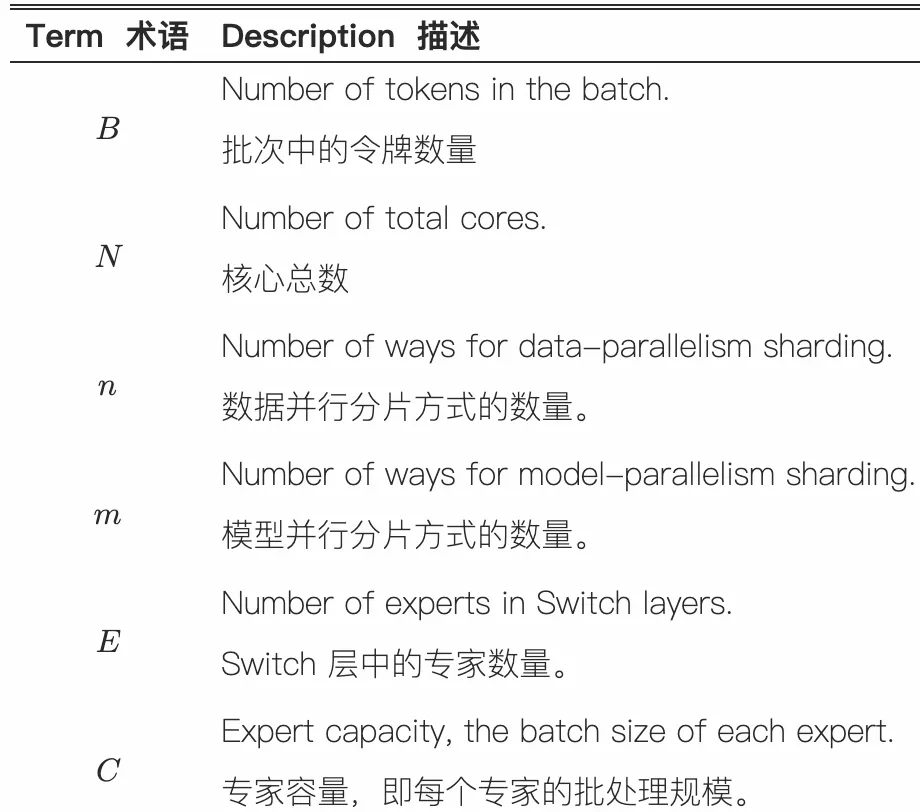
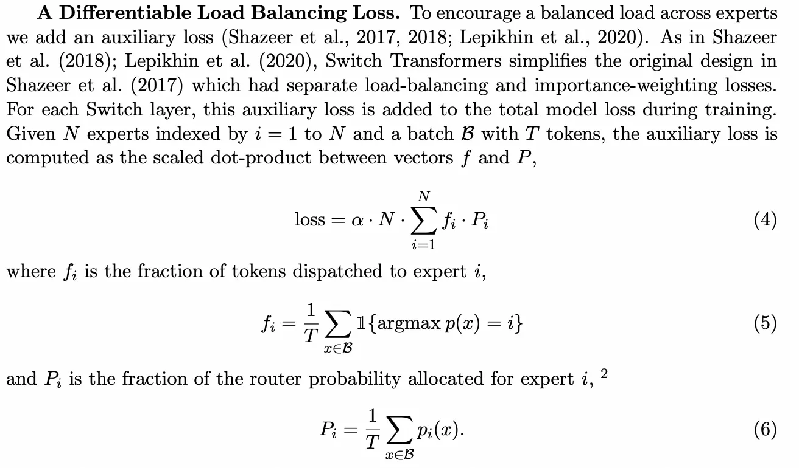
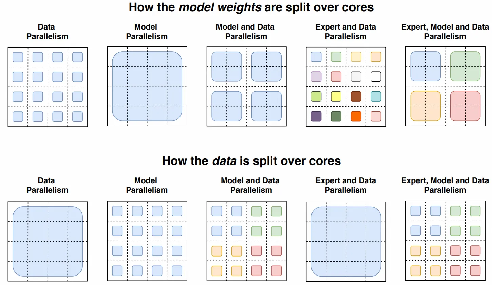

- [一 背景知识](#一-背景知识)
	- [1.1 All-to-All 通信](#11-all-to-all-通信)
	- [1.2 MoE 专家并行原理](#12-moe-专家并行原理)
	- [1.3 DeepSpeed MoE 并行策略](#13-deepspeed-moe-并行策略)
- [二 MoE 负载不均衡的优化](#二-moe-负载不均衡的优化)
	- [公式4: 负载均衡损失](#公式4-负载均衡损失)
	- [公式5：实际分配比例 $f\_i$](#公式5实际分配比例-f_i)
	- [公式6：路由概率比例 $P\_i$](#公式6路由概率比例-p_i)
	- [为什么该损失能促进负载均衡？](#为什么该损失能促进负载均衡)
- [三 MoE 并行策略](#三-moe-并行策略)
	- [3.1 数据并行 + 张量并行](#31-数据并行--张量并行)
	- [3.2 数据并行 + 专家并行](#32-数据并行--专家并行)
		- [流程分解](#流程分解)
		- [第一步：本地路由 (Local Routing)](#第一步本地路由-local-routing)
		- [第二步：本地收集 (Local Gather via `einsum`)](#第二步本地收集-local-gather-via-einsum)
		- [第三步：全局交换 (Global Shuffle via `All-to-All`)](#第三步全局交换-global-shuffle-via-all-to-all)
		- [实例分析](#实例分析)
	- [3.3 专家、数据、张量并行](#33-专家数据张量并行)
- [参考资料](#参考资料)

## 一 背景知识

### 1.1 All-to-All 通信

llm 推理部署中的 All-to-All 通信包括：Dispatch 和 Combine 阶段。
- Dispatch（分发阶段）：将本地数据分片发送给其他节点（例如张量的不同维度分片）。
- Combine（聚合阶段）：从所有节点收集分片并重组为完整数据。

### 1.2 MoE 专家并行原理

**1，概述**：

- 专家并行是在分布式学习中专门针对 MoE 模块场景的并行策略，其主要思想就是将不同专家放在不同计算节点上进行并行计算。
- 专家并行与之前所有的并行相比，最大的不同在于，输入数据需要通过一个动态的路由选择机制分发给相应专家，此处会涉及到一个所有节点上的数据重分配的动作（dispatch），然后在所有专家处理完成后，又需要将分散在不同节点上的数据按原来的次序整合起来（combine）。
- 对于专家并行，通信发生在每一个 MoE 模块之前和之后，即 dispatch 和 combine 操作，单次通信数据量较大且可能动态变化，通信较频繁。

2，核心思想：

- **动态专家激活**：MoE 模型中，每个输入 token 仅被路由到 num_experts_per_tok个专家（如DeepSeek R1 每层激活 8/256 个专家），其他专家处于空闲状态。

3，关键挑战和优化：
- 负载不均衡：高频专家导致部分 GPU 过载（如负载波动达300%）。【解决办法：EPLB 优化: 存放冗余专家】
- 通信开销：跨节点通信（如 RDMA）延迟高。【解决办法：高度优化的通信库 DeepEP, 通信和计算重叠】

### 1.3 DeepSpeed MoE 并行策略

DeepSpeed MoE 支持五种不同形式的并行，并同时利用 GPU 和 CPU 内存。其灵活的设计使用户能够混合不同类型的流行并行技术，如下表所示。

| 简称          | 灵活并行配置                      | 优势                                                     |
| ------------- | --------------------------------- | -------------------------------------------------------- |
| E             | 专家并行                          | 通过增加专家数量来扩展模型大小                           |
| E + D         | 专家 + 数据并行                   | 通过扩展到多个数据并行组来加速训练吞吐量                 |
| E + Z         | 专家 + ZeRO 驱动的数据并行        | 分割非专家参数以支持更大的基础模型                       |
| E + D + M     | 专家 + 数据 + 模型并行            | 支持巨大的隐藏层大小，以及比 E+Z 更大的基础模型          |
| E + D + Z     | 专家 + 数据 + ZeRO 驱动的数据并行 | 支持巨大的隐藏层大小，以及比 E+Z 更大的基础模型          |
| E + Z-Off + M | 专家 + ZeRO-Offload + 模型并行    | 在有限的 GPU 数量下，为大型 MoE 模型利用 GPU 和 CPU 内存 |

## 二 MoE 负载不均衡的优化

1. **设置专家容量 (Expert Capacity)**：这是这段代码最核心的概念。在 TPU 这样的硬件上，为了效率最大化，计算图（包括张量的形状）在编译时必须是静态的。你不能动态地决定一个专家今天处理 100 个 tokens，明天处理 120 个。因此，每个专家都被分配了一个固定大小的缓冲区，这就是它的“容量”。如果发送给某个专家的 tokens 数量超过了其容量，多余的 tokens 就会被丢弃 (dropped)。
2. **负载均衡损失 (Load Balancing Loss)**：由于存在 token 丢弃的风险，我们不希望路由器把所有 tokens 都发送给少数几个“热门”专家。因此，需要一个辅助的损失函数来鼓励路由器尽可能均匀地将 tokens 分配给所有专家。

负载均衡损失优化的完整公式如上图所示。

### 公式4: 负载均衡损失

$$\text{loss} = \alpha \cdot N \cdot \sum_{i=1}^{N} f_i \cdot P_i$$

+ $f_i$：实际分配到专家 $i$ 的 token 比例（公式5）  
    - 计算方式：统计 batch 内被路由到专家 i 的 token 数量，除以总 token 数 T 。
    - 例如：若 100 个 token 中有 30 个分配给专家 1，则 $f_1 = 0.3$。
+ $P_i$：路由器对专家 $i$ 分配的概率均值（公式6）  
    - 计算方式：对 batch 内所有 token 的路由概率 $p_i(x)$ 取平均。
    - 例如：若所有 token 对专家 1 的平均概率为 0.2，则 $P_1 = 0.2$ 。
+ $\alpha$：超参数，控制损失权重, 文中设为 $10^{-2}$。
+ $N$：专家总数，用于抵消专家数量对损失值的影响。

**关键设计思想**

+ **目标**：最小化该损失会迫使 $f_i$ 和 $P_i$ 趋近于 $\frac{1}{N}$（即均匀分配）。
    - 当完全均衡时：$f_i = P_i = \frac{1}{N}$，此时损失值为 $\alpha \cdot N \cdot \sum \frac{1}{N^2} = \alpha$与 $N$ 无关。
+ **可微分性**：仅 $P_i$ 依赖可微的路由概率，而 $f_i$ 不可微（因 `argmax` 是离散操作），但整体损失仍可梯度传播。

### 公式5：实际分配比例 $f_i$

$$f_i = \frac{1}{T} \sum_{x \in B} 1 {\text{argmax } p(x) = i}$$

+ ($ 1{\cdot} $): 指示函数，当token $x$被分配给专家$i$时值为1，否则为0。
+ **物理意义**：直接统计各专家的真实负载比例。

### 公式6：路由概率比例 $P_i$

$$P_i = \frac{1}{T} \sum_{x \in B} p_i(x)$$

+ $p_i(x)$：token $x$ 分配给专家 $i$ 的软概率（由路由器输出）。
+ **物理意义**：量化路由器对专家 $i$ 的"偏好程度"。

### 为什么该损失能促进负载均衡？

+ **数学性质**：当 $f_i$ 和 $P_i$ 均等于 $\frac{1}{N}$ 时，损失达到最小值 $\alpha$。
+ **反向传播作用**：
    - 若某专家 $i$ 的 $f_i$ 过高（接收过多 token），损失函数会通过 $P_i$ 调整路由概率，减少对该专家的偏好。
    - 反之，若 $f_i$ 过低，则增加路由概率。

举个例子，假设 $N=2$ 个专家，batch 内 $T=4$ 个token：

| Token $x$ | 专家1概率 $p_1(x)$ | 专家2概率 $p_2(x)$ | 实际分配 |
| --- | --- | --- | --- |
| $x_1$ | 0.7 | 0.3 | 专家1 |
| $x_2$ | 0.6 | 0.4 | 专家1 |
| $x_3$ | 0.4 | 0.6 | 专家2 |
| $x_4$ | 0.3 | 0.7 | 专家2 |

+ **计算**：
  - $f_1 = \frac{2}{4} = 0.5$, $f_2 = 0.5$
  - $P_1 = \frac{0.7+0.6+0.4+0.3}{4} = 0.5$, $P_2 = 0.5$
  - 损失值：$\alpha \cdot 2 \cdot (0.5 \cdot 0.5 + 0.5 \cdot 0.5) = \alpha$（均衡状态）

## 三 MoE 并行策略

llm 并行推理时：数据并行 + 模型并行（张量并行），GPU 数目 = dp_size * tp_size。

### 3.1 数据并行 + 张量并行

每个 gpu 设备负责: $\text{num\_tokens} / \text{dp\_size}$ 个 tokens，以及 $\text{d\_model} / m$、$\text{d\_ff} / m$ 的权重和中间激活。
在前向传播和反向传播过程中，每个核心通过全归约操作传输大小为: $[\text{num\_tokens} / \text{dp\_size},\text{d\_model}]$ 的张量。

### 3.2 数据并行 + 专家并行
首先，定义文中的变量：

+ `n`: 计算核心的数量（例如 GPU 或 TPU 核心的数量）。
+ `B`: 一个批次中 Token 的总数 (Total Batch Size)。
+ `B/n`: **每个核心**处理的 Token 数量。
+ `E`: 模型中专家的总数。
+ `C`: 每个专家的容量 (Capacity)，即每个专家最多能处理的 Token 数量。
+ `d_model`: 模型的隐藏层维度（Token 的向量表示维度）。

#### 流程分解
#### 第一步：本地路由 (Local Routing)
Switch Transformer 的一个巧妙设计是：如果你有 n 个计算核心（如 GPU），那么你就有 n 个专家，每个核心恰好负责一个专家。

> "Switch Transformers will allocate all of their cores to the data partitioning dimension `n`... For each token per core a router locally computes assignments to the experts."
>
> "Switch Transformers 会将所有计算核心分配至数据分区维度 `n`... 每个核心上的令牌会由本地路由器计算专家分配方案。"
>

+ **初始状态**：系统处于**数据并行**模式。有 n 个计算核心（如 GPU），就有 n 个专家，每个核心负责一个专家，处理 `B/n` 个 tokens。
+ **本地计算**：在每个核心上，路由器独立地为它自己负责的 `B/n` 个 tokens 计算出它们应该去哪个专家。
+ **输出**：路由器的计算结果是一个巨大的、稀疏的二进制矩阵，我们称之为 `dispatch_tensor`。对于单个核心来说，它的形状是 `[B/n, E, C]`。当所有 `n` 个核心组合起来时，就是文中的 `[n, B/n, E, C]`。这个矩阵标记了每个本地 token 应该去哪个专家（`E` 维度）的哪个容量位置（`C` 维度）。

#### 第二步：本地收集 (Local Gather via `einsum`)
> "This binary matrix is then used to do a gather via matrix multiplication with the input tensor... einsum(...)"
>
> "随后通过该二进制矩阵与输入张量...的矩阵乘法来完成数据收集操作。"
>

+ **操作**：这是一个非常聪明的步骤。通过 `einsum`（本质上是矩阵乘法），`dispatch_tensor` 被用来从原始的 token 列表 `[n, B/n, d_model]` 中“抓取”和“排序” tokens。
+ `einsum` 详解:
    - `einsum([n, B/n, d_model], [n, B/n, E, C], dimension=[B/n])`
    - **输入1**: `[n, B/n, d_model]` - 每个核心上的原始 token 数据。
    - **输入2**: `[n, B/n, E, C]` - 本地路由决策（调度矩阵）。
    - **操作**: 它在 `B/n` 这个维度上进行收缩（矩阵乘法）。可以理解为，对于每个核心，它都在说：“按照我的调度矩阵，把这 `B/n` 个 tokens 重新排列，放进 `E` 个专家的 `C` 个容量槽里。”
+ **结果**：`einsum` 的输出张量形状为 `[n, E, C, d_model]`。
    - **含义**：此时，在**每个核心**上，tokens 已经根据它们**将要去的专家**被分好组了。例如，在核心0上，有一个形状为 `[E, C, d_model]` 的张量，其中第一个切片 `[0, C, d_model]` 是所有**起源于核心0**并且**要去专家0**的 tokens，第二个切片是**起源于核心0**要去**专家1**的 tokens，依此类推。
    - **关键问题**：虽然 tokens 已经按专家分组，但它们仍然在**错误的物理核心**上。例如，要去专家5的 tokens 现在可能还分散在核心0、核心1、核心2...上。

#### 第三步：全局交换 (Global Shuffle via `All-to-All`)
> "Because each core has its own expert, we do an all-to-all communication... to now shard the E-dimension instead of the n-dimension."
>
> "由于每个计算核心拥有独立的专家模块，我们需执行...的全交换通信，将分片维度从 `n` 维度转为 `E` 维度。"
>

+ **模式切换**：这是从**数据并行**切换到**专家并行**的魔法发生的地方。我们现在假定，物理核心 $i$ 负责运行专家 $i$。
+ `All-to-All`**操作**：
    - **发送**：核心 `i` 会把它在上一步中收集好的、要去往专家 `j` 的那一包 tokens (`[j, C, d_model]`) 发送给核心 `j`。它会对所有 `j` 都做这个操作。
    - **接收**：同时，核心 `i` 会从所有其他核心 `j` 那里，接收它们发送过来的、要去往专家 `i` 的那一包 tokens。
+ **最终状态**：经过 `All-to-All` 之后，在核心 `i` 上，现在汇集了**来自所有核心**的、但**目标都是专家 **`i` 的 tokens。此时，核心 `i` 就可以用它负责的专家 `i` 的权重对这些 tokens 进行计算了。数据的分片方式从按 `n`（数据并行）变成了按 `E`（专家并行）。

---

#### 实例分析

假设我们有以下配置：

+ `n=2` (2个GPU: GPU0, GPU1)
+ `E=2` (2个专家: E0, E1)，我们规定 **GPU0 负责 E0**，**GPU1 负责 E1**。
+ `B=8` (总共8个tokens: t0-t7)
+ `B/n=4` (每个GPU处理4个tokens)
+ `C=3` (每个专家容量为3)
+ `d_model=...` (维度不影响逻辑)

**1. 初始状态 (数据并行)**

+ **GPU0** 持有数据：`[t0, t1, t2, t3]`
+ **GPU1** 持有数据：`[t4, t5, t6, t7]`

**2. 本地路由 & 本地收集 (**`einsum`**)**

+ **GPU0** 上的路由器决定：
    - t0 -> E1
    - t1 -> E0
    - t2 -> E1
    - t3 -> E0  
经过 `einsum`，GPU0 上的张量 `[E, C, d_model]` 变为：
    - 发往 **E0** 的包：`[t1, t3, <pad>]` (容量3，填满2个)
    - 发往 **E1** 的包：`[t0, t2, <pad>]` (容量3，填满2个)
+ **GPU1** 上的路由器决定：
    - t4 -> E1
    - t5 -> E1 (但 E1 容量已满，假设 t5 被丢弃)
    - t6 -> E0
    - t7 -> E1  
经过 `einsum`，GPU1 上的张量 `[E, C, d_model]` 变为：
    - 发往 **E0** 的包：`[t6, <pad>, <pad>]`
    - 发往 **E1** 的包：`[t4, t7, <pad>]` (t5 被丢弃了)

**3. 全局交换 (**`All-to-All`**)**

+ **GPU0**：
    - **发送** 去往 E1 的包 `[t0, t2, <pad>]` 给 **GPU1**。
    - **保留** 去往 E0 的包 `[t1, t3, <pad>]`。
    - **接收** 来自 GPU1 的、去往 E0 的包 `[t6, <pad>, <pad>]`。
+ **GPU1**：
    - **发送** 去往 E0 的包 `[t6, <pad>, <pad>]` 给 **GPU0**。
    - **保留** 去往 E1 的包 `[t4, t7, <pad>]`。
    - **接收** 来自 GPU0 的、去往 E1 的包 `[t0, t2, <pad>]`。

**4. 最终状态 (专家并行)**

+ **GPU0** 上现在的数据是 **所有要去 E0 的 tokens**: `[t1, t3, t6]`。GPU0 现在可以调用 **专家E0** 进行计算。
+ **GPU1** 上现在的数据是 **所有要去 E1 的 tokens**: `[t0, t2, t4, t7]` (注意，这里的数量超过了容量C，说明我的例子中t7也应该被丢弃，一个更真实的场景是容量会被严格遵守)。一个更正的例子是GPU1的包是`[t4, t7, <pad>]`，接收GPU0的包`[t0, t2, <pad>]`后，最终送入E1计算的是`[t4, t7, t0]`，t2被丢弃。

计算完成后，会再有一次 `All-to-All` 将结果发送回它们原始的 token 位置。

### 3.3 专家、数据、张量并行

一个 gpu 的显存是有限的，可能不足以存放下所有 experts 的权重，因此需要增加 m（张量并行） 。但由于核心（GPU）数量 N 和 N=n×m 是固定的，我们必须减少 n ，这迫使采用更小的批处理规模（以保持每个核心处理的令牌数恒定）。
当结合模型并行与专家并行时，我们将面临两种通信开销：一是将令牌路由至对应专家的全对全通信，二是模型并行内部的全局规约通信。当同时采用这三种方法时，平衡 FLOPS、通信开销与单核内存变得极为复杂，最佳映射方案需通过实验确定。

## 参考资料
+ [Switch Transformers: Scaling to Trillion Parameter Models with Simple and Efficient Sparsity](about:blank)
+ [https://lmsys.org/blog/2025-05-05-large-scale-ep/](https://lmsys.org/blog/2025-05-05-large-scale-ep/)