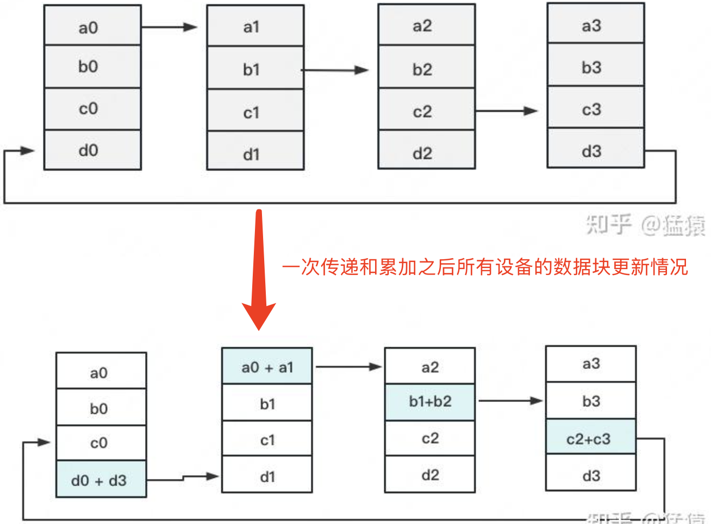
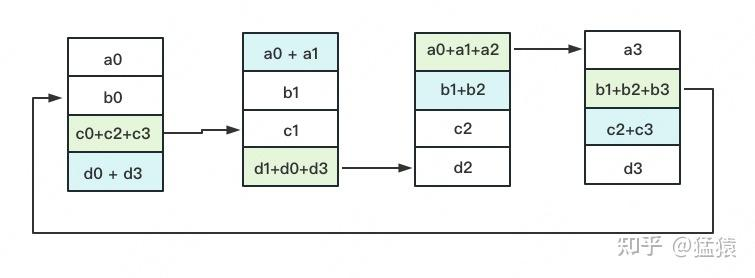
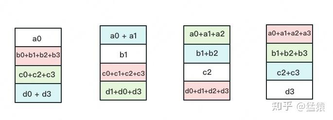
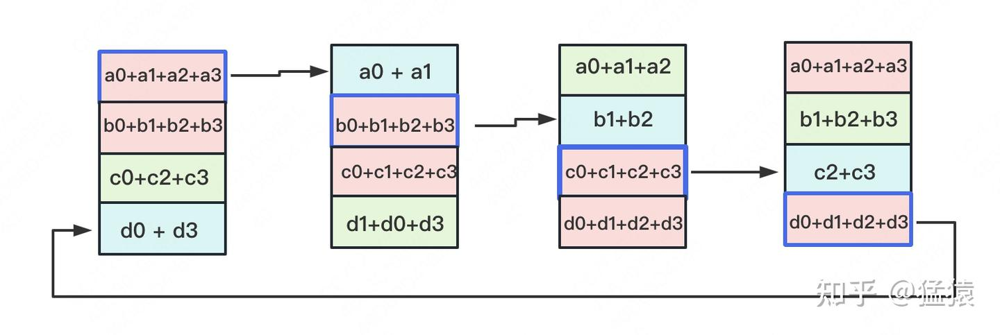
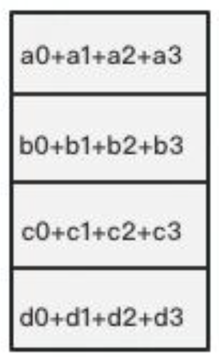
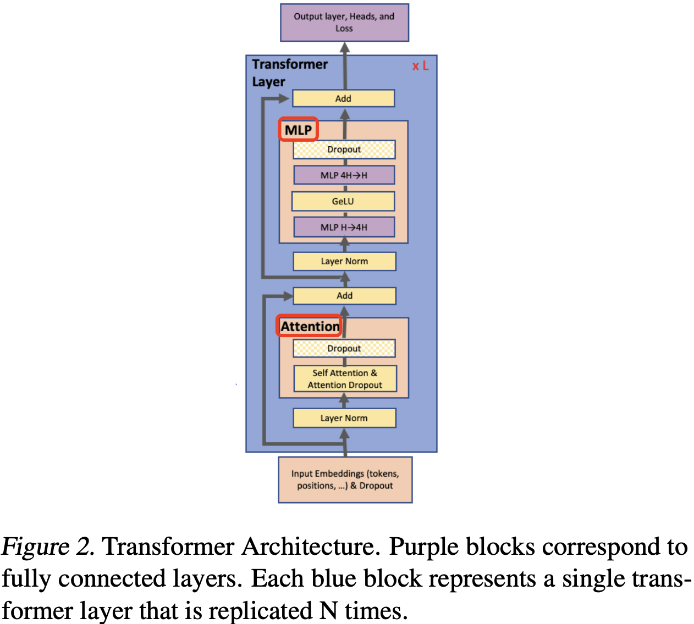
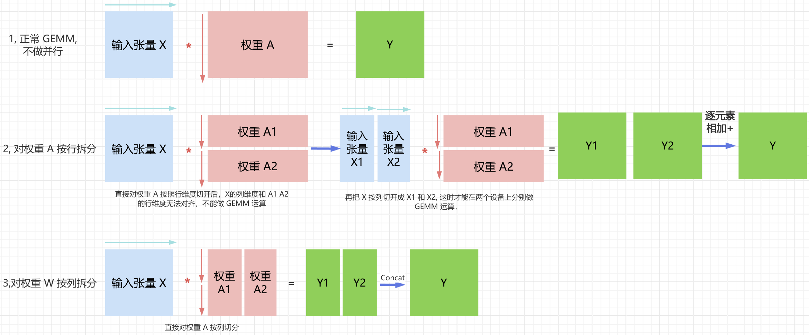
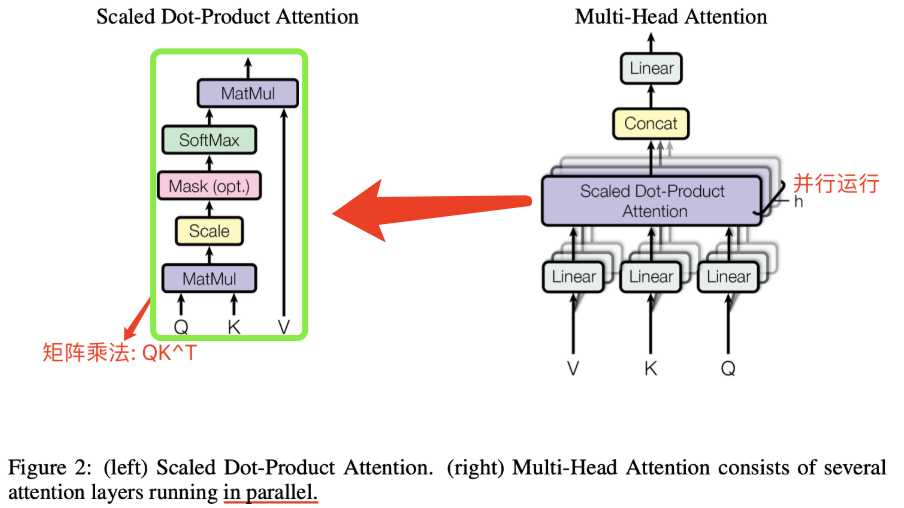
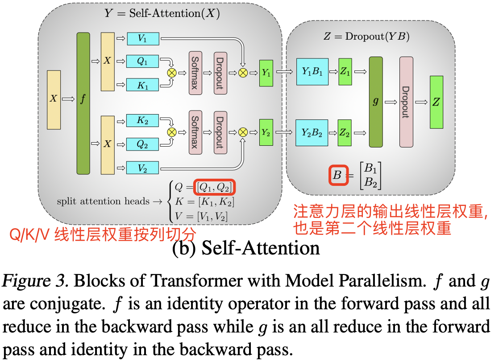

- [摘要](#摘要)
- [1. 介绍](#1-介绍)
- [2. 背景和挑战](#2-背景和挑战)
  - [2.1 神经语言模型预训练](#21-神经语言模型预训练)
  - [2.2 Transformer 语言模型和多头注意力](#22-transformer-语言模型和多头注意力)
  - [2.3 深度学习中的数据和模型并行](#23-深度学习中的数据和模型并行)
  - [2.4 AllReduce 算子原理](#24-allreduce-算子原理)
  - [2.5 Ring AllReduce 的通信成本](#25-ring-allreduce-的通信成本)
- [3. 模型并行 Transformers](#3-模型并行-transformers)
    - [3.1 线性层权重不同切分方式](#31-线性层权重不同切分方式)
  - [3.2 MLP 层的张量并行](#32-mlp-层的张量并行)
    - [MLP 层的通讯量分析](#mlp-层的通讯量分析)
  - [3.3 MHA 层的张量并行](#33-mha-层的张量并行)
    - [MHA 层的通讯量分析](#mha-层的通讯量分析)
  - [3.4 Embedding 层的张量并行](#34-embedding-层的张量并行)
  - [3.5 张量并行方法总结](#35-张量并行方法总结)
- [参考资料](#参考资料)

## 摘要

为了训练更大的 `transformer` 模型，[Megatron-LM 论文](https://arxiv.org/pdf/1909.08053) 作者引入了一种简单高效的 `intra-layer model parallel`（层内模型并行，也叫张量并行）方法，它无需安装新的编译器和库，和早期的 pipeline model parallelism 方法互为正交且互补，并且只需在 native PyTorch 中插入少量 `communication operations` 就能完全实现。

## 1. 介绍

随着模型参数量的不断扩大（模型参数内存），它们往往会超出现代处理器的内存承载能力，这就需要采用额外的内存管理策略，比如 `activation checkpointing` (Chen et al., 2016) 技术。另外常，用的优化算法 `Adam` 需要为每个参数分配额外内存来存储动量及其他状态信息（即优化器内存），这也限制了能够高效训练的模型规模。为了解决这一问题，模型并行技术通过对模型进行分割，使得各部分权重和对应的优化状态不必同时加载到同一处理器上，从而突破内存瓶颈。例如，`GPipe` (Huang et al., 2018) 和 Mesh-Tensorflow (Shazeer et al., 2018) 分别为不同类型的模型并行提供了框架，但它们**通常需要重写模型结构代码**，并依赖仍在不断完善的自定义编译器和框架。

由此，论文作者在本论文研究中提出了一种基于 `intra-layer model-parallelism` 的简单高效的模型并行方案。直接基于 transformer 的语言模型的固有结构（即不改变模型本身结构），开发了一种在 PyTorch 中高效训练的简单模型并行实现，无需自定义 `C++` 代码或编译器。层内并行与 `GPipe` (Huang et al., 2018) 等方法所倡导的 pipeline-based model parallelism 相互独立、互补，可为大规模模型训练提供更多灵活性。

可以在现有的 PyTorch transformer 实现基础上，**仅需要少量针对性的代码修改**，就实现了一种简单而高效的模型并行（张量并行）方案。

## 2. 背景和挑战

### 2.1 神经语言模型预训练

预训练语言模型如今已成为  NLP  研究者工具箱中不可缺少的一部分。过去十年来，利用大规模语料进行预训练以获得鲁棒的语言神经表征，一直是一个非常活跃的研究方向。早期的研究表明，与从头开始训练的词嵌入表相比，预训练的词嵌入表能显著提升下游任务的效果 (Mikolov et al., 2013; Pennington et al., 2014; Turian et al., 2010)。

### 2.2 Transformer 语言模型和多头注意力

`GPT-2` 和 `BERT` 在 `multi-head attention` 和 `feed forward` 层的输入端都使用了 `GeLU` (Hendrycks & Gimpel, 2016) 激活函数及 layer normalization (Ba et al., 2016)，而原始 transformer (Vaswani et al., 2017) 则采用了 `ReLU` 激活函数，并在输出端应用了 layer normalization。

### 2.3 深度学习中的数据和模型并行

目前，将深度神经网络训练扩展到多个硬件加速器的有两种主要方法：
-  **数据并行 data parallelism**（Valiant, 1990），即将一个训练 minibatch 划分到多个 worker 上；
- **模型并行 model parallelism**，即将一个模型的内存使用和计算分布到多个 worker 上。

增加可用 `worker` 数量成比例增加 `minibatch` 大小（即弱扩展），可以观察到训练数据吞吐量近乎线性提升；但是大批量训练会给优化过程引入复杂性，可能导致准确率降低或收敛时间延长，从而抵消了训练吞吐量提升带来的好处 (Keskar et al., 2017)。

为进一步扩展训练规模，一些并行工作 (Chen et al., 2016) 将 **data parallelism** 与 **activation checkpointing** 结合起来：在反向传播中重新计算激活值而不在正向传播中存储它们，从而减少内存需求。

随着模型参数量的增加，模型参数所占用的内存已接近和超过单个 GPU 的内存上限。论文作者的解决办法是利用 **model parallelism** **将模型分割并分布到多个加速器上**，这不仅缓解了内存压力，而且使并行性不再依赖于 microbatch 的大小。

在 **model parallelism** 内部，还有两种常见策略：
- 一种是 **layer-wise pipeline parallelism**，即将一系列操作在一个设备上执行完后，再将结果传递到下一个设备继续处理；
- 另一种是更通用的 **distributed tensor computation**，它将单个 tensor 操作拆分到多个设备上，从而加速计算或支持更大模型。

在 **pipeline model parallelism**（流水线并行）中，**一组操作先在一个设备上执行，然后将输出传递到流水线中的下一个设备，在那里执行另一组操作**。一些方法 (Harlap et al., 2018; Chen et al., 2018) 结合了 **parameter server**（参数并行） (Li et al., 2014) 与流水线并行，但这些方法存在一致性问题。TensorFlow 的 **GPipe** 框架 (Huang et al., 2018) 通过采用**同步梯度下降**来克服这一一致性问题。该方法需要额外逻辑来高效处理通信与计算操作的流水线调度，同时会受到流水线空泡的影响而降低效率，或需对优化器本身进行修改，从而影响准确率。

**distributed tensor computation** 是一种正交且更通用的方法，它将一个 `tensor` 操作划分到多个设备上，以加速计算或增加模型规模。**FlexFlow** (Jia et al., 2018) 是一个 `orchestrating` 此类并行计算的深度学习框架，提供了一种选择最佳并行策略的方法。最近，**Mesh-TensorFlow** (Shazeer et al., 2018) 在 TensorFlow (Abadi et al., 2015) 中引入了一种用于指定一类通用 **distributed tensor computations** 的语言，用户在语言中指定并行维度，生成的计算图则使用适当的 collective primitives 进行编译。

论文借鉴了 **Mesh-TensorFlow** 的类似思想，并在计算 transformer 的 `attention` `heads` 时利用并行计算能力来实现模型并行。而且，论文提出的方法并不依赖全新的框架或编译器，而只需要在现有的 PyTorch transformer 代码实现中做几处有针对性的调整。整个方案简单易行，无需新的编译器或大规模代码重构，只需插入几个简单的 `primitives` 即可实现，具体细节会在下一节详细说明。

### 2.4 AllReduce 算子原理

集合通信（Collective Communications）是一个**进程组的所有进程都参与的全局通信操作**，其基本操作包括：发送 `send`、接收 `receive`、复制 `copy`、组内进程栅障同步 Barrier 以及节点间进程同步(signal +wait)等。这些基本操作经过组合构成了一组通信模板（通信原语），常见的包括：

- **单点到多点**：广播（broadcast）、发散（scatter）；
- **多点到单点**：收集（gather）、规约（reduce）；
- **多点到多点**：全收集（all-gather）、全规约（`all-reduce`）、全交换（all-to-all）、规约发散（reduce-scatter）。

其中 `scatter` 通信算子可视化图如下所示。


张量并行中使用的通信算子是 `AllReduce`，其目标是**将所有进程的数据通过特定操作（如求和、取最大值）聚合后，将结果同步到所有进程**。常用实现方式包括 `Ring AllReduce` 和 `Tree AllReduce`。

AllReduce 的最终目标，就是让每块 GPU 上的数据都变成下图箭头右边汇总的结果。

<center>

</center>

AllReduce 的实现其实分为两个过程 Reduce-Scatter 和 All-Gather，其过程可视化图来源[文章](https://zhuanlan.zhihu.com/p/617133971)。

1. **分块传输**：将待传输的数据切分为 $N$ 块（N 为进程数也是设备数），形成逻辑环状结构。
2. **`Reduce-Scatter` 阶段**：每个进程依次向右邻进程发送下一块数据，并进行局部聚合（如累加、累减等）。经过 $N−1$ 次传递后，每个设备上**都有一块数据**拥有了对应位置完整的聚合。
3. `AllGather` 阶段：每个进程聚合后的数据块都在环中传播，按照“相邻设备对应位置进行通讯”的原则，最终所有进程获得完整结果。

**Reduce-Scatter**

定义网络拓扑关系，使得每个 GPU 只和其相邻的两块 GPU 通讯。每次发送对应位置的数据进行累加。每一次累加更新都形成一个拓扑环，因此被称为 `Ring`。

第一次累加完毕后，蓝色位置的数据块被更新，**被更新的数据块将成为下一次更新的起点**，继续做累加操作。

<center>

</center>

第二次累加完成后的示意图如下，同样，被更新的数据块将成为下一次更新的起点。

<center>

</center>

第三次累加完成后的示意图如下：

<center>

</center>

很明显，$3$ 次更新之后，每块 `GPU` 上都有一块数据拥有了对应位置完整的累加聚合（下图中红色块）。此时，`Reduce-Scatter` 通信阶段结束。进入 `All-Gather` 通信阶段。目标是把红色块的数据广播到其余 `GPU` 对应的位置上，目的是让所有 `GPU` 最终都拥有全部的数据。

**All-Gather**

All-Gather 通信操作里依然按照“相邻 `GPU` 对应位置进行通讯”的原则，但对应位置数据不再做相加，而是直接替换。

`All-Gather` 以红色块作为起点，第一轮更新完成后的示意图如下所示:

<center>

</center>

同样的经过 $3$ 轮更新，使得每块 GPU 上都汇总到了完整的数据，变成如下形式:

<center>

</center>

### 2.5 Ring AllReduce 的通信成本

假设我们有 $N$ 个设备，每个设备的数据大小为 $K$，在一次 AllReduce 过程中，进行了 $N-1$ 次 `Scatter-Reduce` 操作和 $N-1$ 次 `Allgather` 操作，每一次操作所需要传递的数据大小为 $K/N$，所以**整个 `AllReduce` 过程所传输的数据大小为 $2(N-1) * K/N$，随着 $N$ 的增大，Ring AllReduce 通信算子的通信量可以近似为 $2K$**。

值得注意的是，使用张量并行加速时，**分布式系统 AllReduce 的通信速度只受限于逻辑环中最慢的两个 GPU 的连接**;（每次需要通信的数据大小仅为 $K/N$，随着 $N$ 增大，通信量减少，一般小于 network bandwidth）；总结就是 Ring AllReduce 的通信速度恒定，和设备数量无关，完全由系统中GPU 之间最慢的连接决定。

## 3. 模型并行 Transformers

基于 transformer 网络 pytorch 代码的基础上，只需添加几个**同步操作代码**（synchronization primitives），就可实现一个简单的模型并行方案。

标准的 transformer 层如图 2 所示，其由一个自注意力（`self-attention`）模块和一个两层的多层感知机 (`MLP`)组成，可在这两个模块中分别引入**模型并行**（也叫张量并行）技术。

<center>

</center>

#### 3.1 线性层权重不同切分方式

线性层是 MLP 的核心 kernel，其本质上是一种 GEMM 操作，我们在加载 transformer 模型的时候，需要将权重做切分并并分发到不同的 GPU 设备上。随后，各 GPU 设备分别执行相应 GEMM 操作。

权重切分有两种方式：**按行和按列切分**。按不同方式切分权重后的线性层推理 `forward` 操作的可视化对比图如下图所示：
> 在线浏览和编辑优化的[链接](https://www.processon.com/diagraming/67c868f1b8570c67383d9f6c?from=pwa)。

<center>

</center>

- 权重 $A$ 按照列拆分的并行计算方式看图理解比较直观，这里直接跳过分析。
- 权重 $A$ 如果按照**行维度**进行切分切开后，那么 `GEMM` 的矩阵乘法 $XA_1$ 和 $XA_2$ 的维度无法对齐，需要**再把 $X$ 按列切开**才能做到矩阵乘法的维度对齐，并在对应 GPU 设备上分别执行 GEMM 得到 $X_1A_1=Y_1$ 和 $X_2A_2=Y_2$，并执行 $Y_1 + Y_2 = Y$，这里的 $+$ 是**逐元素相加操作**。

### 3.2 MLP 层的张量并行

> MLP 的张量并行实现相对 Self-Attention 简单。

MLP 模块的第一个操作是通用矩阵乘法 (GEMM)，随后是一个 GeLU 非线性激活函数，计算公式如下所示。

$$Y = GeLU(XA)$$

**为了实现 `GEMM` 的并行计算**。

第一个方法是**将权重矩阵 A 按行拆分，同时将输入矩阵 X 按列拆分**，如下图所示：

$$X = [X_1, X_2], A = \begin{bmatrix}
A_1 \\
A_2 \end{bmatrix}$$

这种切分方式会得到 $Y = GeLU(X_1A_1 + X_2A_2)$，因为 `GeLU` 是一个**非线性函数**，所以 $GeLU(X1A1 + X2A2) \ne GeLU(X1A1) + GeLU(X2A2)$，因此这种方法在 `GeLU` 函数之前需要一个同步点（synchronization point）。

所谓**同步点**是指，在执行 `GeLU` 函数之前，需要等待各个设备的并行计算（即 $X_1A_1$ 和 $X_2A_2$）都完成，同时将各个设备输出的中间结果正确地聚合（synchronize），可通过 `reduce + broadcast` 操作在 GPU0 上计算完整 $XA$，然后广播 `GeLU(XA)` 到 GPU1。

另一种方案是将**权重矩阵** $A$ **沿列方向**切分为 $A = [A1, A2]$。这种切分方式使得每个 GPU 设备**能独立完成部分 $\text{GEMM}$ 运算**，并应用 GeLU 激活函数。**列切分权重方法**的优势在于**避免了前向传播中一次全局同步通信（行切分方案需先同步合并分块结果，再统一应用激活函数）**

$$[Y1, Y2] = [GeLU(XA1), GeLU(XA2)$$

将第一个线性层的权重按照列并行方式切分后，**第二个线性层的权重矩阵 B 自然沿着行方向拆分**，使其能够直接处理来自 `GeLU` 层的输出而无需任何通信，如图 3a 所示。

<center>

</center>

1，MLP 模块中两个线性层权重先列后行的切分方法，其张量并行的前向传播过程拆解如下：
1. 第一个 GEMM（如 $XA_1$ 和 $XA_2$）：每个 GPU 独立计算，无需通信。
2. 第二个 GEMM（如 $Y_1B_1$ 和 $Y_2B_2$ 之后，**需要一次 All-Reduce 操作合并结果**，再将结果输入 Dropout 层
   - 之所以需要 All-Reduce 归约操作，是因为第二个线性层的权重是按行切分得到 $Z_1$ 和 $Z_2$，所以需要执行加法操作得到最终的 Z。
   - 具体来说，**第二个 GEMM（如 $Y_1B_1$ 和 $Y_2B_2$) 之后，需要一次 All-Reduce 操作合并结果（对 $Y_1B_1$ 和 $Y_2B_2$ 求和）**。
3. 激活函数（如 GeLU）：本地计算，无需通信。

因为第二个线性层的权重是按行切分得到 Z1 和 Z2，所以需要执行加法操作得到最终的 Z。另外，**第二个 GEMM（如 $Y_1B_1$ 和 $Y_2B_2$ 之后，需要一次 All-Reduce 操作合并结果（对 $Y_1B_1$ 和 $Y_2B_2$ 求和）**。

2，另外，图 3a 中的 $f$ 和 $g$ 的操作解释如下
- $f$ 的前向推理 forward 计算：把输入 $X$ 拷贝到两块 GPU 上，每块 GPU 即可独立做forward 计算。
- $g$ 的前向推理 forward 计算：每块 GPU 上的 forward 的计算完毕，取得 Z1 和 Z2 后，各 GPU 间做一次 AllReduce，相加结果产生 Z。

MLP 的张量并行过程的形状变换公式拆解如下：

- `GPU0` 上计算 `Z1`: `[b, s, h] * [h, h/2] -> [b, s, h/2] * [h/2, h] -> [b, s, h]`;
- `GPU1` 上计算 `Z2`: `[b, s, h] * [h, h/2] -> [b, s, h/2] * [h/2, h] -> [b, s, h]`;
- `Z1 + Z2 = Z`: `[b, s, h] + [b, s, h] -> [b, s, h]`

3，下述代码是 $f$ 运算符的实现示例：

```python
"""
f operator 实现：
- 前向传递：直接返回输入（恒等运算）
- 反向传递：对梯度执行 All-Reduce
对应的 g operator 行为对称：
- 前向传递：执行 All-Reduce
- 反向传递：直接返回梯度（恒等运算）

Implementation of f operator. g is similar to f with
identity in the backward and all-reduce in the forward functions.
"""
class f(torch.autograd.Function):
    @staticmethod
    def forward(ctx, x):
        return x  # 前向传递无通信
    
    @staticmethod
    def backward(ctx, grad_output):
        all_reduce(grad_output)  # 反向传递触发 All-Reduce
        return grad_output

class g(torch.autograd.Function):
    @staticmethod
    def forward(ctx, x):
        all_reduce(x)   # 前向传递触发 All-Reduce
    
    @staticmethod
    def backward(ctx, grad_output):
        return grad_output # 反向传递无通信
```

#### MLP 层的通讯量分析

总结：MLP 层在 forward(前向推理时) 做一次 All-Reduce 操作，在 backward(前向推理时) 做一次 All-Reduce 操作。而 All-Reduce 的过程分为两个阶段，`Reduce-Scatter` 和 `All-Gather`，每个阶段的通讯量是相等的。假设输入张量大小为 `[b, s, h]`，则每次 All-Reduce 操作通讯量为 $2bsh$。

模型训练和推理阶段，**MLP 层的张量并行通信量**如下所示：
- 模型训练时，包含前向传播和反相传播两个过程，即两次 `All-Reduce` 操作，所以 `MLP` 层的总通讯量为：$4bsh$。
- 模型推理时，只有前向传播过程，即一次 `All-Reduce` 操作，所以 `MLP` 层的总通讯量为：$2bsh$。

### 3.3 MHA 层的张量并行

多头注意力模块的结构如下图所示，可以看出，在设计上，MHA 层对于每个头（head），就有都有独立的 q/k/v 三个线性变换层以及对应的 self-attention 计算结构，然后将每个 head 输出的结果做拼接 `concat`，最后将拼接得到结果做线性变换得到最终的注意力层输出张量。

<center>

</center>

下图展示了当 `num_heads` = 2 时 attention 层的 Q/K/V 线性变换的并行计算方法。对每一块权重，我们都沿着列方向（k_dim）维度切割一刀。此时每个 `head` 上的 $W^Q、W^K、W^V$  的维度都变成 `(d_model, k_dim//2)`。每个 `head` 上能独立做矩阵计算，最后将计算结果 `concat`起来即可。整个流程如下图所示：

<center>

</center>

可以发现，从多头注意力结构看，其计算机制真的是天然适合模型的张量并行计算，即**每个头上都可以在每个设备上独立计算**，即**可以把每个头（也可以是 n 个头）的参数放到一块 GPU 上**，最后将子结果 concat 后得到最终的张量。具体来说，多头注意力结构的张量并行计算过程拆解如下：
> 实际模型中，会存在一个或多个 head 占用一块 GPU 的情况，且我们尽量保证 heads 总数能被 GPU 个数整除。

1. 对三个权重参数矩阵 $W_Q$、$W_K$、$W_V$，按照“列切割”，每个头放到一块 GPU 上，即每个注意力头的 Q/K/V 线性变换的矩阵乘法可以在单个 GPU 上独立完成。作用是将每个注意力头的参数和计算可以负载均匀分摊到多个 GPU 上，而且完成自注意力计算时无需立即进行跨 GPU 通信。
2. 对注意力输出线性层 $B$，按照“行切分”。注意力层的 Q/K/V 线性层和输出线性层的forward 与 backward 原理和 `MLP` 模块基本一致，不再赘述。

Attention 模块的张量并行加速过程如图 3(b) 所示：

<center>

</center>

#### MHA 层的通讯量分析

很明显上述的设计对 MLP 和自注意力层均采用了**将两组 GEMM 运算融合的策略**，从而消除了一个同步步骤，并获得了更好的扩展性。基于此技术方案，在一个标准 transformer 层中，前向传播只需执行两次 all-reduce 操作，反向传播也仅需两次 all-reduce（详见图 4）。

<center>

</center>

和 MLP 模块类似，模型训练和推理阶段，**MHA 层的张量并行通信量**如下所示：
- 模型训练时，包含前向传播和反相传播两个过程，即两次 `All-Reduce` 操作，所以 `MLP` 层的总通讯量为：$4bsh$。
- 模型推理时，只有前向传播过程，即一次 `All-Reduce` 操作，所以 `MLP` 层的总通讯量为：$2bsh$。

### 3.4 Embedding 层的张量并行

Transformer 语言模型的输出嵌入矩阵尺寸为 `[batch_size, vocab_size, hidden_size]`。因为当前 transformer 语言模型的词汇表通常至少有数万个 token（例如，GPT-2 的词汇表大小为 50,257），因此对**输出 embedding 层**的 GEMM 计算进行并行化很有加速效果。但是，又因为在 transformer 语言模型中，**输出嵌入层与输入嵌入层通常共享权重**，这就要求对两者都需要进行修改。

我们将**输入嵌入的权重矩阵** E（权重矩阵尺寸为 `[hidden_size, vocab_size]`）**按词汇维度进行列拆分**，得到 $E = [E_1, E_2]$。因为每个分块仅包含嵌入表的一部分，因此
**在完成输入嵌入后需要执行一次 `all-reduce`（即 g operator）**。对于输出嵌入，一种方案是先并行计算 $[Y1, Y2] = [XE_1, XE_2]$ 得到 `logits`，然后通过 `all-gather` 操作将其拼接成 $Y = \text{all-gather}([Y1, Y2])$，接着再将结果输入到交叉熵损失函数中。但是，这样的 `all-gather` 操作需要传输 $b \times s \times v$ 个元素（其中 $b$ 为批次大小，$s$ 为序列长度），而且**因为词汇表通常很大，这会带来巨大的通信负担**。

因此，为了降低通信成本，模型训练时，我们将并行 `GEMM` 的输出 `[Y1, Y2]` 和交叉熵损失融合，从而将数据维度压缩至 $b \times s$。相比传输完整的 `logits`，仅传输标量损失大幅减少了通信量，从而显著提高了模型并行方案的效率。

### 3.5 张量并行方法总结

模型并行方法大部分**可以归纳为旨在减少通信并使 GPU 保持计算密集状态的技术**。与其让一个 GPU 计算部分的 dropout、 layer normalization 或 residual connections 并将结果广播到其他 GPU，我们选择在所有 GPU 上复制这些计算。具体来说，我们在每个 GPU 上维护 layer normalization 参数的重复副本，并将模型并行区域的输出张量经过 dropout 和 residual connection 处理后，再作为输入传递给下一个模型并行区域。

为了优化模型，我们**允许每个模型并行工作单元独立优化自己的一套参数**。由于所有数值均在单个 GPU 上局部存在或被复制，因此在这种方案中无需通信更新参数值。我们在附录 B 中提供了有关混合模型与数据并行以及随机数生成处理的更多细节供参考。总之，上述方法易于实现，在前向和反向传播过程中只需额外添加几次 all-reduce 操作。该方法不需要新的编译器，并且与例如 (Huang et al., 2018) 所倡导的 `pipeline model parallelism` 互为**正交且互补**。

## 参考资料

- [Megatron-LM: Training Multi-Billion Parameter Language Models Using Model Parallelism](https://arxiv.org/pdf/1909.08053)
- [图解大模型训练之：张量模型并行(TP)，Megatron-LM](https://zhuanlan.zhihu.com/p/622212228)
- [图解大模型训练之：数据并行上篇(DP, DDP与ZeRO)](https://zhuanlan.zhihu.com/p/617133971)
- [huggingface/picotron](https://github.com/huggingface/picotron)