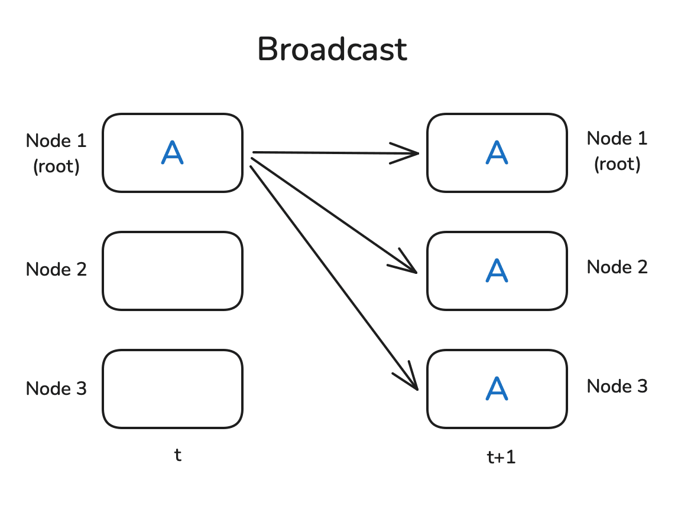

- [一 集合通信概述](#一-集合通信概述)
  - [1.1 p2p 概述](#11-p2p-概述)
  - [1.2 mpi4py 和 torch.distributed](#12-mpi4py-和-torchdistributed)
    - [mpi4py](#mpi4py)
    - [torch.distributed](#torchdistributed)
  - [1.3 mpi4py.MPI.Comm 类总结](#13-mpi4pympicomm-类总结)
    - [核心属性](#核心属性)
    - [主要实例方法（按功能归类）](#主要实例方法按功能归类)
- [二 Broadcast 原理和实践](#二-broadcast-原理和实践)
- [三 Reduce \& AllReduce](#三-reduce--allreduce)
- [四 Gather \& AllGather \& AllReduce](#四-gather--allgather--allreduce)
    - [4.1 Gather \& AllGather 原理和实践](#41-gather--allgather-原理和实践)
  - [4.2 All-Gather 和 All-Reduce](#42-all-gather-和-all-reduce)
- [五 Scatter \& ReduceScatter](#五-scatter--reducescatter)
- [六 Ring AllReduce](#六-ring-allreduce)
  - [6.1 AllReduce 通信量分析](#61-allreduce-通信量分析)
  - [6.2 Barrier 概述](#62-barrier-概述)
- [七 Alltoall](#七-alltoall)
  - [7.1 Scatter 和 Gather示例代码](#71-scatter-和-gather示例代码)
  - [8.2 Alltoall 可视化和示例](#82-alltoall-可视化和示例)
- [参考资料](#参考资料)

## 一 集合通信概述

### 1.1 p2p 概述

`P2P` 是点对点通信，是消息传递系统的基础功能。`P2P` 支持**在进程对之间进行数据传输，一端发送，另一端接收**。

集合通信允许在组内**多个进程间同时传输数据**，即通信参与方是不止 $2$ 个。同时，集合通信还引入了同步点，所有代码在达到同步点后才能继续执行后续的代码。常见的集体通信操作如下：

1. 跨所有组成员的屏障同步，**这里的成员是指进程**。
2. 全局通信函数：
    - `Broadcast`（广播）： 将数据从一个成员广播至组内所有成员。
    - `Gather`（汇聚）：将数据从所有成员收集至组内某个成员。
    - `Scatter`（发散）：将数据从一个成员分散至组内所有成员。
3. 求和、求最大值、求最小值等全局规约操作。

### 1.2 mpi4py 和 torch.distributed 

分布式程序都需要一个 `launcher`，例如 `mpiexec`、`torchrun`、`ray` 等，本文的实例代码使用 mpiexec 和 torchrun 两种。

#### mpi4py

`MPI` 是跨语言的并行计算标准，用于在分布式系统中协调多进程通信。在 PyTorch 分布式训练中可作为后端（如 gloo 或 mpi）。`mpi4py` 是 Python 的 MPI 软件包，为 Python 编程语言提供了 MPI 接口，使任何 Python 程序都能利用多处理器优势。该软件包基于 MPI 规范构建，提供了严格遵循 MPI-2 C++绑定的面向对象接口。

`mpi4py` 库的安装方式如下:

```bash
apt-get update && apt-get install mpich
mpirun --version

pip install mpi4py
pip install torch
```

mpi4py 基本实例代码如下:

```python
# mpi_hello.py
from mpi4py import MPI

comm = MPI.COMM_WORLD
rank = comm.Get_rank()
size = comm.Get_size()

print(f"Hello from process {rank}/{size}")
```

运行命令:

```bash
mpiexec -n 4 python mpi_hello.py
```

输出实例：

```bash
Hello from process 0/4
Hello from process 1/4
Hello from process 2/4
Hello from process 3/4
```

#### torch.distributed

torchrun 是 PyTorch 官方推荐的分布式训练启动工具（取代 torch.distributed.launch），自动处理进程初始化。基本命令格式如下:

```bash
torchrun \
    --nnodes={总节点数} \
    --nproc_per_node={每节点GPU数} \
    --node_rank={当前节点ID} \
    --master_addr={主节点IP} \
    --master_port={端口号} \
    YOUR_SCRIPT.py
```

torchrun 自动注入以下变量，无需手动设置：
- RANK：全局进程 ID
- WORLD_SIZE：总进程数
- LOCAL_RANK：当前节点内的进程 ID
- MASTER_ADDR：主节点 IP
- MASTER_PORT：主节点端口

下述代码是使用分布式数据并行（`DistributedDataParallel`，简称 `DDP`）进行简单训练的演示脚本，让每个进程都在单独的 `GPU` 上执行模型计算。

```python
import torch
import torch.distributed as dist
from torch.nn.parallel import DistributedDataParallel as DDP

def main():
    # 初始化分布式环境，并使用 NCCL 作为通信后端。
    dist.init_process_group(backend="nccl")
    rank = dist.get_rank()
    device = rank
    
    # 1. 验证数据是否相同
    data = torch.randn(20, 10).to(device)  # 每个进程独立生成随机数据
    print(f"Rank {rank}: Data mean={data.mean().item():.6f}, std={data.std().item():.6f}")
    
    # 2. 验证模型初始参数是否相同
    model = torch.nn.Linear(10, 10).to(device) # 各进程独立初始化
    print(f"Rank {rank}: Weight mean={model.weight.mean().item():.6f}")
    
    # 3. DDP包装后参数同步验证
    ddp_model = DDP(model, device_ids=[device]) # DDP同步参数
    print(f"Rank {rank}: DDP Weight mean={ddp_model.module.weight.mean().item():.6f}")
    
    # 4. 计算输出
    result = ddp_model(data)
    print(f"Rank {rank}: Output mean={result.mean().item():.6f}")

if __name__ == "__main__":
    main()
```

运行命令如下:

```bash
torchrun --nproc_per_node=2 train_torchrun.py
```

上述代码运行后输出结果如下所示:

```bash
[2025-06-28 16:29:17,453] torch.distributed.run: [WARNING] 
[2025-06-28 16:29:17,453] torch.distributed.run: [WARNING] *****************************************
[2025-06-28 16:29:17,453] torch.distributed.run: [WARNING] Setting OMP_NUM_THREADS environment variable for each process to be 1 in default, to avoid your system being overloaded, please further tune the variable for optimal performance in your application as needed. 
[2025-06-28 16:29:17,453] torch.distributed.run: [WARNING] *****************************************
Rank 1: Data mean=-0.012511, std=1.087953
Rank 1: Weight mean=-0.014889
Rank 0: Data mean=0.059724, std=0.959770
Rank 0: Weight mean=0.000033
Rank 1: DDP Weight mean=0.000033
Rank 0: DDP Weight mean=0.000033
Rank 1: Output mean=-0.065272
Rank 0: Output mean=0.049773
```

rank0 和 rank1 输出结果不同是因为 torch.randn **使用各进程各自的随机状态生成数据**，因为没有显式设置相同的随机种子，所以 rank 0 与 rank 1 产生的 data 自然内容不同。

DDP 的设计就是 “数据并行”：每个进程／GPU 负责一份不同的小批数据，前向结果不要求相同；它只在反向时通信梯度，保证各进程参数同步更新。实例代码中没有反向与优化步骤，只做一次前向打印，所以看到输出差异是正常的。

### 1.3 mpi4py.MPI.Comm 类总结

mpi4py.MPI.Comm 类是 MPI（Message Passing Interface）在 Python 中的核心通信器类，用于管理进程组间的通信上下文。MPI 所有点对点 / 集体通信均以 Comm 为起点调用。典型实例：
- `MPI.COMM_WORLD`：包含启动作业的全部进程
- `MPI.COMM_SELF`：仅包含自身
- 派生子通信域：由 Comm.Split、Comm.Create、Cartcomm、Graphcomm 等方法生成

#### 核心属性

| 方法/属性      | 描述                          | 示例                     |
|---------------|-------------------------------|--------------------------|
| `Get_size()`  | 获取通信器(域)包含的进程总数      | `size = comm.Get_size()` |
| `Get_rank()`  | 获取当前进程在组内的排名(rank) | `rank = comm.Get_rank()` |
| `Get_group()` | 获取关联的进程组对象          | `group = comm.Get_group()` |
| `Get_name()`  | 获取通信器名称                | `name = comm.Get_name()` |


#### 主要实例方法（按功能归类）

A) 点对点通信
- send(obj, dest, tag=0): 以标准模式发送。
- recv(source=MPI.ANY_SOURCE, tag=MPI.ANY_TAG, status=None)
- isend / irecv：立即返回 Request，可与 Wait/Test 配合
- sendrecv(sendobj, dest, sendtag, recvobj, source, recvtag, status=None)
- ssend / bsend：同步或缓冲发送

B) 集体通信

| 方法                                   | 描述                                   |
| -------------------------------------- | -------------------------------------- |
| `Bcast(buf[, root])`                   | 将数据从根进程广播至所有其他进程       |
| `Scatter(sendbuf, recvbuf[, root])`    | 根进程分发数据                         |
| `Gather(sendbuf, recvbuf[, root])`     | 将数据从所有进程收集到一个进程(根进程) |
| `Allgather(sendbuf, recvbuf)`          | 所有进程收集所有数据                   |
| `Reduce(sendbuf, recvbuf[, op, root])` | 归约操作到根进程                       |
| `Allreduce(sendbuf, recvbuf[, op])`    | 全归约操作（所有进程获结果）           |

## 二 Broadcast 原理和实践

`Broadcast` 广播将一个进程（或节点）中的数据发送到所有其他进程（节点）。通常用于将一个进程的消息或数据复制到所有参与者。

<center>

</center>

Broadcast 操作的 mpi4py 实例代码：

```python
from mpi4py import MPI
import numpy as np

comm = MPI.COMM_WORLD
rank = comm.Get_rank()
size = comm.Get_size()

def demo_broadcast():
    """
    Broadcast：root 进程准备一份数据，把它广播给通信域内所有进程。
    """
    if rank == 0:
        data = {"msg": "Hello", "vec": np.arange(4)}
        print(f"[BCAST] Rank 0 初始化数据 -> {data}")
    else:
        data = None                 # 非 root 必须占位
    data = comm.bcast(data, root=0) # 广播
    print(f"[BCAST] Rank {rank} 收到数据 -> {data}")

if __name__ == "__main__":
    if rank == 0:
        print(f"=== 进程总数: {size} ===\n")

    comm.Barrier()   # 让所有进程同步后再开始演示
    if rank == 0: print("\n*** Broadcast 演示 ***")
    demo_broadcast()
```

torch.distributed 的广播示例代码很简单，流程如下：
1. 首先，通过 `dist.initi_process_group` 初始化一个进程组，用于设置通信后端（如 `nccl`），并设置 `worker` 工作进程（节点）数量，并为每个工作进程分配一个等级（通过 `dist.get_rank` 获得）。
2. 然后，创建一个在 `rank=0` 上具有非零值的张量，其他 `worker` 创建充满零的张量，通过 `dist.broadcast(tensor, src=0)` 将 rank 0 上的张量分发给所有其他进程。

完整代码如下所示:

```python
import torch
import torch.distributed as dist

def init_process():
    dist.init_process_group(backend='nccl')
    torch.cuda.set_device(dist.get_rank())
    
def example_broadcast():
    if dist.get_rank() == 0:
        tensor = torch.tensor([1, 2, 3, 4, 5], dtype=torch.float32).cuda()
    else:
        tensor = torch.zeros(5, dtype=torch.float32).cuda()
    print(f"Before broadcast on rank {dist.get_rank()}: {tensor}")
    dist.broadcast(tensor, src=0)
    print(f"After broadcast on rank {dist.get_rank()}: {tensor}")
    
init_process()
example_broadcats()
```

运行命令和输出结果如下所示:

```bash
torchrun --nproc_per_node=2 dist_op.py

Before broadcast on rank 0: tensor([1., 2., 3., 4., 5.], device='cuda:0')
Before broadcast on rank 1: tensor([0., 0., 0., 0., 0.], device='cuda:1')

After broadcast on rank 0: tensor([1., 2., 3., 4., 5.], device='cuda:0')
After broadcast on rank 1: tensor([1., 2., 3., 4., 5.], device='cuda:1')
```

## 三 Reduce & AllReduce

`Reduce` 是**分布式数据处理**中的一种基础模式，其核心思想是在**各个节点上**执行某个函数 `f()`（例如**求和或平均**），并将数据进行合并。
- `Reduce`: 合并结果只发送给根节点；
- `AllReduce`: 结果则会同步到所有节点。

<center>

</center>

看上图，`f()` 函数是悬空的，毕竟，并没有哪个节点能“凭空”完成整个操作。通常，**各个节点会进行局部计算，并按照环形或树状结构协同完成任务**。举个例子：假设每个节点上都有一个数字，我们要计算它们的总和，并且节点之间按**环状相连**。
> Ring（环）AllReduce 原理、可视化和通信量分析可以参考我的另一篇[文章](http://localhost:4000/2025-04-10/tensor-parallelism.html)。

下述是一个简单的 `Reduce` 操作示例，用于对多个张量进行求和。通过设置 `op=dist.ReduceOp.SUM` 来指定使用的归约操作。

```python
def example_reduce():
    tensor = torch.tensor([dist.get_rank() + 1] * 5, dtype=torch.float32).cuda()
    print(f"Before reduce on rank {dist.get_rank()}: {tensor}")
    dist.reduce(tensor, dst=0, op=dist.ReduceOp.SUM)
    print(f"After reduce on rank {rank}: {tensor}")
    
init_process()
example_reduce()
```

运行命令和输出结果如下所示。注意，因为是 `reduce` 操作，所以仅更新 dst（`0`）节点上的张量。

```bash
torchrun --nproc_per_node=2 dist_reduce.py

Before reduce on rank 0: tensor([1., 1., 1., 1., 1.], device='cuda:0')
Before reduce on rank 1: tensor([2., 2., 2., 2., 2.], device='cuda:1')

After reduce on rank 0: tensor([3., 3., 3., 3., 3.], device='cuda:0')
After reduce on rank 1: tensor([2., 2., 2., 2., 2.], device='cuda:1')
```

同样的，按如下方式执行 `AllReduce` 操作（呜呜指定 `dst`）

```python
def example_all_reduce():
    tensor = torch.tensor([dist.get_rank() + 1] * 5, dtype=torch.float32).cuda()
    print(f"Before all_reduce on rank {dist.get_rank()}: {tensor}")
    dist.all_reduce(tensor, op=dist.ReduceOp.SUM)
    print(f"After all_reduce on rank {dist.get_rank()}: {tensor}")
    
init_process()
example_all_reduce()
```

运行命令和输出结果如下所示:

```bash
torchrun --nproc_per_node=2 dist_allreduce.py

Before reduce on rank 0: tensor([1., 1., 1., 1., 1.], device='cuda:0')
Before reduce on rank 1: tensor([2., 2., 2., 2., 2.], device='cuda:1')

After reduce on rank 0: tensor([3., 3., 3., 3., 3.], device='cuda:0')
After reduce on rank 0: tensor([3., 3., 3., 3., 3.], device='cuda:0')
```

## 四 Gather & AllGather & AllReduce

#### 4.1 Gather & AllGather 原理和实践

Gather 和 AllGather 操作本质上与 Broadcast 类似，都是在各个节点之间分发数据且不改变数据本身。但不同的是，Broadcast 是从某一个节点向所有节点广播同一个数据，而 Gather 和 AllGather 的场景中，每个节点都有一份独立的数据块：

- `Gather`: 会把这些数据收集到一个指定节点上;
- `AllGather`: 则是让所有节点最终都拥有全部的数据。

示意图如下所示:

<center>

</center>

虚线表示某些数据实际上根本没有移动（因为它已经存在于节点上）。

在执行 Gather 操作时，我们需要准备一个**容器对象**用于存放收集到的张量，在下面的示例中，就是 `gather_list` 对象。

`dist.gather` 示例代码如下所示：

```python
def example_gather():
    tensor = torch.tensor([dist.get_rank() + 1] * 5, dtype=torch.float32).cuda()
    if dist.get_rank() == 0:
        gather_list = [
            torch.zeros(5, dtype=torch.float32).cuda()
            for _ in range(dist.get_world_size())
            ]
    else:
        gather_list = None
    print(f"Before gather on rank {dist.get_rank()}: {tensor}")
    dist.gather(tensor, gather_list, dst=0)
    if dist.get_rank() == 0:
        print(f"After gather on rank 0: {gather_list}")
    
init_process()
example_gather()
```

输出结果中 gather_list 确实包含所有 `rank` 的张量：

```python
Before gather on rank 0: tensor([1., 1., 1., 1., 1.], device='cuda:0')
Before gather on rank 1: tensor([2., 2., 2., 2., 2.], device='cuda:1')

After gather on rank 0: [tensor([1., 1., 1., 1., 1.], device='cuda:0'),
                         tensor([2., 2., 2., 2., 2.], device='cuda:0')]
```

对于 AllGather 示例，每个 `rank` 都要预先准备一个用于接收所有结果的占位容器 `gather_list`。`dist.all_gather` 示例代码如下所示：

```python
def example_allgather():
    tensor = torch.tensor([dist.get_rank() + 1] * 5, dtype=torch.float32).cuda()
    gather_list = [
        torch.zeros(5, dtype=torch.float32).cuda()
        for _ in range(dist.get_world_size())
        ]
    print(f"Before gather on rank {dist.get_rank()}: {tensor}")
    dist.all_gather(tensor, gather_list)
    print(f"After gather on rank 0: {gather_list}")
    
init_process()
example_allgather()
```

从输出结果可以看出，每个节点现在都有所有数据：

```bash
Before all_gather on rank 0: tensor([1., 1., 1., 1., 1.], device='cuda:0')
Before all_gather on rank 1: tensor([2., 2., 2., 2., 2.], device='cuda:1')

After all_gather on rank 0: [tensor([1., 1., 1., 1., 1.], device='cuda:0'),
                             tensor([2., 2., 2., 2., 2.], device='cuda:0')]
After all_gather on rank 1: [tensor([1., 1., 1., 1., 1.], device='cuda:1'),
                             tensor([2., 2., 2., 2., 2.], device='cuda:0')]
```

`Gather`（收集）的“反操作”是什么呢？假设现在所有数据都集中在一个节点上：
- 如果希望将这些**数据切分并分发**给各个节点，则可以使用 `Scatter` 操作；
- 如果在分发前还需要先对数据进行归约处理，那就可以采用 `ReduceScatter` 模式。

### 4.2 All-Gather 和 All-Reduce

**Allgather 是 Gather 的进阶版**。`All Gather` 操作是将所有进程中的数据汇聚到每个进程中。每个进程不仅接收来自根进程的数据，还接收来自其他所有进程的数据。


`Reduce` 操作将多个进程中的数据通过某种运算（如求和、取最大值等）整合成一个结果，并将该结果发送到一个指定的根进程。


`All Reduce` 操作是将所有进程中的数据进行归约运算，并将结果发送到所有进程。每个进程都能获得归约后的结果。


三者对比图如下所示:


三者实例代码如下所示:

```python
# collective_ops.py
from mpi4py import MPI
import numpy as np

comm = MPI.COMM_WORLD
rank, size = comm.Get_rank(), comm.Get_size()

def demo_allgather():
    """
    每个进程发出局部向量，所有进程都得到完整列表
    """
    local_vec = np.arange(rank*3, rank*3 + 3, dtype='i')  # eg Rank2->[6 7 8]
    gathered = comm.allgather(local_vec)
    print(f"[ALLGATHER] Rank {rank}: local={local_vec} → gathered={gathered}")

def demo_reduce():
    """
    将标量归约到 root；这里只做求和
    """
    local_val = (rank + 1) ** 2          # 1,4,9,16
    total = comm.reduce(local_val, op=MPI.SUM, root=0)
    if rank == 0:
        print(f"\n[REDUCE] 汇总结果 (sum) = {total}")  # 1+4+9+16=30

def demo_allreduce():
    """
    所有进程都同时得到归约值；这里做 max
    """
    local_val = (rank + 1) * 2           # 2,4,6,8
    global_max = comm.allreduce(local_val, op=MPI.MAX)
    print(f"[ALLREDUCE] Rank {rank}: local={local_val}, global_max={global_max}")

if __name__ == "__main__":
    if rank == 0:
        print(f"\n=== 进程总数: {size} ===\n")

    comm.Barrier();  demo_allgather()
    comm.Barrier();  demo_reduce()
    comm.Barrier();  demo_allreduce()
```

运行命令:

```bash
mpiexec -np 4 --allow-run-as-root python mpi4py_allreduce.py 
```

输出结果:

```bash
=== 进程总数: 4 ===

[ALLGATHER] Rank 0: local=[0 1 2] → gathered=[array([0, 1, 2], dtype=int32), array([3, 4, 5], dtype=int32), array([6, 7, 8], dtype=int32), array([ 9, 10, 11], dtype=int32)]
[ALLGATHER] Rank 2: local=[6 7 8] → gathered=[array([0, 1, 2], dtype=int32), array([3, 4, 5], dtype=int32), array([6, 7, 8], dtype=int32), array([ 9, 10, 11], dtype=int32)]
[ALLGATHER] Rank 1: local=[3 4 5] → gathered=[array([0, 1, 2], dtype=int32), array([3, 4, 5], dtype=int32), array([6, 7, 8], dtype=int32), array([ 9, 10, 11], dtype=int32)]
[ALLGATHER] Rank 3: local=[ 9 10 11] → gathered=[array([0, 1, 2], dtype=int32), array([3, 4, 5], dtype=int32), array([6, 7, 8], dtype=int32), array([ 9, 10, 11], dtype=int32)]

[REDUCE] 汇总结果 (sum) = 30
[ALLREDUCE] Rank 0: local=2, global_max=8
[ALLREDUCE] Rank 2: local=6, global_max=8
[ALLREDUCE] Rank 3: local=8, global_max=8
[ALLREDUCE] Rank 1: local=4, global_max=8
```

## 五 Scatter & ReduceScatter

`Scatter` 操作的作用是**将一个节点上的数据切片并分发给所有其他节点**，每个节点接收到数据的一部分。这和 Broadcast 不同，Broadcast 是将同一份完整数据复制发送给每个节点，不进行切片。而 Scatter 可以看作是 Gather 操作的反过程。

`ReduceScatter` 和 AllReduce 类似，都会对所有节点上的数据执行某种操作（如求和）。但不同的是：
- 在 AllReduce 中，每个节点最终会接收到完整的归约结果；
- 而在 ReduceScatter 中，每个节点只接收归约结果的一部分切片。

<center>

</center>

`Scatter` 是 `Gather` 的反向过程，因此需要准备的是一个源张量列表，表示要分发出去的数据，而不是用于接收的目标列表。同时，还需要通过 src 参数指定数据来源的节点。

```python
import torch
import torch.distributed as dist

def init_process():
    dist.init_process_group(backend='nccl')
    torch.cuda.set_device(dist.get_rank())

def example_scatter():
    if dist.get_rank() == 0:
        scatter_list = [
            torch.tensor([i + 1] * 5, dtype=torch.float32).cuda()
            for i in range(dist.get_world_size())
            ]
        print(f"Rank 0: Tensor to scatter: {scatter_list}")
    else:
        scatter_list = None
    tensor = torch.empty(5, dtype=torch.float32).cuda()
    
    print(f"Before scatter on rank {dist.get_rank()}: {tensor}")
    dist.scatter(tensor, scatter_list, src=0)
    print(f"After scatter on rank {dist.get_rank()}: {tensor}")
    
init_process()
example_scatter()
```

零（空）张量被 scatter_list 的内容填充:

```bash
torchrun --nproc_per_node=2 dist_scater.py

Rank 0: Tensor to scatter: [tensor([1., 1., 1., 1., 1.], device='cuda:0'),
                            tensor([2., 2., 2., 2., 2.], device='cuda:0')]
Before scatter on rank 0: tensor([0., 0., 0., 0., 0.], device='cuda:0')
Before scatter on rank 1: tensor([0., 0., 0., 0., 0.], device='cuda:1')
After scatter on rank 0: tensor([1., 1., 1., 1., 1.], device='cuda:0')
After scatter on rank 1: tensor([2., 2., 2., 2., 2.], device='cuda:1')
```

为了更好地演示 `ReduceScatter` 的工作方式，我们先在每个节点上生成一组更有规律的数据：每个节点创建一个包含两个元素向量的列表，数值由幂函数和与 rank 相关的偏移量计算得出。

```python
import torch
import torch.distributed as dist

def init_process():
    dist.init_process_group(backend='nccl')
    torch.cuda.set_device(dist.get_rank())

def example_reduce_scatter():
    rank = dist.get_rank()
    world_size = dist.get_world_size()
    input_tensor = [
        torch.tensor([(rank + 1) * i for i in range(1, 3)], dtype=torch.float32).cuda()**(j+1) 
        for j in range(world_size)
        ]
    output_tensor = torch.zeros(2, dtype=torch.float32).cuda()
    print(f"Before ReduceScatter on rank {rank}: {input_tensor}")
    dist.reduce_scatter(output_tensor, input_tensor, op=dist.ReduceOp.SUM)
    print(f"After ReduceScatter on rank {rank}: {output_tensor}")    
    
init_process()
example_reduce_scatter()
```

从打印结果可以看出，每个节点生成的数据都符合预期的规律。同时，ReduceScatter 的行为也非常清晰：第 0 个节点收到了所有节点中第一个张量的求和结果，**第 1 个节点收到了所有节点中第二个张量的求和结果**，更多节点也是依此类推。

```bash
torchrun --nproc_per_node=2 dist_reduce_scater.py
Before ReduceScatter on rank 0: [tensor([1., 2.], device='cuda:0'), tensor([1., 4.], device='cuda:0')]
Before ReduceScatter on rank 1: [tensor([2., 4.], device='cuda:1'), tensor([4., 16.], device='cuda:1')]

After ReduceScatter on rank 0: tensor([3., 6.], device='cuda:0')
After ReduceScatter on rank 1: tensor([5., 20.], device='cuda:1')
```

## 六 Ring AllReduce

Ring AllReduce 是一种专为分布式系统可扩展性设计的高效 AllReduce 实现方案。它避免了所有 GPU 之间直接通信所带来的网络瓶颈，转而将 AllReduce 拆分为两个步骤：ReduceScatter 和 AllGather。其工作机制如下：

✅ ReduceScatter 阶段
- 每个 GPU 会将自己的数据（例如梯度）等分为 $N$ 块（$N$ 是总 `GPU` 数）。
- 然后它将其中一块数据发送给右侧的邻居，同时接收来自左侧邻居的一块数据。
- 每当收到一块数据时，它就与自己对应的本地块执行求和（reduce）。
- 这个过程会沿着环形结构持续传递，直到每个 GPU 得到一块已经在所有设备上累加过的结果。

✅ AllGather 阶段
- 此时，**每个 GPU 拥有了一块完整求和后的数据**。接下来需要交换数据，使每个 GPU 拥有全部的块。
- 每轮中，GPU 把自己已有的块发送给邻居，同时接收另一个邻居的块。
- 经过 $N−1$ 轮交换后，所有 GPU 都拥有了所有的数据块，从而完成了完整的 AllReduce。

下图演示了这个过程：我们用 5 个 GPU，每个拥有长度为 5 的张量为例。第一幅动画展示的是 ReduceScatter 阶段，在这一阶段结束时，每个 GPU 拿到一块经过归约处理的数据块（图中以橙色矩形标示）。

<center>

</center>

下面的动画显示了 `AllGather` 步骤，其中，在最后，每个 GPU 都会获取 AllReduce 作的完整结果。

<center>

</center>

### 6.1 AllReduce 通信量分析

可能已经注意到，在 `ReduceScatter` 和 `AllGather` 两个阶段中，每个 GPU 都要进行 $N - 1$ 次发送和接收操作（共计 $2 \times (N - 1)$ 次通信），其中 $N$ 是 GPU 数量。每次传输的内容为 $\frac{K}{N}$ 个元素，$K$ 表示总共需要归约的参数数量。

因此，每个 GPU 总共需要传输的数据量是：$2 \times (N - 1) \times \frac{K}{N}$，当 GPU 数量 N 较大时，这一公式近似为：$2 \times K$。也就是说，每个 GPU 在整个 Ring AllReduce 过程中，总共传输了大约两倍于模型参数数量的数据。

### 6.2 Barrier 概述

Barrier（同步屏障） 是一种用于协调所有节点的简单同步机制。它会阻塞程序执行，直到所有节点都到达这一点为止，之后所有节点才能继续执行后续计算。

<center>

</center>

```python
def example_barrier():
    rank = dist.get_rank()
    t_start = time.time()
    print(f"Rank {rank} sleeps {rank} seconds.")
    time.sleep(rank)  # Simulate different processing times
    dist.barrier()
    print(f"Rank {rank} after barrier time delta: {time.time()-t_start:.4f}")
    
init_process()
example_barrier()
```

虽然第一个 rank 并没有真正休眠，但因为用上了 `dist.barrier()`，所以仍然等了 2 秒才通过同步屏障（Barrier）。

```bash
Rank 0 sleeps 0 seconds.
Rank 1 sleeps 1 seconds.

Rank 0 after barrier time delta: 2.0025
Rank 1 after barrier time delta: 2.0025
```

## 七 Alltoall

### 7.1 Scatter 和 Gather示例代码

Broadcast、Scatter、Gather 的运行实例代码如下所示：

```python
# comm_ops.py
from mpi4py import MPI
import numpy as np

comm = MPI.COMM_WORLD
rank = comm.Get_rank()
size = comm.Get_size()

def demo_broadcast():
    """
    Broadcast：root 进程准备一份数据，把它广播给通信域内所有进程。
    """
    if rank == 0:
        data = {"msg": "Hello", "vec": np.arange(4)}
        print(f"[BCAST] Rank 0 初始化数据 -> {data}")
    else:
        data = None                 # 非 root 必须占位
    data = comm.bcast(data, root=0) # 广播
    print(f"[BCAST] Rank {rank} 收到数据 -> {data}")

def demo_scatter():
    """
    Scatter：root 进程按进程数把一个可迭代对象切块，分别送到各进程。
    最终每个进程仅拿到自己的“那一块”。
    """
    if rank == 0:
        big_array = np.arange(size * 3, dtype='i')   # 举例：总长度 = 进程数 × 3
        chunks = np.split(big_array, size)           # 均匀切成 size 份
        print(f"[SCATTER] Rank 0 切割后 chunks = {chunks}")
    else:
        chunks = None
    local_arr = comm.scatter(chunks, root=0)  # 本进程获得一个形状 (3,) 的子数组
    print(f"[SCATTER] Rank {rank} 拿到 {local_arr}, 平均={local_arr.mean():.1f}")

def demo_gather(local_data):
    """
    Gather：把各进程局部结果收集到 root 进程，root 获得列表，其他进程得 None
    Allgather：所有进程都得到完整列表
    """
    gathered = comm.gather(local_data, root=0)
    if rank == 0:
        print(f"[GATHER] Root 收到来自所有进程的数据 -> {gathered}\n")

    gathered_all = comm.allgather(local_data)
    print(f"[ALLGATHER] Rank {rank} 收到完整数据列表 -> {gathered_all}")

if __name__ == "__main__":
    if rank == 0:
        print(f"\n=== 进程总数: {size} ===")

    comm.Barrier()
    if rank == 0: print("\n*** Broadcast 演示 ***")
    demo_broadcast()

    comm.Barrier()
    if rank == 0: print("\n*** Scatter + Gather 演示 ***")
    local = demo_scatter()

    comm.Barrier()
    demo_gather(local)
```

按下述命令运行代码:

```bash
mpiexec -np 4 --allow-run-as-root python mpi4py_bcast.py
```

运行后输出结果如下所示:

```bash
=== 进程总数: 4 ===

*** Broadcast 演示 ***
[BCAST] Rank 0 初始化数据 -> {'msg': 'Hello', 'vec': array([0, 1, 2, 3])}
[BCAST] Rank 0 收到数据 -> {'msg': 'Hello', 'vec': array([0, 1, 2, 3])}
[BCAST] Rank 1 收到数据 -> {'msg': 'Hello', 'vec': array([0, 1, 2, 3])}
[BCAST] Rank 2 收到数据 -> {'msg': 'Hello', 'vec': array([0, 1, 2, 3])}
[BCAST] Rank 3 收到数据 -> {'msg': 'Hello', 'vec': array([0, 1, 2, 3])}

*** Scatter + Gather 演示 ***
[SCATTER] Rank 0 切割后 chunks = [array([0, 1, 2], dtype=int32), array([3, 4, 5], dtype=int32), array([6, 7, 8], dtype=int32), array([ 9, 10, 11], dtype=int32)]
[SCATTER] Rank 1 拿到 [3 4 5], 平均=4.0
[SCATTER] Rank 0 拿到 [0 1 2], 平均=1.0
[SCATTER] Rank 3 拿到 [ 9 10 11], 平均=10.0
[SCATTER] Rank 2 拿到 [6 7 8], 平均=7.0
[GATHER] Root 收到来自所有进程的数据 -> [array([0, 1, 2], dtype=int32), array([3, 4, 5], dtype=int32), array([6, 7, 8], dtype=int32), array([ 9, 10, 11], dtype=int32)]

[ALLGATHER] Rank 0 收到完整数据列表 -> [array([0, 1, 2], dtype=int32), array([3, 4, 5], dtype=int32), array([6, 7, 8], dtype=int32), array([ 9, 10, 11], dtype=int32)]
[ALLGATHER] Rank 2 收到完整数据列表 -> [array([0, 1, 2], dtype=int32), array([3, 4, 5], dtype=int32), array([6, 7, 8], dtype=int32), array([ 9, 10, 11], dtype=int32)]
[ALLGATHER] Rank 3 收到完整数据列表 -> [array([0, 1, 2], dtype=int32), array([3, 4, 5], dtype=int32), array([6, 7, 8], dtype=int32), array([ 9, 10, 11], dtype=int32)]
[ALLGATHER] Rank 1 收到完整数据列表 -> [array([0, 1, 2], dtype=int32), array([3, 4, 5], dtype=int32), array([6, 7, 8], dtype=int32), array([ 9, 10, 11], dtype=int32)]
```

### 8.2 Alltoall 可视化和示例

`Alltoall` 作用：每个进程向其他所有进程发送不同的数据块，同时从所有进程接收对应的数据块。其本质是全局数据重组（如矩阵转置）。Alltoall 是 `Scatter` 和 `Gather` 的组合，先 `Scatter`，再 `Gather`。

在 mpi4py 中，有以下三种类型的 Alltoall 集体通讯。
- comm.Alltoall(sendbuf, recvbuf)
- comm.Alltoallv(sendbuf, recvbuf)
- comm.Alltoallw(sendbuf, recvbuf)

comm.alltoall 方法将 task j 的中 sendbuf 的第 i 个对象拷贝到 task i 中 recvbuf 的第 j 个对象（接收者收到的对象和发送者一一对应，发送者发送的对象和接收者一一对应）。

下图可以表示这个发送过程。


从发送和接收的接收的角度来理解，4个 rank 的 alltoall 的可视化过程如下图:


实例代码:

```python
# alltoall_equal.py
from mpi4py import MPI
import numpy as np
comm = MPI.COMM_WORLD
rank, size = comm.Get_rank(), comm.Get_size()

# 准备发送缓冲区：一个二维数组 shape=(size, k)
k = 2
sendbuf = np.arange(rank*size*k, (rank+1)*size*k, dtype='i').reshape(size, k)
# 发送给自己的那一行可用作“自环”数据
print(f"Rank {rank} sendbuf=\n{sendbuf}")

# 预先分配接收同形数组
recvbuf = np.empty_like(sendbuf)
comm.Alltoall(sendbuf, recvbuf)

print(f"Rank {rank} recvbuf=\n{recvbuf}")
```

运行命令:

```bash
mpiexec -np 4 --allow-run-as-root python mpi4py_alltoall.py 
```

输出结果:

```bash
Rank 0 sendbuf=
[[0 1]
 [2 3]
 [4 5]
 [6 7]]
Rank 1 sendbuf=
[[ 8  9]
 [10 11]
 [12 13]
 [14 15]]
Rank 3 sendbuf=
[[24 25]
 [26 27]
 [28 29]
 [30 31]]
Rank 2 sendbuf=
[[16 17]
 [18 19]
 [20 21]
 [22 23]]
Rank 2 recvbuf=
[[ 4  5]
 [12 13]
 [20 21]
 [28 29]]
Rank 0 recvbuf=
[[ 0  1]
 [ 8  9]
 [16 17]
 [24 25]]
Rank 3 recvbuf=
[[ 6  7]
 [14 15]
 [22 23]
 [30 31]]
Rank 1 recvbuf=
[[ 2  3]
 [10 11]
 [18 19]
 [26 27]]
```

## 参考资料

- [集合通信入门](https://blog.niuhemoon.win/posts/tech/collective-communication-introduction/#broadcast)
- [11.4. 集合通信](https://scale-py.godaai.org/ch-mpi/collective.html)
- [使用Alltoall通讯](https://python-parallel-programmning-cookbook.readthedocs.io/zh-cn/latest/chapter3/17_Collective_communication_using_Alltoall.html)
- [The Ultra-Scale Playbook:Training LLMs on GPU Clusters](https://nanotron-ultrascale-playbook.static.hf.space/index.html#high-level_overview)