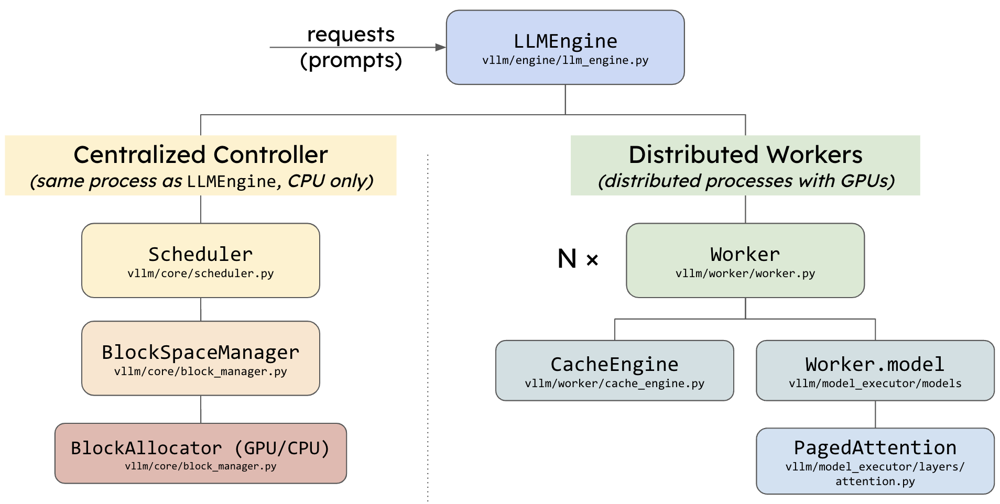
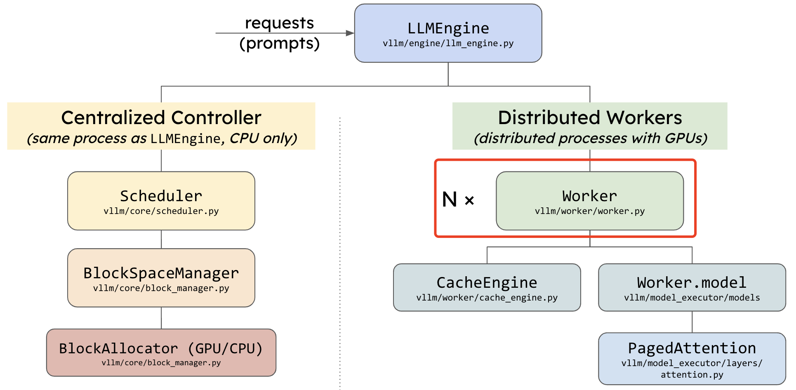

简单来讲，大模型推理一般会经历 4 个流程：Tokenizer -> Model.forward -> Sampler -> DeTokenizer，但对于集成了各种优化技术的 vllm 框架来说，大模型推理服务流程是非常复杂的

先看下 `vLLM` 代码整体架构：



vllm 模型执行流程调用关系可以通过以下代码打印：

```python
print(vllm_model.model.llm_engine.model_executor.driver_worker.model_runner.model)
```

这里先直接总结 vllm 模型推理涉及到的类，及它们之间的调用关系如下，贯穿这些类的是 execute_model 函数。

LLMEngine —> ExecutorBase —> WorkerBase —> ModelRunnerBase

### LLMEngine 类

`LLMEngine` 类: vllm/engine/llm_engine.py

（涉及代码 2000 行）： 用于管理大语言模型（LLM）的推理和生成过程。LLMEngine 是整个 vllm 系统的入口类，其中 _initialize_kv_cache、step、add_request 是重点成员函数，其初始化函数会在引擎对象内部组合一个 `Tokenizer`、`Detokenizer`、和一组（pipeline_parallel_size）`Scheduler`。

其中：
- `step` 方法：是引擎的核心方法，每调用一次执行一次解码步骤。包括调度、执行模型、处理输出和清理任务。
- `_initialize_kv_caches` 方法：初始化 CPU/GPU 的 KV cache 的 blocks 数量，每个 block 包含 block_size 个 tokens。
- `add_request` 方法：负责处理输入的 `prompt` 请求，向引擎的请求池添加新的请求，实现了**规范的请求处理流程**，函数关键步骤包括：通过 _validate_token_prompt 验证输入 token 的有效性、使用 input_preprocessor 对输入进行预处理等等，最后通过 `_add_processed_request` 将处理后的请求添加到系统中。

`step()` 方法中真正调用模型推理的代码只有一行，通过调用 model_executor 类实例的 execute_model 方法执行模型推理。

```python
outputs = self.model_executor.execute_model(execute_model_req=execute_model_req)
```

### ExecutorBase 类

`ExecutorBase` 类: vllm/executor/executor_base.py

模型推理执行器, 针对不同的硬件平台 CPU/GPU/XPU 等，使用工厂方法注册得到不同平台的模型推理执行器类，基类不实现 `execute_model` 函数，每个平台的执行器类都有各自的实现。

`execute_model` 函数内部通过调用下述代码，实现模型推理，输入参数只有一个 `execute_model_req`。类型为 `ExecuteModelRequest`。初始化和执行模型推理代码如下所示:

```python
def __init__(self, ):
    self.driver_worker = self._create_worker()

def execute_model(self, ):
    output = self.driver_worker.execute_model(execute_model_req)
```

#### _create_worker 函数

_create_worker() 函数由 ExecutorBase 类的初始化函数调用: vllm/executor/gpu_executor.py

_create_worker 通过 local_rank 和 rank 参数配置工作器（Worker），其本质上是通过调用 create_worker 函数，create_worker 函数的输入参数如下，函数输入参数通过另外一个类函数 _get_worker_module_and_class 获取。

- `worker_module_name`: 工作器模块名字
- `worker_class_name`： 工作起类名
- `worker_class_fn`：工作器函数

```python
def create_worker(worker_module_name: str, worker_class_name: str,
                  worker_class_fn: Optional[Callable[[], Type[WorkerBase]]],
                  **kwargs):
    wrapper = WorkerWrapperBase(
        worker_module_name=worker_module_name,
        worker_class_name=worker_class_name,
        worker_class_fn=worker_class_fn,
    )
    wrapper.init_worker(**kwargs)
    return wrapper.worker
```

`_get_worker_module_and_class` 函数，支持根据当前的**调度器配置（scheduler_config）和推测性配置（speculative_config）**动态地选择适当的 Worker 模块和类。这些 Worker 模块负责执行实际的模型推理工作。函数实现代码如下所示:

```python
def _get_worker_module_and_class(
        self) -> Tuple[str, str, Optional[Callable[[], Type[WorkerBase]]]]:
    worker_class_fn = None
    if self.scheduler_config.is_multi_step:
        worker_module_name = "vllm.worker.multi_step_worker"
        worker_class_name = "MultiStepWorker"
    elif self.speculative_config:
        worker_module_name = "vllm.spec_decode.spec_decode_worker"
        worker_class_name = "create_spec_worker"
    else:
        worker_module_name = "vllm.worker.worker"
        worker_class_name = "Worker"
    return (worker_module_name, worker_class_name, worker_class_fn)
```

_get_worker_module_and_class 函数逻辑说明

1. 多步调度 (is_multi_step)： 如果启用了多步调度，函数返回：
    * 模块路径："vllm.worker.multi_step_worker"
    * 类名："MultiStepWorker"
2. 推测性解码 (speculative_config)： 如果启用了推测性解码，函数返回：
    * 模块路径："vllm.spec_decode.spec_decode_worker"
    * 类名："create_spec_worker"
3. 默认配置： 如果既未启用多步调度，也未启用推测性解码，则返回默认的 Worker：
    * 模块路径："vllm.worker.worker"
    * 类名："Worker"
4. 函数指针：
    * 默认返回 None，表示无需额外的类处理逻辑。

总结：根据 scheduler_config 或 speculative_config 的状态，选择合适的 Worker 模块和类。

### WorkerWrapperBase 类

`WorkerWrapperBase` 类： vllm/worker/worker_base.py

WorkerBase: 定义了所有 Worker 的抽象基类（接口），明确了每个 Worker 必须实现的功能。抽象方法包括设备初始化、缓存管理、模型执行等。

WorkerWrapperBase 类的关键方法 init_worker()：完成初始化 Worker 的功能，**输入参数是前面 create_worker 的输入参数**，支持自定义逻辑。init_worker 方法支持两种方式获取**实际 Worker 类**：
- 使用 worker_class_fn 函数返回 Worker 类。
- `importlib` 动态导入模块，并从模块中获取 Worker 类。

其中动态导入模块的实现代码如下所示：

```python
mod = importlib.import_module(self.worker_module_name)
worker_class = getattr(mod, self.worker_class_name)
```

上述代码是 Python 的动态导入机制，可以在运行时根据字符串形式的模块名称加载模块，而不是在代码编译时导入。getattr() 函数的作用是从一个对象（在这里是模块 mod）中获取指定名称的属性（在这里是 self.worker_class_name）。在这里的代码中，用于动态获取模块中的类。

#### LocalOrDistributedWorkerBase 类

`LocalOrDistributedWorkerBase`：`vllm/worker/worker_base.py`

抽象基类，用于在本地或分布式环境中运行模型推理任务。它通过以下功能实现模型的执行和数据广播：

- 元数据广播：在分布式环境中，主工作器（Driver Worker）将元数据和输入数据广播到其他工作器。辅助工作器从广播数据中提取输入。
- 输入准备和分布式支持：主工作器准备输入并广播。辅助工作器接收广播并提取输入。
- 推理执行：负责调用模型运行器（model_runner）来执行模型推理步骤。支持单步或多步推理。包含 SPMD（单程序多数据）模式执行
- **抽象方法定义**：定义了 `prepare_worker_input` 和 `execute_worker` 等抽象方法，需子类实现本地逻辑。

真正的模型推理执行是通过调用 self.model_runner.execute_model 代码实现。

```python
output = self.model_runner.execute_model(
    model_input=model_input,
    kv_caches=self.kv_cache[worker_input.virtual_engine]
    if self.kv_cache is not None else None,
    intermediate_tensors=intermediate_tensors,
    num_steps=num_steps,
    **kwargs,
)
```

`self.model_runner` 的初始化在各个不同 `Worker` 子类中实现。如 GPU 的 Worker 类的 __init__ 初始化函数实现了对 self.model_runner 的赋值。

```python
ModelRunnerClass: Type[GPUModelRunnerBase] = ModelRunner
if model_runner_cls is not None:
    ModelRunnerClass = model_runner_cls
elif model_config.task == "embedding":
    ModelRunnerClass = EmbeddingModelRunner
elif self.model_config.is_encoder_decoder:
    ModelRunnerClass = EncoderDecoderModelRunner
self.model_runner: GPUModelRunnerBase = ModelRunnerClass(
    vllm_config=self.vllm_config,
    kv_cache_dtype=self.cache_config.cache_dtype,
    is_driver_worker=is_driver_worker,
    **speculative_args,
)
```

#### Worker 类

Worker 类：vllm/worker/worker.py



默认的 GPU 工作器类，继承自 `LocalOrDistributedWorkerBase`。在 GPU 上执行模型（分区）的 worker 类。**每个 worker 都与单个 GPU 相关联**。worker 负责维护 KV 缓存并在 GPU 上执行模型。在分布式推理的情况下，每个 worker 都会被分配一个模型分区。其核心函数作用总结如下：

- `determine_num_available_blocks`：分析 GPU 内存使用情况，确定可用的 KV 缓存块数量。并返回 num_gpu_blocks 和 num_cpu_blocks。
- `initialize_cache`：分配 GPU 和 CPU 上的 KV 缓存，准备模型的计算缓存。
- `execute_worker`：根据输入执行缓存操作，例如数据块的交换、复制等。

### ModelRunner 类

`ModelRunner`：vllm/worker/model_runner.py

类定义：ModelRunner 是基于 GPU 的模型运行器，支持推理和采样。类包含 2 个成员变量：
- `_model_input_cls`：定义模型输入的类型，ModelInputForGPUWithSamplingMetadata。
- `_builder_cls`：定义构造模型输入的工具类，ModelInputForGPUBuilder。

核心函数：
- `make_model_input_from_broadcasted_tensor_dict`：从广播的张量字典创建 ModelInputForGPUWithSamplingMetadata 实例。通过调用ModelInputForGPUWithSamplingMetadata 类的 from_broadcasted_tensor_dict 方法解析输入张量，并与注意力后端 (attn_backend) 配置绑定。
- `prepare_model_input`：为推理准备模型输入，包括元数据和采样配置。按 prefill 和 decode 的顺序对输入数据进行批处理。使用 dataclasses.replace 方法更新模型输入。
- `execute_model`：作用执行一次模型推理。推理执行流程包括： 使用 CUDA 图 (decode_meta.use_cuda_graph) 或常规执行 —> 模型计算 logits —> 如果是最后一级流水线，使用 logits 采样下一个 token。最终返回的是采样输出 (SamplerOutput)。

调用 model.forward 模型推理的代码如下所示，这里的 model_executable 是应用了 cuda graph 技术后捕获 `graph_runners[virtual_engine][graph_batch_size]`。
```python
with set_forward_context(model_input.attn_metadata):
    hidden_or_intermediate_states = model_executable(
        input_ids=model_input.input_tokens,
        positions=model_input.input_positions,
        kv_caches=kv_caches,
        attn_metadata=model_input.attn_metadata,
        intermediate_tensors=intermediate_tensors,
        **MultiModalKwargs.as_kwargs(multi_modal_kwargs,
                                        device=self.device),
        **seqlen_agnostic_kwargs)
```

self.graph_runners 的赋值是通过 GPUModelRunnerBase 类的 capture_model 函数捕获一系列不同 batch_size 的 capture_models。

至此，vllm 推理的各个类的调用关系和流程的简单分析完毕了，后续会继续优化细节。

### 参考资料

- [The first vLLM meetup](https://docs.google.com/presentation/d/1QL-XPFXiFpDBh86DbEegFXBXFXjix4v032GhShbKf3s/edit?pli=1#slide=id.g24ad94a0065_0_350)