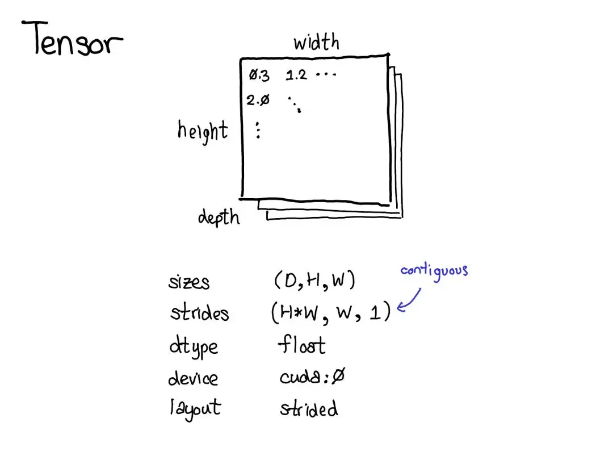
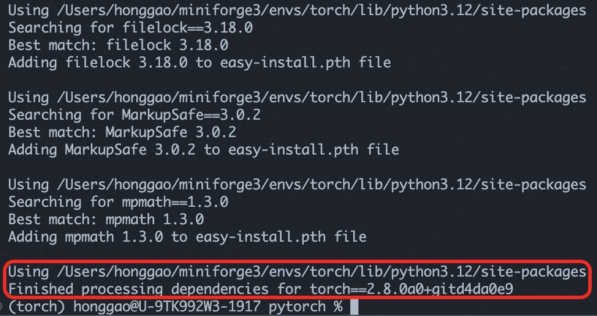
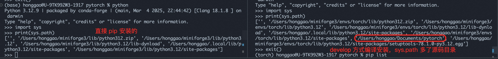
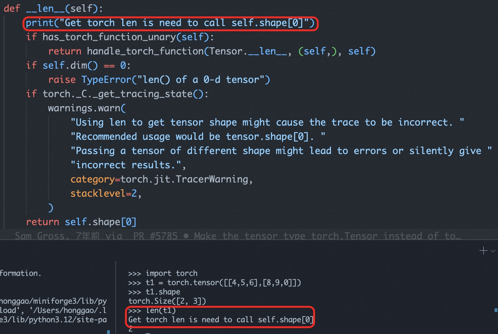
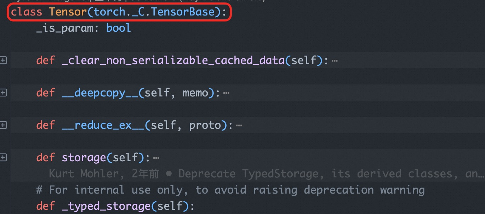
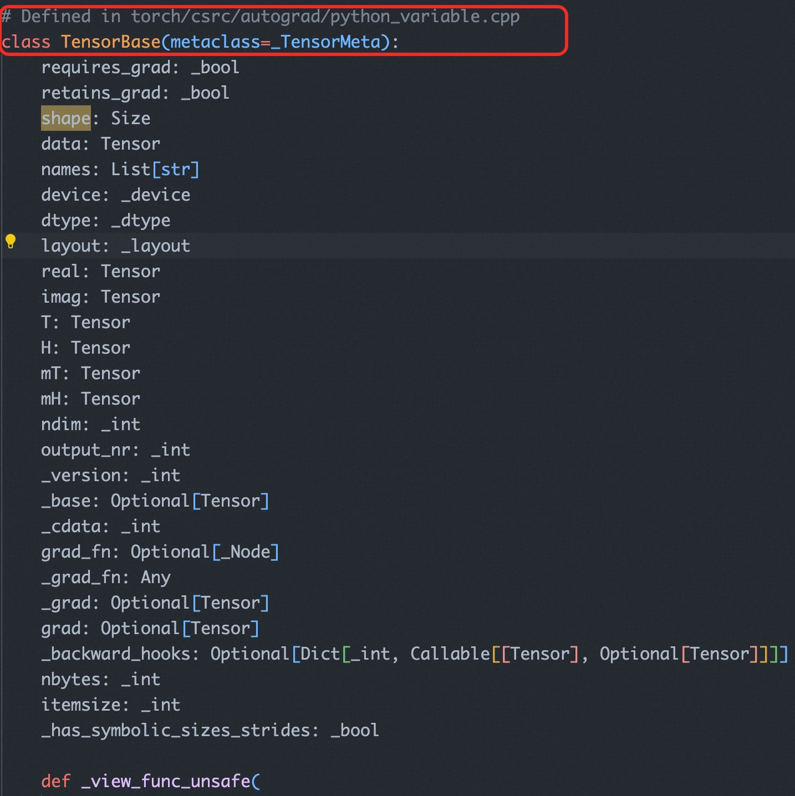

- [一 pytorch 框架概述](#一-pytorch-框架概述)
  - [1.1 pytorch 概述](#11-pytorch-概述)
  - [1.2 在 macOS 上的编译安装](#12-在-macos-上的编译安装)
- [二 pytorch 源码目录](#二-pytorch-源码目录)
  - [2.1 c10 核心基础库](#21-c10-核心基础库)
- [三 pytorch 前后端](#三-pytorch-前后端)
  - [3.1 前后端交互](#31-前后端交互)
- [参考资料](#参考资料)

## 一 pytorch 框架概述

### 1.1 pytorch 概述

`PyTorch` 框架本质上是一个支持自动微分的张量库，张量是 PyTorch 中的核心数据结构。
1. 从直观上理解，其是一种包含某种标量类型（比如浮点数和整型数等）的 n 维数据结构。
2. 从代码角度看，张量可以看作是包含一些数据成员的结构体/类对象，比如，张量的尺寸、张量的元素类型（dtype）、张量所在的设备类型（CPU 内存？CUDA 内存？）和步长 `stride` 等数据成员。

<div align="center">

</div>

### 1.2 在 macOS 上的编译安装

1，前置安装条件：

`Cmake` 使用 `brew` 方式安装，不推荐用 `conda` 安装，版本优先推荐 `3.31`:
```bash
(torch) honggao@U-9TK992W3-1917 pytorch % cmake --version
cmake version 3.31.6 
```

2，在环境中有 conda 的基础上，按照以下步骤编译按照 cpu 版本的 pytorch。

```bash
# 1, 创建名为 torch_dev 的虚拟环境，指定 python 版本为 3.12
conda create --name torch_dev python=3.12
conda activate torch_dev # 可不执行

# 2，安装依赖包
conda install cmake ninja
pip install -r requirements.txt
# 如果需要 torch.distributed 模块的功能
conda install pkg-config libuv

# 如果本地电脑 macos 系统中没有 cmake 或者版本低于3.15
brew install cmake

# 3,编译安装 torch 包（这个过程耗时非常严重）
MAX_JOBS=8 python setup.py develop # 使用 8 个并行任务同时编译
MAX_JOBS=8 python setpy.py install 编译源码，打好包，并安装（拷贝）到平台 python 环境中
```

<div align="center">

</div>

和 `install` 方式不同之处在于，其不拷贝文件到平台环境，而是在 python 启动时直接将源码目录加到 python PATH 变量中。在 python 解释中通过 import sys 并打印 sys.path 可以看到**pytorch 多了源码目录**。

<div align="center">

</div>

`develop` 编译安装方式可以让开发者在开发顶层 `python` 层逻辑代码时（比如要加入一个新的 nn module layer），**在源码处做更改后即可立刻看到效果**。

举个例子，我在 pytorch python 端的 Tensor 类代码的 `__len__` 魔法方法中加入一段 print("Get torch len is need to call self.shape[0]") 代码后，在 python 中调用 `len(tensor)` 会立即生效，如下图所示:

<div align="center">

</div>

## 二 pytorch 源码目录

PyTorch 2.x 的源码主要划分为多个顶级目录，每个目录承担不同的功能，通过 `tree -L 1 -d` 显示当前目录的 `1` 层子目录。

```bash
├── android # 在 Android 平台上编译和部署 PyTorch 有关
├── aten    # ATen (“A Tensor”) 是 PyTorch 的张量库与算子库核心，实现了底层的张量数据结构、算子等基础。
├── benchmarks # 存放性能基准测试（benchmark）脚本及相关工具
├── binaries   # 存放编译后生成的可执行文件或脚本、工具，可能也用作打包产物输出目录
├── build      # 编译输出和中间产物
├── c10        # PyTorch 的核心基础库，包含常用数据结构（TensorImpl, Storage）和调度器（Dispatcher）、设备适配等的通用实现。
├── caffe2     # Caffe2 的遗留子目录，包含 Caffe2 自己的 core, utils, serialize 等部分
├── cmake      # 存放 CMake 脚本和配置模块
├── docs       # 存放文档
├── functorch  #  Functorch 项目集成到 PyTorch 源码，提供可对函数进行变换（vmap, grad等）的函数式功能和原型。
├── mypy_plugins # 存放mypy（Python 静态类型检查）的插件或自定义类型规则
├── scripts    # 辅助脚本
├── test       # PyTorch 的 测试用例目录：单元测试、集成测试
├── third_party #第三方依赖库 源码
├── tools      # 构建工具与脚本库，包含 build 系列脚本、jit 工具、onnx 工具、code_coverage, linter 等
├── torch      # PyTorch Python 包源码的核心实现
├── torch.egg-info
└── torchgen   # PyTorch 算子代码生成相关脚本和生成文件目录，如算子注册、shape 函数生成、static_runtime、decompositions 等。
```

虽然第一级的子目录很多，但是对于开发者来说，最核心和重要的子目录就那几个，简单总结下其作用和相互关系：

1. `c10/`：c10 指的是 caffe tensor library，相当于 caffe 的 aten, PyTorch 的**核心基础库目录**。
   - c10 子目录提供了**在各平台通用的基础构件**，包括**Tensor 元数据和存储实现、调度分发机制（dispatcher）、流（Stream）、事件（Event）等**​。
   - 它其实是 PyTorch 和 Caffe2 合并后抽象出的统一核心层，“c10” 名字取自 “Caffe2” 与 “A Ten”的谐音（`C Ten`）。
   - c10 本身不包含算子的实现，它更多的是提供一些辅助张量自动微分机制的抽象模块和类。
2. `aten/`：ATen (“A Tensor”) 库目录。ATen 是 PyTorch 的**张量运算核心库**（C++ 实现），提供张量及其操作的定义和实现​。它不直接包含自动求导逻辑，主要关注**张量的创建、索引、数学运算、张量运算等 kernel 操作和实现的功能**。aten/src/ATen 下有核心子目录：
    - `ATen/core`：ATen 的核心功能（部分正逐步迁移到顶层的 c10 目录）。
    - `ATen/native`：分算子（operators）的 `native` 实现。如果要新增算子，一般将实现放在这里​。根据设备类型又细分子目录:
      - `native/cpu`: 并非真正意义上的 CPU 算子实现，而是经过特定处理器指令（如 AVX）编译的实现。​。
      - `native/cuda`: 算子的 CUDA 实现。
      - `native/sparse`:  COO 格式稀疏张量操作在 CPU 和 CUDA 上的实现。
      - `native/quantized`: 量化张量（即 QTensor）算子的实现。
3. `torch/`：真正的 PyTorch 库，除 csrc 中的内容外，其余部分都是 Python 模块，遵循 PyTorch Python 前端模块结构。
    - `csrc`: 构成 PyTorch 库的 C++ 文件。该目录树中的文件混合了 Python 绑定代码和大量 C++ 底层实现。有关 Python 绑定文件的正式列表，请参阅 `setup.py`；通常它们以 python_ 为前缀。
	- `jit`: TorchScript JIT 前端的编译器及前端。一个编译堆栈（TorchScript）用于从 PyTorch 代码创建可序列化和可优化的模型。
	- `autograd`: **反向自动微分的实现**。详见 README。
	- `api`: PyTorch 的 C++ 前端。
	- `distributed`: PyTorch 的分布式训练支持。
4. `tools`: 供 PyTorch 库使用的代码生成脚本。

### 2.1 c10 核心基础库

c10 作为 PyTorch 框架的**核心基础库**，其包含多个子模块：
- `c10/core/`：核心组件，定义了 PyTorch **核心数据结构和机制**。例如包含 `TensorImpl`（张量底层实现类）​、`Storage`（张量存储）、`DispatchKey` 和 `Dispatcher`（动态算子调度）、设备类型 `Device`、类型元信息 `TypeMeta` 等基础定义。
- `c10/util/`：工具模块，提供通用的 C++ 实用组件。如 intrusive_ptr 智能指针、`UniqueVoidPtr` 通用指针封装、`Exception` 异常处理、日志和元编程工具等，供整个框架使用。
- `c10/macros/`：宏定义模块，包含编译配置相关的宏。例如根据操作系统和编译选项生成的 cmake_macros.h，以及 C10_API, TORCH_API, CAFFE2_API 等符号导出控制宏​。
- `c10/cuda/`, c10/hip/, c10/metal/, c10/xpu/ 等：特定设备平台支持代码, 这些目录有助于在 c10 层面适配不同硬件平台。例如:
	- c10/cuda 中包含 **CUDA 后端初始化、流管理等与 CUDA 设备相关的基础功能**；
	- c10/hip 类似地对应 AMD 的 HIP；
	- c10/metal 针对苹 Metal 后端；
	- c10/xpu 则可能用于其他加速器（如 Intel XPUs）。
- `c10/mobile/`：移动端支持代码，为在移动/嵌入式场景下裁剪和优化 PyTorch 而设。
- `c10/test/`：c10 本身的一些单元测试代码。

## 三 pytorch 前后端

在 pytorch 中前端指的是 pytorch 的 python  接口，用于构建数据集处理 pipeline、定义模型结构和训练评估模型的工具接口。

后端指的是 PyTorch 的底层 C++ 引擎，它负责执行前端指定的计算。后端引擎使用张量表示计算图的节点和边，并使用高效的线性代数运算和卷积运算来执行计算。后端引擎支持多设备（如 cpu、cuda、rocm等）执行计算，将 python 计算代码转换为底层设备平台能够执行的代码。

pytorch 中的 tensor 实现在 torch/_tensor.py 中，其继承了 C++ 中实现的 `TensorBase`。torch/_tensor.py 是 PyTorch 中定义和包装张量（Tensor）的 Python 端接口文件，它连接了 C++ 内核实现与 Python 用户接口。总体来说，

<div align="center">

</div>

`_TensorBase` 类的实现是在 torch/_C/__init__.pyi 中。

torch/_C/init.pyi 作文件是 PyTorch 对外提供的 C++ 扩展模块接口的**类型提示文件**（`stub file`），用于描述 torch._C 模块中 C++ 实现的各个函数、类和常量的类型定义信息，但是没有具体实现。

PyTorch 通过 pybind11 将 C++ 函数、类暴露给 Python，在这个过程中部分信息可以被用来生成 `.pyi` 文件。

下图可以看出 `TensorBase` 类真正的实现是在 torch/csrc/autograd/python_variable.cpp 中。

<div align="center">

</div>

在 python_variable.cpp 文件中，可以看到 PyTorch 实际是用了 pybind，将 c++ 和 Python 进行交互的。

> `“THPVariable”` 全称为`“Torch Python Variable”`，用于表示 `PyTorch` 源码中用于 `Python` 绑定的 C 结构体类型，其代表了 Python 层中的 `Tensor` 对象（历史上称为 `Variable`）

### 3.1 前后端交互

以 Tensor 对象为例分析 Python 和 C++ 黏合的部分（pybind）

## 参考资料

- [万字综述，核心开发者全面解读PyTorch内部张量机制](https://mp.weixin.qq.com/s/8J-vsOukt7xwWQFtwnSnWw)