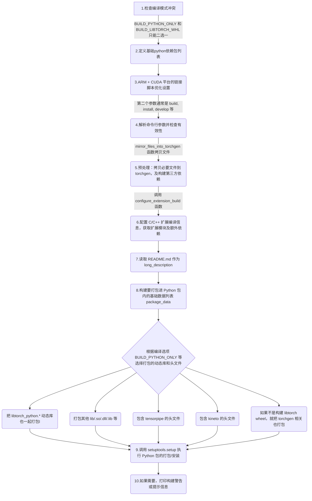

- [1. 解析 setup.py 中 main 函数流程](#1-解析-setuppy-中-main-函数流程)
- [2. configure\_extension\_build 函数流程](#2-configure_extension_build-函数流程)

## 1. 解析 setup.py 中 main 函数流程

在 `setup.py` 中，最主要的是调用 `setuptools.setup()` 函数，它是 Python 中 setuptools 模块的核心，**用于定义 Python 包的元数据、依赖关系和构建流程**。pytorch/setup.py 在 `main()` 函数中调用了 `setup()` 函数。

`setup` 的函数参数有很多个，主要分为以下类型：
1. **基础参数**：定义包元数据：包名称 `name`、版本号 `version`、简要描述 description、作者 author、项目主页 url、子包 packages、依赖的第三方库 install_requires、长描述 long_description 等。
2. **扩展模块参数** `ext_modules`：编译 `C++/CUDA` 代码。
3. **自定义构建流程** `cmdclass`：覆盖默认命令。

这里对其进行了注释如下所示：

```python
setup(
    # -------------------------------------------
    # 1. 基础信息
    # -------------------------------------------
    name=package_name,                 # 包名，在 PyPI 或安装时用于标识该包，比如 "torch"
    version=version,                   # 包版本号，通常遵循语义化版本(如 1.0.0)
    description=(                      # 简短描述，会显示在 PyPI 中的标题描述
        "Tensors and Dynamic neural networks in Python with strong GPU acceleration"
    ),
    long_description=long_description, # 包的详细描述，通常从 README.md 中读取，可在 PyPI 上显示更丰富内容
    long_description_content_type="text/markdown",  # 指定 long_description 的格式，这里是 Markdown

    # -------------------------------------------
    # 2. 编译和构建相关
    # -------------------------------------------
    ext_modules=extensions,   # 需要编译的 C/C++ 扩展模块列表（如 pybind11、Cython 等）
    cmdclass=cmdclass,        # 自定义构建/安装命令的类映射，覆盖默认的 build_ext 等逻辑

    # -------------------------------------------
    # 3. Python 包及入口点
    # -------------------------------------------
    packages=packages,        # 要被打包的 Python 包列表，通常由 find_packages() 获取
    entry_points=entry_points,# 安装包时可注册命令行可执行入口，如 console_scripts

    # -------------------------------------------
    # 4. 依赖和可选依赖
    # -------------------------------------------
    install_requires=install_requires, # 安装该包时必须安装的依赖库列表
    extras_require=extras_require,      # 可选依赖项：用户可通过 "pip install package[extra]" 安装

    # -------------------------------------------
    # 5. 包含的文件/资源
    # -------------------------------------------
    package_data=package_data,          # 指定需要包含在包内的额外文件（如头文件、.so/.dll、.cmake等）
                                        # 与实际的 Python 源码一起打包发布

    # -------------------------------------------
    # 6. 版权、主页及其他元数据
    # -------------------------------------------
    url="https://pytorch.org/",         # 包对应的项目网址，会在 PyPI 上显示
    download_url="https://github.com/pytorch/pytorch/tags", # 包源码下载地址
    author="PyTorch Team",              # 作者姓名
    author_email="packages@pytorch.org",# 作者联系邮箱

    # -------------------------------------------
    # 7. Python 版本和分类器
    # -------------------------------------------
    python_requires=f">={python_min_version_str}", # 指定兼容的最低 Python 版本，比如 ">=3.6"
    classifiers=[
        # PyPI 上展示的分类器，可帮助其他人快速了解该库的适用范围、状态和许可证等
        "Development Status :: 5 - Production/Stable",
        "Intended Audience :: Developers",
        "Intended Audience :: Education",
        "Intended Audience :: Science/Research",
        "License :: OSI Approved :: BSD License",
        "Topic :: Scientific/Engineering",
        "Topic :: Scientific/Engineering :: Mathematics",
        "Topic :: Scientific/Engineering :: Artificial Intelligence",
        "Topic :: Software Development",
        "Topic :: Software Development :: Libraries",
        "Topic :: Software Development :: Libraries :: Python Modules",
        "Programming Language :: C++",
        "Programming Language :: Python :: 3",
    ]
    + [
        # 额外添加 "Programming Language :: Python :: 3.X" 的分类器
        f"Programming Language :: Python :: 3.{i}"
        for i in range(python_min_version[1], version_range_max)
    ],

    # -------------------------------------------
    # 8. 许可证与关键词
    # -------------------------------------------
    license="BSD-3-Clause",      # 指定许可证，这里为 BSD-3-Clause
    keywords="pytorch, machine learning",  # 关键词，用于 PyPI 搜索
)
```

`main()` 函数的流程图如下所示：



package_data 是存放要包含在 'torch' 包中的文件(二进制文件、头文件、cmake脚本等)，分两种情况：
1. 如果不是构建 libtorch wheel，就把 libtorch_python.* 动态库也一起打包；
2. 如果不是纯 Python 构建，那么还要包含其他 .so/.dll/.lib 等；
3. 如果开启 USE_TENSORPIPE，就把 tensorpipe 的头文件也包含进来；
4. 如果开启 USE_KINETO，就把 kineto 的头文件也包含进来。
5. 若不是构建 libtorch wheel，就把 torchgen 相关也打包；否则不包含扩展

为了更方便理解 main 函数流程，我对 torch/setup.py 的 main 做了简化并添加注释，代码如下所示:

```python
def main():
    # --------------------------------------------------------------
    # 1. 检查编译模式冲突
    # --------------------------------------------------------------
    # 如果指定了同时只构建 Python 部分 (BUILD_PYTHON_ONLY)
    # 和构建 libtorch wheel 包 (BUILD_LIBTORCH_WHL)，两者互斥，抛出异常
    if BUILD_LIBTORCH_WHL and BUILD_PYTHON_ONLY:
        raise RuntimeError(
            "Conflict: 'BUILD_LIBTORCH_WHL' and 'BUILD_PYTHON_ONLY' can't both be 1. Set one to 0 and rerun."
        )

    # --------------------------------------------------------------
    # 2. 定义基础依赖列表
    # --------------------------------------------------------------
    # 安装 PyTorch 时需要安装的 Python 包依赖
    install_requires = [
        "filelock",
        "typing-extensions>=4.10.0",
        'setuptools ; python_version >= "3.12"',
        "sympy>=1.13.3",
        "networkx",
        "jinja2",
        "fsspec",
    ]

    # 如果只构建 Python，那么需要对应的 libtorch 包
    if BUILD_PYTHON_ONLY:
        install_requires.append(f"{LIBTORCH_PKG_NAME}=={get_torch_version()}")

    # --------------------------------------------------------------
    # 3. ARM + CUDA 平台的链接脚本优化设置
    # --------------------------------------------------------------
    use_prioritized_text = str(os.getenv("USE_PRIORITIZED_TEXT_FOR_LD", ""))
    # 如果在 Linux + AArch64 上未设置 USE_PRIORITIZED_TEXT_FOR_LD，就提示一下优化策略
    if (
        use_prioritized_text == ""
        and platform.system() == "Linux"
        and platform.processor() == "aarch64"
    ):
        print_box(
            """
            WARNING: we strongly recommend enabling linker script optimization for ARM + CUDA.
            To do so please export USE_PRIORITIZED_TEXT_FOR_LD=1
            """
        )
    # 如果启用 USE_PRIORITIZED_TEXT_FOR_LD，则调用脚本生成链接脚本并注入编译/链接选项
    if use_prioritized_text == "1" or use_prioritized_text == "True":
        gen_linker_script(
            filein="cmake/prioritized_text.txt", fout="cmake/linker_script.ld"
        )
        linker_script_path = os.path.abspath("cmake/linker_script.ld")
        os.environ["LDFLAGS"] = os.getenv("LDFLAGS", "") + f" -T{linker_script_path}"
        os.environ["CFLAGS"] = (
            os.getenv("CFLAGS", "") + " -ffunction-sections -fdata-sections"
        )
        os.environ["CXXFLAGS"] = (
            os.getenv("CXXFLAGS", "") + " -ffunction-sections -fdata-sections"
        )

    # --------------------------------------------------------------
    # 4. 解析命令行参数并检查有效性
    # --------------------------------------------------------------
    # Distribution 对象可解析命令行参数 (如 build, install, sdist, bdist_wheel 等)
    dist = Distribution()
    dist.script_name = os.path.basename(sys.argv[0])
    dist.script_args = sys.argv[1:]
    try:
        dist.parse_command_line()
    except setuptools.distutils.errors.DistutilsArgError as e:
        print(e)
        sys.exit(1)

    # --------------------------------------------------------------
    # 5. 预处理：拷贝必要文件到 torchgen，及构建第三方依赖
    # --------------------------------------------------------------
    mirror_files_into_torchgen()
    if RUN_BUILD_DEPS:
        build_deps()

    # --------------------------------------------------------------
    # 6. 配置 C/C++ 扩展编译信息，获取扩展模块及额外依赖
    # --------------------------------------------------------------
    (
        extensions,
        cmdclass,
        packages,
        entry_points,
        extra_install_requires,
    ) = configure_extension_build()
    # 将额外依赖追加到基础依赖中
    install_requires += extra_install_requires

    # 扩展依赖项(可选安装)，比如 pip install torch[optree]
    extras_require = {
        "optree": ["optree>=0.13.0"],
        "opt-einsum": ["opt-einsum>=3.3"],
    }

    ########## 读取 README.md 作为 long_description的代码省略 ##########
    # --------------------------------------------------------------
    # 7. 构建要打包进 Python 包内的数据列表(package_data)
    # --------------------------------------------------------------
    # version_range_max 用于动态生成 Python 版本兼容的分类器
    version_range_max = max(sys.version_info[1], 13) + 1

    # torch_package_data 存放要包含在 'torch' 包中的文件(二进制文件、头文件、cmake脚本等)
    torch_package_data = [
        "py.typed",
        "bin/*",
        "test/*",
        "*.pyi",
        "**/*.pyi",
        "lib/*.pdb",
        "lib/**/*.pdb",
        "lib/*shm*",
        "lib/torch_shm_manager",
        "lib/*.h",
        "lib/**/*.h",
        "include/*.h",
        "include/**/*.h",
        "include/*.hpp",
        "include/**/*.hpp",
        "include/*.cuh",
        "include/**/*.cuh",
        "_inductor/codegen/*.h",
        "_inductor/codegen/aoti_runtime/*.cpp",
        "_inductor/script.ld",
        "_export/serde/*.yaml",
        "_export/serde/*.thrift",
        "share/cmake/ATen/*.cmake",
        "share/cmake/Caffe2/*.cmake",
        "share/cmake/Caffe2/public/*.cmake",
        "share/cmake/Caffe2/Modules_CUDA_fix/*.cmake",
        "share/cmake/Caffe2/Modules_CUDA_fix/upstream/*.cmake",
        "share/cmake/Caffe2/Modules_CUDA_fix/upstream/FindCUDA/*.cmake",
        "share/cmake/Gloo/*.cmake",
        "share/cmake/Tensorpipe/*.cmake",
        "share/cmake/Torch/*.cmake",
        "utils/benchmark/utils/*.cpp",
        "utils/benchmark/utils/valgrind_wrapper/*.cpp",
        "utils/benchmark/utils/valgrind_wrapper/*.h",
        "utils/model_dump/skeleton.html",
        "utils/model_dump/code.js",
        "utils/model_dump/*.mjs",
    ]

    ##########################省略部分代码############################

    # 若不是构建 libtorch wheel，就把 torchgen 相关也打包；否则不包含扩展
    if not BUILD_LIBTORCH_WHL: # BUILD_LIBTORCH_WHL 默认为 0
        package_data["torchgen"] = torchgen_package_data
    else:
        # 在 BUILD_LIBTORCH_WHL 模式下，不需要构建Python C/C++扩展
        extensions = []

    # --------------------------------------------------------------
    # 8. 调用 setuptools.setup() 执行 Python 包的打包/安装
    # --------------------------------------------------------------
    setup(
        name=package_name,
        version=version,
        description=(
            "Tensors and Dynamic neural networks in Python with strong GPU acceleration"
        ),
        ext_modules=extensions,           # C/C++ 扩展模块
        cmdclass=cmdclass,               # 自定义构建命令
        packages=packages,               # 包含的Python包
        entry_points=entry_points,       # 可执行入口
        install_requires=install_requires,
        extras_require=extras_require,
        package_data=package_data,
        url="https://pytorch.org/",
        download_url="https://github.com/pytorch/pytorch/tags",
        author="PyTorch Team",
        author_email="packages@pytorch.org",
        python_requires=f">={python_min_version_str}",
        # classifiers 列表和 long_description 代码省略
        license="BSD-3-Clause",
        keywords="pytorch, machine learning",
    )

if __name__ == "__main__":
    main()
```

## 2. configure_extension_build 函数流程

`configure_extension_build` 函数用于配置并生成构建和安装 PyTorch C/C++ 扩展模块所需要的关键参数：
- `ext_modules`：列表，用于定义 C/C++ 扩展模块，以便在安装时通过 setuptools 构建和编译这些模块。
- `cmdclass`: 字典，自定义命令，用于在安装过程中执行一些额外的操作（例如：编译其他资源、运行脚本等）。
- `packages`: 列表，用于指定要包含在安装包中的 Python 包,每个元素是一个包的名称或包路径。
- `entry_points`: 字典，通常用于指定可执行脚本或插件系统的入口点。
- `extra_install_requires`: 字典，当想实现特定功能时，用此参数来定义**可选的额外依赖项**

configure_extension_build 函数流程如下所示:

```bash
configure_extension_build()
├─ 读取 CMake 缓存变量 (cmake_cache_vars)
├─ 配置编译选项
│  ├─ 从 CMakeCache.txt 或相关上下文中获取编译配置选项
│  ├─ 根据操作系统设置编译/链接参数
│  ├─ 处理调试/发布模式标志
│  ├─ 处理 macOS 交叉编译选项
│  └─ 定义辅助函数，生成传给链接器（linker）的 -rpath 参数
├─ 声明扩展模块和包
│  ├─ 排除不编译的目录 (caffe2/tools)
│  ├─ 创建主扩展模块 (torch._C)
│  └─ 条件添加 functorch 扩展
├─ 定义自定义构建命令 (cmdclass)
├─ 配置入口点 (console_scripts)
└─ 返回配置参数
```

`rpath`（runtime search path）是一个在运行时指定动态库搜索路径的机制，让可执行文件或共享库知道去哪里寻找依赖的其它动态库。默认情况下，系统会在标准路径（如 /usr/lib, /usr/local/lib）或在由 `LD_LIBRARY_PATH`（或 `macOS` 的 `DYLD_LIBRARY_PATH`）等环境变量中指定的路径里查找；

configure_extension_build 注释后的代码如下所示：

```python
def configure_extension_build():
    r"""
    配置 PyTorch C/C++ 扩展构建选项，并返回给 setuptools.setup(...) 所需的部分参数。

    Returns:
      5 个元素组成的元组：
        (extensions, cmdclass, packages, entry_points, extra_install_requires)
    """
    # 从 CMakeCache.txt 或相关上下文中获取编译配置选项
    cmake_cache_vars = get_cmake_cache_vars()

    ################################################################################
    # 1. 设置编译标志与链接标志的基础配置
    ################################################################################
    library_dirs = []
    extra_install_requires = []

    # 根据平台选择不同编译/链接选项
    if IS_WINDOWS:
        # /NODEFAULTLIB:LIBCMT.LIB - 指定只链接 DLL 版运行时
        extra_link_args = ["/NODEFAULTLIB:LIBCMT.LIB"]
        # /MD - 使用动态运行时库，/FS - 并行写PDB，/EHsc - 启用标准C++异常处理
        extra_compile_args = ["/MD", "/FS", "/EHsc"]
    else:
        extra_link_args = []
        extra_compile_args = [
            "-Wall",
            "-Wextra",
            "-Wno-strict-overflow",
            "-Wno-unused-parameter",
            "-Wno-missing-field-initializers",
            "-Wno-unknown-pragmas",
            # -fno-strict-aliasing 可兼容早期 Python（2.6），避免代码对别名优化敏感
            "-fno-strict-aliasing",
        ]

    # 将编译后生成的库路径加入 library_dirs，以便链接
    library_dirs.append(lib_path)

    main_compile_args = []
    main_libraries = ["torch_python"]  # 默认链接到 torch_python 库
    main_link_args = []
    main_sources = ["torch/csrc/stub.c"]  # 默认源文件
    
    # 如果是只构建 libtorch wheel，则不需要 torch_python，而是链接 "torch"
    # 并且 stub.c 也不使用
    if BUILD_LIBTORCH_WHL:
        main_libraries = ["torch"]
        main_sources = []

    # 处理 Debug / RelWithDebInfo 模式下的编译、链接标志
    if build_type.is_debug():
        if IS_WINDOWS:
            extra_compile_args.append("/Z7")      # 生成完整调试信息
            extra_link_args.append("/DEBUG:FULL") # 链接时也生成 pdb 等
        else:
            extra_compile_args += ["-O0", "-g"]   # 不优化并生成调试信息
            extra_link_args += ["-O0", "-g"]
    if build_type.is_rel_with_deb_info():
        if IS_WINDOWS:
            extra_compile_args.append("/Z7")
            extra_link_args.append("/DEBUG:FULL")
        else:
            extra_compile_args += ["-g"]
            extra_link_args += ["-g"]

    # 额外 Python 依赖：若环境变量 PYTORCH_EXTRA_INSTALL_REQUIREMENTS 有值，就拆分并加入
    pytorch_extra_install_requirements = os.getenv("PYTORCH_EXTRA_INSTALL_REQUIREMENTS", "")
    if pytorch_extra_install_requirements:
        report(f"pytorch_extra_install_requirements: {pytorch_extra_install_requirements}")
        extra_install_requires += pytorch_extra_install_requirements.split("|")

    # macOS 交叉编译配置：若 CMAKE_OSX_ARCHITECTURES 指定为 arm64 或 x86_64 等
    if IS_DARWIN:
        macos_target_arch = os.getenv("CMAKE_OSX_ARCHITECTURES", "")
        if macos_target_arch in ["arm64", "x86_64"]:
            macos_sysroot_path = os.getenv("CMAKE_OSX_SYSROOT")
            if macos_sysroot_path is None:
                # 调用 xcrun --show-sdk-path 来获取macOS的sysroot
                macos_sysroot_path = (
                    subprocess.check_output(["xcrun", "--show-sdk-path", "--sdk", "macosx"])
                    .decode("utf-8")
                    .strip()
                )
            # 为编译/链接追加 -arch 和 -isysroot 参数，以匹配目标架构
            extra_compile_args += [
                "-arch", macos_target_arch,
                "-isysroot", macos_sysroot_path,
            ]
            extra_link_args += ["-arch", macos_target_arch]

    # 定义一个辅助函数，用于生成相对路径的 rpath 参数
    def make_relative_rpath_args(path):
        if IS_DARWIN:
            # macOS 下可使用 @loader_path
            return [f"-Wl,-rpath,@loader_path/{path}"]
        elif IS_WINDOWS:
            # Windows 下不使用 rpath
            return []
        else:
            # Linux 下用 $ORIGIN
            return [f"-Wl,-rpath,$ORIGIN/{path}"]

    ################################################################################
    # 2. 声明扩展模块和 Python 包
    ################################################################################
    extensions = []

    # exclude 某些不需要作为 Python 包的目录
    excludes = ["tools", "tools.*", "caffe2", "caffe2.*"]

    # 若未开启 BUILD_FUNCTORCH，则排除 functorch 包
    if not cmake_cache_vars["BUILD_FUNCTORCH"]:
        excludes.extend(["functorch", "functorch.*"])

    # 使用 find_packages 排除上述目录，获取最终要打包的 Python 包列表
    packages = find_packages(exclude=excludes)

    # 定义主扩展模块： torch._C
    C = Extension(
        "torch._C",                             # 模块的全名, 安装后可通过 torch._C 导入核心
        libraries=main_libraries,               # 链接所依赖的库名列表
        sources=main_sources,                   # 源文件列表，编译这些文件生成模块
        language="c",                           # 指定语言，决定使用哪种编译器
        extra_compile_args=main_compile_args + extra_compile_args, # 编译时传递的额外命令行参数
        include_dirs=[],                        # 头文件搜索路径
        library_dirs=library_dirs,              # 库文件搜索路径
        extra_link_args=(                       # 链接时传递的额外命令行参数，通常用于设置 rpath 等
            extra_link_args
            + main_link_args
            + make_relative_rpath_args("lib")   # rpath 配置
        ),
    )
    extensions.append(C)

    # 如果编译 functorch，则再添加一个 functorch._C 占位扩展（由外部CMake完成实际构建并复制）
    if cmake_cache_vars["BUILD_FUNCTORCH"]:
        extensions.append(
            Extension(name="functorch._C", sources=[]),
        )

    # 自定义命令类，用于替换默认的 setuptools build_ext、bdist_wheel 等
    cmdclass = {
        "bdist_wheel": wheel_concatenate,
        "build_ext": build_ext,
        "clean": clean,
        "install": install,
        "sdist": sdist,
    }

    # 定义 Python 的命令行入口点
    entry_points = {
        "console_scripts": [
            "torchrun = torch.distributed.run:main",   # 安装后可使用 torchrun 命令
        ],
        "torchrun.logs_specs": [
            "default = torch.distributed.elastic.multiprocessing:DefaultLogsSpecs",
        ],
    }

    # 若编译开启分布式，则把 torchfrtrace 脚本也加入 console_scripts
    if cmake_cache_vars["USE_DISTRIBUTED"]:
        entry_points["console_scripts"].append(
            "torchfrtrace = tools.flight_recorder.fr_trace:main",
        )

    # ----------------------------------------------------------------
    # 在返回之前，使用 logger.info() 打印当前生成的各参数
    # ----------------------------------------------------------------
    
    logger.info("=== configure_extension_build Results ===")
    logger.info("extensions: %s", extensions)
    logger.info("cmdclass: %s", cmdclass)
    logger.info("packages: %s", packages)
    logger.info("entry_points: %s", entry_points)
    logger.info("extra_install_requires: %s", extra_install_requires)
    logger.info("=========================================")
    
    # 最后将上述配置统一返回
    return extensions, cmdclass, packages, entry_points, extra_install_requires
```

上述代码看起来内容很多，其实最核心最本质的代码就是定义主拓展模块那部分代码：

```python
# 定义主扩展模块： torch._C
C = Extension(
    "torch._C",                             # 模块的全名, 安装后可通过 torch._C 导入
    libraries=main_libraries,               # 链接所依赖的库名列表
    sources=main_sources,                   # 源文件列表，编译这些文件生成模块
    language="c",                           # 指定语言，决定使用哪种编译器
    extra_compile_args=main_compile_args + extra_compile_args, # 编译时传递的额外命令行参数
    include_dirs=[],                        # 头文件搜索路径
    library_dirs=library_dirs,              # 库文件搜索路径
    extra_link_args=(                       # 链接时传递的额外命令行参数，通常用于设置 rpath 等
        extra_link_args
        + main_link_args
        + make_relative_rpath_args("lib")   # rpath 配置
    ),
)
extensions.append(C)
```

library_dirs 存放了编译后生成的库路径，其涉及到的代码如下所示：

```python
lib_path = os.path.join(cwd, "torch", "lib")
library_dirs.append(lib_path)
```

`pytorch/torch/lib` 目录主要用于**存放代码构建后生成的本地动态库（也称为共享库），这些库构成了 PyTorch 的核心 C++ 后端**。即这个目录的文件是用来实现张量计算、自动微分、设备管理、分布式训练等功能的二进制代码，它们通过 Python 的扩展机制（例如 _C 模块）与 Python 层进行连接和交互。

extensions, cmdclass, packages, entry_points 打印后的内容如下所示:

```bash
INFO:__main__:=== configure_extension_build Results ===
INFO:__main__:extensions: [<setuptools.extension.Extension('torch._C') at 0x100db26c0>, <setuptools.extension.Extension('functorch._C') at 0x100b2b0e0>]
INFO:__main__:cmdclass: {'bdist_wheel': <class '__main__.wheel_concatenate'>, 'build_ext': <class '__main__.build_ext'>, 'clean': <class '__main__.clean'>, 'install': <class '__main__.install'>, 'sdist': <class '__main__.sdist'>}
INFO:__main__:packages: ['torch', 'torchgen', 'functorch', 'torch.monitor', 'torch._dispatch', 'torch._custom_op', 'torch.nn', 'torch.mps', 'torch.onnx', 'torch.cpu', \
'torch.distributed', 'torch.autograd', 'torch.profiler', 'torch.sparse', 'torch._awaits', 'torch.export', 'torch.compiler', 'torch.distributions', 'torch.package', 'torch.func', \
'torch.nn.attention', 'torch.nn.parallel', 'torch.nn.qat', 'torch.nn.quantized', 'torch.nn.backends', 'torch.nn.utils', 'torch.nn.quantizable', 'torch.nn.intrinsic', 'torch.nn.modules','torch.utils.tensorboard', \
'torch.nn.qat.*', 'torch.nn.quantized.*', 'torch.nn.*', 'torch.fx.*, 'torch.utils.*']
INFO:__main__:entry_points: {'console_scripts': ['torchrun = torch.distributed.run:main', 'torchfrtrace = tools.flight_recorder.fr_trace:main'], 'torchrun.logs_specs': ['default = torch.distributed.elastic.multiprocessing:DefaultLogsSpecs']}
INFO:__main__:extra_install_requires: []
INFO:__main__:=========================================
```

为了方便阅读 packages 内容手动做了简化，上述的内容是简化后的信息。
- torch.fx.* 和 torch.nn.quantized.* 做了省略，表示 torch.fx 和 torch.nn.quantized 相关模块;
- torch.nn.qat.* 表示训练中量化功能涉及到的相关模块。torch.nn.* 表示神经网络模块相关；
- torch.utils.* 表示 torch 接口功能相关模块